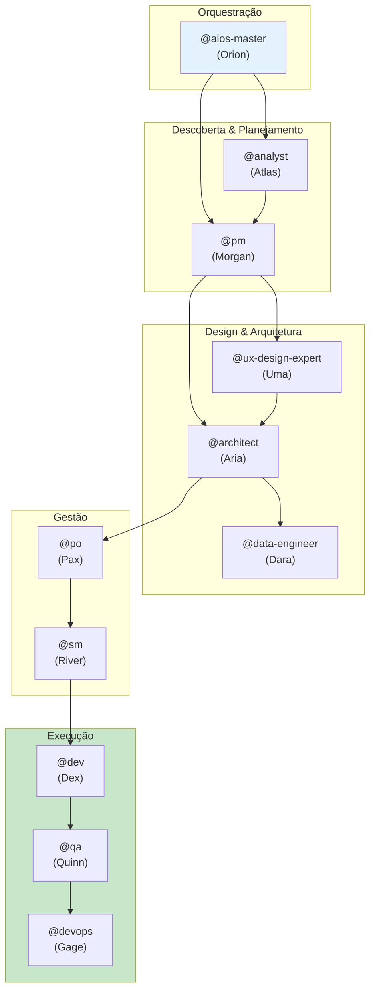

# AIOS Agent Flows - Documentação Detalhada dos Agentes

> 🌐 **PT** | [EN](../en/aios-agent-flows/README.md) | [ES](../es/aios-agent-flows/README.md) | [ZH](../zh/aios-agent-flows/README.md)

---

**Versão:** 1.0.0
**Última Atualização:** 2026-02-05
**Status:** Documentação Oficial

---

## Visão Geral

Esta pasta contém a documentação detalhada de todos os agentes do AIOS, incluindo:

- **Sistema completo** de cada agente
- **Flowcharts Mermaid** de operações
- **Mapeamento de comandos** para tasks
- **Integrações** entre agentes
- **Workflows** que envolvem cada agente
- **Best practices** e troubleshooting

---

## Agentes Documentados

| Agente | Persona | Arquétipo | Documento |
|--------|---------|-----------|-----------|
| **@aios-master** | Orion | Orchestrator | [aios-master-system.md](./aios-master-system.md) |
| **@analyst** | Atlas | Researcher | [analyst-system.md](./analyst-system.md) |
| **@architect** | Aria | Visionary | [architect-system.md](./architect-system.md) |
| **@data-engineer** | Dara | Data Sage | [data-engineer-system.md](./data-engineer-system.md) |
| **@dev** | Dex | Builder | [dev-system.md](./dev-system.md) |
| **@devops** | Gage | Guardian | [devops-system.md](./devops-system.md) |
| **@pm** | Morgan | Strategist | [pm-system.md](./pm-system.md) |
| **@qa** | Quinn | Guardian | [qa-system.md](./qa-system.md) |
| **@sm** | River | Facilitator | [sm-system.md](./sm-system.md) |
| **@squad-creator** | Nova | Creator | [squad-creator-system.md](./squad-creator-system.md) |
| **@ux-design-expert** | Uma | Designer | [ux-design-expert-system.md](./ux-design-expert-system.md) |

---

## Estrutura de Cada Documento

Cada documento de agente segue esta estrutura padrão:

```
1. Visão Geral
   - Responsabilidades principais
   - Princípios core

2. Lista Completa de Arquivos
   - Tasks core
   - Definição do agente
   - Templates
   - Checklists
   - Arquivos relacionados

3. Flowchart do Sistema
   - Diagrama Mermaid completo
   - Fluxo de operações

4. Mapeamento de Comandos
   - Comandos → Tasks
   - Parâmetros e opções

5. Workflows Relacionados
   - Workflows que usam o agente
   - Papel do agente em cada workflow

6. Integrações entre Agentes
   - De quem recebe inputs
   - Para quem entrega outputs
   - Colaborações

7. Configuração
   - Arquivos de configuração
   - Tools disponíveis
   - Restrições

8. Best Practices
   - Quando usar
   - O que evitar

9. Troubleshooting
   - Problemas comuns
   - Soluções

10. Changelog
    - Histórico de versões
```

---

## Diagrama de Relacionamento entre Agentes



---

## Como Usar Esta Documentação

### Para Entender um Agente

1. Acesse o documento do agente desejado
2. Leia a **Visão Geral** para entender o papel
3. Consulte os **Comandos** para saber o que pode fazer
4. Veja os **Workflows** para entender o contexto

### Para Debugar Problemas

1. Vá direto à seção **Troubleshooting**
2. Consulte os **Flowcharts** para entender o fluxo
3. Verifique as **Integrações** para dependências

### Para Estender o Sistema

1. Analise a **Lista de Arquivos** para saber o que modificar
2. Siga os **Best Practices** para manter consistência
3. Atualize o **Changelog** após mudanças

---

## Relacionamento com Outras Documentações

| Documentação | Localização | Propósito |
|--------------|-------------|-----------|
| Meta-Agent Commands | [docs/meta-agent-commands.md](../meta-agent-commands.md) | Referência rápida |
| Workflows Guide | [docs/guides/workflows-guide.md](../guides/workflows-guide.md) | Guia de workflows |
| AIOS Workflows | [docs/aios-workflows/](../aios-workflows/) | Detalhamento de workflows |
| Architecture | [docs/architecture/](../architecture/) | Arquitetura técnica |

---

## Contribuindo

Para adicionar ou atualizar documentação de agentes:

1. Siga a estrutura padrão descrita acima
2. Inclua diagramas Mermaid atualizados
3. Mantenha o changelog atualizado
4. Crie traduções em EN, ES e ZH

---

*AIOS Agent Flows Documentation v1.0 - Documentação detalhada do sistema de agentes*
