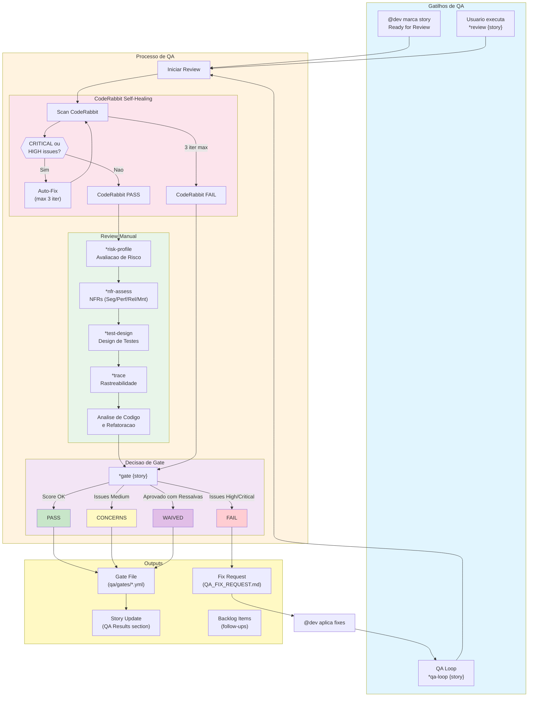
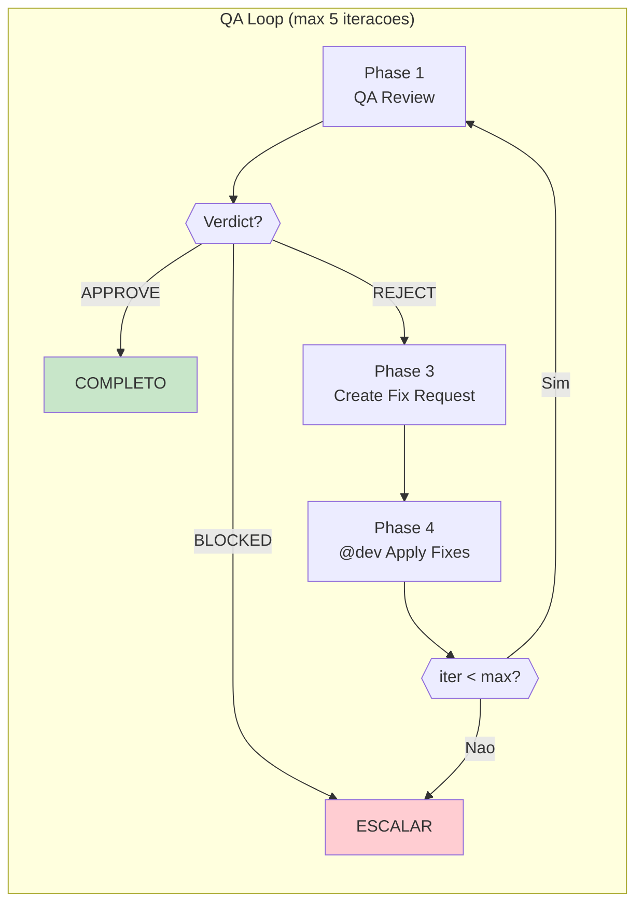
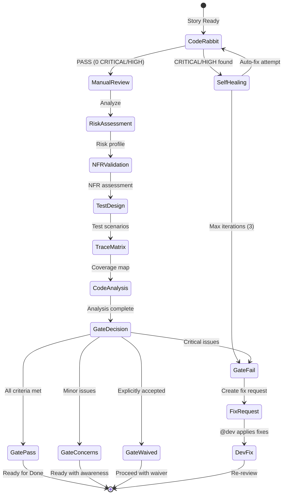
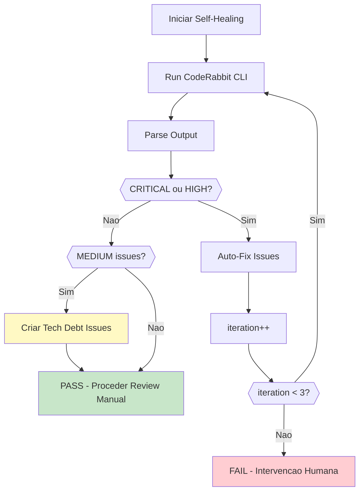
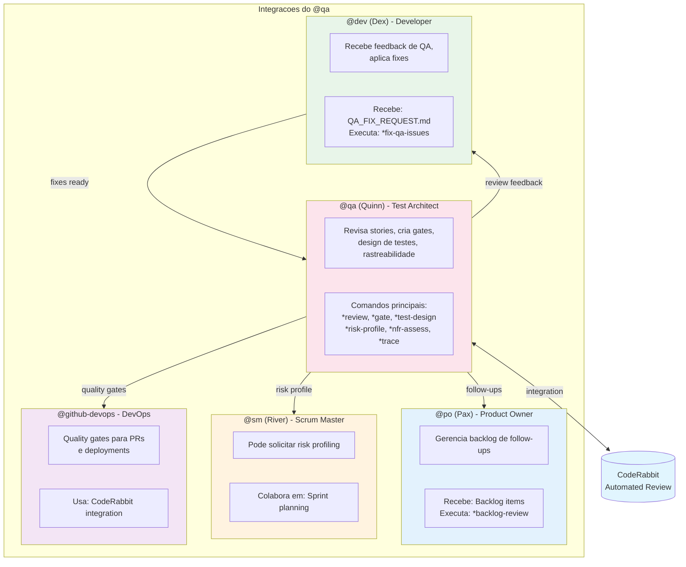

# Sistema do Agente @qa

> **Versão:** 1.0.0
> **Criado:** 2026-02-04
> **Owner:** @qa (Quinn - Guardian)
> **Status:** Documentação Oficial

---

## Visão Geral

O agente **@qa (Quinn)** e o Test Architect & Quality Advisor do AIOS. Seu papel e fornecer analise abrangente de qualidade, decisoes de quality gates e recomendacoes acionaveis para equipes de desenvolvimento.

**Arquetipo:** Guardian (Virgem)
**Tom de Comunicacao:** Analitico, sistematico, educacional, pragmatico
**Vocabulario Caracteristico:** validar, verificar, garantir, proteger, auditar, inspecionar, assegurar

### Principios Core

1. **Profundidade Conforme Necessario** - Ir fundo baseado em sinais de risco, manter conciso quando baixo risco
2. **Rastreabilidade de Requisitos** - Mapear todas stories para testes usando padroes Given-When-Then
3. **Testes Baseados em Risco** - Avaliar e priorizar por probabilidade x impacto
4. **Atributos de Qualidade** - Validar NFRs (seguranca, performance, confiabilidade)
5. **Avaliacao de Testabilidade** - Avaliar controlabilidade, observabilidade, debuggabilidade
6. **Governanca de Gates** - Fornecer decisoes claras PASS/CONCERNS/FAIL/WAIVED com justificativa
7. **Excelencia Consultiva** - Educar atraves de documentacao, nunca bloquear arbitrariamente
8. **Integracao CodeRabbit** - Usar revisao automatizada para detectar problemas precocemente

---

## Lista Completa de Arquivos

### Arquivos Core de Tasks do @qa

| Arquivo | Comando | Propósito |
|---------|---------|-----------|
| `.aios-core/development/tasks/qa-gate.md` | `*gate {story}` | Criar arquivo de decisao de quality gate |
| `.aios-core/development/tasks/qa-review-story.md` | `*review {story}` | Revisao completa de story com decisao de gate |
| `.aios-core/development/tasks/qa-test-design.md` | `*test-design {story}` | Criar cenarios de teste abrangentes |
| `.aios-core/development/tasks/qa-risk-profile.md` | `*risk-profile {story}` | Gerar matriz de avaliacao de risco |
| `.aios-core/development/tasks/qa-nfr-assess.md` | `*nfr-assess {story}` | Validar requisitos não-funcionais |
| `.aios-core/development/tasks/qa-trace-requirements.md` | `*trace {story}` | Mapear requisitos para testes (Given-When-Then) |
| `.aios-core/development/tasks/qa-generate-tests.md` | `*generate-tests` | Gerar suites de teste automaticamente |
| `.aios-core/development/tasks/qa-run-tests.md` | `*run-tests` | Executar suite de testes com gate de qualidade |
| `.aios-core/development/tasks/qa-backlog-add-followup.md` | `*backlog-add` | Adicionar follow-ups ao backlog |
| `.aios-core/development/tasks/qa-create-fix-request.md` | `*create-fix-request {story}` | Gerar documento de fix request para @dev |

### Arquivos de Tasks Secundarias do @qa

| Arquivo | Propósito |
|---------|-----------|
| `.aios-core/development/tasks/qa-browser-console-check.md` | Verificar erros no console do browser |
| `.aios-core/development/tasks/qa-evidence-requirements.md` | Requisitos de evidencia para QA |
| `.aios-core/development/tasks/qa-false-positive-detection.md` | Deteccao de falsos positivos |
| `.aios-core/development/tasks/qa-fix-issues.md` | Task para @dev aplicar fixes de QA |
| `.aios-core/development/tasks/qa-library-validation.md` | Validacao de bibliotecas |
| `.aios-core/development/tasks/qa-migration-validation.md` | Validacao de migracoes |
| `.aios-core/development/tasks/qa-review-build.md` | Revisao de builds |
| `.aios-core/development/tasks/qa-security-checklist.md` | Checklist de seguranca |
| `.aios-core/development/tasks/qa-review-proposal.md` | Revisao de propostas |

### Arquivos de Definição do Agente

| Arquivo | Propósito |
|---------|-----------|
| `.aios-core/development/agents/qa.md` | Definição completa do agente QA |
| `.claude/commands/AIOS/agents/qa.md` | Comando Claude Code para ativar @qa |

### Arquivos de Workflow

| Arquivo | Propósito |
|---------|-----------|
| `.aios-core/development/workflows/qa-loop.yaml` | Orquestrador do loop QA (Review -> Fix -> Re-review) |

### Arquivos de Time

| Arquivo | Propósito |
|---------|-----------|
| `.aios-core/development/agent-teams/team-qa-focused.yaml` | Configuracao do time focado em QA (@dev, @qa, @github-devops) |

### Arquivos de Dados (Outputs)

| Arquivo | Propósito |
|---------|-----------|
| `docs/qa/gates/` | Arquivos de decisao de quality gate |
| `docs/qa/assessments/` | Avaliacoes de risco, NFR e trace |
| `docs/qa/coderabbit-reports/` | Relatorios de revisao do CodeRabbit |
| `docs/qa/backlog-archive-{YYYY-MM}.md` | Arquivo de itens completados |

### Arquivos de Configuracao

| Arquivo | Propósito |
|---------|-----------|
| `.aios-core/core-config.yaml` | Configuracao central (qa.qaLocation, etc.) |
| `.aios-core/development/data/technical-preferences.md` | Preferencias tecnicas para QA |

---

## Flowchart: Sistema Completo de QA



### Fluxo do QA Loop Automatizado



---

## Mapeamento de Comandos para Tasks

### Comandos de Analise e Review

| Comando | Task File | Operacao |
|---------|-----------|----------|
| `*code-review {scope}` | (interno) | Executar revisao automatizada |
| `*review {story}` | `qa-review-story.md` | Revisao completa de story |

### Comandos de Quality Gates

| Comando | Task File | Operacao |
|---------|-----------|----------|
| `*gate {story}` | `qa-gate.md` | Criar decisao de quality gate |
| `*nfr-assess {story}` | `qa-nfr-assess.md` | Validar requisitos não-funcionais |
| `*risk-profile {story}` | `qa-risk-profile.md` | Gerar matriz de risco |

### Comandos de Estrategia de Testes

| Comando | Task File | Operacao |
|---------|-----------|----------|
| `*test-design {story}` | `qa-test-design.md` | Criar cenarios de teste |
| `*trace {story}` | `qa-trace-requirements.md` | Mapear requisitos para testes |
| `*generate-tests` | `qa-generate-tests.md` | Gerar testes automaticamente |
| `*run-tests` | `qa-run-tests.md` | Executar suite de testes |

### Comandos de Backlog

| Comando | Task File | Operacao |
|---------|-----------|----------|
| `*backlog-add` | `qa-backlog-add-followup.md` | Adicionar follow-up ao backlog |
| `*backlog-update {id} {status}` | (via po-manage-story-backlog) | Atualizar status de item |
| `*backlog-review` | (via po-manage-story-backlog) | Gerar revisao de backlog |

### Comandos de Utilitarios

| Comando | Task File | Operacao |
|---------|-----------|----------|
| `*help` | (interno) | Mostrar todos os comandos |
| `*session-info` | (interno) | Mostrar detalhes da sessao |
| `*guide` | (interno) | Mostrar guia de uso completo |
| `*exit` | (interno) | Sair do modo QA |

---

## Ciclo de Vida de Review de Story

### 1. Pre-Requisitos

```yaml
Pre-conditions:
  - Story status: "Review"
  - Developer completou todas as tasks
  - File List atualizada no story
  - Todos os testes automatizados passando
```

### 2. Processo de Review



### 3. Severidades de Issues

| Severidade | Prefixo | Acao | Impacto no Gate |
|------------|---------|------|-----------------|
| CRITICAL | `SEC-`, `DATA-` | Auto-fix ou bloquear | Gate = FAIL |
| HIGH | `PERF-`, `REL-` | Auto-fix ou documentar | Gate = FAIL |
| MEDIUM | `MNT-`, `TEST-` | Tech debt issue | Gate = CONCERNS |
| LOW | `DOC-`, `ARCH-` | Nota no review | Gate = PASS |

### 4. Decisoes de Gate

```yaml
Gate Criteria:
  PASS:
    - Todos acceptance criteria atendidos
    - Nenhum issue high-severity
    - Test coverage atende padroes do projeto

  CONCERNS:
    - Issues não-bloqueantes presentes
    - Devem ser rastreados e agendados
    - Pode prosseguir com consciencia

  FAIL:
    - Acceptance criteria não atendidos
    - Issues high-severity presentes
    - Recomendar retorno para InProgress

  WAIVED:
    - Issues explicitamente aceitos
    - Requer aprovacao e justificativa
    - Prosseguir apesar de issues conhecidos
```

---

## Integracao CodeRabbit

### Configuracao de Self-Healing

```yaml
coderabbit_integration:
  enabled: true
  installation_mode: wsl

  self_healing:
    enabled: true
    type: full
    max_iterations: 3
    timeout_minutes: 30
    trigger: review_start

    severity_filter:
      - CRITICAL
      - HIGH

    behavior:
      CRITICAL: auto_fix       # Auto-fix (3 tentativas max)
      HIGH: auto_fix           # Auto-fix (3 tentativas max)
      MEDIUM: document_as_debt # Criar issue de tech debt
      LOW: ignore              # Nota no review, sem acao
```

### Comandos CodeRabbit

```bash
# Pre-review (uncommitted changes)
wsl bash -c 'cd /mnt/c/.../aios-core && ~/.local/bin/coderabbit --prompt-only -t uncommitted'

# Story review (committed changes vs main)
wsl bash -c 'cd /mnt/c/.../aios-core && ~/.local/bin/coderabbit --prompt-only -t committed --base main'
```

### Fluxo de Self-Healing



---

## Integracoes entre Agentes

### Diagrama de Integracao



### Fluxo de Handoff QA -> Dev

1. @qa executa `*review {story}`
2. Identifica issues criticos
3. Cria `*create-fix-request {story}`
4. @dev recebe `QA_FIX_REQUEST.md`
5. @dev executa `*fix-qa-issues {story}`
6. @dev cria `READY_FOR_REREVIEW.md`
7. @qa re-revisa com `*review {story}`

### Fluxo de Backlog

1. @qa durante review identifica follow-ups
2. Adiciona item com `*backlog-add`
3. Item rastreado com source: "QA Review"
4. @po prioriza com `*backlog-prioritize`

---

## Configuracao

### core-config.yaml

```yaml
qa:
  qaLocation: docs/qa
  gatesLocation: docs/qa/gates
  assessmentsLocation: docs/qa/assessments
  reportsLocation: docs/qa/coderabbit-reports

  # Thresholds
  coverageTarget: 80
  qualityScoreMinimum: 70

  # CodeRabbit
  coderabbitEnabled: true
  selfHealingEnabled: true
  maxSelfHealingIterations: 3

devStoryLocation: docs/stories
```

### Restricoes de Git

```yaml
git_restrictions:
  allowed_operations:
    - git status      # Verificar estado do repositorio
    - git log         # Ver historico de commits
    - git diff        # Revisar mudancas
    - git branch -a   # Listar branches

  blocked_operations:
    - git push        # APENAS @github-devops pode push
    - git commit      # QA revisa, não commita
    - gh pr create    # APENAS @github-devops cria PRs
```

---

## Best Practices

### Durante Revisao

1. **Executar CodeRabbit primeiro** - Deixar automacao encontrar issues obvios
2. **Avaliar risco** - Determinar profundidade da revisao
3. **Verificar rastreabilidade** - Cada AC deve ter teste correspondente
4. **Documentar refatoracoes** - Se modificar codigo, explicar WHY e HOW
5. **Manter foco** - Apenas atualizar secao QA Results

### Criacao de Gates

1. **Usar severidades corretas** - low/medium/high apenas
2. **Justificar decisao** - status_reason em 1-2 sentencas
3. **Identificar owners** - dev/sm/po para cada issue
4. **Definir expiracao** - Tipicamente 2 semanas

### Evitar

- Modificar secoes da story alem de QA Results
- Bloquear sem justificativa clara
- Ignorar issues medium (documentar como tech debt)
- Fazer review antes de CodeRabbit completar
- Aprovar sem verificar test coverage

---

## Troubleshooting

### CodeRabbit não encontrado

```bash
# Verificar instalacao
wsl bash -c '~/.local/bin/coderabbit --version'

# Se não instalado, usar wsl_config.installation_path no agent
```

### Timeout na revisao

- CodeRabbit pode levar ate 30 minutos
- Aumentar timeout se necessario
- Verificar se não ha processos travados

### Gate file não criado

1. Verificar se `qa.qaLocation/gates` existe
2. Verificar permissoes de escrita
3. Confirmar que template `qa-gate-tmpl.yaml` esta disponivel

### Story não encontrada

1. Verificar formato do story ID (epic.story)
2. Confirmar que story existe em `docs/stories/`
3. Usar path completo se necessario

### Issues de self-healing persistem

1. Verificar se issues sao realmente auto-fixaveis
2. Considerar intervencao manual apos 3 iteracoes
3. Criar tech debt para issues complexos

---

## Referencias

### Tasks Core

- [qa-gate.md](/.aios-core/development/tasks/qa-gate.md)
- [qa-review-story.md](/.aios-core/development/tasks/qa-review-story.md)
- [qa-test-design.md](/.aios-core/development/tasks/qa-test-design.md)
- [qa-risk-profile.md](/.aios-core/development/tasks/qa-risk-profile.md)
- [qa-nfr-assess.md](/.aios-core/development/tasks/qa-nfr-assess.md)
- [qa-trace-requirements.md](/.aios-core/development/tasks/qa-trace-requirements.md)

### Workflows

- [qa-loop.yaml](/.aios-core/development/workflows/qa-loop.yaml)

### Teams

- [team-qa-focused.yaml](/.aios-core/development/agent-teams/team-qa-focused.yaml)

### Agente

- [qa.md](/.aios-core/development/agents/qa.md)

### Documentos Relacionados

- [BACKLOG-MANAGEMENT-SYSTEM.md](/docs/guides/BACKLOG-MANAGEMENT-SYSTEM.md)

---

## Resumo

| Aspecto | Detalhes |
|---------|----------|
| **Total de Tasks Core** | 10 task files principais |
| **Total de Tasks Secundarias** | 9 task files de suporte |
| **Workflow Principal** | qa-loop.yaml (orquestracao) |
| **Comandos de Review** | 2 (`*code-review`, `*review`) |
| **Comandos de Gate** | 3 (`*gate`, `*nfr-assess`, `*risk-profile`) |
| **Comandos de Teste** | 4 (`*test-design`, `*trace`, `*generate-tests`, `*run-tests`) |
| **Comandos de Backlog** | 3 (`*backlog-*` family) |
| **Decisoes de Gate** | 4 (PASS, CONCERNS, FAIL, WAIVED) |
| **Severidades** | 3 (low, medium, high) |
| **Self-Healing Max** | 3 iteracoes |
| **Integracao CodeRabbit** | Sim (WSL mode) |

---

## Changelog

| Data | Autor | Descrição |
|------|-------|-----------|
| 2026-02-04 | @qa | Documento inicial criado com diagramas Mermaid completos |

---

*-- Quinn, guardiao da qualidade*
