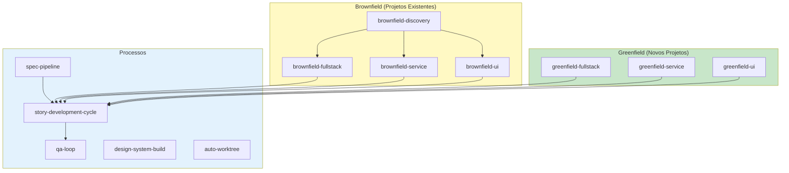
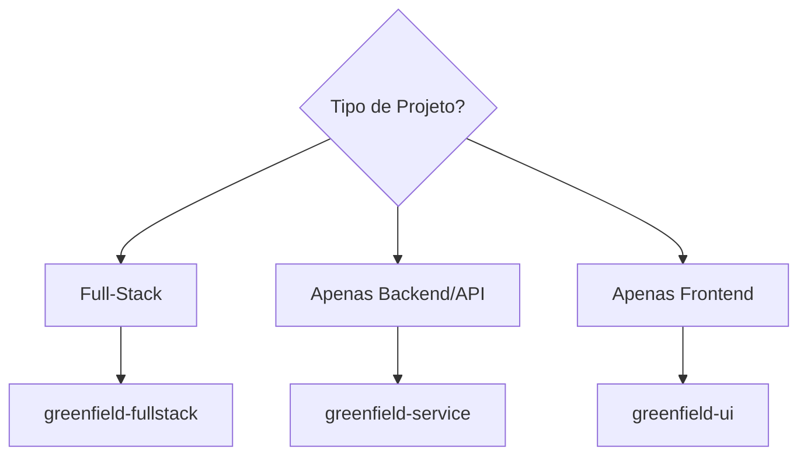
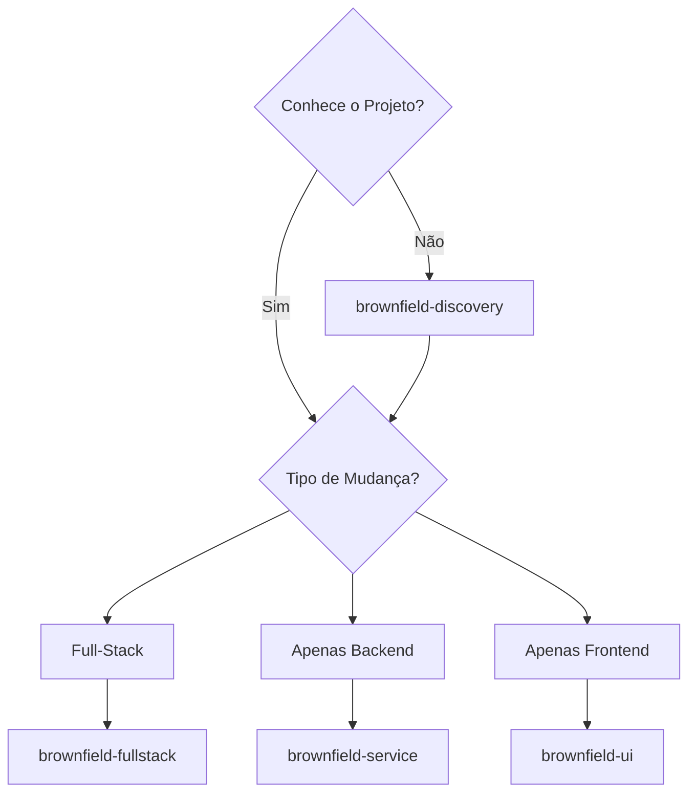

# AIOS Workflows - Documentação Detalhada dos Workflows

> 🌐 **PT** | [EN](../en/aios-workflows/README.md) | [ES](../es/aios-workflows/README.md) | [ZH](../zh/aios-workflows/README.md)

---

**Versão:** 1.0.0
**Última Atualização:** 2026-02-05
**Status:** Documentação Oficial

---

## Visão Geral

Esta pasta contém a documentação detalhada de todos os workflows do AIOS, incluindo:

- **Diagramas Mermaid** completos (flowchart, sequence, state)
- **Steps detalhados** com inputs/outputs
- **Agentes participantes** e seus papéis
- **Pontos de decisão** e condições
- **Pré-requisitos** e configurações
- **Troubleshooting** e modos de execução

---

## Workflows Documentados

### Por Tipo de Projeto

| Tipo | Workflow | Descrição | Documento |
|------|----------|-----------|-----------|
| **Greenfield** | Fullstack | Aplicações full-stack do zero | [greenfield-fullstack-workflow.md](./greenfield-fullstack-workflow.md) |
| **Greenfield** | Service | Backend/API do zero | [greenfield-service-workflow.md](./greenfield-service-workflow.md) |
| **Greenfield** | UI | Frontend do zero | [greenfield-ui-workflow.md](./greenfield-ui-workflow.md) |
| **Brownfield** | Discovery | Análise de projeto existente | [brownfield-discovery-workflow.md](./brownfield-discovery-workflow.md) |
| **Brownfield** | Fullstack | Evolução full-stack existente | [brownfield-fullstack-workflow.md](./brownfield-fullstack-workflow.md) |
| **Brownfield** | Service | Evolução backend existente | [brownfield-service-workflow.md](./brownfield-service-workflow.md) |
| **Brownfield** | UI | Evolução frontend existente | [brownfield-ui-workflow.md](./brownfield-ui-workflow.md) |

### Por Processo

| Processo | Workflow | Descrição | Documento |
|----------|----------|-----------|-----------|
| **Development** | Story Cycle | Ciclo completo de story | [story-development-cycle-workflow.md](./story-development-cycle-workflow.md) |
| **Quality** | QA Loop | Ciclo de qualidade | [qa-loop-workflow.md](./qa-loop-workflow.md) |
| **Spec** | Spec Pipeline | Pipeline de especificação | [spec-pipeline-workflow.md](./spec-pipeline-workflow.md) |
| **Design** | Design System | Construção de design system | [design-system-build-quality-workflow.md](./design-system-build-quality-workflow.md) |
| **Git** | Auto Worktree | Gestão automática de worktrees | [auto-worktree-workflow.md](./auto-worktree-workflow.md) |

---

## Estrutura de Cada Documento

Cada documento de workflow segue esta estrutura padrão:

```
1. Visão Geral
   - Objetivo do workflow
   - Tipos de projeto suportados
   - Quando usar / não usar

2. Diagrama Mermaid
   - Flowchart principal
   - Diagrama de estados
   - Diagrama de sequência

3. Steps Detalhados
   - ID, agente, ação
   - Inputs e outputs
   - Critérios de sucesso
   - Status transitions

4. Agentes Participantes
   - Papel de cada agente
   - Comandos relevantes

5. Tasks Executadas
   - Mapa de tasks por fase
   - Arquivos de task

6. Pré-requisitos
   - Configuração necessária
   - Documentação prerequisita
   - Ferramentas integradas

7. Entradas e Saídas
   - Inputs do workflow
   - Outputs produzidos

8. Pontos de Decisão
   - Condições de branching
   - Critérios de bloqueio

9. Modos de Execução
   - YOLO (autônomo)
   - Interactive (balanceado)
   - Pre-Flight (planejamento)

10. Troubleshooting
    - Problemas comuns
    - Logs e diagnóstico

11. Changelog
    - Histórico de versões
```

---

## Mapa de Workflows



---

## Guia de Seleção de Workflow

### Novo Projeto?



### Projeto Existente?



---

## Fluxo entre Workflows

| De | Para | Condição |
|----|------|----------|
| `brownfield-discovery` | `brownfield-*` | Após análise completa |
| `greenfield-*` | `story-development-cycle` | Para cada story |
| `brownfield-*` | `story-development-cycle` | Para cada story |
| `spec-pipeline` | `story-development-cycle` | Após spec aprovada |
| `story-development-cycle` | `qa-loop` | Na fase de QA |

---

## Como Usar Esta Documentação

### Para Iniciar um Projeto

1. Use o **Guia de Seleção** acima para escolher o workflow
2. Leia a **Visão Geral** do workflow escolhido
3. Verifique os **Pré-requisitos**
4. Siga os **Steps** na ordem

### Para Entender um Processo

1. Analise os **Diagramas Mermaid**
2. Veja os **Agentes Participantes** e seus papéis
3. Consulte os **Pontos de Decisão**

### Para Debugar Problemas

1. Vá à seção **Troubleshooting**
2. Verifique os **Logs e Diagnóstico**
3. Consulte os **Critérios de Sucesso** de cada step

---

## Relacionamento com Outras Documentações

| Documentação | Localização | Propósito |
|--------------|-------------|-----------|
| Workflows Guide | [docs/guides/workflows-guide.md](../guides/workflows-guide.md) | Guia geral |
| Agent Flows | [docs/aios-agent-flows/](../aios-agent-flows/) | Detalhes de agentes |
| Meta-Agent Commands | [docs/meta-agent-commands.md](../meta-agent-commands.md) | Referência rápida |

---

## Contribuindo

Para adicionar ou atualizar documentação de workflows:

1. Siga a estrutura padrão descrita acima
2. Inclua diagramas Mermaid completos
3. Documente todos os inputs/outputs
4. Mantenha o changelog atualizado
5. Crie traduções em EN e ES

---

*AIOS Workflows Documentation v1.0 - Documentação detalhada dos workflows de desenvolvimento*
