# Workflow: Story Development Cycle

**Versão:** 1.0
**Tipo:** Workflow Generico
**Autor:** Orion (AIOS Master)
**Data de Criação:** 2025-01-30
**Tags:** story, development-cycle, quality-gate, agile, generic

---

## Visão Geral

O **Story Development Cycle** e o workflow central do AIOS para desenvolvimento de stories. Ele automatiza o fluxo completo desde a criacao ate a entrega com quality gate integrado, seguindo a sequencia: **criar -> validar -> implementar -> QA review**.

### Objetivo

Garantir que cada story passe por um processo estruturado e rastreavel, com pontos de validação em cada fase, reduzindo retrabalho e aumentando a qualidade das entregas.

### Tipos de Projeto Suportados

| Tipo | Descrição |
|------|-----------|
| `greenfield` | Projetos novos, do zero |
| `brownfield` | Projetos existentes, manutenção |
| `feature-development` | Desenvolvimento de novas funcionalidades |
| `bug-fix` | Correção de bugs |
| `enhancement` | Melhorias em funcionalidades existentes |

---

## Diagrama Mermaid do Workflow

### Fluxo Principal

```mermaid
flowchart TD
    subgraph PHASE_1["Fase 1: Story Creation"]
        START([Inicio: Story Development Cycle]) --> SM_CREATE
        SM_CREATE["@sm: Criar próxima story<br/>Task: create-next-story"]
    end

    subgraph PHASE_2["Fase 2: Story Validation"]
        SM_CREATE --> PO_VALIDATE["@po: Validar story<br/>Task: validate-next-story<br/>10 Checks"]
        PO_VALIDATE --> VALID_DECISION{Validação OK?}
        VALID_DECISION -->|Não| FEEDBACK_SM["Feedback para SM<br/>Story retorna para ajustes"]
        FEEDBACK_SM --> SM_CREATE
        VALID_DECISION -->|Sim| DEV_IMPLEMENT
    end

    subgraph PHASE_3["Fase 3: Implementation"]
        DEV_IMPLEMENT["@dev: Implementar story<br/>Task: dev-develop-story<br/>+ CodeRabbit Self-Healing"]
    end

    subgraph PHASE_4["Fase 4: QA Review"]
        DEV_IMPLEMENT --> QA_REVIEW["@qa: Review + Quality Gate<br/>Task: qa-gate"]
        QA_REVIEW --> QA_DECISION{Quality Gate OK?}
        QA_DECISION -->|Não| FEEDBACK_DEV["Feedback para Dev<br/>Checklist de fixes"]
        FEEDBACK_DEV --> DEV_IMPLEMENT
        QA_DECISION -->|Sim| STORY_DONE
    end

    subgraph COMPLETION["Conclusão"]
        STORY_DONE([Story Done!])
        STORY_DONE --> MORE_STORIES{Mais stories?}
        MORE_STORIES -->|Sim| SM_CREATE
        MORE_STORIES -->|Não| CYCLE_COMPLETE([Ciclo Completo])
    end

    style CYCLE_COMPLETE fill:#90EE90
    style STORY_DONE fill:#90EE90
    style SM_CREATE fill:#87CEEB
    style PO_VALIDATE fill:#FFE4B5
    style DEV_IMPLEMENT fill:#98FB98
    style QA_REVIEW fill:#DDA0DD
    style FEEDBACK_SM fill:#FFB6C1
    style FEEDBACK_DEV fill:#FFB6C1
```



### Fluxo de Status da Story

```mermaid
stateDiagram-v2
    [*] --> Draft: SM cria story
    Draft --> Ready: PO valida (10 checks)
    Ready --> InProgress: Dev inicia implementação
    InProgress --> InReview: Dev conclui + CodeRabbit
    InReview --> Done: QA aprova
    InReview --> InProgress: QA rejeita
    Draft --> Draft: PO rejeita validação
    Done --> [*]

    note right of Draft : Status inicial
    note right of Ready : Pronta para dev
    note right of InProgress : Em desenvolvimento
    note right of InReview : Aguardando QA
    note right of Done : Concluida
```



### Diagrama de Interação entre Agentes

```mermaid
sequenceDiagram
    participant U as Usuario
    participant SM as @sm (River)
    participant PO as @po (Pax)
    participant DEV as @dev (Dex)
    participant QA as @qa (Quinn)
    participant CR as CodeRabbit

    U->>SM: *workflow story-development-cycle

    rect rgb(135, 206, 235)
        Note over SM: Fase 1: Criacao
        SM->>SM: Identifica próxima story
        SM->>SM: Extrai requisitos do epic
        SM->>SM: Popula template
        SM-->>U: Story criada (status: Draft)
    end

    rect rgb(255, 228, 181)
        Note over PO: Fase 2: Validação
        SM->>PO: Handoff para validação
        PO->>PO: Executa 10 checks
        alt Validação falhou
            PO-->>SM: Feedback com issues
            SM->>SM: Ajusta story
        else Validação OK
            PO-->>U: Story validada (status: Ready)
        end
    end

    rect rgb(152, 251, 152)
        Note over DEV: Fase 3: Implementação
        PO->>DEV: Handoff para implementação
        DEV->>DEV: Implementa tasks
        DEV->>DEV: Escreve testes
        DEV->>CR: Pre-commit review
        CR-->>DEV: Feedback (CRITICAL/HIGH)
        DEV->>DEV: Self-healing loop
        DEV-->>U: Story implementada (status: In Review)
    end

    rect rgb(221, 160, 221)
        Note over QA: Fase 4: QA Review
        DEV->>QA: Handoff para review
        QA->>CR: Review automatizado
        CR-->>QA: Scan de qualidade
        QA->>QA: Review manual
        alt Quality Gate falhou
            QA-->>DEV: Feedback com fixes
            DEV->>DEV: Aplica correções
        else Quality Gate OK
            QA-->>U: Story aprovada (status: Done)
        end
    end
```



---

## Steps Detalhados

### Step 1: Create Story (Fase 1)

| Campo | Valor |
|-------|-------|
| **ID** | `create` |
| **Agente** | @sm (River - Scrum Master) |
| **Ação** | Criar próxima story |
| **Task** | `create-next-story.md` |

#### Descrição

O Scrum Master (River) identifica e cria a próxima story do backlog utilizando o PRD shardado ou documentação do projeto como fonte.

#### Inputs

| Input | Tipo | Origem | Obrigatório |
|-------|------|--------|-------------|
| `name` | string | User Input | Sim |
| `options` | object | User Input | Não |
| `force` | boolean | User Input | Não |
| PRD shardado | arquivo | Sistema de arquivos | Sim |
| Contexto do epic | documento | docs/stories/epic-X/ | Sim |

#### Outputs

| Output | Tipo | Destino |
|--------|------|---------|
| `story_file` | arquivo | `{devStoryLocation}/{epicNum}.{storyNum}.story.md` |
| `story_id` | string | Contexto do workflow |
| `validation_report` | object | Memória |

#### Critérios de Sucesso

- [ ] Story criada com titulo descritivo
- [ ] Acceptance criteria definidos
- [ ] Escopo claro e delimitado
- [ ] Dependencias identificadas

#### Status da Story

- **Antes:** N/A
- **Depois:** `Draft`

---

### Step 2: Validate Story (Fase 2)

| Campo | Valor |
|-------|-------|
| **ID** | `validate` |
| **Agente** | @po (Pax - Product Owner) |
| **Ação** | Validar story (10 checks) |
| **Task** | `validate-next-story.md` |
| **Requer** | `create` |

#### Descrição

O Product Owner (Pax) valida a story criada usando um checklist rigoroso de 10 pontos, garantindo que a story esta pronta para implementação.

#### Inputs

| Input | Tipo | Origem | Obrigatório |
|-------|------|--------|-------------|
| `story_file` | arquivo | Output do step anterior | Sim |
| `target` | string | User Input | Sim |
| `criteria` | array | Config | Sim |
| `strict` | boolean | User Input | Não (default: true) |

#### Outputs

| Output | Tipo | Destino |
|--------|------|---------|
| `validation_report` | object | Arquivo (.ai/*.json) |
| `validation_result` | boolean | Return value |
| `errors` | array | Memória |
| `story_status` | string | Story file |

#### Checklist de Validação (10 Pontos)

| # | Check | Descrição |
|---|-------|-----------|
| 1 | Titulo claro e objetivo | O titulo descreve precisamente o que sera feito |
| 2 | Descrição completa | Problema/necessidade claramente explicado |
| 3 | Acceptance criteria testaveis | Formato Given/When/Then preferido |
| 4 | Escopo bem definido | O que esta IN e OUT claramente listado |
| 5 | Dependencias mapeadas | Stories ou recursos prerequisitos identificados |
| 6 | Estimativa de complexidade | Pontos de complexidade ou T-shirt sizing |
| 7 | Valor de negocio | Beneficio para o usuario/negocio claro |
| 8 | Riscos documentados | Potenciais problemas identificados |
| 9 | Critérios de Done | Definicao clara de quando esta completa |
| 10 | Alinhamento com PRD/Epic | Consistencia com documentos fonte |

#### Resultado

| Resultado | Ação |
|-----------|------|
| **Aprovada** | Status muda para `Ready`, prossegue para implementação |
| **Rejeitada** | Retorna para SM com feedback detalhado |

#### Status da Story

- **Antes:** `Draft`
- **Depois (Sucesso):** `Ready`
- **Depois (Falha):** `Draft` (retorna para SM)

---

### Step 3: Implement Story (Fase 3)

| Campo | Valor |
|-------|-------|
| **ID** | `implement` |
| **Agente** | @dev (Dex - Full Stack Developer) |
| **Ação** | Implementar story |
| **Task** | `dev-develop-story.md` |
| **Requer** | `validate` |

#### Descrição

O Dev Agent (Dex) implementa a story validada, seguindo os acceptance criteria e as tarefas definidas. Inclui o CodeRabbit Self-Healing Loop para garantir qualidade do codigo.

#### Modos de Execução

| Modo | Descrição | Prompts ao Usuario |
|------|-----------|-------------------|
| **YOLO** | Execução autônoma com logging de decisões | 0-1 |
| **Interactive** | Checkpoints de decisao e feedback educacional (DEFAULT) | 5-10 |
| **Pre-Flight** | Planejamento completo antes da execucao | 10-15 (upfront) |

#### Inputs

| Input | Tipo | Origem | Obrigatório |
|-------|------|--------|-------------|
| `story_file` | arquivo | Output do step anterior | Sim |
| `task` | string | User Input | Sim |
| `parameters` | object | User Input | Não |
| `mode` | string | User Input | Não (default: interactive) |

#### Outputs

| Output | Tipo | Destino |
|--------|------|---------|
| `implementation_files` | array | Sistema de arquivos |
| `test_results` | object | Console/logs |
| `commit_hash` | string | Git |
| `execution_result` | object | Memória |
| `logs` | array | `.ai/logs/*` |
| `decision_log` | arquivo | `.ai/decision-log-{story-id}.md` (modo YOLO) |

#### Fluxo de Execução

```mermaid
flowchart LR
    A[Ler task] --> B[Implementar task + subtasks]
    B --> C[Escrever testes]
    C --> D[Executar validacoes]
    D --> E{Todas passaram?}
    E -->|Sim| F[Marcar checkbox [x]]
    E -->|Não| B
    F --> G[Atualizar File List]
    G --> H{Mais tasks?}
    H -->|Sim| A
    H -->|Não| I[CodeRabbit Self-Healing]
    I --> J[Story DOD Checklist]
    J --> K[Status: In Review]
```

#### CodeRabbit Self-Healing Loop

```mermaid
flowchart TD
    START[Iniciar Self-Healing] --> RUN[Executar CodeRabbit CLI]
    RUN --> PARSE[Analisar resultados]
    PARSE --> CHECK{Issues CRITICAL?}
    CHECK -->|Não| DOC[Documentar HIGH issues]
    DOC --> PASS[PASSED - Prosseguir]
    CHECK -->|Sim| ITER{iteration < 2?}
    ITER -->|Sim| FIX[Tentar auto-fix]
    FIX --> INCREMENT[iteration++]
    INCREMENT --> RUN
    ITER -->|Não| FAIL[FAILED - HALT]
    FAIL --> MANUAL[Requer intervencao manual]
```



#### Critérios de Sucesso

- [ ] Todos os acceptance criteria implementados
- [ ] Testes passando
- [ ] File List atualizada
- [ ] Codigo commitado
- [ ] CodeRabbit Self-Healing passou

#### Status da Story

- **Antes:** `Ready`
- **Durante:** `In Progress`
- **Depois:** `In Review`

---

### Step 4: QA Review (Fase 4)

| Campo | Valor |
|-------|-------|
| **ID** | `review` |
| **Agente** | @qa (Quinn - Test Architect) |
| **Ação** | Review final + Quality Gate |
| **Task** | `qa-gate.md` |
| **Requer** | `implement` |

#### Descrição

O QA Agent (Quinn) executa o review final com quality gate, validando codigo, testes, e aderencia aos acceptance criteria.

#### Inputs

| Input | Tipo | Origem | Obrigatório |
|-------|------|--------|-------------|
| `story_file` | arquivo | Output do step anterior | Sim |
| `target` | string | User Input | Sim |
| `criteria` | array | Config | Sim |
| `strict` | boolean | User Input | Não (default: true) |

#### Outputs

| Output | Tipo | Destino |
|--------|------|---------|
| `qa_report` | arquivo | `{qaLocation}/gates/{epic}.{story}-{slug}.yml` |
| `quality_gate_status` | string | PASS/CONCERNS/FAIL/WAIVED |
| `story_final_status` | string | Story file |
| `validation_result` | boolean | Return value |
| `errors` | array | Memória |

#### Quality Gate Checks

| # | Check | Descrição |
|---|-------|-----------|
| 1 | Code review | Padroes, legibilidade, manutenibilidade |
| 2 | Testes unitarios | Adequados e passando |
| 3 | Acceptance criteria | Todos atendidos |
| 4 | Sem regressoes | Funcionalidades existentes preservadas |
| 5 | Performance | Dentro dos limites aceitaveis |
| 6 | Seguranca | OWASP basics verificados |
| 7 | Documentação | Atualizada se necessario |

#### Decisões do Quality Gate

| Decisão | Critérios | Ação |
|---------|-----------|------|
| **PASS** | Todos os checks passaram, sem issues HIGH | Aprovar story |
| **CONCERNS** | Issues nao-bloqueantes presentes | Aprovar com observacoes |
| **FAIL** | Issues HIGH/CRITICAL presentes | Retornar para Dev |
| **WAIVED** | Issues explicitamente aceitas | Aprovar com waiver documentado |

#### Severidade de Issues

| Severidade | Descrição | Ação |
|------------|-----------|------|
| `low` | Issues menores, cosmeticos | Documentar |
| `medium` | Deveria corrigir em breve | Criar tech debt |
| `high` | Critico, deveria bloquear release | Retornar para Dev |

#### Resultado

| Resultado | Ação |
|-----------|------|
| **Aprovada** | Status muda para `Done` |
| **Rejeitada** | Retorna para Dev com checklist de fixes |

#### Status da Story

- **Antes:** `In Review`
- **Depois (Sucesso):** `Done`
- **Depois (Falha):** `In Progress` (retorna para Dev)

---

## Agentes Participantes

### @sm - River (Scrum Master)

| Aspecto | Descrição |
|---------|-----------|
| **Icone** | 🌊 |
| **Arquetipo** | Facilitator |
| **Papel** | Technical Scrum Master - Story Preparation Specialist |
| **Foco** | Criar stories claras e acionaveis para agentes de desenvolvimento |
| **Responsabilidades** | Story creation, epic management, sprint planning, local branch management |

**Comandos Relevantes:**
- `*draft` - Criar próxima story
- `*story-checklist` - Executar checklist de story

---

### @po - Pax (Product Owner)

| Aspecto | Descrição |
|---------|-----------|
| **Icone** | 🎯 |
| **Arquetipo** | Balancer |
| **Papel** | Technical Product Owner & Process Steward |
| **Foco** | Validar coesao de artefatos e garantir qualidade de documentação |
| **Responsabilidades** | Backlog management, story validation, prioritization, PM tool sync |

**Comandos Relevantes:**
- `*validate-story-draft {story}` - Validar qualidade da story
- `*backlog-review` - Review para sprint planning

---

### @dev - Dex (Full Stack Developer)

| Aspecto | Descrição |
|---------|-----------|
| **Icone** | 💻 |
| **Arquetipo** | Builder |
| **Papel** | Expert Senior Software Engineer & Implementation Specialist |
| **Foco** | Executar tarefas de story com precisao e testes abrangentes |
| **Responsabilidades** | Code implementation, testing, debugging, refactoring |

**Comandos Relevantes:**
- `*develop {story-id}` - Implementar story
- `*run-tests` - Executar linting e testes
- `*apply-qa-fixes` - Aplicar correções do QA

---

### @qa - Quinn (Test Architect)

| Aspecto | Descrição |
|---------|-----------|
| **Icone** | ✅ |
| **Arquetipo** | Guardian |
| **Papel** | Test Architect with Quality Advisory Authority |
| **Foco** | Análise de qualidade abrangente atraves de arquitetura de testes |
| **Responsabilidades** | Code review, quality gates, test strategy, risk assessment |

**Comandos Relevantes:**
- `*review {story}` - Review abrangente de story
- `*gate {story}` - Criar decisao de quality gate
- `*code-review {scope}` - Review automatizado

---

## Tasks Executadas

### Mapa de Tasks por Fase

```mermaid
graph TD
    subgraph "Fase 1: Criacao"
        T1[create-next-story.md]
    end

    subgraph "Fase 2: Validação"
        T2[validate-next-story.md]
    end

    subgraph "Fase 3: Implementação"
        T3[dev-develop-story.md]
        T3a[story-dod-checklist.md]
    end

    subgraph "Fase 4: QA Review"
        T4[qa-gate.md]
    end

    T1 --> T2
    T2 --> T3
    T3 --> T3a
    T3a --> T4
```



### Detalhamento das Tasks

| Task | Arquivo | Agente | Propósito |
|------|---------|--------|-----------|
| Create Next Story | `create-next-story.md` | @sm | Criar story a partir do PRD/epic |
| Validate Next Story | `validate-next-story.md` | @po | Validar completude e qualidade |
| Develop Story | `dev-develop-story.md` | @dev | Implementar codigo e testes |
| Story DOD Checklist | `story-dod-checklist.md` | @dev | Verificar Definition of Done |
| QA Gate | `qa-gate.md` | @qa | Criar decisao de quality gate |

---

## Pré-requisitos

### Configuração do Projeto

1. **core-config.yaml** - Arquivo de configuracao AIOS obrigatorio
   - `devStoryLocation` - Local das stories
   - `prd.*` - Configuração do PRD
   - `architecture.*` - Configuração da arquitetura
   - `qa.qaLocation` - Local dos artefatos de QA

2. **Story Template** - `story-tmpl.yaml` disponivel em `.aios-core/development/templates/`

3. **Checklists** - Checklists obrigatorios disponiveis:
   - `story-draft-checklist.md`
   - `story-dod-checklist.md`
   - `po-master-checklist.md`

### Documentação Prerequisita

| Documento | Local | Obrigatório |
|-----------|-------|-------------|
| PRD (shardado ou monolitico) | Conforme `prd.*` config | Sim |
| Epic file | `docs/stories/epic-X/` | Sim |
| Architecture docs | Conforme `architecture.*` config | Sim |

### Ferramentas Integradas

| Ferramenta | Propósito | Agentes |
|------------|-----------|---------|
| `git` | Controle de versao | @sm, @dev, @qa |
| `coderabbit` | Review automatizado | @dev, @qa |
| `clickup` | Tracking de stories | @sm, @po |
| `context7` | Documentação de libs | Todos |
| `github-cli` | Operacoes GitHub | @po, @qa |

---

## Entradas e Saidas

### Entradas do Workflow

| Entrada | Tipo | Fonte | Descrição |
|---------|------|-------|-----------|
| Epic requirements | Documento | `docs/stories/epic-X/` | Requisitos do epic |
| PRD | Documento | Conforme config | Product Requirements |
| Architecture docs | Documentos | `docs/architecture/` | Especificacoes tecnicas |
| Story template | YAML | `.aios-core/development/templates/` | Template padrao |

### Saidas do Workflow

| Saida | Tipo | Destino | Descrição |
|-------|------|---------|-----------|
| Story file | Markdown | `{devStoryLocation}/{epic}.{story}.story.md` | Story completa |
| Implementation files | Codigo | Conforme story tasks | Codigo implementado |
| Test files | Codigo | Conforme padrao do projeto | Testes unitarios |
| QA Gate file | YAML | `{qaLocation}/gates/{epic}.{story}-{slug}.yml` | Decisão de QA |
| Decision log | Markdown | `.ai/decision-log-{story-id}.md` | Log de decisões (modo YOLO) |

---

## Pontos de Decisão

### Diagrama de Decisões

```mermaid
graph TD
    D1{Validação PO<br/>10 checks passaram?}
    D1 -->|Sim| CONTINUE1[Prosseguir para Dev]
    D1 -->|Não| RETURN1[Retornar para SM]

    D2{Quality Gate<br/>Issues CRITICAL/HIGH?}
    D2 -->|Não| CONTINUE2[Aprovar Story]
    D2 -->|Sim| RETURN2[Retornar para Dev]

    D3{Self-Healing<br/>Issues CRITICAL?}
    D3 -->|Não| CONTINUE3[Prosseguir para DOD]
    D3 -->|Sim| D4{iteration < 2?}
    D4 -->|Sim| FIX[Tentar auto-fix]
    D4 -->|Não| HALT[HALT - Manual]
```



### Pontos de Decisão Detalhados

| Ponto | Fase | Decisor | Criterio | Resultado Positivo | Resultado Negativo |
|-------|------|---------|----------|-------------------|-------------------|
| Validação PO | 2 | @po | 10 checks passam | Status: Ready | Retorna para SM |
| Self-Healing | 3 | Sistema | Sem CRITICAL issues | Prossegue para DOD | Halt ou auto-fix |
| Quality Gate | 4 | @qa | Sem HIGH/CRITICAL | Status: Done | Retorna para Dev |

### Condições de Bloqueio

O workflow deve HALT e solicitar intervencao do usuario quando:

1. **Dependencias nao aprovadas necessarias** - Nova lib ou recurso requerido
2. **Ambiguidade apos verificar story** - Requisitos nao claros
3. **3 falhas consecutivas** - Tentativas de implementação ou correção
4. **Configuração faltando** - core-config.yaml ou templates ausentes
5. **Regressao falhando** - Testes existentes quebraram

---

## Modos de Execução

O workflow suporta tres modos de execucao que afetam todos os steps:

### 1. YOLO Mode (Autônomo)

```yaml
mode: yolo
prompts: 0-1
best_for: Tarefas simples e deterministicas
```

- Decisões autônomas com logging automatico
- Mínima interação com usuario
- Gera `decision-log-{story-id}.md` com todas as decisões

### 2. Interactive Mode (Balanceado) [DEFAULT]

```yaml
mode: interactive
prompts: 5-10
best_for: Aprendizado e decisões complexas
```

- Checkpoints de decisao explícitos
- Explicacoes educacionais em cada passo
- Confirma entendimento com usuario

### 3. Pre-Flight Mode (Planejamento)

```yaml
mode: preflight
prompts: 10-15 (upfront)
best_for: Requisitos ambiguos e trabalho critico
```

- Análise completa de ambiguidades antes de iniciar
- Questionário abrangente upfront
- Execução sem ambiguidades apos planejamento

---

## Troubleshooting

### Problemas Comuns

#### 1. Story nao pode ser criada

**Sintoma:** Erro ao executar `create-next-story`

**Possíveis Causas:**
- `core-config.yaml` nao encontrado
- Epic file nao existe
- PRD nao disponivel

**Solução:**
```bash
# Verificar se core-config.yaml existe
cat .aios-core/core-config.yaml

# Verificar estrutura de epics
ls docs/stories/epic-*/

# Verificar PRD
cat docs/prd/PRD.md  # ou localizado conforme config
```

#### 2. Validação PO falha repetidamente

**Sintoma:** Story retorna para SM multiplas vezes

**Possíveis Causas:**
- Acceptance criteria mal definidos
- Falta de informações no Dev Notes
- Escopo nao claro

**Solução:**
1. Revisar os 10 checks do checklist
2. Garantir formato Given/When/Then nos ACs
3. Preencher Dev Notes com referencias de arquitetura

#### 3. CodeRabbit Self-Healing falha

**Sintoma:** CRITICAL issues persistem apos 2 iteracoes

**Possíveis Causas:**
- Issues que requerem refatoração significativa
- Problemas de segurança complexos
- Codigo que viola padroes de arquitetura

**Solução:**
```bash
# Verificar output do CodeRabbit
wsl bash -c 'cd /mnt/c/.../aios-core && ~/.local/bin/coderabbit --prompt-only -t uncommitted'

# Corrigir issues manualmente
# Depois re-executar *develop
```

#### 4. Quality Gate retorna FAIL

**Sintoma:** QA rejeita story com HIGH issues

**Possíveis Causas:**
- Acceptance criteria nao atendidos
- Cobertura de testes insuficiente
- Problemas de segurança

**Solução:**
1. Revisar `qa-gate.yml` gerado
2. Executar `*apply-qa-fixes` no @dev
3. Re-submeter para review

#### 5. Workflow trava em handoff

**Sintoma:** Transição entre agentes nao acontece

**Possíveis Causas:**
- Outputs nao gerados corretamente
- Status da story inconsistente
- Dependencia de step anterior nao satisfeita

**Solução:**
```bash
# Verificar status da story
cat docs/stories/{story-file}.md | grep "status:"

# Forcar transição manual
@{next-agent}
*{comando-apropriado}
```

### Logs e Diagnóstico

| Arquivo | Local | Conteudo |
|---------|-------|----------|
| Decision Log | `.ai/decision-log-{story-id}.md` | Decisões autônomas (modo YOLO) |
| QA Gate | `{qaLocation}/gates/{epic}.{story}-{slug}.yml` | Decisão do quality gate |
| Story File | `{devStoryLocation}/{epic}.{story}.story.md` | Historia completa com logs |

---

## Quando Usar e Quando Não Usar

### Quando Usar Este Workflow

- Desenvolvimento de qualquer story (greenfield ou brownfield)
- Quando precisa de ciclo completo com validação e quality gate
- Quando precisa de rastreabilidade do processo
- Equipes que seguem processo agil estruturado

### Quando NAO Usar Este Workflow

| Situacao | Alternativa |
|----------|-------------|
| Hotfixes urgentes | Fluxo simplificado sem QA gate |
| Spikes/POCs exploratorios | Desenvolvimento ad-hoc |
| Tasks puramente tecnicas sem story | Tarefas diretas com @dev |

---

## Referências

### Arquivos Relacionados

| Arquivo | Caminho |
|---------|---------|
| Workflow Definition | `.aios-core/development/workflows/story-development-cycle.yaml` |
| SM Agent | `.aios-core/development/agents/sm.md` |
| PO Agent | `.aios-core/development/agents/po.md` |
| Dev Agent | `.aios-core/development/agents/dev.md` |
| QA Agent | `.aios-core/development/agents/qa.md` |
| Create Story Task | `.aios-core/development/tasks/create-next-story.md` |
| Validate Story Task | `.aios-core/development/tasks/validate-next-story.md` |
| Develop Story Task | `.aios-core/development/tasks/dev-develop-story.md` |
| QA Gate Task | `.aios-core/development/tasks/qa-gate.md` |
| Story Template | `.aios-core/development/templates/story-tmpl.yaml` |

### Documentação Adicional

- [Guia de Workflows YAML](../workflows-yaml-guide.md)
- [Guia de Squads](../squads-user-guide.md)
- [Framework de Priorizacao](../PRIORITIZATION-FRAMEWORK.md)

---

## Changelog

| Versao | Data | Mudancas |
|--------|------|----------|
| 1.0 | 2025-01-30 | Versao inicial do workflow |

---

*Documentação gerada automaticamente baseada no arquivo `story-development-cycle.yaml`*
