# Code Intelligence — Flowcharts & System Diagrams (Measured Behavior)

> Documentacao visual completa do sistema de Code Intelligence: quando ativa,
> o que produz, o que atualiza, e como se integra com o Entity Registry e SYNAPSE.
> Baseado em comportamento real do codebase apos NOG-0 a NOG-23 + CODEINTEL-RP-001.

**Versao:** 2.0.0
**Data:** 2026-02-24
**Autor:** @architect (Aria)
**Status:** Living Document
**Baseline:** CODEINTEL-RP-001 (RegistryProvider) + NOG-23 validation
**Relacionado:** [SYNAPSE-FLOWCHARTS-v3.md](SYNAPSE/SYNAPSE-FLOWCHARTS-v3.md)
**Mudanca principal v2:** RegistryProvider (T1, nativo) substitui CodeGraphMCP como provider primario. Code-Intel agora **ativo por padrao** em qualquer instalacao AIOS com entity-registry.yaml.

---

## 1. Visao Geral do Sistema

O Code Intelligence e uma **enhancement layer** provider-agnostic que enriquece
o ciclo de desenvolvimento com analise semantica de codigo. Apos CODEINTEL-RP-001,
o sistema possui **2 providers** com deteccao automatica por prioridade:

1. **RegistryProvider** (T1, nativo) — usa entity-registry.yaml, 5 de 8 primitivas, **ativo por padrao**
2. **CodeGraphProvider** (T3, MCP) — usa Code Graph MCP, 8 de 8 primitivas, ativo apenas se MCP configurado

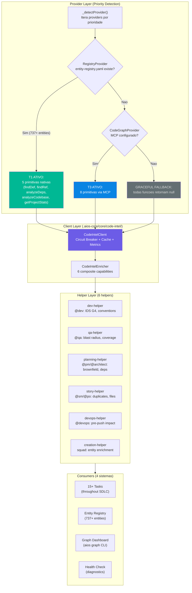
```mermaid
flowchart TB
    subgraph PROVIDER["Provider Layer (Priority Detection)"]
        direction TB
        DETECT["_detectProvider()<br/>Itera providers por prioridade"]
        REG{"RegistryProvider<br/>entity-registry.yaml existe?"}
        MCP{"CodeGraphProvider<br/>MCP configurado?"}

        DETECT --> REG
        REG -->|"Sim (737+ entities)"| T1_ACTIVE["T1 ATIVO:<br/>5 primitivas nativas<br/>(findDef, findRef, analyzeDeps,<br/>analyzeCodebase, getProjectStats)"]
        REG -->|"Nao"| MCP
        MCP -->|"Sim"| T3_ACTIVE["T3 ATIVO:<br/>8 primitivas via MCP"]
        MCP -->|"Nao"| GRACEFUL["GRACEFUL FALLBACK:<br/>todas funcoes retornam null"]
    end

    subgraph CLIENT["Client Layer (.aios-core/core/code-intel/)"]
        CIC["CodeIntelClient<br/>Circuit Breaker + Cache + Metrics"]
        CIE["CodeIntelEnricher<br/>6 composite capabilities"]
    end

    subgraph HELPERS["Helper Layer (6 helpers)"]
        H_DEV["dev-helper<br/>@dev: IDS G4, conventions"]
        H_QA["qa-helper<br/>@qa: blast radius, coverage"]
        H_PLAN["planning-helper<br/>@pm/@architect: brownfield, deps"]
        H_STORY["story-helper<br/>@sm/@po: duplicates, files"]
        H_OPS["devops-helper<br/>@devops: pre-push impact"]
        H_CREATE["creation-helper<br/>squad: entity enrichment"]
    end

    subgraph CONSUMERS["Consumers (4 sistemas)"]
        TASKS["15+ Tasks<br/>(throughout SDLC)"]
        REGISTRY["Entity Registry<br/>(737+ entities)"]
        GRAPH["Graph Dashboard<br/>(aios graph CLI)"]
        HEALTH["Health Check<br/>(diagnostics)"]
    end

    T1_ACTIVE --> CIC
    T3_ACTIVE --> CIC
    GRACEFUL --> CIC
    CIC --> CIE
    CIE --> HELPERS
    HELPERS --> CONSUMERS

    style GRACEFUL fill:#636e72,color:#ddd
    style T1_ACTIVE fill:#00b894,color:#fff
    style T3_ACTIVE fill:#0984e3,color:#fff
    style CIC fill:#6c5ce7,color:#fff
```

### Status Real (pos-CODEINTEL-RP-001)

| Aspecto | Status | Detalhe |
|---------|--------|---------|
| Code implementado | **100%** | 8 primitivas, 6 enrichers, 6 helpers, syncer |
| RegistryProvider (T1) | **ATIVO** | 5 primitivas nativas, 737+ entities, <50ms |
| CodeGraphProvider (T3) | **Nao configurado** | Disponivel como upgrade futuro para AST primitivas |
| Helpers retornando dados | **7/7 non-null** | null-rate 0% (era 100% antes do RP-001) |
| Entity Registry | **Bi-direcional** | Registry alimenta RegistryProvider + scanner standalone |
| Testes | **351 passam** | 56 unit + 20 integration + 275 regression |

---

## 2. Arquitetura de 3 Camadas (com Provider Detection)

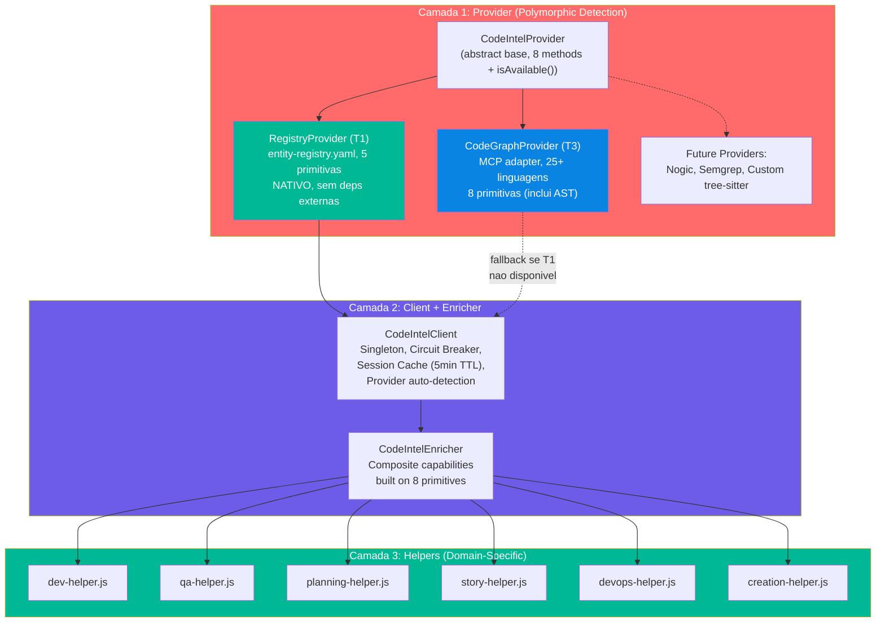
```mermaid
flowchart TD
    subgraph L1["Camada 1: Provider (Polymorphic Detection)"]
        INTERFACE["CodeIntelProvider<br/>(abstract base, 8 methods + isAvailable())"]
        REGISTRY_P["RegistryProvider (T1)<br/>entity-registry.yaml, 5 primitivas<br/>NATIVO, sem deps externas"]
        CODEGRAPH["CodeGraphProvider (T3)<br/>MCP adapter, 25+ linguagens<br/>8 primitivas (inclui AST)"]
        FUTURE["Future Providers:<br/>Nogic, Semgrep, Custom tree-sitter"]

        INTERFACE --> REGISTRY_P
        INTERFACE --> CODEGRAPH
        INTERFACE -.-> FUTURE
    end

    subgraph L2["Camada 2: Client + Enricher"]
        CLIENT["CodeIntelClient<br/>Singleton, Circuit Breaker,<br/>Session Cache (5min TTL),<br/>Provider auto-detection"]
        ENRICHER["CodeIntelEnricher<br/>Composite capabilities<br/>built on 8 primitives"]

        CLIENT --> ENRICHER
    end

    subgraph L3["Camada 3: Helpers (Domain-Specific)"]
        DEV["dev-helper.js"]
        QA["qa-helper.js"]
        PLAN["planning-helper.js"]
        STORY["story-helper.js"]
        OPS["devops-helper.js"]
        CREATE["creation-helper.js"]
    end

    REGISTRY_P --> CLIENT
    CODEGRAPH -.->|"fallback se T1<br/>nao disponivel"| CLIENT
    ENRICHER --> DEV
    ENRICHER --> QA
    ENRICHER --> PLAN
    ENRICHER --> STORY
    ENRICHER --> OPS
    ENRICHER --> CREATE

    style L1 fill:#ff6b6b,color:#fff
    style L2 fill:#6c5ce7,color:#fff
    style L3 fill:#00b894,color:#fff
    style REGISTRY_P fill:#00b894,color:#fff
    style CODEGRAPH fill:#0984e3,color:#fff
```

### Provider Priority Table

| Prioridade | Provider | Tier | Primitivas | Requer | Status |
|:----------:|----------|:----:|:----------:|--------|--------|
| 1 (primeiro) | RegistryProvider | T1 | 5/8 | entity-registry.yaml | **ATIVO** |
| 2 (fallback) | CodeGraphProvider | T3 | 8/8 | MCP configurado | Nao configurado |
| 3 (futuro) | Custom providers | — | Varies | registerProvider() | Extensivel |

### Primitivas por Provider

| Primitiva | RegistryProvider (T1) | CodeGraphProvider (T3) |
|-----------|-----------------------|-----------------------|
| findDefinition | **Sim** (byName + byPath lookup) | Sim (AST-based) |
| findReferences | **Sim** (usedBy + dependencies) | Sim (AST-based) |
| findCallers | Nao (requer AST) | Sim |
| findCallees | Nao (requer AST) | Sim |
| analyzeDependencies | **Sim** (forward+reverse deps) | Sim (AST-based) |
| analyzeComplexity | Nao (requer AST) | Sim |
| analyzeCodebase | **Sim** (registry-based overview) | Sim (file-level) |
| getProjectStats | **Sim** (entity counts, categories) | Sim (loc, languages) |

---

## 3. As 8 Primitivas — API do CodeIntelClient

Cada primitiva mapeia para uma tool do Code Graph MCP.
Todas compartilham: circuit breaker, cache, fallback `null`.


```mermaid
flowchart LR
    subgraph PRIMITIVES["8 Primitive Capabilities"]
        P1["findDefinition(symbol)<br/>→ find_definition"]
        P2["findReferences(symbol)<br/>→ find_references"]
        P3["findCallers(symbol)<br/>→ find_callers"]
        P4["findCallees(symbol)<br/>→ find_callees"]
        P5["analyzeDependencies(path)<br/>→ dependency_analysis"]
        P6["analyzeComplexity(path)<br/>→ complexity_analysis"]
        P7["analyzeCodebase(path)<br/>→ analyze_codebase"]
        P8["getProjectStats()<br/>→ project_statistics"]
    end

    subgraph PROTECTION["Protecoes (todas as primitivas)"]
        CB["Circuit Breaker<br/>3 falhas → open 60s"]
        CACHE["Session Cache<br/>5min TTL, LRU eviction"]
        FALLBACK["Fallback<br/>retorna null, sem throw"]
        LOG["Latency Logging<br/>per-capability"]
    end

    PRIMITIVES --> CB
    CB --> CACHE
    CACHE --> FALLBACK
    FALLBACK --> LOG

    style PROTECTION fill:#fdcb6e,color:#333
```

### Tabela de Primitivas (Dual-Provider)

| # | Primitiva | RegistryProvider (T1) | CodeGraphProvider (T3) | Input | Output |
|---|-----------|:---------------------:|:----------------------:|-------|--------|
| 1 | `findDefinition` | **Sim** | Sim | symbol name | `{ file, line, column, context }` |
| 2 | `findReferences` | **Sim** | Sim | symbol name | `[{ file, line, context }]` |
| 3 | `findCallers` | Nao → `null` | Sim | symbol name | `[{ caller, file, line }]` |
| 4 | `findCallees` | Nao → `null` | Sim | symbol name | `[{ callee, file, line }]` |
| 5 | `analyzeDependencies` | **Sim** | Sim | file path | `{ nodes[], edges[] }` |
| 6 | `analyzeComplexity` | Nao → `null` | Sim | file path | `{ score, details }` |
| 7 | `analyzeCodebase` | **Sim** | Sim | dir path | `{ files[], structure, patterns[] }` |
| 8 | `getProjectStats` | **Sim** | Sim | options | `{ files, lines, languages }` |

**Nota:** Com RegistryProvider ativo, 5/8 primitivas retornam dados reais. As 3 primitivas AST-only (findCallers, findCallees, analyzeComplexity) retornam `null` — disponives apenas com CodeGraphProvider ou futuro provider AST.

---

## 4. Circuit Breaker — Protecao contra Falhas

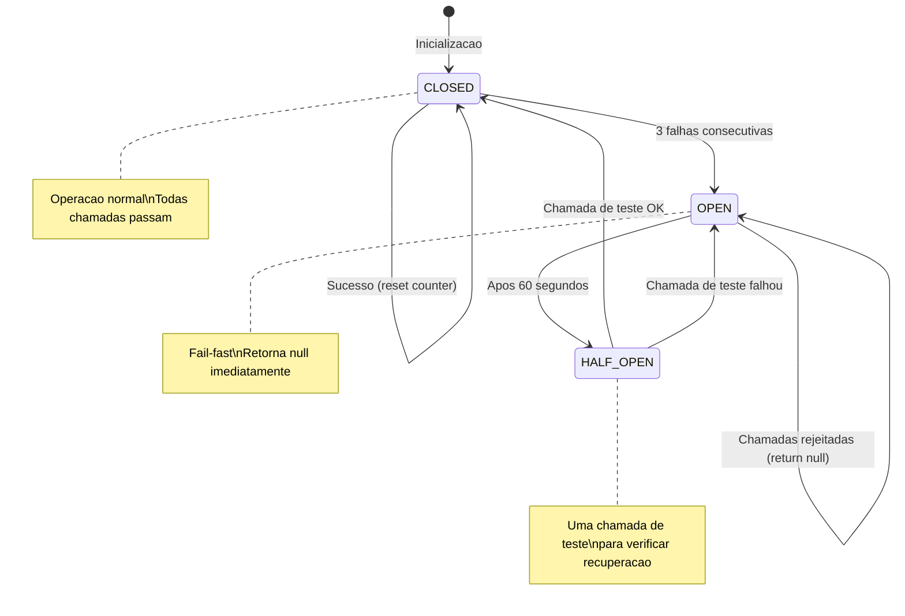
```mermaid
stateDiagram-v2
    [*] --> CLOSED: Inicializacao
    CLOSED --> CLOSED: Sucesso (reset counter)
    CLOSED --> OPEN: 3 falhas consecutivas
    OPEN --> OPEN: Chamadas rejeitadas (return null)
    OPEN --> HALF_OPEN: Apos 60 segundos
    HALF_OPEN --> CLOSED: Chamada de teste OK
    HALF_OPEN --> OPEN: Chamada de teste falhou

    note right of CLOSED: Operacao normal\nTodas chamadas passam
    note right of OPEN: Fail-fast\nRetorna null imediatamente
    note right of HALF_OPEN: Uma chamada de teste\npara verificar recuperacao
```

### Circuit Breaker Config

| Parametro | Valor | Comportamento |
|-----------|-------|---------------|
| Threshold | **3** falhas | Abre apos 3 falhas consecutivas |
| Reset Timer | **60s** | Tenta recuperar apos 1 minuto |
| Fallback | `null` | Nunca lanca excecao |
| Scope | Per-client | Um circuit breaker para todas as primitivas |

### Metricas Expostas

```javascript
getMetrics() → {
  cacheHits: number,
  cacheMisses: number,
  cacheHitRate: number,        // %
  circuitBreakerState: 'closed' | 'open' | 'half-open',
  latencyLog: Map<capability, ms[]>,
  providerAvailable: boolean,
  activeProvider: string | null
}
```

---

## 5. Availability Check — Quando Code-Intel Ativa

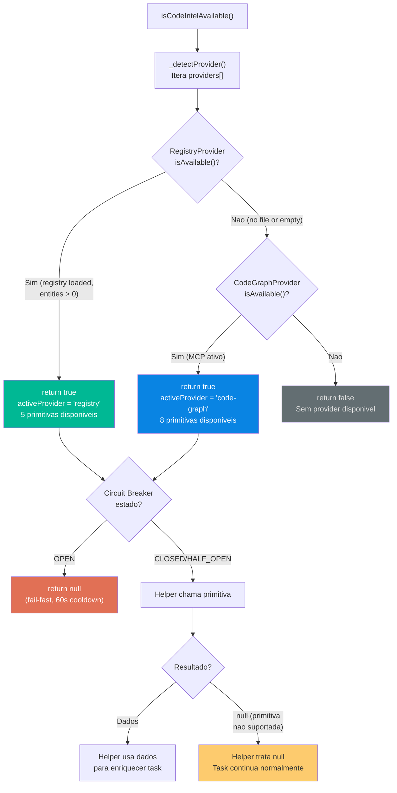
```mermaid
flowchart TD
    START["isCodeIntelAvailable()"] --> DETECT["_detectProvider()<br/>Itera providers[]"]

    DETECT --> P1{"RegistryProvider<br/>isAvailable()?"}
    P1 -->|"Sim (registry loaded,<br/>entities > 0)"| ACTIVE_T1["return true<br/>activeProvider = 'registry'<br/>5 primitivas disponiveis"]
    P1 -->|"Nao (no file or empty)"| P2{"CodeGraphProvider<br/>isAvailable()?"}
    P2 -->|"Sim (MCP ativo)"| ACTIVE_T3["return true<br/>activeProvider = 'code-graph'<br/>8 primitivas disponiveis"]
    P2 -->|"Nao"| UNAVAILABLE["return false<br/>Sem provider disponivel"]

    ACTIVE_T1 --> CHECK_CB{"Circuit Breaker<br/>estado?"}
    ACTIVE_T3 --> CHECK_CB
    CHECK_CB -->|"OPEN"| UNAVAILABLE_CB["return null<br/>(fail-fast, 60s cooldown)"]
    CHECK_CB -->|"CLOSED/HALF_OPEN"| HELPER_CALL["Helper chama primitiva"]

    HELPER_CALL --> RESULT{"Resultado?"}
    RESULT -->|"Dados"| USE["Helper usa dados<br/>para enriquecer task"]
    RESULT -->|"null (primitiva<br/>nao suportada)"| SKIP["Helper trata null<br/>Task continua normalmente"]

    style UNAVAILABLE fill:#636e72,color:#ddd
    style UNAVAILABLE_CB fill:#e17055,color:#fff
    style ACTIVE_T1 fill:#00b894,color:#fff
    style ACTIVE_T3 fill:#0984e3,color:#fff
    style SKIP fill:#fdcb6e,color:#333
```

### Condicoes de Ativacao (pos-CODEINTEL-RP-001)

| Condicao | Provider | Resultado | Frequencia Real |
|----------|----------|-----------|-----------------|
| entity-registry.yaml existe e nao-vazio | RegistryProvider (T1) | **ATIVO** (5 primitivas) | **Atual (padrao em toda instalacao AIOS)** |
| Registry vazio + MCP configurado | CodeGraphProvider (T3) | **ATIVO** (8 primitivas) | Raro (upgrade path) |
| Registry vazio + MCP nao configurado | Nenhum | **INATIVO** (null) | Apenas instalacoes sem registry |
| Provider ativo + circuit breaker aberto | Qualquer | **COOLDOWN** (null por 60s) | Transitorio |

**Mudanca-chave:** Antes do RP-001, code-intel era INATIVO por padrao (dependia de MCP). Agora e **ATIVO por padrao** em qualquer projeto AIOS com entity-registry.yaml.

---

## 6. Helpers — Quem Chama O Que e Quando

### 6.1 dev-helper.js (@dev)

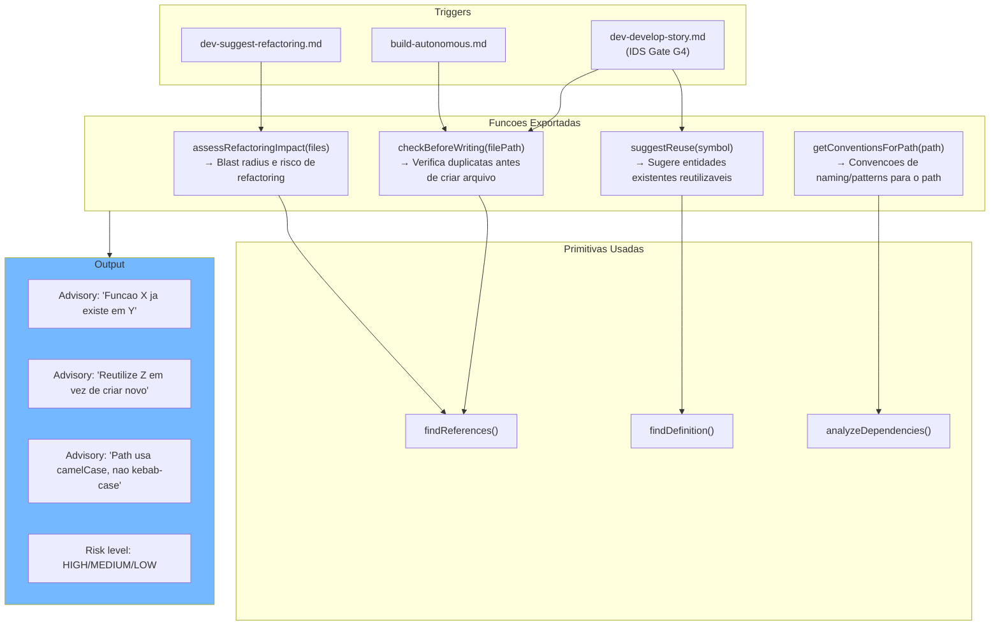
```mermaid
flowchart TD
    subgraph TRIGGER["Triggers"]
        T1["dev-develop-story.md<br/>(IDS Gate G4)"]
        T2["build-autonomous.md"]
        T3["dev-suggest-refactoring.md"]
    end

    subgraph FUNCTIONS["Funcoes Exportadas"]
        F1["checkBeforeWriting(filePath)<br/>→ Verifica duplicatas antes de criar arquivo"]
        F2["suggestReuse(symbol)<br/>→ Sugere entidades existentes reutilizaveis"]
        F3["getConventionsForPath(path)<br/>→ Convencoes de naming/patterns para o path"]
        F4["assessRefactoringImpact(files)<br/>→ Blast radius e risco de refactoring"]
    end

    subgraph PRIMITIVES_USED["Primitivas Usadas"]
        P1["findReferences()"]
        P2["findDefinition()"]
        P3["analyzeDependencies()"]
    end

    subgraph OUTPUT["Output"]
        O1["Advisory: 'Funcao X ja existe em Y'"]
        O2["Advisory: 'Reutilize Z em vez de criar novo'"]
        O3["Advisory: 'Path usa camelCase, nao kebab-case'"]
        O4["Risk level: HIGH/MEDIUM/LOW"]
    end

    T1 --> F1
    T1 --> F2
    T2 --> F1
    T3 --> F4
    F1 --> P1
    F2 --> P2
    F3 --> P3
    F4 --> P1
    FUNCTIONS --> OUTPUT

    style OUTPUT fill:#74b9ff,color:#333
```

**Fallback:** Se code-intel indisponivel, @dev **nao recebe** sugestoes de reuse/duplicatas. O fluxo continua normalmente — as sugestoes sao advisory-only.

---

### 6.2 qa-helper.js (@qa)

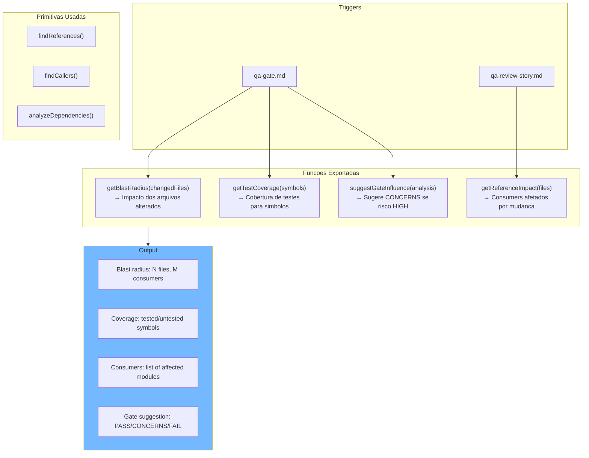
```mermaid
flowchart TD
    subgraph TRIGGER["Triggers"]
        T1["qa-gate.md"]
        T2["qa-review-story.md"]
    end

    subgraph FUNCTIONS["Funcoes Exportadas"]
        F1["getBlastRadius(changedFiles)<br/>→ Impacto dos arquivos alterados"]
        F2["getTestCoverage(symbols)<br/>→ Cobertura de testes para simbolos"]
        F3["getReferenceImpact(files)<br/>→ Consumers afetados por mudanca"]
        F4["suggestGateInfluence(analysis)<br/>→ Sugere CONCERNS se risco HIGH"]
    end

    subgraph PRIMITIVES_USED["Primitivas Usadas"]
        P1["findReferences()"]
        P2["findCallers()"]
        P3["analyzeDependencies()"]
    end

    subgraph OUTPUT["Output"]
        O1["Blast radius: N files, M consumers"]
        O2["Coverage: tested/untested symbols"]
        O3["Consumers: list of affected modules"]
        O4["Gate suggestion: PASS/CONCERNS/FAIL"]
    end

    T1 --> F1
    T1 --> F2
    T1 --> F4
    T2 --> F3
    FUNCTIONS --> OUTPUT

    style OUTPUT fill:#74b9ff,color:#333
```

**Fallback:** Sem code-intel, @qa nao recebe blast radius automatico. QA ainda faz review manual baseado em `git diff`.

---

### 6.3 planning-helper.js (@pm / @architect)

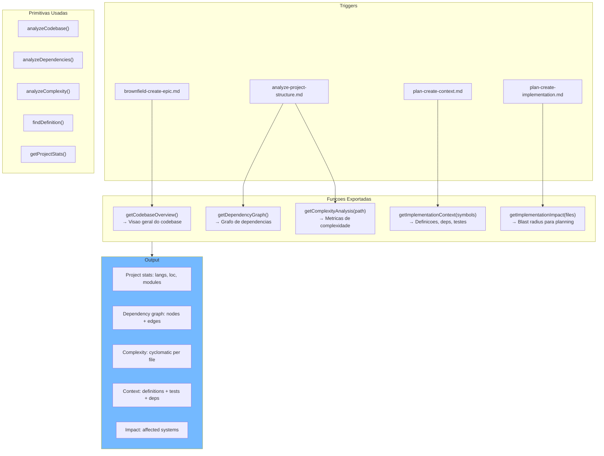
```mermaid
flowchart TD
    subgraph TRIGGER["Triggers"]
        T1["brownfield-create-epic.md"]
        T2["analyze-project-structure.md"]
        T3["plan-create-context.md"]
        T4["plan-create-implementation.md"]
    end

    subgraph FUNCTIONS["Funcoes Exportadas"]
        F1["getCodebaseOverview()<br/>→ Visao geral do codebase"]
        F2["getDependencyGraph()<br/>→ Grafo de dependencias"]
        F3["getComplexityAnalysis(path)<br/>→ Metricas de complexidade"]
        F4["getImplementationContext(symbols)<br/>→ Definicoes, deps, testes"]
        F5["getImplementationImpact(files)<br/>→ Blast radius para planning"]
    end

    subgraph PRIMITIVES_USED["Primitivas Usadas"]
        P1["analyzeCodebase()"]
        P2["analyzeDependencies()"]
        P3["analyzeComplexity()"]
        P4["findDefinition()"]
        P5["getProjectStats()"]
    end

    subgraph OUTPUT["Output"]
        O1["Project stats: langs, loc, modules"]
        O2["Dependency graph: nodes + edges"]
        O3["Complexity: cyclomatic per file"]
        O4["Context: definitions + tests + deps"]
        O5["Impact: affected systems"]
    end

    T1 --> F1
    T2 --> F2
    T2 --> F3
    T3 --> F4
    T4 --> F5
    FUNCTIONS --> OUTPUT

    style OUTPUT fill:#74b9ff,color:#333
```

**Fallback:** Sem code-intel, @architect usa `Glob` + `Grep` + `Read` nativos para analise manual.

---

### 6.4 story-helper.js (@sm / @po)

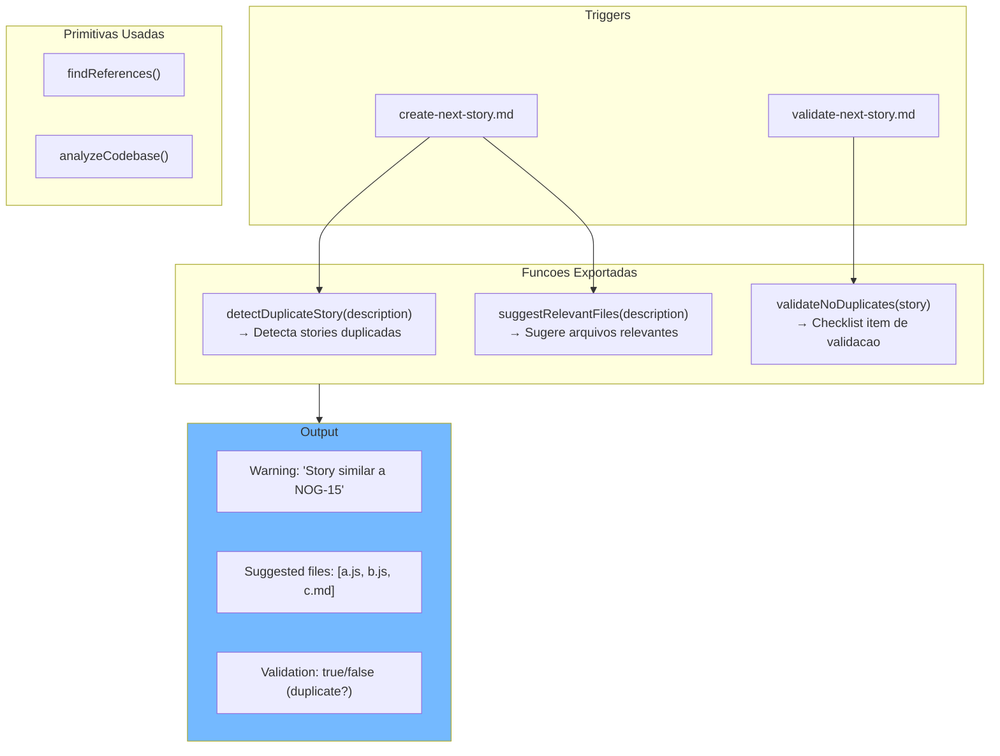
```mermaid
flowchart TD
    subgraph TRIGGER["Triggers"]
        T1["create-next-story.md"]
        T2["validate-next-story.md"]
    end

    subgraph FUNCTIONS["Funcoes Exportadas"]
        F1["detectDuplicateStory(description)<br/>→ Detecta stories duplicadas"]
        F2["suggestRelevantFiles(description)<br/>→ Sugere arquivos relevantes"]
        F3["validateNoDuplicates(story)<br/>→ Checklist item de validacao"]
    end

    subgraph PRIMITIVES_USED["Primitivas Usadas"]
        P1["findReferences()"]
        P2["analyzeCodebase()"]
    end

    subgraph OUTPUT["Output"]
        O1["Warning: 'Story similar a NOG-15'"]
        O2["Suggested files: [a.js, b.js, c.md]"]
        O3["Validation: true/false (duplicate?)"]
    end

    T1 --> F1
    T1 --> F2
    T2 --> F3
    FUNCTIONS --> OUTPUT

    style OUTPUT fill:#74b9ff,color:#333
```

**Fallback:** Sem code-intel, `validateNoDuplicates()` retorna `false` (assume nenhuma duplicata).

---

### 6.5 devops-helper.js (@devops)

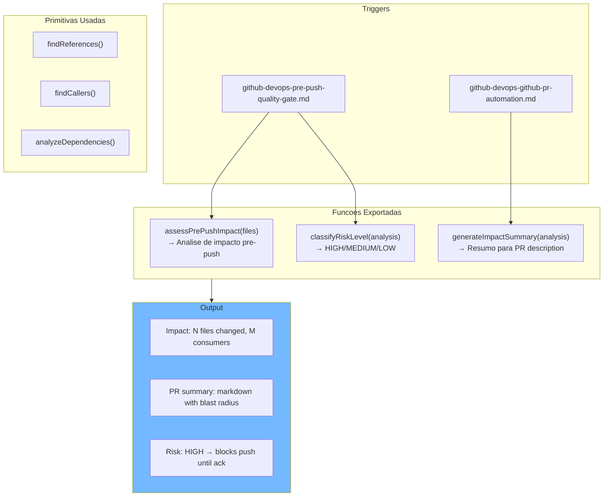
```mermaid
flowchart TD
    subgraph TRIGGER["Triggers"]
        T1["github-devops-pre-push-quality-gate.md"]
        T2["github-devops-github-pr-automation.md"]
    end

    subgraph FUNCTIONS["Funcoes Exportadas"]
        F1["assessPrePushImpact(files)<br/>→ Analise de impacto pre-push"]
        F2["generateImpactSummary(analysis)<br/>→ Resumo para PR description"]
        F3["classifyRiskLevel(analysis)<br/>→ HIGH/MEDIUM/LOW"]
    end

    subgraph PRIMITIVES_USED["Primitivas Usadas"]
        P1["findReferences()"]
        P2["findCallers()"]
        P3["analyzeDependencies()"]
    end

    subgraph OUTPUT["Output"]
        O1["Impact: N files changed, M consumers"]
        O2["PR summary: markdown with blast radius"]
        O3["Risk: HIGH → blocks push until ack"]
    end

    T1 --> F1
    T1 --> F3
    T2 --> F2
    FUNCTIONS --> OUTPUT

    style OUTPUT fill:#74b9ff,color:#333
```

**Fallback:** Sem code-intel, `*pre-push` ainda roda todos os quality gates (lint, test, typecheck, build, CodeRabbit). Apenas a analise de impacto semantica e omitida.

---

### 6.6 creation-helper.js (Entity Creation)

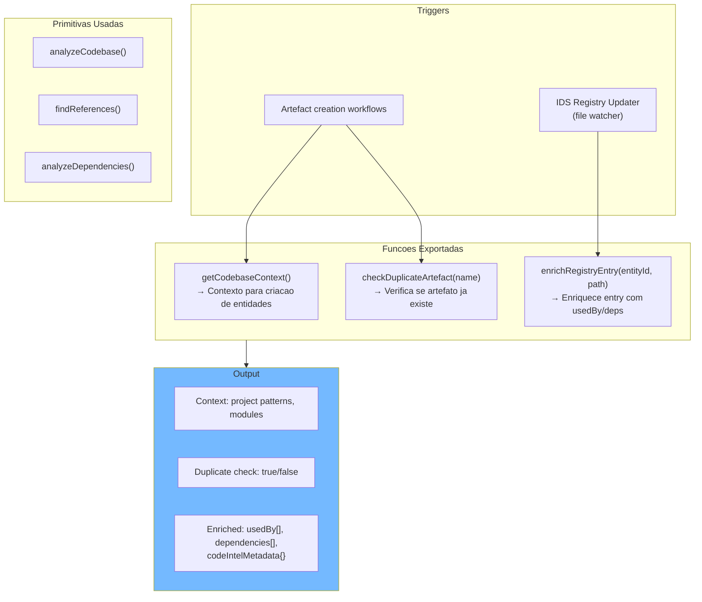
```mermaid
flowchart TD
    subgraph TRIGGER["Triggers"]
        T1["IDS Registry Updater<br/>(file watcher)"]
        T2["Artefact creation workflows"]
    end

    subgraph FUNCTIONS["Funcoes Exportadas"]
        F1["getCodebaseContext()<br/>→ Contexto para criacao de entidades"]
        F2["checkDuplicateArtefact(name)<br/>→ Verifica se artefato ja existe"]
        F3["enrichRegistryEntry(entityId, path)<br/>→ Enriquece entry com usedBy/deps"]
    end

    subgraph PRIMITIVES_USED["Primitivas Usadas"]
        P1["analyzeCodebase()"]
        P2["findReferences()"]
        P3["analyzeDependencies()"]
    end

    subgraph OUTPUT["Output"]
        O1["Context: project patterns, modules"]
        O2["Duplicate check: true/false"]
        O3["Enriched: usedBy[], dependencies[],<br/>codeIntelMetadata{}"]
    end

    T1 --> F3
    T2 --> F1
    T2 --> F2
    FUNCTIONS --> OUTPUT

    style OUTPUT fill:#74b9ff,color:#333
```

---

## 7. Entity Registry — Relacao Bi-Direcional com Code-Intel

Apos CODEINTEL-RP-001, Entity Registry e Code-Intel possuem uma **relacao bi-direcional**:
- **Registry → Code-Intel:** O scanner popula entity-registry.yaml (737+ entities)
- **Code-Intel → Registry:** RegistryProvider **le** entity-registry.yaml para fornecer 5 primitivas

Isso cria um ciclo virtuoso: quanto mais rico o registry, melhor o code-intel funciona.


```mermaid
flowchart TD
    subgraph TRIGGERS["3 Triggers de Scan"]
        T_COMMIT["Git Commit<br/>.husky/post-commit<br/>→ ids-post-commit.js"]
        T_WATCH["File Watcher<br/>registry-updater.js --watch<br/>→ chokidar on 14 paths"]
        T_MANUAL["Manual Full Scan<br/>populate-entity-registry.js<br/>→ 14 categorias"]
    end

    subgraph EXTRACTORS["Dependency Extractors (3 estrategias)"]
        E_JS["JS/TS Extractor<br/>require() + import patterns"]
        E_YAML["YAML Extractor (NOG-15)<br/>dependencies.tasks/templates/etc<br/>+ embedded YAML in markdown"]
        E_MD["Markdown Extractor (NOG-15)<br/>Pattern A: YAML blocks<br/>Pattern B: Label lists<br/>Pattern C: Markdown links<br/>Pattern D: @agent references"]
    end

    subgraph METADATA["Metadata Extraido"]
        M_PATH["path, layer (L1-L4), type"]
        M_PURPOSE["purpose (200 chars)"]
        M_KEYWORDS["keywords (filename + purpose)"]
        M_DEPS["dependencies (internal)"]
        M_EXT["externalDeps (git, npm, etc)"]
        M_PLANNED["plannedDeps (nao resolvidas)"]
        M_LIFECYCLE["lifecycle (NOG-16B):<br/>production|experimental|deprecated|orphan"]
        M_CHECKSUM["checksum (sha256)"]
    end

    subgraph ENRICHMENT["Code-Intel Enrichment (via RegistrySyncer)"]
        ENR_CHECK{"code-intel<br/>disponivel?"}
        ENR_YES["enrichRegistryEntry():<br/>findReferences() → usedBy<br/>analyzeDependencies() → deps<br/>+ codeIntelMetadata"]
        ENR_NO["Skip silenciosamente<br/>Registry funciona sem enrichment"]
    end

    subgraph READBACK["RegistryProvider (Leitura Reversa)"]
        RP["RegistryProvider le<br/>entity-registry.yaml<br/>→ 4 indexes in-memory<br/>→ 5 primitivas para helpers"]
    end

    subgraph RESOLUTION["Post-Processing"]
        R_USED["resolveUsedBy()<br/>Reverse index: para cada dep,<br/>adiciona entity ao target.usedBy"]
        R_CLASSIFY["classifyLayer(path)<br/>L1: core, L2: development,<br/>L3: data, L4: runtime"]
        R_LIFECYCLE["detectLifecycle(entity)<br/>deprecated: old_, backup_<br/>orphan: no deps + no usedBy<br/>production: has usedBy"]
    end

    subgraph OUTPUT["Outputs"]
        O_REGISTRY[".aios-core/data/entity-registry.yaml<br/>715 entities, ~491 KB"]
        O_LOG[".aios-core/data/registry-update-log.jsonl<br/>Audit trail"]
        O_BACKUP[".aios-core/data/registry-backups/<br/>Rotation at 5MB"]
    end

    TRIGGERS --> EXTRACTORS
    EXTRACTORS --> METADATA
    METADATA --> ENRICHMENT
    ENR_CHECK -->|"Sim"| ENR_YES
    ENR_CHECK -->|"Nao"| ENR_NO
    ENRICHMENT --> RESOLUTION
    RESOLUTION --> OUTPUT
    OUTPUT -->|"Ciclo bi-direcional"| RP
    RP -->|"5 primitivas<br/>para helpers"| HELPERS_REF["6 Helpers<br/>(dev, qa, planning,<br/>story, devops, creation)"]

    style ENR_NO fill:#fdcb6e,color:#333
    style ENR_YES fill:#00b894,color:#fff
    style O_REGISTRY fill:#6c5ce7,color:#fff
    style RP fill:#00b894,color:#fff
    style READBACK fill:#00b894,color:#fff
```

### Fluxo Bi-Direcional Detalhado

```
WRITE PATH (Scanner → Registry):
  File change → Extractors → Metadata → entity-registry.yaml (737+ entities)

READ PATH (Registry → Code-Intel → Helpers → Agents):
  entity-registry.yaml → RegistryProvider → 4 indexes → 5 primitivas
  → CodeIntelClient → CodeIntelEnricher → 6 Helpers → 15+ Tasks → Agents

ENRICHMENT PATH (Code-Intel → Registry, optional):
  RegistrySyncer → findReferences() + analyzeDependencies()
  → enrich usedBy/deps/codeIntelMetadata → entity-registry.yaml
```

### Entity Registry Schema (Por Entidade)

```yaml
entity-id:
  path: .aios-core/development/tasks/dev-develop-story.md
  layer: L2
  type: task
  purpose: Dev agent story implementation workflow
  keywords: [dev, develop, story, implementation]
  usedBy: [dev]                           # Reverse index
  dependencies: [execute-checklist, qa-fix-issues]  # Forward deps
  externalDeps: [git, coderabbit]         # External tools
  plannedDeps: []                          # Unresolved refs
  lifecycle: production                    # Auto-detected (NOG-16B)
  adaptability:
    score: 0.8
    constraints: []
    extensionPoints: []
  checksum: sha256:abcdef...              # Integrity
  lastVerified: 2026-02-22T21:42:38Z
  # Opcional — apenas se code-intel ativo:
  codeIntelMetadata:
    callerCount: 5
    role: task
    lastSynced: 2026-02-22T21:42:38Z
    provider: code-graph-mcp
```

---

## 8. Registry Syncer — Enrichment On-Demand

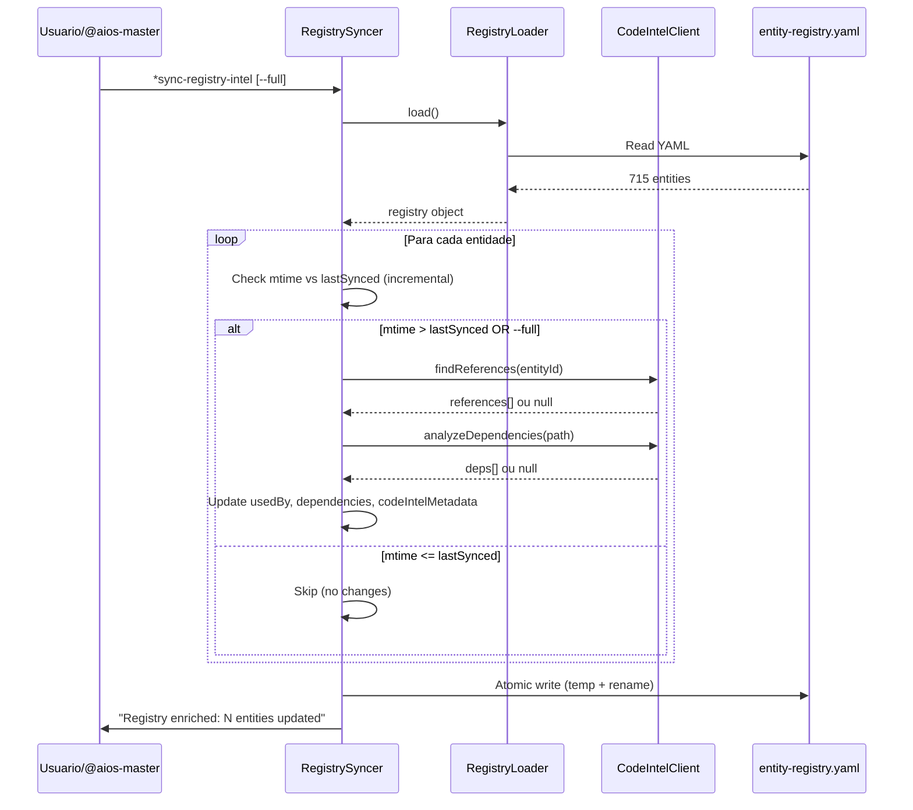
```mermaid
sequenceDiagram
    participant U as Usuario/@aios-master
    participant RS as RegistrySyncer
    participant RL as RegistryLoader
    participant CI as CodeIntelClient
    participant FS as entity-registry.yaml

    U->>RS: *sync-registry-intel [--full]
    RS->>RL: load()
    RL->>FS: Read YAML
    FS-->>RL: 715 entities
    RL-->>RS: registry object

    loop Para cada entidade
        RS->>RS: Check mtime vs lastSynced (incremental)
        alt mtime > lastSynced OR --full
            RS->>CI: findReferences(entityId)
            CI-->>RS: references[] ou null
            RS->>CI: analyzeDependencies(path)
            CI-->>RS: deps[] ou null
            RS->>RS: Update usedBy, dependencies, codeIntelMetadata
        else mtime <= lastSynced
            RS->>RS: Skip (no changes)
        end
    end

    RS->>FS: Atomic write (temp + rename)
    RS->>U: "Registry enriched: N entities updated"
```

### Modos de Sync

| Modo | Comando | Comportamento |
|------|---------|---------------|
| Incremental | `*sync-registry-intel` | Apenas entidades com mtime > lastSynced |
| Full | `*sync-registry-intel --full` | Reprocessa todas 715 entidades |

---

## 9. IDS Registry Updater — File Watcher

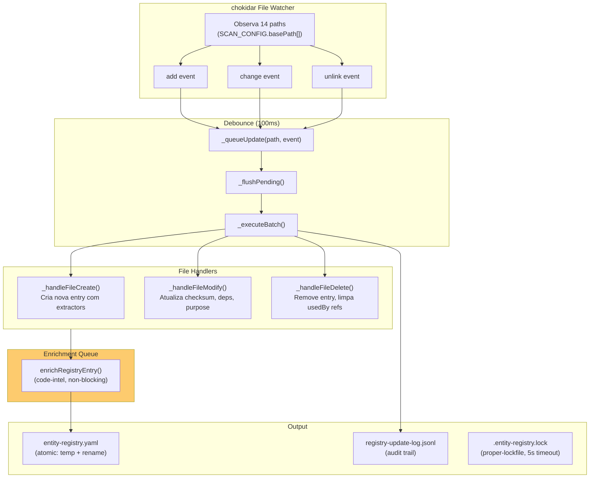
```mermaid
flowchart TD
    subgraph WATCHER["chokidar File Watcher"]
        WATCH["Observa 14 paths<br/>(SCAN_CONFIG.basePath[])"]
        ADD["add event"]
        CHANGE["change event"]
        UNLINK["unlink event"]
    end

    subgraph DEBOUNCE["Debounce (100ms)"]
        QUEUE["_queueUpdate(path, event)"]
        FLUSH["_flushPending()"]
        BATCH["_executeBatch()"]
    end

    subgraph HANDLERS["File Handlers"]
        H_CREATE["_handleFileCreate()<br/>Cria nova entry com extractors"]
        H_MODIFY["_handleFileModify()<br/>Atualiza checksum, deps, purpose"]
        H_DELETE["_handleFileDelete()<br/>Remove entry, limpa usedBy refs"]
    end

    subgraph ENRICHMENT["Enrichment Queue"]
        ENR["enrichRegistryEntry()<br/>(code-intel, non-blocking)"]
    end

    subgraph OUTPUT["Output"]
        REGISTRY["entity-registry.yaml<br/>(atomic: temp + rename)"]
        LOG["registry-update-log.jsonl<br/>(audit trail)"]
        LOCK[".entity-registry.lock<br/>(proper-lockfile, 5s timeout)"]
    end

    WATCH --> ADD & CHANGE & UNLINK
    ADD --> QUEUE
    CHANGE --> QUEUE
    UNLINK --> QUEUE
    QUEUE --> FLUSH
    FLUSH --> BATCH
    BATCH --> H_CREATE & H_MODIFY & H_DELETE
    HANDLERS --> ENR
    ENR --> REGISTRY
    BATCH --> LOG

    style ENRICHMENT fill:#fdcb6e,color:#333
```

### Exclude Patterns

```
/node_modules/  /\.test\.js$/  /\.spec\.js$/  /README\.md$/i  /registry-*/  /\.lock$/
```

---

## 10. Git Hook — Post-Commit Auto-Update

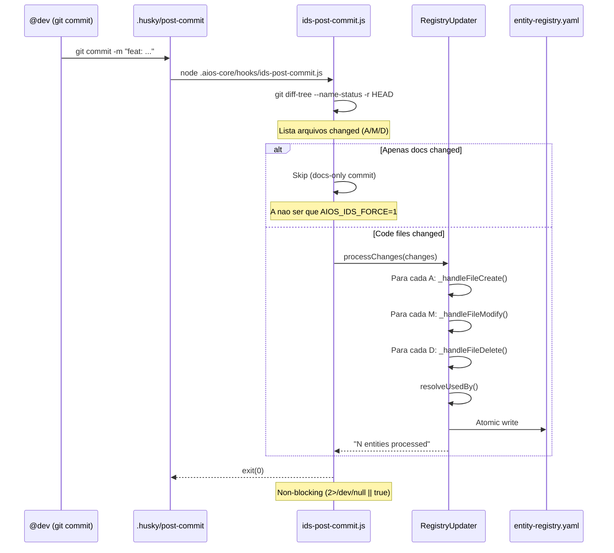
```mermaid
sequenceDiagram
    participant DEV as @dev (git commit)
    participant HOOK as .husky/post-commit
    participant IDS as ids-post-commit.js
    participant UPDATER as RegistryUpdater
    participant FS as entity-registry.yaml

    DEV->>HOOK: git commit -m "feat: ..."
    HOOK->>IDS: node .aios-core/hooks/ids-post-commit.js

    IDS->>IDS: git diff-tree --name-status -r HEAD
    Note over IDS: Lista arquivos changed (A/M/D)

    alt Apenas docs changed
        IDS->>IDS: Skip (docs-only commit)
        Note over IDS: A nao ser que AIOS_IDS_FORCE=1
    else Code files changed
        IDS->>UPDATER: processChanges(changes)
        UPDATER->>UPDATER: Para cada A: _handleFileCreate()
        UPDATER->>UPDATER: Para cada M: _handleFileModify()
        UPDATER->>UPDATER: Para cada D: _handleFileDelete()
        UPDATER->>UPDATER: resolveUsedBy()
        UPDATER->>FS: Atomic write
        UPDATER-->>IDS: "N entities processed"
    end

    IDS-->>HOOK: exit(0)
    Note over IDS: Non-blocking (2>/dev/null || true)
```

---

## 11. Graph Dashboard — Visualizacao de Dependencias

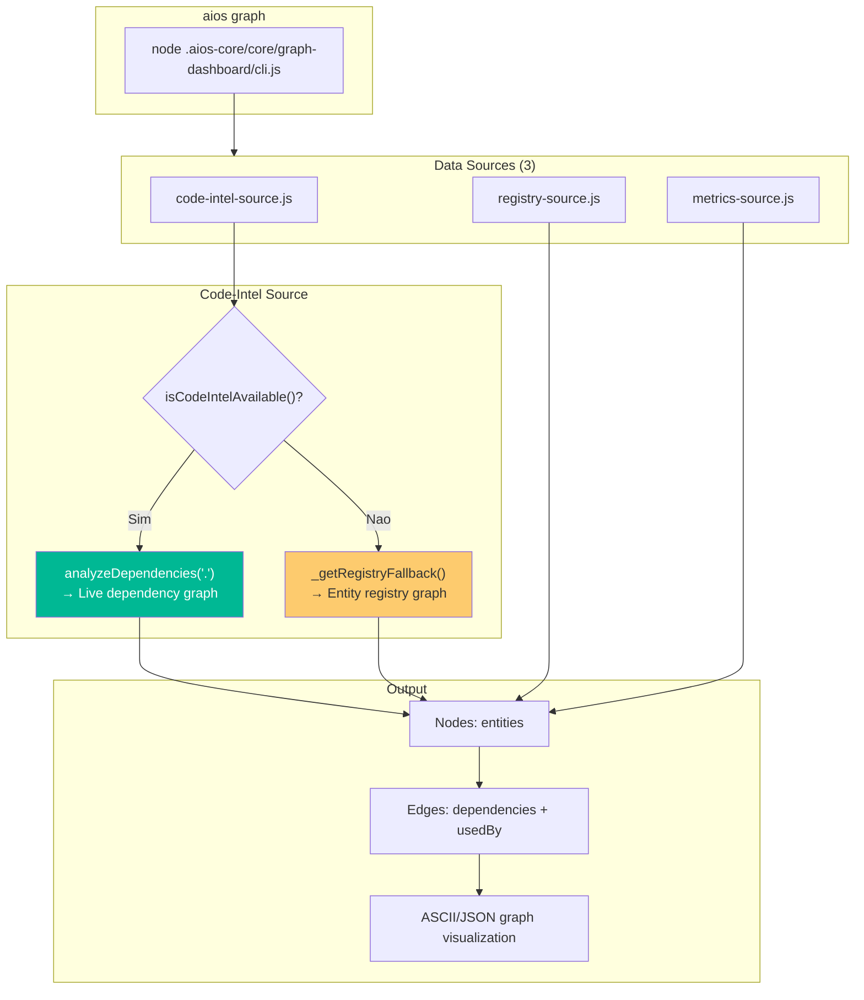
```mermaid
flowchart TD
    subgraph CLI["aios graph"]
        CMD["node .aios-core/core/graph-dashboard/cli.js"]
    end

    subgraph SOURCES["Data Sources (3)"]
        S_INTEL["code-intel-source.js"]
        S_REG["registry-source.js"]
        S_METRIC["metrics-source.js"]
    end

    subgraph INTEL_FLOW["Code-Intel Source"]
        CHECK{"isCodeIntelAvailable()?"}
        ACTIVE["analyzeDependencies('.')<br/>→ Live dependency graph"]
        FALLBACK["_getRegistryFallback()<br/>→ Entity registry graph"]
    end

    subgraph OUTPUT["Output"]
        NODES["Nodes: entities"]
        EDGES["Edges: dependencies + usedBy"]
        GRAPH["ASCII/JSON graph visualization"]
    end

    CMD --> SOURCES
    S_INTEL --> CHECK
    CHECK -->|"Sim"| ACTIVE
    CHECK -->|"Nao"| FALLBACK
    ACTIVE --> NODES
    FALLBACK --> NODES
    S_REG --> NODES
    S_METRIC --> NODES
    NODES --> EDGES --> GRAPH

    style FALLBACK fill:#fdcb6e,color:#333
    style ACTIVE fill:#00b894,color:#fff
```

---

## 12. Health Check — Diagnostico

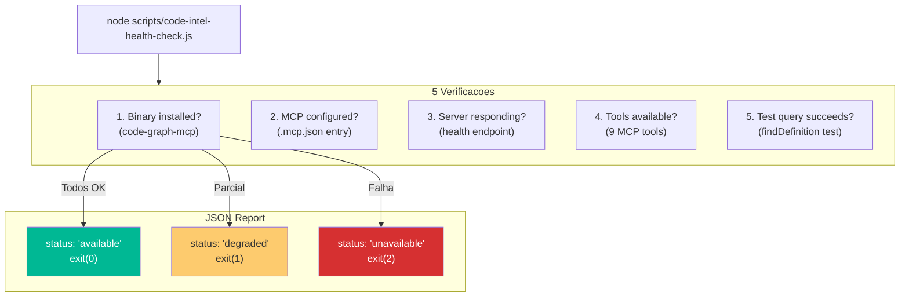
```mermaid
flowchart TD
    CMD["node scripts/code-intel-health-check.js"] --> CHECKS

    subgraph CHECKS["5 Verificacoes"]
        C1["1. Binary installed?<br/>(code-graph-mcp)"]
        C2["2. MCP configured?<br/>(.mcp.json entry)"]
        C3["3. Server responding?<br/>(health endpoint)"]
        C4["4. Tools available?<br/>(9 MCP tools)"]
        C5["5. Test query succeeds?<br/>(findDefinition test)"]
    end

    subgraph RESULT["JSON Report"]
        R_OK["status: 'available'<br/>exit(0)"]
        R_DEGRADED["status: 'degraded'<br/>exit(1)"]
        R_UNAVAILABLE["status: 'unavailable'<br/>exit(2)"]
    end

    C1 -->|"Todos OK"| R_OK
    C1 -->|"Parcial"| R_DEGRADED
    C1 -->|"Falha"| R_UNAVAILABLE

    style R_OK fill:#00b894,color:#fff
    style R_DEGRADED fill:#fdcb6e,color:#333
    style R_UNAVAILABLE fill:#d63031,color:#fff
```

---

## 13. Relacao com SYNAPSE — Sistemas Paralelos, Entity Registry como Ponte

SYNAPSE e Code-Intel sao **sistemas paralelos** sem invocacao direta.
A unica conexao indireta e o **Entity Registry**, que ambos usam mas de formas diferentes:

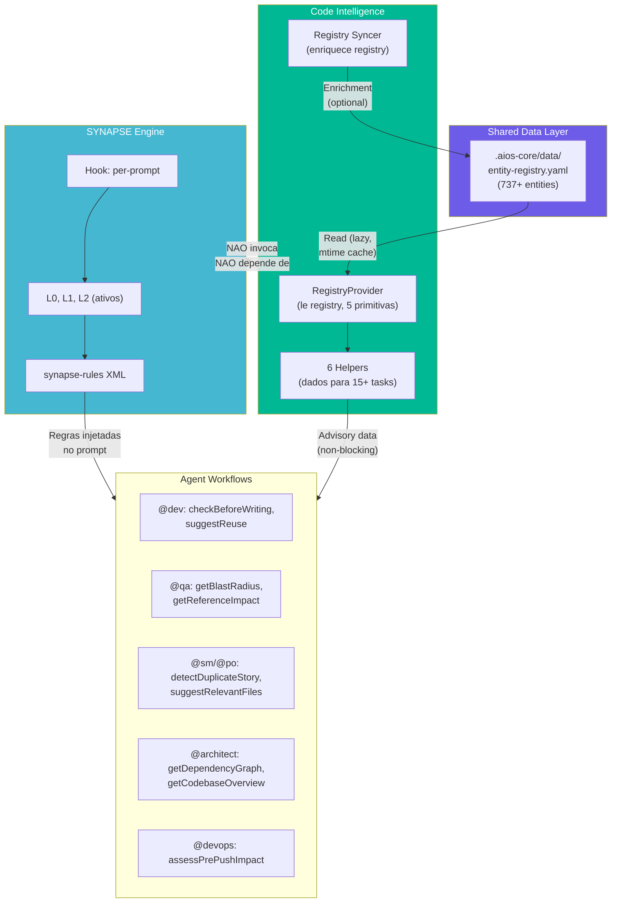
```mermaid
flowchart TB
    subgraph SYNAPSE["SYNAPSE Engine"]
        S_HOOK["Hook: per-prompt"]
        S_LAYERS["L0, L1, L2 (ativos)"]
        S_RULES["synapse-rules XML"]
    end

    subgraph SHARED["Shared Data Layer"]
        REGISTRY[".aios-core/data/<br/>entity-registry.yaml<br/>(737+ entities)"]
    end

    subgraph CODEINTEL["Code Intelligence"]
        RP["RegistryProvider<br/>(le registry, 5 primitivas)"]
        HELPERS["6 Helpers<br/>(dados para 15+ tasks)"]
        SYNCER["Registry Syncer<br/>(enriquece registry)"]
    end

    subgraph AGENTS["Agent Workflows"]
        DEV["@dev: checkBeforeWriting,<br/>suggestReuse"]
        QA["@qa: getBlastRadius,<br/>getReferenceImpact"]
        SM["@sm/@po: detectDuplicateStory,<br/>suggestRelevantFiles"]
        PLAN["@architect: getDependencyGraph,<br/>getCodebaseOverview"]
        OPS["@devops: assessPrePushImpact"]
    end

    S_HOOK --> S_LAYERS --> S_RULES
    S_RULES -->|"Regras injetadas<br/>no prompt"| AGENTS

    REGISTRY -->|"Read (lazy,<br/>mtime cache)"| RP
    RP --> HELPERS
    HELPERS -->|"Advisory data<br/>(non-blocking)"| AGENTS
    SYNCER -->|"Enrichment<br/>(optional)"| REGISTRY

    SYNAPSE -.->|"NAO invoca"| CODEINTEL
    CODEINTEL -.->|"NAO depende de"| SYNAPSE

    style SHARED fill:#6c5ce7,color:#fff
    style SYNAPSE fill:#45b7d1,color:#fff
    style CODEINTEL fill:#00b894,color:#fff
```

### Tabela de Separacao

| Aspecto | SYNAPSE | Code Intelligence |
|---------|---------|-------------------|
| **Trigger** | Cada prompt (hook) | Task execution / file change / manual |
| **Frequencia** | Continuo (per-prompt) | On-demand (lazy load) |
| **Output** | `<synapse-rules>` XML | Advisory data / registry enrichment |
| **Latencia** | <1ms per-prompt | <50ms (RegistryProvider, mtime cache) |
| **Fallback** | Nenhum (sempre executa) | `null` (graceful skip) |
| **Data Source** | Domain files (.synapse/) | entity-registry.yaml (shared) |
| **Provider** | Domain Loader (local) | RegistryProvider (T1) ou CodeGraphMCP (T3) |
| **Impacto se falhar** | Prompts sem regras | Tasks sem sugestoes |
| **Relacao com agents** | Injeta regras de comportamento | Fornece dados semanticos do codebase |

### Como os Agentes Recebem Ambos os Sistemas

```
Prompt do usuario
    ├── SYNAPSE hook (<1ms) → <synapse-rules> XML
    │   └── Regras: constitution, agent persona, commands, restrictions
    │
    └── Agent executa task → Helper function call
        └── Code-Intel → RegistryProvider → entity-registry.yaml
            └── Advisory: "Entidade X ja existe", "Blast radius: 5 consumers"
```

Os agentes recebem **regras** do SYNAPSE (como se comportar) e **dados** do Code-Intel (o que o codebase contem). Sistemas complementares, nao concorrentes.

---

## 14. Fluxo End-to-End — Story Development com Code-Intel

Cenario completo: como code-intel participa (ou nao) no ciclo de uma story.

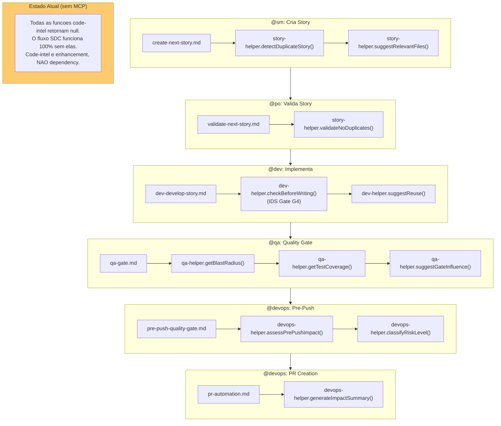
```mermaid
flowchart TD
    subgraph CREATE["@sm: Cria Story"]
        C1["create-next-story.md"]
        C2["story-helper.detectDuplicateStory()"]
        C3["story-helper.suggestRelevantFiles()"]
        C1 --> C2 --> C3
    end

    subgraph VALIDATE["@po: Valida Story"]
        V1["validate-next-story.md"]
        V2["story-helper.validateNoDuplicates()"]
        V1 --> V2
    end

    subgraph IMPLEMENT["@dev: Implementa"]
        I1["dev-develop-story.md"]
        I2["dev-helper.checkBeforeWriting()<br/>(IDS Gate G4)"]
        I3["dev-helper.suggestReuse()"]
        I1 --> I2 --> I3
    end

    subgraph QA_GATE["@qa: Quality Gate"]
        Q1["qa-gate.md"]
        Q2["qa-helper.getBlastRadius()"]
        Q3["qa-helper.getTestCoverage()"]
        Q4["qa-helper.suggestGateInfluence()"]
        Q1 --> Q2 --> Q3 --> Q4
    end

    subgraph PUSH["@devops: Pre-Push"]
        P1["pre-push-quality-gate.md"]
        P2["devops-helper.assessPrePushImpact()"]
        P3["devops-helper.classifyRiskLevel()"]
        P1 --> P2 --> P3
    end

    subgraph PR["@devops: PR Creation"]
        PR1["pr-automation.md"]
        PR2["devops-helper.generateImpactSummary()"]
        PR1 --> PR2
    end

    CREATE --> VALIDATE --> IMPLEMENT --> QA_GATE --> PUSH --> PR

    subgraph FALLBACK_NOTE["Estado Atual (sem MCP)"]
        FN["Todas as funcoes code-intel retornam null.<br/>O fluxo SDC funciona 100% sem elas.<br/>Code-intel e enhancement, NAO dependency."]
    end

    style FALLBACK_NOTE fill:#fdcb6e,color:#333
```

---

## 15. Arvore de Arquivos — Mapa Completo

```
.aios-core/core/code-intel/                    # CODE INTELLIGENCE SYSTEM
├── index.js                                    # Public exports, singletons
│   └── Exports: getClient(), getEnricher(), isCodeIntelAvailable(),
│       RegistryProvider, CodeGraphProvider, enrichWithCodeIntel()
├── code-intel-client.js                        # Provider detection + circuit breaker + cache
│   └── Class: CodeIntelClient (singleton)
│       ├── _registerDefaultProviders() → [RegistryProvider, CodeGraphProvider]
│       ├── _detectProvider() → first isAvailable() wins
│       └── _executeCapability() → cache → circuit breaker → provider
├── code-intel-enricher.js                      # 6 composite capabilities
│   └── Class: CodeIntelEnricher
│       ├── assessImpact(files)
│       ├── detectDuplicates(name, type)
│       ├── getConventions(path)
│       ├── findTests(symbol)
│       ├── describeProject()
│       └── getEntityContext(entityId)
├── registry-syncer.js                          # On-demand registry enrichment
│   └── Class: RegistrySyncer
│       ├── sync({ full: false })
│       └── Atomic write (temp + rename)
├── providers/
│   ├── provider-interface.js                   # Abstract base class
│   │   └── 8 methods + isAvailable() (default: false)
│   ├── registry-provider.js                    # T1 NATIVE provider (CODEINTEL-RP-001)
│   │   └── Class: RegistryProvider
│   │       ├── Reads: entity-registry.yaml (737+ entities)
│   │       ├── 4 indexes: byName, byPath, byCategory, byKeyword
│   │       ├── Lazy loading + mtime cache invalidation
│   │       ├── Safe YAML (js-yaml JSON_SCHEMA)
│   │       ├── Entity disambiguation (scoring + layer priority)
│   │       └── 5/8 primitivas (exceto findCallers, findCallees, analyzeComplexity)
│   └── code-graph-provider.js                  # T3 MCP adapter (fallback)
│       └── Requires: mcpCallFn (from Claude Code)
└── helpers/
    ├── dev-helper.js                           # @dev: IDS G4, conventions, reuse
    ├── qa-helper.js                            # @qa: blast radius, coverage, gate
    ├── story-helper.js                         # @sm/@po: duplicates, relevant files
    ├── planning-helper.js                      # @pm/@architect: overview, deps, complexity
    ├── devops-helper.js                        # @devops: pre-push impact, risk
    └── creation-helper.js                      # Entity creation: context, enrichment

.aios-core/core/ids/                            # IDS REGISTRY SYSTEM
├── registry-updater.js                         # File watcher + incremental updates
│   └── Uses: creation-helper.enrichRegistryEntry()
├── registry-loader.js                          # Query API for registry
├── registry-healer.js                          # Repair corrupted entries
├── framework-governor.js                       # Constitutional enforcement
└── gates/                                      # G1-G4 governance gates

.aios-core/core/graph-dashboard/                # GRAPH VISUALIZATION
└── data-sources/
    ├── code-intel-source.js                    # Uses code-intel, fallback to registry
    ├── registry-source.js                      # Static registry data
    └── metrics-source.js                       # Cache/latency metrics

.aios-core/data/                                # REGISTRY DATA
├── entity-registry.yaml                        # 715 entities, ~491 KB
├── registry-update-log.jsonl                   # Audit trail
├── registry-backups/                           # Rotation backups
└── .entity-registry.lock                       # Concurrency lock

.aios-core/hooks/
└── ids-post-commit.js                          # Git hook: auto-update registry

.aios-core/development/scripts/
└── populate-entity-registry.js                 # Full scan: 14 categories

scripts/
└── code-intel-health-check.js                  # Diagnostics

tests/unit/code-intel/                          # 12 test files (56 unit tests)
│   └── registry-provider.test.js              # 31 tests for RegistryProvider
tests/integration/code-intel/                   # 3 test files (20 integration tests)
│   └── helpers-with-registry.test.js          # 11 tests: AC8 + AC13 validation
tests/graph-dashboard/                          # 5 test files
```

---

## 16. Resumo: Status Atual por Componente

| Sistema | Provider Necessario? | RegistryProvider (T1) | CodeGraphMCP (T3) | Status Real |
|---------|:-------------------:|:---------------------:|:-----------------:|-------------|
| Entity Registry Scanner | **Nao** | — | — | **Funcionando** (standalone) |
| 14-category File Scan | **Nao** | — | — | **Funcionando** |
| JS/YAML/MD Extractors | **Nao** | — | — | **Funcionando** (NOG-15) |
| Lifecycle Detection | **Nao** | — | — | **Funcionando** (NOG-16B) |
| usedBy Reverse Index | **Nao** | Dados mais ricos | findReferences AST | **Funcionando** |
| Post-Commit Hook | **Nao** | — | — | **Funcionando** |
| File Watcher (IDS) | **Nao** | — | enrichRegistryEntry() | **Funcionando** |
| Graph Dashboard | **Nao** (fallback) | Dados nativos | Live AST graph | **Funcionando** |
| Health Check | **Nao** | Reports T1 ativo | Reports T3 ativo | **Funcionando** |
| 6 Helpers (advisory) | **Sim** | **5/8 primitivas** | 8/8 primitivas | **ATIVO (T1)** |
| Registry Syncer | **Sim** | Self-enrichment | Full enrichment | **Funcional** |
| Circuit Breaker | N/A | Protecao | Protecao | **Implementado** |

### Provider Comparison

| Aspecto | Sem Provider | RegistryProvider (T1) | CodeGraphMCP (T3) |
|---------|:-----------:|:--------------------:|:-----------------:|
| Helpers null-rate | 100% | **0%** (7/7 non-null) | 0% (7/7 non-null) |
| Primitivas ativas | 0/8 | **5/8** | 8/8 |
| Deps externas | Nenhuma | **Nenhuma** (le YAML local) | MCP server instalado |
| Latencia | 0ms (null) | **<50ms** (mtime cache) | ~100-500ms (MCP call) |
| AST analysis | Nao | Nao | **Sim** |
| Setup necessario | — | **Zero** (auto-detect) | Instalar + configurar MCP |

### Principio Fundamental

```
Code Intelligence = Enhancement Layer, NOT Dependency
Provider = Pluggable, Prioritized, Auto-Detected
T1 Native = RegistryProvider (default, zero config, 5 primitivas)
T3 MCP = CodeGraphProvider (upgrade path, 8 primitivas, AST analysis)
Graceful Fallback = null para primitivas nao suportadas, sem throw
```

Nenhuma funcionalidade core do AIOS depende de code-intel estar ativo.
Com RegistryProvider, code-intel agora esta **ativo por padrao** — helpers retornam
dados reais (null-rate 0%) sem nenhuma configuracao adicional.
CodeGraphProvider continua disponivel como upgrade para AST primitivas.

---

*Documento atualizado por @qa (Quinn) — pos-CODEINTEL-RP-001 review*
*Baseado em: 351 testes passando, 14 ACs validados, QA Gate PASS (100/100)*
*Data: 2026-02-24*

— Quinn, guardiao da qualidade
