# SYNAPSE — Flowcharts & System Diagrams (Measured Behavior)

> Documentacao visual do comportamento **real e medido** do SYNAPSE apos
> a migracao NOG-18 Native-First. Baseado em metricas de pipeline-audit,
> hook-metrics.json, uap-metrics.json e NOG-23 benchmark comparison.

**Versao:** 3.1.0
**Data:** 2026-02-24
**Autor:** @architect (Aria), atualizado por @qa (Quinn)
**Status:** Living Document — Post-NOG-18 + CODEINTEL-RP-001
**Baseline:** NOG-17 pipeline-audit + NOG-23 benchmark + CODEINTEL-RP-001 (RegistryProvider)
**Supersedes:** SYNAPSE-FLOWCHARTS.md v2.0.0 (deprecated)
**Mudanca v3.1:** Code-Intel agora ATIVO via RegistryProvider (T1) — paralelo ao SYNAPSE, nao integrado nele.

---

## 1. Visao Geral — Estado Real do Sistema

O SYNAPSE opera com **3 layers ativos** (L0, L1, L2) de 8 possiveis.
L3-L7 estao implementados mas **desabilitados** pela constante `DEFAULT_ACTIVE_LAYERS`.
A ativacao de agentes usa **Claude Code native features** (skills, hooks, memory, rules)
em vez do UAP/GreetingBuilder programatico.

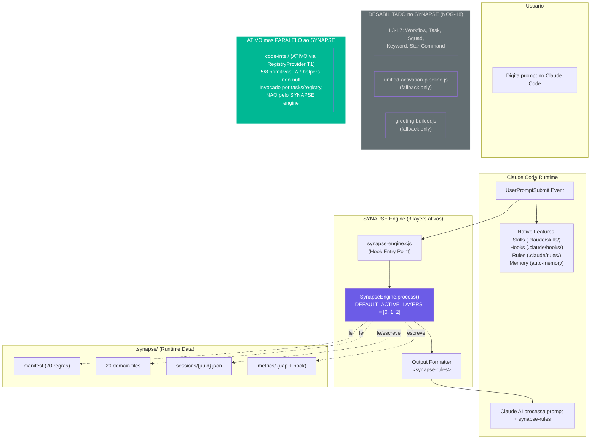

### Metricas Medidas (NOG-23 Benchmark)

| Metrica | Valor Medido | Fonte |
|---------|-------------|-------|
| SYNAPSE processing per-prompt | **<1ms** | hook-metrics.json |
| Layers carregados | **3** (L0, L1, L2) | hook-metrics.json |
| Layers skipped | **5** (L3-L7) | hook-metrics.json |
| Total regras injetadas | **70** | hook-metrics.json |
| Token budget FRESH | **800 adj tokens** | context-tracker.js |
| Agent activation p50 | **21-161ms** | NOG-23 pipeline-audit |

---

## 2. Pipeline Real — Apenas 3 Layers

O engine **sempre** usa `[0, 1, 2]` independente do bracket calculado.
A logica de selecao de layers por bracket existe no codigo mas e **ignorada**
pela constante `DEFAULT_ACTIVE_LAYERS` (engine.js linhas 176-181, 244-265).

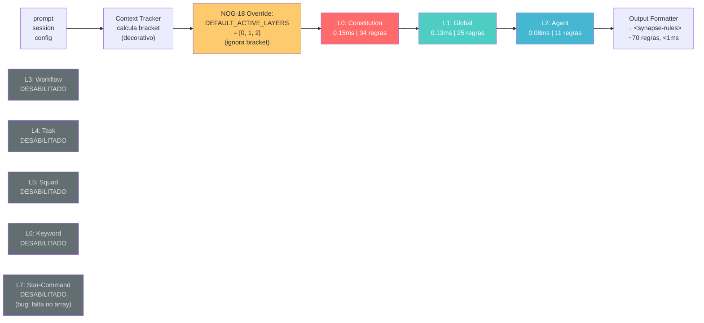

### Comparacao: Planejado vs Real

| Layer | v2.0 (Planejado) | v3.0 (Medido) | Status |
|-------|-----------------|---------------|--------|
| L0: Constitution | Ativo, 5ms | **Ativo, 0.15ms** | Funcionando |
| L1: Global | Ativo, 10ms | **Ativo, 0.13ms** | Funcionando |
| L2: Agent | Ativo, 15ms | **Ativo, 0.08ms** | Funcionando |
| L3: Workflow | Ativo | **Desabilitado** | session.active_workflow = null |
| L4: Task | Ativo | **Desabilitado** | session.active_task = null |
| L5: Squad | Ativo | **Desabilitado** | session.active_squad = null |
| L6: Keyword | Ativo | **Desabilitado** | RECALL matching nunca ativado |
| L7: Star-Command | Ativo | **Desabilitado** | Bug: nao incluido em DEFAULT_ACTIVE_LAYERS |

### Bug Conhecido: L7 Star-Command

```javascript
// engine.js linha 176-181
const DEFAULT_ACTIVE_LAYERS = [0, 1, 2];
// Deveria ser [0, 1, 2, 7] para manter star-command detection
// L7 era FRESH-bracket layer no design original
// Impacto: *commands nao sao processados pelo SYNAPSE
// Mitigacao: Claude Code resolve *commands nativamente via skills
```

---

## 3. Context Brackets — Calculados Mas Decorativos

O bracket e calculado corretamente a cada prompt, mas **nao influencia**
quais layers sao executados (sempre L0, L1, L2). Apenas o token budget varia.

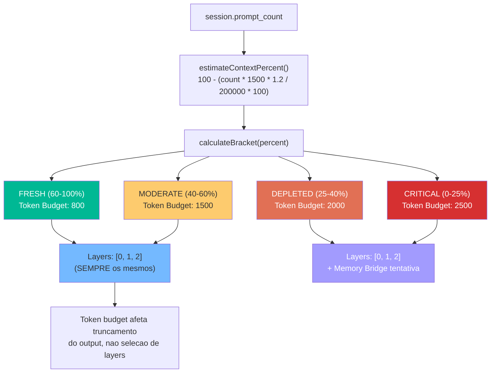

### Tabela Real de Brackets (Medido)

| Bracket | Context % | Layers Reais | Token Budget | Memory Bridge | Impacto Real |
|---------|-----------|-------------|-------------|--------------|-------------|
| FRESH | 60-100% | **[0, 1, 2]** | 800 | Skip | Output ~400-500 tokens |
| MODERATE | 40-60% | **[0, 1, 2]** | 1500 | Skip | Output aceita mais tokens |
| DEPLETED | 25-40% | **[0, 1, 2]** | 2000 | Tenta (Pro-gated) | Raro de atingir |
| CRITICAL | 0-25% | **[0, 1, 2]** | 2500 | Tenta (Pro-gated) | Quase nunca atingido |

**Nota:** Na pratica, a maioria das sessoes opera em FRESH porque `prompt_count` precisa atingir ~45 prompts para sair de FRESH (formula: `100 - (45 * 1500 * 1.2 / 200000 * 100) = 59.5%`).

---

## 4. Ativacao de Agentes — Fluxo Real (NOG-21)

Apos NOG-21, a ativacao usa **Claude Code native markdown** em vez do UAP programatico.
O UAP (`unified-activation-pipeline.js`) existe como **fallback** nos agent files,
mas o fluxo primario e a leitura direta do frontmatter pelo Claude Code.

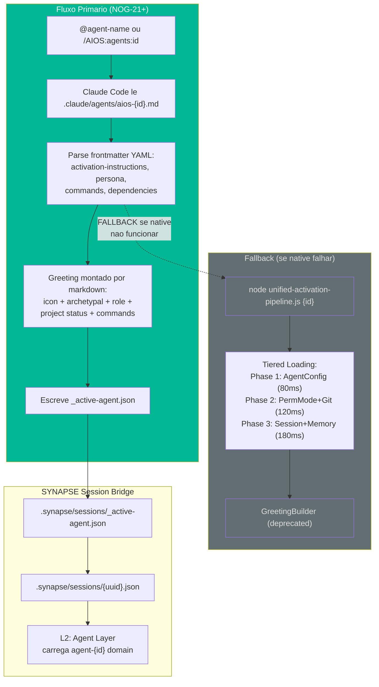

### Agent Activation Latency (NOG-23 Rerun)

| Agent | NOG-17 p50 (ms) | NOG-23 p50 (ms) | Delta | Quality |
|-------|----------------|-----------------|-------|---------|
| @dev | 194.6 | **161.5** | -17.0% | full |
| @qa | 92.3 | **104.0** | +12.7% | full |
| @architect | 83.5 | **21.4** | -74.4% | full |
| @pm | 94.1 | — | baseline | full |
| @po | 98.7 | — | baseline | full |
| @sm | 89.6 | — | baseline | full |
| @devops | 81.3 | — | baseline | full |
| @analyst | 88.2 | — | baseline | full |
| @data-engineer | 95.7 | — | baseline | full |
| @ux | 83.5 | — | baseline | full |

**Nota:** NOG-23 rerun executou quick mode (3 agents). Baseline completo em NOG-17.

---

## 5. Agent Native Features — O Que Substituiu L3-L7

As funcionalidades que L3-L7 proviam sao agora cobertas por features nativas
do Claude Code, configuradas via frontmatter nos agent files.

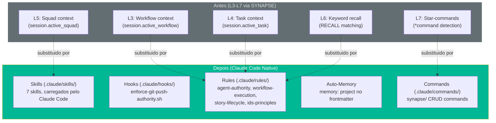

### Mapeamento Detalhado

| Feature SYNAPSE (desabilitada) | Substituto Nativo | Como Funciona |
|-------------------------------|-------------------|---------------|
| L3: Workflow rules | `.claude/rules/workflow-execution.md` | Claude Code carrega rules automaticamente |
| L4: Task context | Story files em `docs/stories/` | Agent le story diretamente |
| L5: Squad domains | `.claude/skills/` + squad configs | Skills carregados por frontmatter |
| L6: Keyword recall | `.claude/rules/` com paths frontmatter | Rules condicionais por path |
| L7: Star-commands | `.claude/commands/synapse/` + skills | Commands nativos do Claude Code |
| UAP GreetingBuilder | Markdown activation-instructions | Frontmatter YAML no agent file |
| Memory Bridge (MIS) | `memory: project` auto-memory | Claude Code gerencia MEMORY.md |

---

## 6. Code Intelligence — Status Real (pos-CODEINTEL-RP-001)

O modulo `code-intel/` e **production code ativo** com RegistryProvider (T1) nativo.
E invocado por 15+ tasks e pelo Entity Registry, mas **nao pelo SYNAPSE engine**.
Com RegistryProvider, 5/8 primitivas retornam dados reais sem nenhuma configuracao.

> Documentacao completa: [CODE-INTEL-FLOWCHARTS.md](../CODE-INTEL-FLOWCHARTS.md)

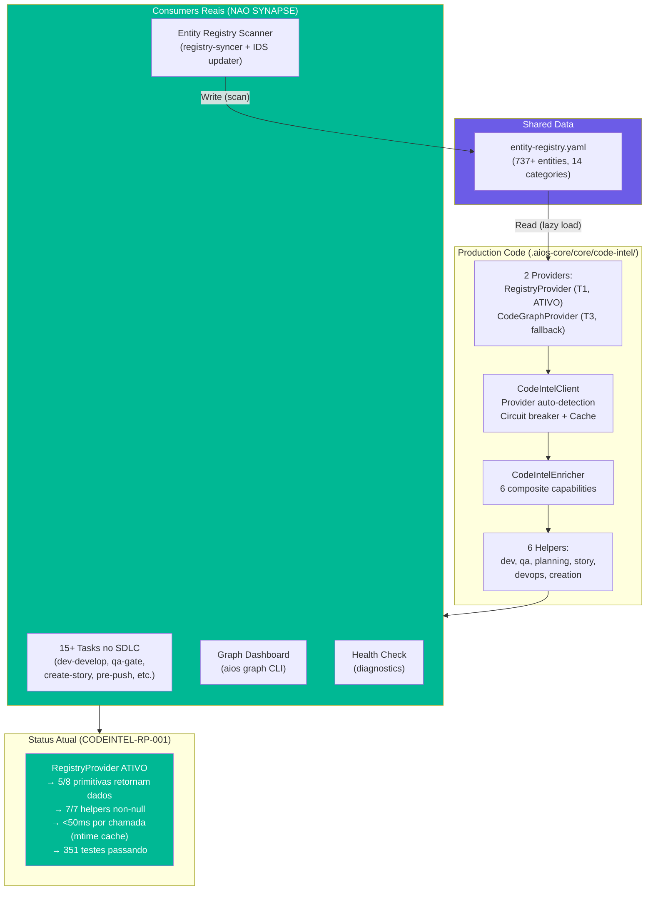

### O Que Existe vs O Que Funciona (pos-RP-001)

| Componente | Implementado? | Provider Ativo? | Dados Reais? | Sem Provider |
|-----------|:------------:|:--------------:|:------------:|:------------:|
| RegistryProvider | **Sim** | **T1 ATIVO** | **Sim** (5 primitivas) | N/A — e o provider |
| CodeGraphProvider | Sim | Nao configurado | Nao | graceful skip |
| CodeIntelClient | Sim | **Sim** (via RegistryProvider) | **Sim** | retorna `null` |
| CodeIntelEnricher | Sim | **Sim** | **Sim** | retorna `null` |
| dev-helper | Sim | **Sim** | **non-null** | skip silencioso |
| qa-helper | Sim | **Sim** | **non-null** | skip silencioso |
| planning-helper | Sim | **Sim** | **non-null** | skip silencioso |
| story-helper | Sim | **Sim** | **non-null** | skip silencioso |
| devops-helper | Sim | **Sim** | **non-null** | skip silencioso |
| creation-helper | Sim | **Sim** | **non-null** | skip silencioso |
| Entity Registry Scanner | Sim | **Standalone** | **Sim** | funciona 100% |

### SYNAPSE vs Code-Intel — Complementares, Nao Concorrentes

```
SYNAPSE:    Injeta REGRAS no prompt (como agente se comporta)
            <synapse-rules> → constitution, agent persona, restrictions
            Trigger: cada prompt | Latencia: <1ms | Sempre ativo

Code-Intel: Fornece DADOS do codebase (o que o codigo contem)
            entity-registry.yaml → RegistryProvider → helpers → advisory
            Trigger: task execution | Latencia: <50ms | Ativo via T1

Entity Registry: PONTE compartilhada (ambos leem, scanner escreve)
```

**Principio:** Code Intelligence = Enhancement Layer, NOT Dependency.
O SYNAPSE engine **nao invoca** code-intel. Sao sistemas paralelos com consumers diferentes.
O Entity Registry e a ponte de dados compartilhada entre ambos.

---

## 7. Session Management — Schema Real

As sessions persistem em `.synapse/sessions/{uuid}.json`. Muitos campos
do schema v2.0 estao **sempre null** porque L3-L7 nao os populam.

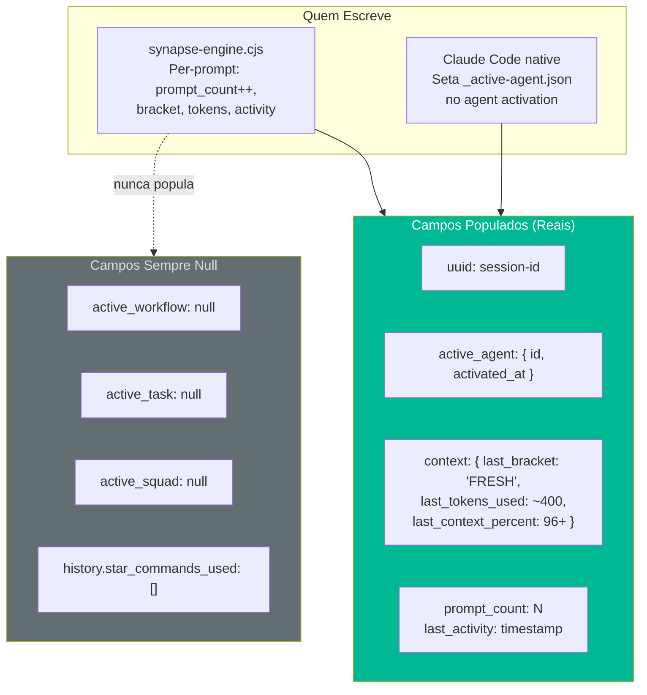

### Session JSON Real (Exemplo Medido)

```json
{
  "uuid": "abc-123-def",
  "active_agent": {
    "id": "dev",
    "activated_at": "2026-02-23T10:00:00Z",
    "activation_quality": "full"
  },
  "active_workflow": null,
  "active_task": null,
  "active_squad": null,
  "context": {
    "last_bracket": "FRESH",
    "last_tokens_used": 403,
    "last_context_percent": 96.25
  },
  "history": {
    "star_commands_used": [],
    "domains_loaded_last": ["constitution", "global", "agent-dev"],
    "agents_activated": ["dev"]
  },
  "prompt_count": 5,
  "last_activity": "2026-02-23T10:05:00Z"
}
```

---

## 8. Hook Entry Point — Fluxo Real por Prompt

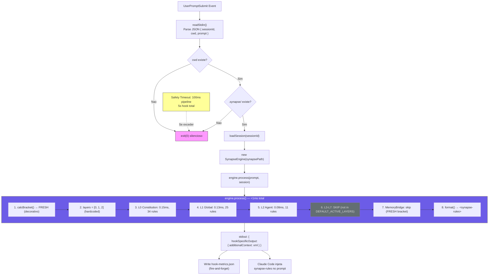

---

## 9. Output Real — &lt;synapse-rules&gt; Injetado

Com apenas 3 layers, o output e compacto (~400-500 tokens).
Secoes de workflow, task, squad, keyword e star-command estao **ausentes**.

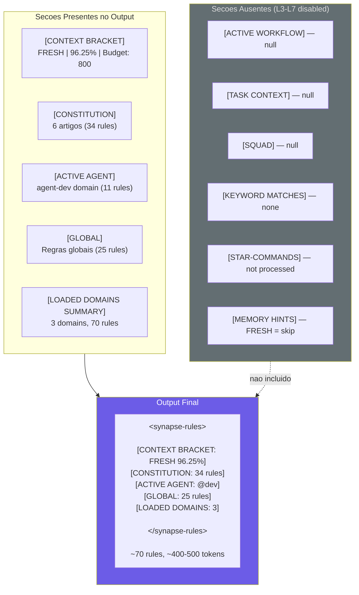

---

## 10. SYNAPSE Rule Impact — Medido por Bracket (NOG-23)

Dados reais do pipeline-audit rerun com SYNAPSE engine:

| Budget Phase | % Context | Rules | Adj Tokens | Active Layers | Processing Time |
|-------------|-----------|-------|-----------|--------------|----------------|
| FRESH (100%) | 96%+ | 70 | 1,403 | 3/4* | **0.81ms** |
| MODERATE (55%) | 40-60% | 70 | 1,455 | 3/8 | **0.32ms** |
| DEPLETED (32.5%) | 25-40% | 70 | 1,455 | 3/8 | **0.47ms** |
| CRITICAL (19%) | 0-25% | 70 | 1,485 | 3/8 | **0.25ms** |

*3/4 = 3 layers loaded of 4 FRESH-expected (L7 missing from array = bug)

**Observacao:** O processing time e **menor** em brackets mais apertados porque o token budget mais alto permite menos truncamento, resultando em menos iteracoes do formatter.

---

## 11. Fluxo End-to-End Real (Exemplo Medido)

Cenario: usuario ativa `@dev` e depois trabalha em uma story.

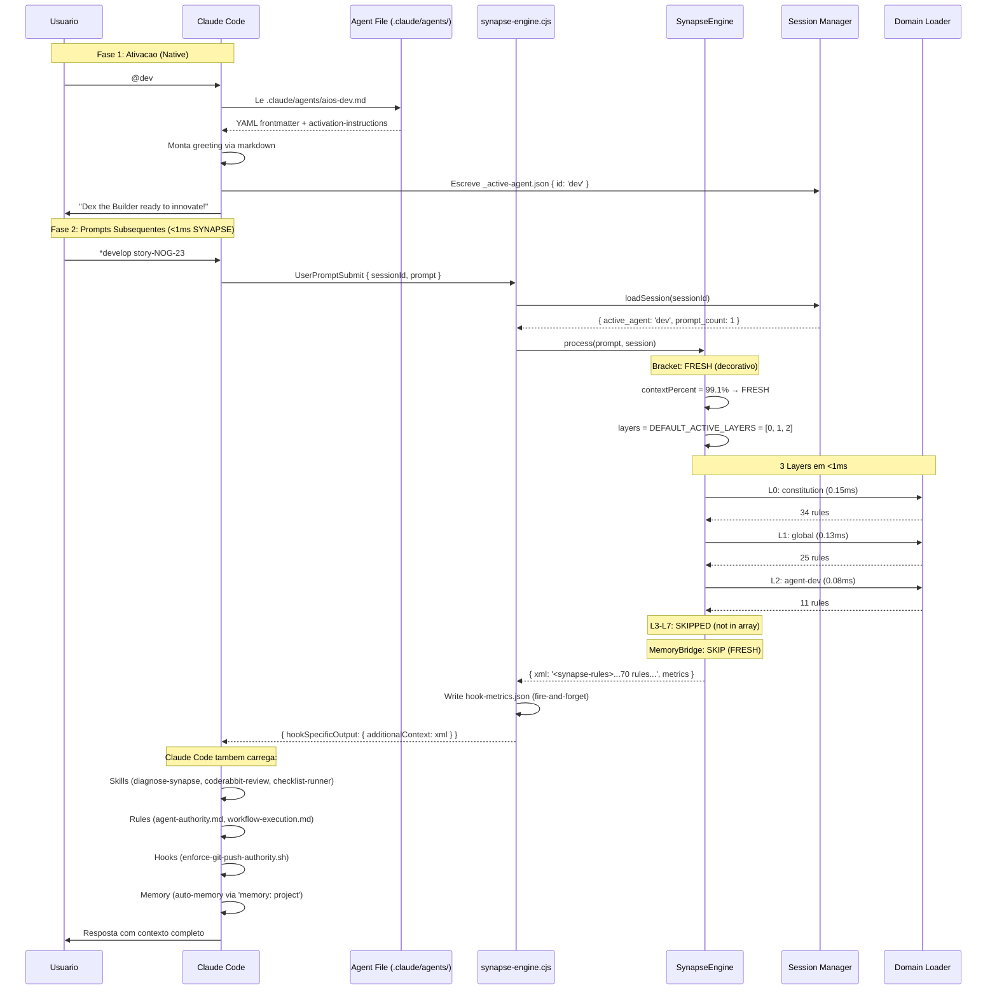

---

## 12. Memory Bridge — Status Real

O MemoryBridge existe e funciona, mas **raramente e invocado**
porque a maioria das sessoes permanece em FRESH bracket.

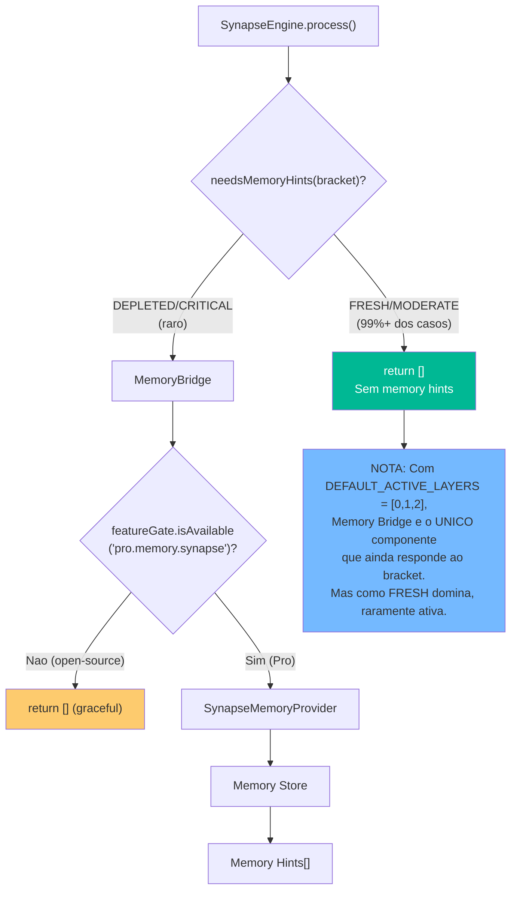

---

## 13. Diagnostics — *synapse-diagnose (Funcional)

O sistema de diagnosticos permanece **100% funcional** com 10 collectors.

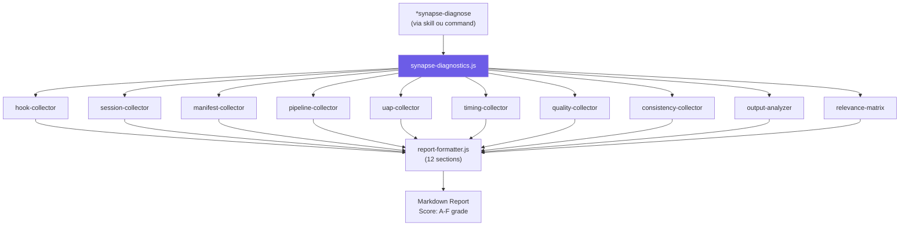

---

## 14. Metricas Persistence — Medido

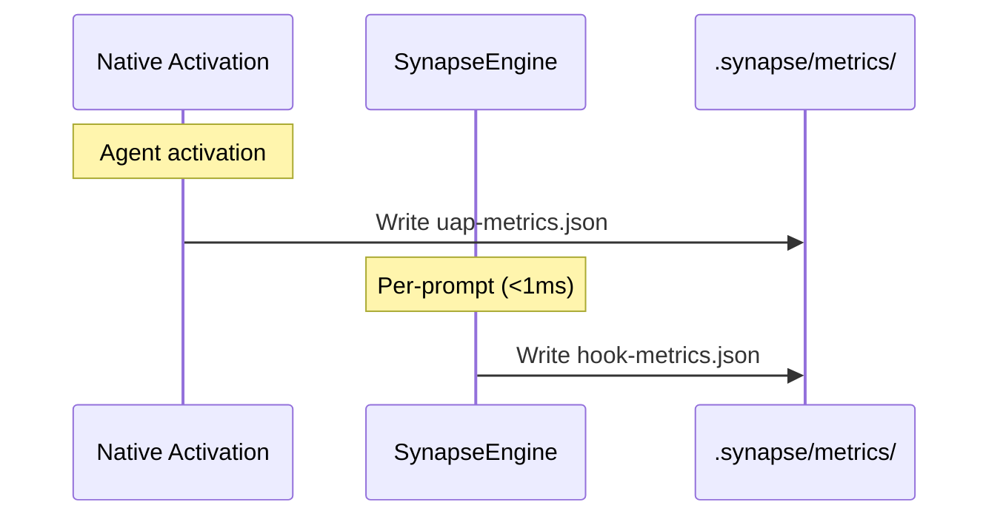

### hook-metrics.json Real (Medido)

```json
{
  "totalDuration": 0.4,
  "hookBootMs": 12.5,
  "bracket": "FRESH",
  "layersLoaded": 3,
  "layersSkipped": 5,
  "layersErrored": 0,
  "totalRules": 70,
  "timestamp": "2026-02-23T10:00:00.000Z",
  "perLayer": {
    "constitution": { "duration": 0.15, "status": "ok", "rules": 34 },
    "global": { "duration": 0.13, "status": "ok", "rules": 25 },
    "agent": { "duration": 0.08, "status": "ok", "rules": 11 },
    "workflow": { "duration": 0, "status": "skipped", "rules": 0 },
    "task": { "duration": 0, "status": "skipped", "rules": 0 },
    "squad": { "duration": 0, "status": "skipped", "rules": 0 },
    "keyword": { "duration": 0, "status": "skipped", "rules": 0 },
    "star-command": { "duration": 0, "status": "skipped", "rules": 0 }
  }
}
```

---

## 15. Arvore de Arquivos — Status Real

```
aios-core/
├── .claude/
│   ├── agents/                              # 10 native agent files (NOG-20/21)
│   │   └── aios-{id}.md                     # Frontmatter: persona, skills, hooks, memory
│   ├── hooks/
│   │   ├── synapse-engine.cjs               # Hook entry point (ATIVO, <1ms per-prompt)
│   │   └── enforce-git-push-authority.sh    # Git push guard (9/10 agents)
│   ├── skills/                              # 7 skills (NOG-22)
│   │   ├── synapse/SKILL.md                 # SYNAPSE management skill
│   │   ├── coderabbit-review/SKILL.md       # Code review skill
│   │   ├── checklist-runner/SKILL.md        # Checklist execution
│   │   ├── architect-first/SKILL.md         # Architecture-first philosophy
│   │   ├── tech-search/SKILL.md             # Deep tech research
│   │   ├── mcp-builder/SKILL.md             # MCP server building
│   │   └── skill-creator/SKILL.md           # Skill creation guide
│   ├── rules/                               # Contextual rules (substituem L3-L6)
│   │   ├── agent-authority.md
│   │   ├── workflow-execution.md
│   │   ├── story-lifecycle.md
│   │   └── ids-principles.md
│   └── commands/synapse/                    # SYNAPSE CRUD (substituem L7)
│
├── .aios-core/core/synapse/                 # Engine core (ATIVO mas limitado a L0-L2)
│   ├── engine.js                            # DEFAULT_ACTIVE_LAYERS = [0, 1, 2]
│   ├── context/context-tracker.js           # Bracket calc (funcional, decorativo)
│   ├── domain/domain-loader.js              # Manifest + domain loading
│   ├── layers/                              # 8 layers (apenas 3 executam)
│   │   ├── l0-constitution.js               # ATIVO: 0.15ms
│   │   ├── l1-global.js                     # ATIVO: 0.13ms
│   │   ├── l2-agent.js                      # ATIVO: 0.08ms
│   │   ├── l3-workflow.js                   # INATIVO (not in array)
│   │   ├── l4-task.js                       # INATIVO (not in array)
│   │   ├── l5-squad.js                      # INATIVO (not in array)
│   │   ├── l6-keyword.js                    # INATIVO (not in array)
│   │   └── l7-star-command.js               # INATIVO (bug: missing from array)
│   ├── memory/memory-bridge.js              # Pro-gated, raramente invocado
│   ├── output/formatter.js                  # Output XML formatter
│   ├── session/session-manager.js           # Session CRUD
│   └── diagnostics/                         # 10 collectors (FUNCIONAL)
│
├── .aios-core/core/code-intel/              # PRODUCTION (ATIVO via RegistryProvider T1)
│   ├── index.js                             # Public exports, singletons
│   ├── code-intel-client.js                 # Provider detection + circuit breaker + cache
│   ├── code-intel-enricher.js               # 6 composite capabilities
│   ├── registry-syncer.js                   # On-demand registry enrichment
│   ├── providers/
│   │   ├── provider-interface.js            # Abstract base (8 methods + isAvailable())
│   │   ├── registry-provider.js             # T1 NATIVE (ATIVO, 5 primitivas, CODEINTEL-RP-001)
│   │   └── code-graph-provider.js           # T3 MCP adapter (fallback, nao configurado)
│   └── helpers/                             # 6 helpers (ATIVO, 7/7 non-null via RegistryProvider)
│
├── .aios-core/development/scripts/
│   ├── unified-activation-pipeline.js       # FALLBACK only (816 linhas)
│   └── greeting-builder.js                  # DEPRECATED by NOG-21
│
├── .synapse/                                # Runtime data
│   ├── manifest                             # 70 regras, 20 domains
│   ├── constitution                         # L0 domain (ATIVO)
│   ├── global                               # L1 domain (ATIVO)
│   ├── context                              # L1 bracket display
│   ├── agent-{id}                           # L2 domains (12, ATIVO se agent match)
│   ├── workflow-{id}                        # L3 domains (INATIVO, nunca carregado)
│   ├── commands                             # L7 domain (INATIVO, nunca processado)
│   ├── sessions/                            # Session JSON (gitignored)
│   └── metrics/                             # uap + hook metrics
│
└── tests/synapse/                           # 749 tests (todos passam)
```

---

## 16. Resumo: Planejado vs Medido

| Aspecto | v2.0 (Planejado) | v3.0 (Medido) | Gap |
|---------|-----------------|---------------|-----|
| Layers ativos | 4-8 (por bracket) | **3 (fixo)** | L7 bug, L3-L6 disabled |
| Bracket impact | Seleciona layers | **Apenas token budget** | Layer selection bypassed |
| Agent activation | UAP + GreetingBuilder | **Claude Code native** | UAP = fallback only |
| Code Intelligence | Integrado via L3-L7 | **ATIVO via RegistryProvider (T1), paralelo ao SYNAPSE** | 5/8 primitivas nativas, 7/7 helpers non-null |
| Star-commands | L7 detection | **Claude Code skills** | L7 not in array |
| Memory Bridge | DEPLETED/CRITICAL | **Raramente atingido** | FRESH domina |
| Processing time | <100ms | **<1ms** | 100x mais rapido |
| Token output | 800-2500 | **~400-500** | Fewer sections = fewer tokens |
| Session fields | 8 fields populados | **4 populados, 4 null** | L3-L7 nao populam |
| Diagnostics | 10 collectors | **10 collectors (funcional)** | Sem gap |

### Decisoes Arquiteturais (NOG-18)

| Decisao | Rationale | Status |
|---------|-----------|--------|
| Desabilitar L3-L7 | Claude Code rules/skills cobrem essas funcoes nativamente | **Validado** |
| Manter engine code | Possibilidade de reativar layers no futuro | **Mantido** |
| Native greeting | Elimina 816 linhas de JS execution na ativacao | **Funcionando** |
| Keep code-intel code | Production code ATIVO via RegistryProvider (T1), invocado por tasks/registry | **Ativo (5 primitivas, 7/7 helpers non-null)** |
| Memory Bridge Pro-gated | Funcionalidade premium para sessoes longas | **Correto mas raro** |

---

*Documento gerado por @architect (Aria), atualizado por @qa (Quinn)*
*v3.0: metricas medidas (hook-metrics.json, uap-metrics.json, NOG-17/23 baselines)*
*v3.1: CODEINTEL-RP-001 — Code-Intel ativo via RegistryProvider (T1), 351 testes, QA PASS*
*Nenhum dado especulativo — apenas comportamento observado*
*Data: 2026-02-24*

— Aria, arquitetando o futuro
