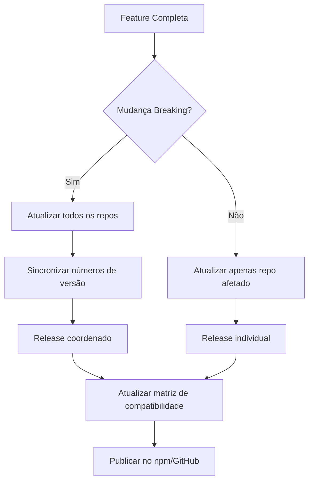

# Estratégia Multi-Repositório

**Versão:** 1.0.0
**Status:** Oficial
**Criado:** 2025-12-09
**Autor:** @architect (Aria)
**Idioma:** PT-BR (Versão oficial)
**English Version:** [multi-repo-strategy.md](multi-repo-strategy.md)

---

## 📋 Índice

- [Visão Geral](#visão-geral)
- [Estrutura de Repositórios](#estrutura-de-repositórios)
- [Interfaces entre Repos](#interfaces-entre-repos)
- [Versionamento Cross-Repo](#versionamento-cross-repo)
- [Coordenação de Releases](#coordenação-de-releases)
- [Dependências Permitidas](#dependências-permitidas)
- [Templates de CI/CD](#templates-de-cicd)
- [Estratégia de Comunidade](#estratégia-de-comunidade)

---

## Visão Geral

Este documento define a arquitetura multi-repositório para o ecossistema AIOS sob a organização `allfluence/` no GitHub. A estratégia garante clara separação de responsabilidades, licenciamento apropriado e engajamento unificado da comunidade.

**Organização:** `allfluence/`

**Fonte da Decisão:** OSR-2 (Investigação de Repos) - Opção A aprovada

---

## Estrutura de Repositórios

### Repositórios Públicos (3)

| Repositório | Licença | Propósito | Visibilidade |
|-------------|---------|-----------|--------------|
| `allfluence/aios-core` | Commons Clause | Framework core, engine de orquestração, agentes base | Público |
| `allfluence/aios-squads` | MIT | AIOS Squads (ETL, Creator, MMOS) - equipes modulares de agentes | Público |
| `allfluence/mcp-ecosystem` | Apache 2.0 | Docker MCP Toolkit, configs de IDE, configurações de presets | Público |

### Repositórios Privados (2)

| Repositório | Licença | Propósito | Visibilidade |
|-------------|---------|-----------|--------------|
| `allfluence/certified-partners` | Proprietária | Packs premium, portal de parceiros, marketplace | Privado |
| `allfluence/mmos` | Proprietária + NDA | Clones cognitivos MMOS, emulador, pesquisa | Privado |

---

## Interfaces entre Repos

### Contratos de API

```
┌─────────────────────────────────────────────────────────────────────────┐
│                           FLUXO DE DEPENDÊNCIAS                          │
│                                                                         │
│   ┌────────────────────┐                                               │
│   │   aios-core        │◄──────────────────┐                           │
│   │   (Commons Clause) │                   │                           │
│   │                    │                   │                           │
│   │ • Core Engine      │                   │                           │
│   │ • Agentes Base     │                   │                           │
│   │ • Task Runner      │                   │                           │
│   │ • APIs Framework   │                   │                           │
│   └────────┬───────────┘                   │                           │
│            │                               │                           │
│            │ depende de                    │ depende de                │
│            ▼                               │                           │
│   ┌────────────────────┐      ┌───────────┴────────┐                   │
│   │   aios-squads      │      │   mcp-ecosystem    │                   │
│   │   (MIT)            │      │   (Apache 2.0)     │                   │
│   │                    │      │                    │                   │
│   │ • ETL Squad        │      │ • Docker MCP Toolkit│                  │
│   │ • Creator Squad    │      │ • Configs de IDE   │                   │
│   │ • MMOS Squad       │      │ • MCP Presets      │                   │
│   └────────────────────┘      └────────────────────┘                   │
│                                                                         │
└─────────────────────────────────────────────────────────────────────────┘
```

### Definições de Interface

#### aios-core → aios-squads

```yaml
Interface: Carregamento de Squad
Contrato:
  - Squads DEVEM seguir estrutura: {squad}/agents/, {squad}/tasks/, {squad}/templates/
  - Squads DEVEM declarar manifesto pack.yaml com versão e dependências
  - Squads PODEM estender agentes base do aios-core
  - Squads NÃO DEVEM modificar arquivos do framework core

API:
  loadSquad(squadName: string): Promise<SquadManifest>
  executeSquadTask(squad: string, task: string, args: object): Promise<TaskResult>
```

#### aios-core → mcp-ecosystem

```yaml
Interface: Configuração MCP
Contrato:
  - Configs MCP DEVEM seguir schema do Docker MCP Toolkit
  - Presets DEVEM ser JSON/YAML válidos com definições de servidor
  - Configs de IDE NÃO DEVEM ter caminhos hardcoded (usar variáveis de ambiente)

API:
  loadMCPPreset(presetName: string): Promise<MCPConfig>
  getMCPServers(): Promise<ServerList>
```

---

## Versionamento Cross-Repo

### Estratégia de Versionamento Semântico

Todos os repositórios seguem **Semantic Versioning 2.0.0**:

```
MAJOR.MINOR.PATCH

MAJOR - Mudanças que quebram compatibilidade em APIs públicas
MINOR - Novas funcionalidades, compatível com versões anteriores
PATCH - Correções de bugs, compatível com versões anteriores
```

### Matriz de Compatibilidade de Versões

```yaml
Regras de Compatibilidade:
  aios-core: "^1.0.0"     # Squads requerem versão core compatível
  aios-squads: "^1.0.0"   # Segue versão major do core
  mcp-ecosystem: "^1.0.0" # Versionamento independente

Dependências Cross-Repo:
  aios-squads:
    peerDependency: "aios-core@^1.0.0"

  mcp-ecosystem:
    optionalDependency: "aios-core@^1.0.0"
```

### Sincronização de Versões

| Evento | aios-core | aios-squads | mcp-ecosystem |
|--------|-----------|-------------|---------------|
| Mudança breaking no core | Bump MAJOR | Bump MAJOR (compatibilidade) | Revisão necessária |
| Nova feature no core | Bump MINOR | Sem mudança | Sem mudança |
| Nova feature em Squad | Sem mudança | Bump MINOR | Sem mudança |
| Novo preset MCP | Sem mudança | Sem mudança | Bump MINOR |

---

## Coordenação de Releases

### Processo de Release



### Checklist de Release

#### Release aios-core

- [ ] Todos os testes passam
- [ ] CHANGELOG.md atualizado
- [ ] Versão incrementada no package.json
- [ ] Matriz de compatibilidade revisada
- [ ] Mudanças breaking documentadas
- [ ] Guia de migração (se breaking)
- [ ] Notificar mantenedores do aios-squads
- [ ] Notificar mantenedores do mcp-ecosystem

#### Release aios-squads

- [ ] Todos os testes passam
- [ ] Verificar compatibilidade com aios-core
- [ ] CHANGELOG.md atualizado
- [ ] Versão incrementada
- [ ] Manifestos de Squad validados

#### Release mcp-ecosystem

- [ ] Todas as configs validadas
- [ ] Presets testados com Docker MCP Toolkit
- [ ] Integração com IDE verificada
- [ ] CHANGELOG.md atualizado

---

## Dependências Permitidas

### Grafo de Dependências

```
                    ┌─────────────────┐
                    │    PACOTES      │
                    │    EXTERNOS     │
                    │  (npm registry) │
                    └────────┬────────┘
                             │
              ┌──────────────┼──────────────┐
              │              │              │
              ▼              ▼              ▼
       ┌──────────┐   ┌──────────┐   ┌──────────┐
       │aios-core │   │aios-squads│  │mcp-ecosystem│
       └────┬─────┘   └─────┬────┘   └──────┬───┘
            │               │               │
            │     ┌─────────┘               │
            │     │                         │
            ▼     ▼                         ▼
       Usa aios-core             Presets e configs
       como peer dependency      independentes
```

### Dependências Permitidas

| De | Para | Tipo | Observações |
|----|------|------|-------------|
| aios-squads | aios-core | peerDependency | Necessário para execução de Squad |
| mcp-ecosystem | aios-core | optionalDependency | Para validação de preset |
| aios-core | pacotes npm | dependency | Lista curada apenas |
| aios-squads | pacotes npm | dependency | Deve ser compatível MIT/Apache |
| mcp-ecosystem | pacotes npm | devDependency | Apenas tooling |

### Dependências Proibidas

- ❌ aios-core → aios-squads (core não deve depender de extensões)
- ❌ aios-core → mcp-ecosystem (core não deve depender de configs)
- ❌ aios-squads → certified-partners (público não pode depender de privado)
- ❌ Qualquer repo → mmos (conteúdo proprietário com NDA)

---

## Templates de CI/CD

### Localização de Workflows Reutilizáveis

```
.github/
├── workflows/
│   ├── _reusable-test.yml        # Workflow de teste compartilhado
│   ├── _reusable-lint.yml        # Workflow de lint compartilhado
│   ├── _reusable-release.yml     # Workflow de release compartilhado
│   └── _reusable-labeler.yml     # Workflow de labeler compartilhado
```

### Template: Workflow de CI Test

```yaml
# .github/workflows/_reusable-test.yml
name: Test

on:
  workflow_call:
    inputs:
      node-version:
        required: false
        type: string
        default: '18'

jobs:
  test:
    runs-on: ubuntu-latest
    steps:
      - uses: actions/checkout@v4
      - uses: actions/setup-node@v4
        with:
          node-version: ${{ inputs.node-version }}
          cache: 'npm'
      - run: npm ci
      - run: npm run lint
      - run: npm test
```

### Template: Workflow de Release

```yaml
# .github/workflows/_reusable-release.yml
name: Release

on:
  workflow_call:
    inputs:
      publish-npm:
        required: false
        type: boolean
        default: true

jobs:
  release:
    runs-on: ubuntu-latest
    steps:
      - uses: actions/checkout@v4
        with:
          fetch-depth: 0
      - uses: actions/setup-node@v4
        with:
          node-version: '18'
          registry-url: 'https://registry.npmjs.org'
      - run: npm ci
      - name: Semantic Release
        env:
          GITHUB_TOKEN: ${{ secrets.GITHUB_TOKEN }}
          NPM_TOKEN: ${{ secrets.NPM_TOKEN }}
        run: npx semantic-release
```

### Template: Workflow de Labeler

```yaml
# .github/workflows/_reusable-labeler.yml
name: Labeler

on:
  workflow_call:

jobs:
  label:
    runs-on: ubuntu-latest
    permissions:
      contents: read
      pull-requests: write
    steps:
      - uses: actions/labeler@v5
        with:
          repo-token: "${{ secrets.GITHUB_TOKEN }}"
```

---

## Estratégia de Comunidade

### Arquitetura do Hub de Discussões

```
┌─────────────────────────────────────────────────────────────────────────┐
│                 ESTRATÉGIA DE DISCUSSÕES DA COMUNIDADE                   │
│                                                                         │
│   ┌────────────────────────────────────────────────────────────────┐   │
│   │                   allfluence/aios-core                          │   │
│   │                   ════════════════════                          │   │
│   │                   DISCUSSIONS: ✅ HABILITADO                    │   │
│   │                   (Hub Central para TODOS os repos)             │   │
│   │                                                                 │   │
│   │   Categorias:                                                   │   │
│   │   ├── 📣 Announcements (apenas mantenedores)                   │   │
│   │   ├── 💬 General                                               │   │
│   │   ├── 💡 Ideas                                                 │   │
│   │   ├── 🙏 Q&A                                                   │   │
│   │   ├── 🙌 Show and Tell                                         │   │
│   │   ├── 🐛 Troubleshooting                                       │   │
│   │   ├── 📦 Squads (para discussões do aios-squads)               │   │
│   │   └── 🔧 MCP Ecosystem (para discussões do mcp-ecosystem)      │   │
│   └────────────────────────────────────────────────────────────────┘   │
│                                  ▲                                      │
│                                  │                                      │
│              ┌───────────────────┼───────────────────┐                 │
│              │                   │                   │                 │
│   ┌──────────┴───────┐   ┌──────┴──────┐   ┌───────┴────────┐        │
│   │ aios-squads      │   │ aios-core   │   │ mcp-ecosystem  │        │
│   │ ───────────      │   │ ─────────   │   │ ─────────────  │        │
│   │ DISCUSSIONS: ❌  │   │ (Hub)       │   │ DISCUSSIONS: ❌ │        │
│   │                  │   │             │   │                │        │
│   │ README linka     │   │ Comunidade  │   │ README linka   │        │
│   │ aios-core/discuss│   │ central     │   │ aios-core/discuss│       │
│   └──────────────────┘   └─────────────┘   └────────────────┘        │
│                                                                         │
└─────────────────────────────────────────────────────────────────────────┘
```

### Estratégia de Labels

#### Labels Base (Todos os 3 Repos Públicos)

| Label | Cor | Descrição |
|-------|-----|-----------|
| `bug` | #d73a4a | Algo não está funcionando |
| `enhancement` | #a2eeef | Nova funcionalidade ou melhoria |
| `documentation` | #0075ca | Melhorias na documentação |
| `question` | #d876e3 | Perguntas ou dúvidas |
| `good-first-issue` | #7057ff | Bom para iniciantes |
| `help-wanted` | #008672 | Precisa de atenção extra |
| `needs-triage` | #ededed | Aguardando triagem inicial |
| `stale` | #fef2c0 | Sem atividade por 30+ dias |
| `wontfix` | #ffffff | Não será corrigido |
| `duplicate` | #cfd3d7 | Issue duplicada |
| `invalid` | #e4e669 | Issue inválida |
| `priority: critical` | #b60205 | Precisa de atenção imediata |
| `priority: high` | #d93f0b | Alta prioridade |
| `priority: medium` | #fbca04 | Média prioridade |
| `priority: low` | #0e8a16 | Baixa prioridade |
| `community` | #c5def5 | Contribuição da comunidade |
| `hacktoberfest` | #ff7518 | Elegível para Hacktoberfest |
| `rfc` | #006b75 | Request for Comments |

#### Labels Específicos do aios-core

| Label | Cor | Descrição |
|-------|-----|-----------|
| `core` | #1d76db | Relacionado ao framework core |
| `agents` | #5319e7 | Relacionado ao sistema de agentes |
| `installer` | #b60205 | Relacionado ao instalador |
| `ci/cd` | #0e8a16 | Relacionado a CI/CD |
| `templates` | #bfd4f2 | Relacionado a templates |
| `workflows` | #d4c5f9 | Relacionado a workflows |

#### Labels Específicos do aios-squads

| Label | Cor | Descrição |
|-------|-----|-----------|
| `squad` | #fbca04 | Relacionado a squads |
| `squad: etl` | #fef2c0 | ETL Squad |
| `squad: creator` | #fef2c0 | Creator Squad |
| `squad: mmos` | #fef2c0 | MMOS Squad |
| `new-squad` | #0e8a16 | Proposta de novo squad |

#### Labels Específicos do mcp-ecosystem

| Label | Cor | Descrição |
|-------|-----|-----------|
| `mcp` | #28a745 | Relacionado ao ecossistema MCP |
| `docker-mcp` | #0366d6 | Docker MCP Toolkit |
| `code-mode` | #6f42c1 | Execução Code Mode |
| `mcp-server` | #1d76db | Novo servidor MCP |
| `gateway` | #d73a4a | Docker MCP Gateway |
| `preset` | #fbca04 | Configuração de preset |

### Roteamento de Issues

| Repo | Issues | Discussions |
|------|--------|-------------|
| aios-core | Bugs, features para core | Todas as discussões da comunidade |
| aios-squads | Bugs, features para squads | → Redirecionar para aios-core (categoria Squads) |
| mcp-ecosystem | Bugs, features para MCP | → Redirecionar para aios-core (categoria MCP Ecosystem) |

### Template de Seção Community para README

```markdown
## 💬 Comunidade & Suporte

Para discussões, perguntas e interação com a comunidade, visite nosso hub central:

👉 **[Discussões da Comunidade AIOS](https://github.com/allfluence/aios-core/discussions)**

- 📦 **Dúvidas sobre Squads?** → Use a categoria "Squads"
- 🔧 **Dúvidas sobre MCP?** → Use a categoria "MCP Ecosystem"
- 🐛 **Encontrou um bug?** → Abra uma issue NESTE repositório
- 💡 **Ideia de feature?** → Inicie uma Discussion na categoria "Ideas"
```

---

## Histórico de Versões

| Versão | Data | Mudanças | Autor |
|--------|------|----------|-------|
| 1.0.0 | 2025-12-09 | Documento inicial de estratégia multi-repo | @architect (Aria) |

---

**Documentos Relacionados:**
- [OSR-2: Investigação de Repos](../stories/v2.1/sprint-5/story-osr-2-repo-investigation.md)
- [OSR-3: Fundação Legal](../stories/v2.1/sprint-5/story-osr-3-legal-foundation.md)
- [OSR-4: Setup de Comunidade GitHub](../stories/v2.1/sprint-5/story-osr-4-github-community-setup.md)
- [Decisão 005: Reestruturação de Repositórios](../decisions/decision-005-repository-restructuring-FINAL.md)

---

*Este é um documento oficial de arquitetura AIOS. Todas as configurações multi-repo devem seguir esta estratégia.*
