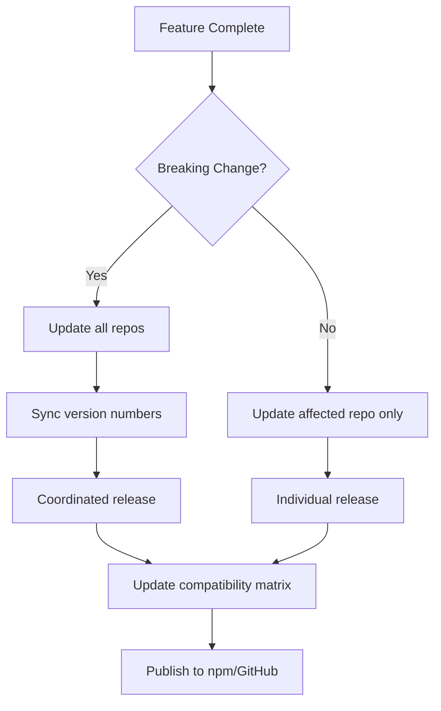

# Multi-Repository Strategy

**Version:** 1.0.0
**Status:** Official
**Created:** 2025-12-09
**Author:** @architect (Aria)
**Language:** EN (English Version)
**Versão PT-BR:** [multi-repo-strategy-pt.md](multi-repo-strategy-pt.md)

---

## 📋 Table of Contents

- [Overview](#overview)
- [Repository Structure](#repository-structure)
- [Interfaces Between Repos](#interfaces-between-repos)
- [Versionamento Cross-Repo](#versionamento-cross-repo)
- [Coordenação de Releases](#coordenação-de-releases)
- [Dependências Permitidas](#dependências-permitidas)
- [CI/CD Templates](#cicd-templates)
- [Community Strategy](#community-strategy)

---

## Overview

This document defines the multi-repository architecture for the AIOS ecosystem under the `allfluence/` GitHub organization. The strategy ensures clear separation of concerns, appropriate licensing, and unified community engagement.

**Organization:** `allfluence/`

**Decision Source:** OSR-2 (Repo Investigation) - Option A approved

---

## Repository Structure

### Public Repositories (3)

| Repository | License | Purpose | Visibility |
|------------|---------|---------|------------|
| `allfluence/aios-core` | Commons Clause | Core framework, orchestration engine, base agents | Public |
| `allfluence/aios-squads` | MIT | AIOS Squads (ETL, Creator, MMOS) - modular agent teams | Public |
| `allfluence/mcp-ecosystem` | Apache 2.0 | Docker MCP Toolkit, IDE configs, preset configurations | Public |

### Private Repositories (2)

| Repository | License | Purpose | Visibility |
|------------|---------|---------|------------|
| `allfluence/certified-partners` | Proprietary | Premium packs, partner portal, marketplace | Private |
| `allfluence/mmos` | Proprietary + NDA | MMOS cognitive clones, emulator, research | Private |

---

## Interfaces Between Repos

### API Contracts

```
┌─────────────────────────────────────────────────────────────────────────┐
│                           DEPENDENCY FLOW                               │
│                                                                         │
│   ┌────────────────────┐                                               │
│   │   aios-core        │◄──────────────────┐                           │
│   │   (Commons Clause) │                   │                           │
│   │                    │                   │                           │
│   │ • Core Engine      │                   │                           │
│   │ • Base Agents      │                   │                           │
│   │ • Task Runner      │                   │                           │
│   │ • Framework APIs   │                   │                           │
│   └────────┬───────────┘                   │                           │
│            │                               │                           │
│            │ depends on                    │ depends on                │
│            ▼                               │                           │
│   ┌────────────────────┐      ┌───────────┴────────┐                   │
│   │   aios-squads      │      │   mcp-ecosystem    │                   │
│   │   (MIT)            │      │   (Apache 2.0)     │                   │
│   │                    │      │                    │                   │
│   │ • ETL Squad        │      │ • Docker MCP Toolkit│                  │
│   │ • Creator Squad    │      │ • IDE Configs      │                   │
│   │ • MMOS Squad       │      │ • MCP Presets      │                   │
│   └────────────────────┘      └────────────────────┘                   │
│                                                                         │
└─────────────────────────────────────────────────────────────────────────┘
```

### Interface Definitions

#### aios-core → aios-squads

```yaml
Interface: Squad Loading
Contract:
  - Squads MUST follow structure: {squad}/agents/, {squad}/tasks/, {squad}/templates/
  - Squads MUST declare pack.yaml manifest with version and dependencies
  - Squads CAN extend base agents from aios-core
  - Squads MUST NOT modify core framework files

API:
  loadSquad(squadName: string): Promise<SquadManifest>
  executeSquadTask(squad: string, task: string, args: object): Promise<TaskResult>
```

#### aios-core → mcp-ecosystem

```yaml
Interface: MCP Configuration
Contract:
  - MCP configs MUST follow Docker MCP Toolkit schema
  - Presets MUST be valid JSON/YAML with server definitions
  - IDE configs MUST not hardcode paths (use environment variables)

API:
  loadMCPPreset(presetName: string): Promise<MCPConfig>
  getMCPServers(): Promise<ServerList>
```

---

## Versionamento Cross-Repo

### Semantic Versioning Strategy

All repositories follow **Semantic Versioning 2.0.0**:

```
MAJOR.MINOR.PATCH

MAJOR - Breaking changes to public APIs
MINOR - New features, backward compatible
PATCH - Bug fixes, backward compatible
```

### Version Compatibility Matrix

```yaml
Compatibility Rules:
  aios-core: "^1.0.0"     # Squads require compatible core version
  aios-squads: "^1.0.0"   # Follows core major version
  mcp-ecosystem: "^1.0.0" # Independent versioning

Cross-Repo Dependencies:
  aios-squads:
    peerDependency: "aios-core@^1.0.0"

  mcp-ecosystem:
    optionalDependency: "aios-core@^1.0.0"
```

### Version Synchronization

| Event | aios-core | aios-squads | mcp-ecosystem |
|-------|-----------|-------------|---------------|
| Core breaking change | MAJOR bump | MAJOR bump (compatibility) | Review needed |
| Core new feature | MINOR bump | No change | No change |
| Squad new feature | No change | MINOR bump | No change |
| MCP new preset | No change | No change | MINOR bump |

---

## Coordenação de Releases

### Release Process



### Release Checklist

#### aios-core Release

- [ ] All tests pass
- [ ] CHANGELOG.md updated
- [ ] Version bumped in package.json
- [ ] Compatibility matrix reviewed
- [ ] Breaking changes documented
- [ ] Migration guide (if breaking)
- [ ] Notify aios-squads maintainers
- [ ] Notify mcp-ecosystem maintainers

#### aios-squads Release

- [ ] All tests pass
- [ ] Verify aios-core compatibility
- [ ] CHANGELOG.md updated
- [ ] Version bumped
- [ ] Squad manifests validated

#### mcp-ecosystem Release

- [ ] All configs validated
- [ ] Presets tested with Docker MCP Toolkit
- [ ] IDE integration verified
- [ ] CHANGELOG.md updated

---

## Dependências Permitidas

### Dependency Graph

```
                    ┌─────────────────┐
                    │    EXTERNAL     │
                    │    PACKAGES     │
                    │  (npm registry) │
                    └────────┬────────┘
                             │
              ┌──────────────┼──────────────┐
              │              │              │
              ▼              ▼              ▼
       ┌──────────┐   ┌──────────┐   ┌──────────┐
       │aios-core │   │aios-squads│  │mcp-ecosystem│
       └────┬─────┘   └─────┬────┘   └──────┬───┘
            │               │               │
            │     ┌─────────┘               │
            │     │                         │
            ▼     ▼                         ▼
       Uses aios-core             Independent presets
       as peer dependency         and configs
```

### Allowed Dependencies

| From | To | Type | Notes |
|------|-----|------|-------|
| aios-squads | aios-core | peerDependency | Required for Squad execution |
| mcp-ecosystem | aios-core | optionalDependency | For preset validation |
| aios-core | npm packages | dependency | Curated list only |
| aios-squads | npm packages | dependency | Must be MIT/Apache compatible |
| mcp-ecosystem | npm packages | devDependency | Tooling only |

### Prohibited Dependencies

- ❌ aios-core → aios-squads (core must not depend on extensions)
- ❌ aios-core → mcp-ecosystem (core must not depend on configs)
- ❌ aios-squads → certified-partners (public cannot depend on private)
- ❌ Any repo → mmos (proprietary NDA content)

---

## CI/CD Templates

### Reusable Workflows Location

```
.github/
├── workflows/
│   ├── _reusable-test.yml        # Shared test workflow
│   ├── _reusable-lint.yml        # Shared lint workflow
│   ├── _reusable-release.yml     # Shared release workflow
│   └── _reusable-labeler.yml     # Shared labeler workflow
```

### Template: CI Test Workflow

```yaml
# .github/workflows/_reusable-test.yml
name: Test

on:
  workflow_call:
    inputs:
      node-version:
        required: false
        type: string
        default: '18'

jobs:
  test:
    runs-on: ubuntu-latest
    steps:
      - uses: actions/checkout@v4
      - uses: actions/setup-node@v4
        with:
          node-version: ${{ inputs.node-version }}
          cache: 'npm'
      - run: npm ci
      - run: npm run lint
      - run: npm test
```

### Template: Release Workflow

```yaml
# .github/workflows/_reusable-release.yml
name: Release

on:
  workflow_call:
    inputs:
      publish-npm:
        required: false
        type: boolean
        default: true

jobs:
  release:
    runs-on: ubuntu-latest
    steps:
      - uses: actions/checkout@v4
        with:
          fetch-depth: 0
      - uses: actions/setup-node@v4
        with:
          node-version: '18'
          registry-url: 'https://registry.npmjs.org'
      - run: npm ci
      - name: Semantic Release
        env:
          GITHUB_TOKEN: ${{ secrets.GITHUB_TOKEN }}
          NPM_TOKEN: ${{ secrets.NPM_TOKEN }}
        run: npx semantic-release
```

### Template: Labeler Workflow

```yaml
# .github/workflows/_reusable-labeler.yml
name: Labeler

on:
  workflow_call:

jobs:
  label:
    runs-on: ubuntu-latest
    permissions:
      contents: read
      pull-requests: write
    steps:
      - uses: actions/labeler@v5
        with:
          repo-token: "${{ secrets.GITHUB_TOKEN }}"
```

---

## Community Strategy

### Discussion Hub Architecture

```
┌─────────────────────────────────────────────────────────────────────────┐
│                    COMMUNITY DISCUSSION STRATEGY                        │
│                                                                         │
│   ┌────────────────────────────────────────────────────────────────┐   │
│   │                   allfluence/aios-core                          │   │
│   │                   ════════════════════                          │   │
│   │                   DISCUSSIONS: ✅ ENABLED                       │   │
│   │                   (Central Hub for ALL repos)                   │   │
│   │                                                                 │   │
│   │   Categories:                                                   │   │
│   │   ├── 📣 Announcements (maintainers only)                      │   │
│   │   ├── 💬 General                                               │   │
│   │   ├── 💡 Ideas                                                 │   │
│   │   ├── 🙏 Q&A                                                   │   │
│   │   ├── 🙌 Show and Tell                                         │   │
│   │   ├── 🐛 Troubleshooting                                       │   │
│   │   ├── 📦 Squads (for aios-squads discussions)                  │   │
│   │   └── 🔧 MCP Ecosystem (for mcp-ecosystem discussions)         │   │
│   └────────────────────────────────────────────────────────────────┘   │
│                                  ▲                                      │
│                                  │                                      │
│              ┌───────────────────┼───────────────────┐                 │
│              │                   │                   │                 │
│   ┌──────────┴───────┐   ┌──────┴──────┐   ┌───────┴────────┐        │
│   │ aios-squads      │   │ aios-core   │   │ mcp-ecosystem  │        │
│   │ ───────────      │   │ ─────────   │   │ ─────────────  │        │
│   │ DISCUSSIONS: ❌  │   │ (Hub)       │   │ DISCUSSIONS: ❌ │        │
│   │                  │   │             │   │                │        │
│   │ README links to  │   │ Central     │   │ README links to │        │
│   │ aios-core/discuss│   │ community   │   │ aios-core/discuss│       │
│   └──────────────────┘   └─────────────┘   └────────────────┘        │
│                                                                         │
└─────────────────────────────────────────────────────────────────────────┘
```

### Labels Strategy

#### Base Labels (All 3 Public Repos)

| Label | Color | Description |
|-------|-------|-------------|
| `bug` | #d73a4a | Something isn't working |
| `enhancement` | #a2eeef | New feature or improvement |
| `documentation` | #0075ca | Documentation improvements |
| `question` | #d876e3 | Questions or inquiries |
| `good-first-issue` | #7057ff | Good for newcomers |
| `help-wanted` | #008672 | Extra attention needed |
| `needs-triage` | #ededed | Awaiting initial triage |
| `stale` | #fef2c0 | No activity for 30+ days |
| `wontfix` | #ffffff | Will not be fixed |
| `duplicate` | #cfd3d7 | Duplicate issue |
| `invalid` | #e4e669 | Invalid issue |
| `priority: critical` | #b60205 | Immediate attention needed |
| `priority: high` | #d93f0b | High priority |
| `priority: medium` | #fbca04 | Medium priority |
| `priority: low` | #0e8a16 | Low priority |
| `community` | #c5def5 | Community contribution |
| `hacktoberfest` | #ff7518 | Hacktoberfest eligible |
| `rfc` | #006b75 | Request for Comments |

#### aios-core Specific Labels

| Label | Color | Description |
|-------|-------|-------------|
| `core` | #1d76db | Core framework related |
| `agents` | #5319e7 | Agent system related |
| `installer` | #b60205 | Installer related |
| `ci/cd` | #0e8a16 | CI/CD related |
| `templates` | #bfd4f2 | Template related |
| `workflows` | #d4c5f9 | Workflow related |

#### aios-squads Specific Labels

| Label | Color | Description |
|-------|-------|-------------|
| `squad` | #fbca04 | Squad related |
| `squad: etl` | #fef2c0 | ETL Squad |
| `squad: creator` | #fef2c0 | Creator Squad |
| `squad: mmos` | #fef2c0 | MMOS Squad |
| `new-squad` | #0e8a16 | New squad proposal |

#### mcp-ecosystem Specific Labels

| Label | Color | Description |
|-------|-------|-------------|
| `mcp` | #28a745 | MCP ecosystem related |
| `docker-mcp` | #0366d6 | Docker MCP Toolkit |
| `code-mode` | #6f42c1 | Code Mode execution |
| `mcp-server` | #1d76db | New MCP server |
| `gateway` | #d73a4a | Docker MCP Gateway |
| `preset` | #fbca04 | Preset configuration |

### Issue Routing

| Repo | Issues | Discussions |
|------|--------|-------------|
| aios-core | Bugs, features for core | All community discussions |
| aios-squads | Bugs, features for squads | → Redirect to aios-core (Squads category) |
| mcp-ecosystem | Bugs, features for MCP | → Redirect to aios-core (MCP Ecosystem category) |

### README Community Section Template

```markdown
## 💬 Community & Support

For discussions, questions, and community interaction, visit our central hub:

👉 **[AIOS Community Discussions](https://github.com/allfluence/aios-core/discussions)**

- 📦 **Squads questions?** → Use the "Squads" category
- 🔧 **MCP questions?** → Use the "MCP Ecosystem" category
- 🐛 **Found a bug?** → Open an issue in THIS repository
- 💡 **Feature idea?** → Start a Discussion in "Ideas" category
```

---

## Version History

| Version | Date | Changes | Author |
|---------|------|---------|--------|
| 1.0.0 | 2025-12-09 | Initial multi-repo strategy document | @architect (Aria) |

---

**Related Documents:**
- [OSR-2: Repo Investigation](../stories/v2.1/sprint-5/story-osr-2-repo-investigation.md)
- [OSR-3: Legal Foundation](../stories/v2.1/sprint-5/story-osr-3-legal-foundation.md)
- [OSR-4: GitHub Community Setup](../stories/v2.1/sprint-5/story-osr-4-github-community-setup.md)
- [Decision 005: Repository Restructuring](../decisions/decision-005-repository-restructuring-FINAL.md)

---

*This is an official AIOS architecture document. All multi-repo configurations must follow this strategy.*
