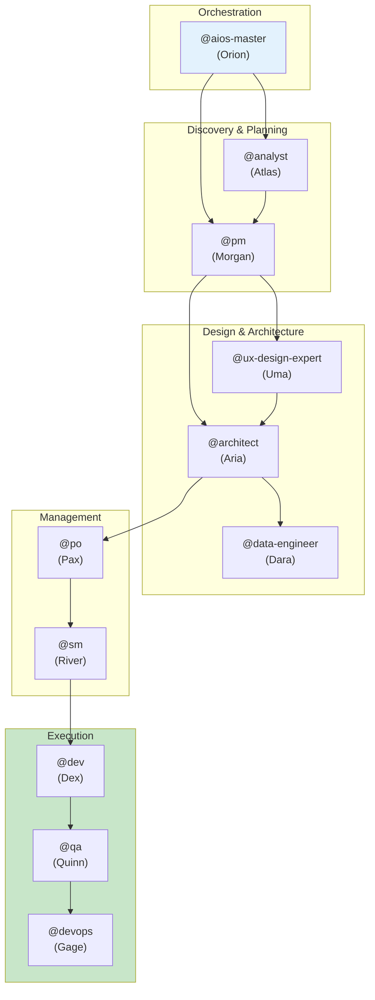

# AIOS Agent Flows - Detailed Agent Documentation

> **EN** | [PT](../../aios-agent-flows/README.md) | [ES](../../es/aios-agent-flows/README.md) | [ZH](../../zh/aios-agent-flows/README.md)

---

**Version:** 1.0.0
**Last Updated:** 2026-02-05
**Status:** Official Documentation

---

## Overview

This folder contains detailed documentation for all AIOS agents, including:

- **Complete system** for each agent
- **Mermaid flowcharts** of operations
- **Command mapping** to tasks
- **Integrations** between agents
- **Workflows** involving each agent
- **Best practices** and troubleshooting

---

## Documented Agents

| Agent | Persona | Archetype | Document |
|-------|---------|-----------|----------|
| **@aios-master** | Orion | Orchestrator | [aios-master-system.md](./aios-master-system.md) |
| **@analyst** | Atlas | Researcher | [analyst-system.md](./analyst-system.md) |
| **@architect** | Aria | Visionary | [architect-system.md](./architect-system.md) |
| **@data-engineer** | Dara | Data Sage | [data-engineer-system.md](./data-engineer-system.md) |
| **@dev** | Dex | Builder | [dev-system.md](./dev-system.md) |
| **@devops** | Gage | Guardian | [devops-system.md](./devops-system.md) |
| **@pm** | Morgan | Strategist | [pm-system.md](./pm-system.md) |
| **@qa** | Quinn | Guardian | [qa-system.md](./qa-system.md) |
| **@sm** | River | Facilitator | [sm-system.md](./sm-system.md) |
| **@squad-creator** | Nova | Creator | [squad-creator-system.md](./squad-creator-system.md) |
| **@ux-design-expert** | Uma | Designer | [ux-design-expert-system.md](./ux-design-expert-system.md) |

---

## Document Structure

Each agent document follows this standard structure:

```
1. Overview
   - Main responsibilities
   - Core principles

2. Complete File List
   - Core tasks
   - Agent definition
   - Templates
   - Checklists
   - Related files

3. System Flowchart
   - Complete Mermaid diagram
   - Operations flow

4. Command Mapping
   - Commands -> Tasks
   - Parameters and options

5. Related Workflows
   - Workflows using the agent
   - Agent's role in each workflow

6. Agent Integrations
   - Who provides inputs
   - Who receives outputs
   - Collaborations

7. Configuration
   - Configuration files
   - Available tools
   - Restrictions

8. Best Practices
   - When to use
   - What to avoid

9. Troubleshooting
   - Common issues
   - Solutions

10. Changelog
    - Version history
```

---

## Agent Relationship Diagram



---

## How to Use This Documentation

### To Understand an Agent

1. Access the desired agent's document
2. Read the **Overview** to understand the role
3. Check the **Commands** to know what it can do
4. See the **Workflows** to understand the context

### To Debug Issues

1. Go directly to the **Troubleshooting** section
2. Check the **Flowcharts** to understand the flow
3. Verify **Integrations** for dependencies

### To Extend the System

1. Analyze the **File List** to know what to modify
2. Follow **Best Practices** to maintain consistency
3. Update the **Changelog** after changes

---

## Relationship with Other Documentation

| Documentation | Location | Purpose |
|---------------|----------|---------|
| Meta-Agent Commands | [docs/meta-agent-commands.md](../../meta-agent-commands.md) | Quick reference |
| Workflows Guide | [docs/guides/workflows-guide.md](../../guides/workflows-guide.md) | Workflows guide |
| AIOS Workflows | [docs/aios-workflows/](../../aios-workflows/) | Detailed workflows |
| Architecture | [docs/architecture/](../../architecture/) | Technical architecture |

---

## Contributing

To add or update agent documentation:

1. Follow the standard structure described above
2. Include updated Mermaid diagrams
3. Keep the changelog up to date
4. Create translations in PT and ES

---

*AIOS Agent Flows Documentation v1.0 - Detailed documentation of the agent system*
