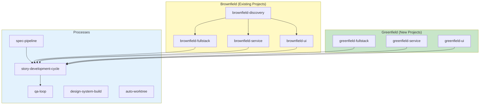
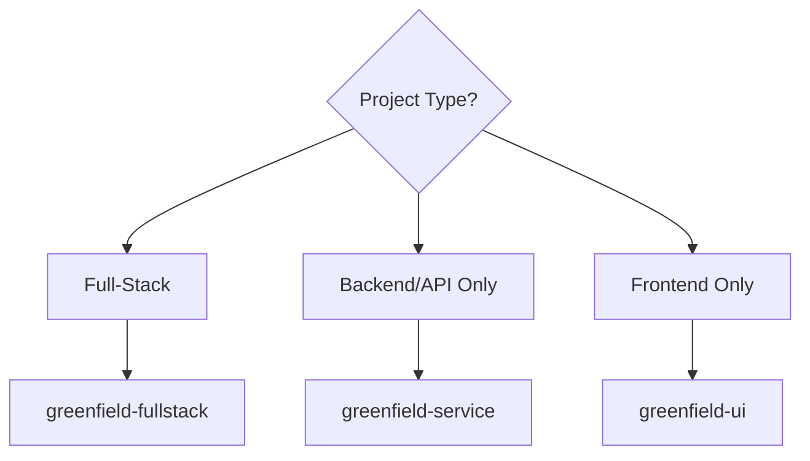
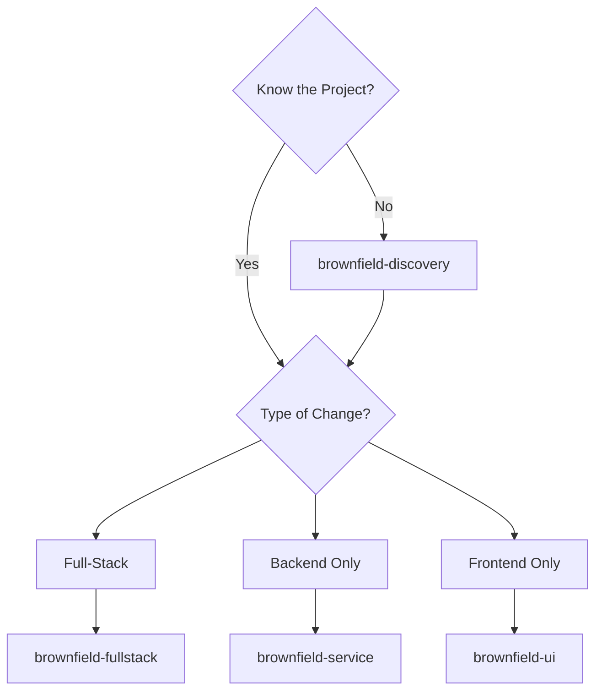

# AIOS Workflows - Detailed Workflow Documentation

> **EN** | [PT](../../aios-workflows/README.md) | [ES](../../es/aios-workflows/README.md) | [ZH](../../zh/aios-workflows/README.md)

---

**Version:** 1.0.0
**Last Updated:** 2026-02-05
**Status:** Official Documentation

---

## Overview

This folder contains detailed documentation of all AIOS workflows, including:

- **Complete Mermaid diagrams** (flowchart, sequence, state)
- **Detailed steps** with inputs/outputs
- **Participating agents** and their roles
- **Decision points** and conditions
- **Prerequisites** and configurations
- **Troubleshooting** and execution modes

---

## Documented Workflows

### By Project Type

| Type | Workflow | Description | Document |
|------|----------|-------------|----------|
| **Greenfield** | Fullstack | Full-stack applications from scratch | [greenfield-fullstack-workflow.md](./greenfield-fullstack-workflow.md) |
| **Greenfield** | Service | Backend/API from scratch | [greenfield-service-workflow.md](./greenfield-service-workflow.md) |
| **Greenfield** | UI | Frontend from scratch | [greenfield-ui-workflow.md](./greenfield-ui-workflow.md) |
| **Brownfield** | Discovery | Existing project analysis | [brownfield-discovery-workflow.md](./brownfield-discovery-workflow.md) |
| **Brownfield** | Fullstack | Existing full-stack evolution | [brownfield-fullstack-workflow.md](./brownfield-fullstack-workflow.md) |
| **Brownfield** | Service | Existing backend evolution | [brownfield-service-workflow.md](./brownfield-service-workflow.md) |
| **Brownfield** | UI | Existing frontend evolution | [brownfield-ui-workflow.md](./brownfield-ui-workflow.md) |

### By Process

| Process | Workflow | Description | Document |
|---------|----------|-------------|----------|
| **Development** | Story Cycle | Complete story cycle | [story-development-cycle-workflow.md](./story-development-cycle-workflow.md) |
| **Quality** | QA Loop | Quality cycle | [qa-loop-workflow.md](./qa-loop-workflow.md) |
| **Spec** | Spec Pipeline | Specification pipeline | [spec-pipeline-workflow.md](./spec-pipeline-workflow.md) |
| **Design** | Design System | Design system construction | [design-system-build-quality-workflow.md](./design-system-build-quality-workflow.md) |
| **Git** | Auto Worktree | Automatic worktree management | [auto-worktree-workflow.md](./auto-worktree-workflow.md) |

---

## Document Structure

Each workflow document follows this standard structure:

```
1. Overview
   - Workflow objective
   - Supported project types
   - When to use / not use

2. Mermaid Diagram
   - Main flowchart
   - State diagram
   - Sequence diagram

3. Detailed Steps
   - ID, agent, action
   - Inputs and outputs
   - Success criteria
   - Status transitions

4. Participating Agents
   - Role of each agent
   - Relevant commands

5. Executed Tasks
   - Task map by phase
   - Task files

6. Prerequisites
   - Required configuration
   - Prerequisite documentation
   - Integrated tools

7. Inputs and Outputs
   - Workflow inputs
   - Produced outputs

8. Decision Points
   - Branching conditions
   - Blocking criteria

9. Execution Modes
   - YOLO (autonomous)
   - Interactive (balanced)
   - Pre-Flight (planning)

10. Troubleshooting
    - Common problems
    - Logs and diagnostics

11. Changelog
    - Version history
```

---

## Workflow Map



---

## Workflow Selection Guide

### New Project?



### Existing Project?



---

## Workflow Flow

| From | To | Condition |
|------|-----|----------|
| `brownfield-discovery` | `brownfield-*` | After complete analysis |
| `greenfield-*` | `story-development-cycle` | For each story |
| `brownfield-*` | `story-development-cycle` | For each story |
| `spec-pipeline` | `story-development-cycle` | After spec approved |
| `story-development-cycle` | `qa-loop` | In QA phase |

---

## How to Use This Documentation

### To Start a Project

1. Use the **Selection Guide** above to choose the workflow
2. Read the **Overview** of the chosen workflow
3. Check the **Prerequisites**
4. Follow the **Steps** in order

### To Understand a Process

1. Analyze the **Mermaid Diagrams**
2. See the **Participating Agents** and their roles
3. Consult the **Decision Points**

### To Debug Problems

1. Go to the **Troubleshooting** section
2. Check **Logs and Diagnostics**
3. Consult the **Success Criteria** of each step

---

## Relationship with Other Documentation

| Documentation | Location | Purpose |
|---------------|----------|---------|
| Workflows Guide | [docs/guides/workflows-guide.md](../../guides/workflows-guide.md) | General guide |
| Agent Flows | [docs/aios-agent-flows/](../../aios-agent-flows/) | Agent details |
| Meta-Agent Commands | [docs/meta-agent-commands.md](../../meta-agent-commands.md) | Quick reference |

---

## Contributing

To add or update workflow documentation:

1. Follow the standard structure described above
2. Include complete Mermaid diagrams
3. Document all inputs/outputs
4. Keep the changelog updated
5. Create translations in EN and ES

---

*AIOS Workflows Documentation v1.0 - Detailed documentation of development workflows*
