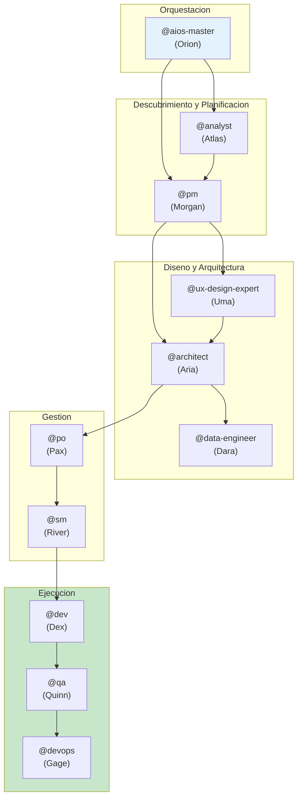

# AIOS Agent Flows - Documentacion Detallada de los Agentes

> [PT](../../aios-agent-flows/README.md) | [EN](../../en/aios-agent-flows/README.md) | **ES** | [ZH](../../zh/aios-agent-flows/README.md)

---

**Version:** 1.0.0
**Ultima Actualizacion:** 2026-02-05
**Estado:** Documentacion Oficial

---

## Vision General

Esta carpeta contiene la documentacion detallada de todos los agentes de AIOS, incluyendo:

- **Sistema completo** de cada agente
- **Flowcharts Mermaid** de operaciones
- **Mapeo de comandos** a tasks
- **Integraciones** entre agentes
- **Workflows** que involucran cada agente
- **Mejores practicas** y solucion de problemas

---

## Agentes Documentados

| Agente | Persona | Arquetipo | Documento |
|--------|---------|-----------|-----------|
| **@aios-master** | Orion | Orchestrator | [aios-master-system.md](./aios-master-system.md) |
| **@analyst** | Atlas | Researcher | [analyst-system.md](./analyst-system.md) |
| **@architect** | Aria | Visionary | [architect-system.md](./architect-system.md) |
| **@data-engineer** | Dara | Data Sage | [data-engineer-system.md](./data-engineer-system.md) |
| **@dev** | Dex | Builder | [dev-system.md](./dev-system.md) |
| **@devops** | Gage | Guardian | [devops-system.md](./devops-system.md) |
| **@pm** | Morgan | Strategist | [pm-system.md](./pm-system.md) |
| **@qa** | Quinn | Guardian | [qa-system.md](./qa-system.md) |
| **@sm** | River | Facilitator | [sm-system.md](./sm-system.md) |
| **@squad-creator** | Nova | Creator | [squad-creator-system.md](./squad-creator-system.md) |
| **@ux-design-expert** | Uma | Designer | [ux-design-expert-system.md](./ux-design-expert-system.md) |

---

## Estructura de Cada Documento

Cada documento de agente sigue esta estructura estandar:

```
1. Vision General
   - Responsabilidades principales
   - Principios core

2. Lista Completa de Archivos
   - Tasks core
   - Definicion del agente
   - Templates
   - Checklists
   - Archivos relacionados

3. Flowchart del Sistema
   - Diagrama Mermaid completo
   - Flujo de operaciones

4. Mapeo de Comandos
   - Comandos → Tasks
   - Parametros y opciones

5. Workflows Relacionados
   - Workflows que usan el agente
   - Rol del agente en cada workflow

6. Integraciones entre Agentes
   - De quien recibe inputs
   - A quien entrega outputs
   - Colaboraciones

7. Configuracion
   - Archivos de configuracion
   - Tools disponibles
   - Restricciones

8. Mejores Practicas
   - Cuando usar
   - Que evitar

9. Solucion de Problemas
   - Problemas comunes
   - Soluciones

10. Changelog
    - Historial de versiones
```

---

## Diagrama de Relacion entre Agentes



---

## Como Usar Esta Documentacion

### Para Entender un Agente

1. Acceda al documento del agente deseado
2. Lea la **Vision General** para entender el rol
3. Consulte los **Comandos** para saber que puede hacer
4. Vea los **Workflows** para entender el contexto

### Para Depurar Problemas

1. Vaya directo a la seccion **Solucion de Problemas**
2. Consulte los **Flowcharts** para entender el flujo
3. Verifique las **Integraciones** para dependencias

### Para Extender el Sistema

1. Analice la **Lista de Archivos** para saber que modificar
2. Siga las **Mejores Practicas** para mantener consistencia
3. Actualice el **Changelog** despues de los cambios

---

## Relacion con Otras Documentaciones

| Documentacion | Ubicacion | Proposito |
|---------------|-----------|-----------|
| Meta-Agent Commands | [docs/meta-agent-commands.md](../../meta-agent-commands.md) | Referencia rapida |
| Workflows Guide | [docs/guides/workflows-guide.md](../../guides/workflows-guide.md) | Guia de workflows |
| AIOS Workflows | [docs/aios-workflows/](../../aios-workflows/) | Detalle de workflows |
| Architecture | [docs/architecture/](../../architecture/) | Arquitectura tecnica |

---

## Contribuyendo

Para agregar o actualizar documentacion de agentes:

1. Siga la estructura estandar descrita arriba
2. Incluya diagramas Mermaid actualizados
3. Mantenga el changelog actualizado
4. Cree traducciones en EN y ES

---

*AIOS Agent Flows Documentation v1.0 - Documentacion detallada del sistema de agentes*
