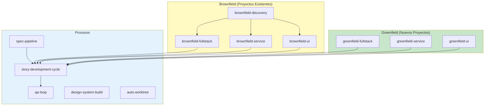
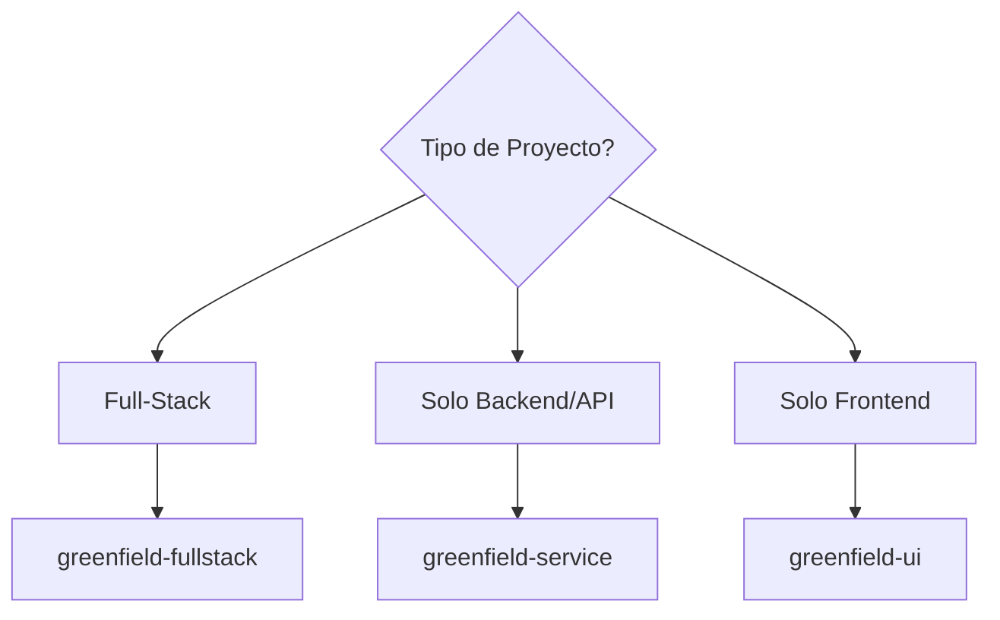
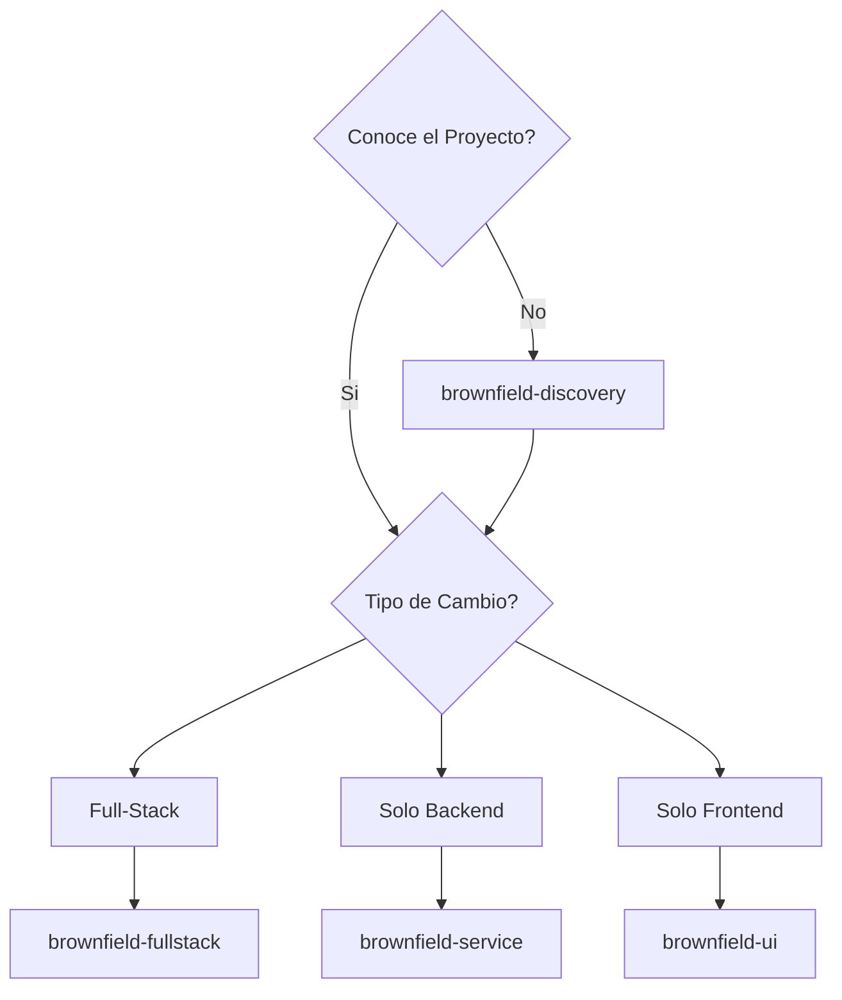

# AIOS Workflows - Documentacion Detallada de los Workflows

> [PT](../../aios-workflows/README.md) | [EN](../../en/aios-workflows/README.md) | **ES** | [ZH](../../zh/aios-workflows/README.md)

---

**Version:** 1.0.0
**Ultima Actualizacion:** 2026-02-05
**Estado:** Documentacion Oficial

---

## Vision General

Esta carpeta contiene la documentacion detallada de todos los workflows de AIOS, incluyendo:

- **Diagramas Mermaid** completos (flowchart, sequence, state)
- **Pasos detallados** con inputs/outputs
- **Agentes participantes** y sus roles
- **Puntos de decision** y condiciones
- **Pre-requisitos** y configuraciones
- **Solucion de problemas** y modos de ejecucion

---

## Workflows Documentados

### Por Tipo de Proyecto

| Tipo | Workflow | Descripcion | Documento |
|------|----------|-------------|-----------|
| **Greenfield** | Fullstack | Aplicaciones full-stack desde cero | [greenfield-fullstack-workflow.md](./greenfield-fullstack-workflow.md) |
| **Greenfield** | Service | Backend/API desde cero | [greenfield-service-workflow.md](./greenfield-service-workflow.md) |
| **Greenfield** | UI | Frontend desde cero | [greenfield-ui-workflow.md](./greenfield-ui-workflow.md) |
| **Brownfield** | Discovery | Analisis de proyecto existente | [brownfield-discovery-workflow.md](./brownfield-discovery-workflow.md) |
| **Brownfield** | Fullstack | Evolucion full-stack existente | [brownfield-fullstack-workflow.md](./brownfield-fullstack-workflow.md) |
| **Brownfield** | Service | Evolucion backend existente | [brownfield-service-workflow.md](./brownfield-service-workflow.md) |
| **Brownfield** | UI | Evolucion frontend existente | [brownfield-ui-workflow.md](./brownfield-ui-workflow.md) |

### Por Proceso

| Proceso | Workflow | Descripcion | Documento |
|---------|----------|-------------|-----------|
| **Development** | Story Cycle | Ciclo completo de story | [story-development-cycle-workflow.md](./story-development-cycle-workflow.md) |
| **Quality** | QA Loop | Ciclo de calidad | [qa-loop-workflow.md](./qa-loop-workflow.md) |
| **Spec** | Spec Pipeline | Pipeline de especificacion | [spec-pipeline-workflow.md](./spec-pipeline-workflow.md) |
| **Design** | Design System | Construccion de design system | [design-system-build-quality-workflow.md](./design-system-build-quality-workflow.md) |
| **Git** | Auto Worktree | Gestion automatica de worktrees | [auto-worktree-workflow.md](./auto-worktree-workflow.md) |

---

## Estructura de Cada Documento

Cada documento de workflow sigue esta estructura estandar:

```
1. Vision General
   - Objetivo del workflow
   - Tipos de proyecto soportados
   - Cuando usar / no usar

2. Diagrama Mermaid
   - Flowchart principal
   - Diagrama de estados
   - Diagrama de secuencia

3. Pasos Detallados
   - ID, agente, accion
   - Inputs y outputs
   - Criterios de exito
   - Transiciones de estado

4. Agentes Participantes
   - Rol de cada agente
   - Comandos relevantes

5. Tasks Ejecutadas
   - Mapa de tasks por fase
   - Archivos de task

6. Pre-requisitos
   - Configuracion necesaria
   - Documentacion prerequisita
   - Herramientas integradas

7. Entradas y Salidas
   - Inputs del workflow
   - Outputs producidos

8. Puntos de Decision
   - Condiciones de branching
   - Criterios de bloqueo

9. Modos de Ejecucion
   - YOLO (autonomo)
   - Interactive (balanceado)
   - Pre-Flight (planificacion)

10. Solucion de Problemas
    - Problemas comunes
    - Logs y diagnostico

11. Changelog
    - Historial de versiones
```

---

## Mapa de Workflows



---

## Guia de Seleccion de Workflow

### Nuevo Proyecto?



### Proyecto Existente?



---

## Flujo entre Workflows

| De | Hacia | Condicion |
|----|-------|-----------|
| `brownfield-discovery` | `brownfield-*` | Despues del analisis completo |
| `greenfield-*` | `story-development-cycle` | Para cada story |
| `brownfield-*` | `story-development-cycle` | Para cada story |
| `spec-pipeline` | `story-development-cycle` | Despues de spec aprobada |
| `story-development-cycle` | `qa-loop` | En la fase de QA |

---

## Como Usar Esta Documentacion

### Para Iniciar un Proyecto

1. Use la **Guia de Seleccion** de arriba para elegir el workflow
2. Lea la **Vision General** del workflow elegido
3. Verifique los **Pre-requisitos**
4. Siga los **Pasos** en orden

### Para Entender un Proceso

1. Analice los **Diagramas Mermaid**
2. Vea los **Agentes Participantes** y sus roles
3. Consulte los **Puntos de Decision**

### Para Depurar Problemas

1. Vaya a la seccion **Solucion de Problemas**
2. Verifique los **Logs y Diagnostico**
3. Consulte los **Criterios de Exito** de cada paso

---

## Relacion con Otras Documentaciones

| Documentacion | Ubicacion | Proposito |
|---------------|-----------|-----------|
| Workflows Guide | [docs/guides/workflows-guide.md](../../guides/workflows-guide.md) | Guia general |
| Agent Flows | [docs/aios-agent-flows/](../../aios-agent-flows/) | Detalles de agentes |
| Meta-Agent Commands | [docs/meta-agent-commands.md](../../meta-agent-commands.md) | Referencia rapida |

---

## Contribuyendo

Para agregar o actualizar documentacion de workflows:

1. Siga la estructura estandar descrita arriba
2. Incluya diagramas Mermaid completos
3. Documente todos los inputs/outputs
4. Mantenga el changelog actualizado
5. Cree traducciones en EN y ES

---

*AIOS Workflows Documentation v1.0 - Documentacion detallada de los workflows de desarrollo*
