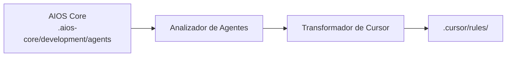

<!-- Traducción: ES | Original: /docs/platforms/en/cursor.md | Sincronización: 2026-01-26 -->

# Guía de AIOS para Cursor

> 🌐 [EN](../../platforms/cursor.md) | [PT](../../pt/platforms/cursor.md) | **ES**

---

> **Editor de Código Basado en IA** - IDE de IA Más Popular

---

## Descripción General

### ¿Qué es Cursor?

Cursor es un editor de código basado en IA construido sobre VS Code, diseñado para hacer que los desarrolladores sean más productivos con asistencia de IA integrada. Combina características familiares de VS Code con poderosas capacidades de IA incluyendo generación de código, edición y conversación.

### ¿Por qué usar AIOS con Cursor?

Cursor es uno de los **IDEs de IA más populares** con excelente integración de AIOS:

- **Base de Usuarios Grande**: Comunidad activa y actualizaciones continuas
- **Activación @mention**: Activación natural de agentes con sintaxis @
- **Integración Composer**: Edición de múltiples archivos con asistencia de IA
- **Contexto @codebase**: Comprensión completa del proyecto
- **Soporte MCP**: Extensible a través de configuración
- **Compatibilidad con VS Code**: Funciona con extensiones de VS Code

### Comparación con Otras Plataformas

| --------------------- | :----: | :-------------------: | :------: |
| Interfaz GUI          |   Sí   |          No           |    Sí    |
| Activación @mention   |   Sí   |       /comando        |    Sí    |
| Composer              |   Sí   | Herramienta de Tareas | Cascade  |
| Extensiones VS Code   |   Sí   |          No           | Limitado |
| Soporte MCP           | Config |        Nativo         |  Config  |
| Edición Multi-archivo |   Sí   |          Sí           |    Sí    |

---

## Requisitos

### Requisitos del Sistema

| Requisito            | Mínimo                           | Recomendado |
| -------------------- | -------------------------------- | ----------- |
| **RAM**              | 4GB                              | 8GB+        |
| **Espacio en Disco** | 500MB                            | 1GB+        |
| **SO**               | macOS 10.15+, Windows 10+, Linux | Último      |
| **Node.js**          | 18.0+ (para AIOS)                | 20.0+       |

### Requisitos de Cuenta

- **Cuenta de Cursor** (versión gratuita disponible)
- **Claves de API** (opcional): OpenAI, Anthropic, o usar modelos integrados de Cursor

### Configuración Recomendada

- Git instalado y configurado
- GitHub CLI (`gh`) para operaciones de PR
- Suscripción Cursor Pro para características avanzadas

---

## Instalación

### Paso 1: Instalar Cursor

1. Descargar desde [cursor.com](https://cursor.com)
2. Ejecutar el instalador para tu plataforma
3. Lanzar Cursor e iniciar sesión

```bash
# macOS (vía Homebrew)
brew install --cask cursor

# O descargar directamente desde cursor.com
```

### Paso 2: Configurar Cursor

Abrir Configuración de Cursor (`Cmd/Ctrl + ,`):

1. **Configuración de IA** > Habilitar características de IA
2. **Modelos** > Seleccionar modelo preferido (Claude, GPT-4, etc.)
3. **Reglas** > Habilitar reglas personalizadas

### Paso 3: Instalar AIOS

```bash
# Navegar a tu proyecto
cd tu-proyecto

# Inicializar AIOS
npx @anthropic/aios init

# Seleccionar "Cursor" cuando se solicite el IDE
```

### Paso 4: Verificar Instalación

Verificar que se crearon los archivos de AIOS:

```bash
ls -la .cursor/
```

Estructura esperada:

```
.cursor/
├── rules.md           # Configuración de reglas principal
├── rules/             # Carpeta de reglas de agentes
│   ├── dev.md
│   ├── qa.md
│   ├── architect.md
│   └── ...
└── settings.json      # Configuración local de Cursor
```

---

## Configuración

### Archivo de Reglas Principal

**Ubicación:** `.cursor/rules.md`

Este archivo contiene:

- Reglas específicas del proyecto y contexto
- Instrucciones de activación de agentes
- Estándares de desarrollo
- Integración del marco AIOS

### Carpeta de Reglas de Agentes

**Ubicación:** `.cursor/rules/`

Cada agente tiene un archivo dedicado:

```
.cursor/rules/
├── dev.md          # Reglas del agente desarrollador
├── qa.md           # Reglas del agente QA
├── architect.md    # Reglas del agente arquitecto
├── pm.md           # Reglas del gerente de proyecto
├── po.md           # Reglas del propietario del producto
├── sm.md           # Reglas del maestro de scrum
├── analyst.md      # Reglas del analista de negocios
└── devops.md       # Reglas del agente DevOps
```

### Configuración de Cursor

**Ubicación:** `.cursor/settings.json`

```json
{
  "cursor.ai.enabled": true,
  "cursor.ai.model": "claude-3-5-sonnet",
  "cursor.rules.enabled": true,
  "cursor.rules.path": ".cursor/rules.md"
}
```

### Configuración MCP

**Ubicación:** `~/.cursor/mcp.json` o `.cursor/mcp.json` en el proyecto

```json
{
  "mcpServers": {
    "filesystem": {
      "command": "npx",
      "args": ["-y", "@modelcontextprotocol/server-filesystem", "."]
    }
  }
}
```

---

## Uso Básico

### Iniciando Cursor con AIOS

1. Abrir tu proyecto en Cursor
2. Las reglas en `.cursor/rules.md` se cargan automáticamente
3. Usar el panel de chat de IA (`Cmd/Ctrl + L`)

### Activando Agentes AIOS

Los agentes se activan usando @mentions en el chat:

```
@dev         # Agente desarrollador
@qa          # Agente ingeniero QA
@architect   # Agente arquitecto de software
@pm          # Agente gerente de proyecto
@po          # Agente propietario del producto
@sm          # Agente maestro de scrum
@analyst     # Agente analista de negocios
@devops      # Agente ingeniero DevOps
```

### Ejemplos de Activación de Agentes

```
@dev implementar la característica de autenticación siguiendo la historia

@qa revisar este código para vulnerabilidades de seguridad

@architect diseñar la arquitectura de microservicios para el sistema de pagos

@pm crear un plan de sprint para las próximas dos semanas
```

### Usando Composer

El Composer de Cursor habilita edición de múltiples archivos:

1. Abrir Composer (`Cmd/Ctrl + I`)
2. Describir tus cambios
3. Seleccionar archivos a modificar
4. Revisar y aplicar cambios

```
# Ejemplo de prompt en Composer
@dev Crear un nuevo endpoint de API REST para registro de usuario.
Incluir:
- Manejador de ruta en src/routes/
- Middleware de validación
- Lógica de capa de servicio
- Pruebas unitarias
```

### Usando @codebase

Referenciar el contexto completo de tu proyecto:

```
@codebase ¿Cómo se implementa actualmente la autenticación?

@codebase @dev Refactorizar las consultas de base de datos para usar el patrón repositorio
```

---

## Uso Avanzado

### Flujos de Trabajo con Composer

#### Refactorización de Múltiples Archivos

```
@architect @codebase
Refactorizar el módulo de usuario para seguir arquitectura limpia:
1. Extraer interfaces
2. Crear capa de repositorio
3. Actualizar servicios
4. Mantener pruebas
```

#### Implementación de Características

```
@dev @codebase
Implementar la característica del carrito de compras:
- Modelo y migraciones del carrito
- Operaciones CRUD
- Persistencia de sesión
- Endpoints de API
```

### Modos de Chat

Cursor soporta diferentes modos de interacción:

| Modo         | Caso de Uso                        |
| ------------ | ---------------------------------- |
| **Chat**     | Preguntas generales, explicaciones |
| **Edición**  | Modificaciones de código en línea  |
| **Composer** | Cambios de múltiples archivos      |
| **Terminal** | Ejecución de comandos              |

### Edición En Línea

Seleccionar código y usar `Cmd/Ctrl + K`:

```
# Seleccionar código, luego:
@dev optimizar esta función para rendimiento
@qa agregar manejo de errores a este bloque
```

### Organización de Reglas

Organizar reglas por contexto:

```
.cursor/
├── rules.md              # Reglas globales
└── rules/
    ├── agents/           # Reglas específicas de agentes
    │   ├── dev.md
    │   └── qa.md
    ├── patterns/         # Patrones de código
    │   ├── api.md
    │   └── testing.md
    └── project/          # Específicas del proyecto
        └── conventions.md
```

---

## Características Específicas de Cursor

### Superpoderes

| Característica  | Descripción               |
| --------------- | ------------------------- |
| **Cmd+K**       | Edición de IA en línea    |
| **Cmd+L**       | Abrir chat de IA          |
| **Cmd+I**       | Abrir Composer            |
| **Cmd+Shift+L** | Agregar selección al chat |
| **Tab**         | Aceptar sugerencia de IA  |

### Atajos de Teclado

| Atajo                  | Acción                   |
| ---------------------- | ------------------------ |
| `Cmd/Ctrl + K`         | Edición de IA            |
| `Cmd/Ctrl + L`         | Chat de IA               |
| `Cmd/Ctrl + I`         | Composer                 |
| `Cmd/Ctrl + Shift + K` | Editar con selección     |
| `Escape`               | Cancelar operación de IA |

### Referencias de Contexto

Usar estos en chat o Composer:

| Referencia    | Descripción                    |
| ------------- | ------------------------------ |
| `@codebase`   | Contexto del proyecto completo |
| `@file`       | Archivo específico             |
| `@folder`     | Contenidos de carpeta          |
| `@docs`       | Documentación                  |
| `@web`        | Búsqueda web                   |
| `@agent-name` | Agente AIOS                    |

### Selección de Modelo

Cambiar modelos según la tarea:

| Modelo                | Mejor Para                          |
| --------------------- | ----------------------------------- |
| **Claude 3.5 Sonnet** | Razonamiento complejo, arquitectura |
| **GPT-4**             | Codificación general                |
| **GPT-4 Turbo**       | Respuestas rápidas                  |
| **Cursor Small**      | Completaciones rápidas              |

---

## Sincronización de Agentes

### Cómo Funciona



### Comandos de Sincronización

```bash
# Sincronizar todos los agentes
npm run sync:ide

# Sincronizar agente específico
npm run sync:ide

# Forzar resincronización
npm run sync:ide
```

### Formato de Archivo de Agente

Los agentes en Cursor usan formato de markdown condensado:

```markdown
# Agente Desarrollador (@dev)

## Rol

Desarrollador Full Stack Senior enfocado en código limpio y mantenible.

## Experiencia

- TypeScript/JavaScript
- Node.js/React
- Diseño de base de datos
- Desarrollo de API

## Flujo de Trabajo

1. Entender requisitos de la historia
2. Planificar enfoque de implementación
3. Escribir código limpio y probado
4. Actualizar progreso de la historia

## Patrones

- Seguir convenciones del código base existente
- Escribir manejo de errores exhaustivo
- Incluir pruebas unitarias para código nuevo
```

### Resolución de Conflictos

Cuando ocurren conflictos durante la sincronización:

1. Se crea copia de seguridad en `.cursor/rules/.backup/`
2. Se solicita estrategia de resolución
3. Opciones: mantener local, usar remoto, fusionar

---

## Limitaciones Conocidas

### Limitaciones Actuales

| Limitación                     | Solución                         |
| ------------------------------ | -------------------------------- |
| Sin MCP nativo                 | Usar MCP basado en configuración |
| Sin generación de subagentes   | Cambio manual de agentes         |
| Límites de ventana de contexto | Usar @codebase selectivamente    |
| Limitación de velocidad        | Configurar en ajustes            |

### Cursor vs Claude Code

| Aspecto               | Cursor | Claude Code |
| --------------------- | ------ | ----------- |
| Herramienta de Tareas | No     | Sí          |
| Hooks                 | No     | Sí          |
| Skills                | No     | Nativo      |
| GUI                   | Sí     | No          |
| Ext de VS Code        | Sí     | No          |

### Problemas Conocidos

- Proyectos grandes pueden ralentizar @codebase
- Algunas extensiones de VS Code pueden entrar en conflicto
- MCP requiere configuración manual

---

## Resolución de Problemas

### Problemas Comunes

#### Las Reglas No Se Cargan

```
Problema: Agente no responde a @mentions
```

**Solución:**

1. Verificar que existe el archivo de reglas: `ls .cursor/rules.md`
2. Verificar Configuración de Cursor > Reglas > Habilitadas
3. Reiniciar Cursor

#### MCP No Funciona

```
Problema: Herramientas MCP no disponibles
```

**Solución:**

```bash
# Verificar configuración MCP
cat ~/.cursor/mcp.json

# Verificar que servidor MCP está instalado
npx @modelcontextprotocol/server-filesystem --version
```

#### Rendimiento Lento

```
Problema: Cursor es lento con proyectos grandes
```

**Solución:**

1. Excluir carpetas grandes en `.cursorignore`
2. Usar referencias de archivo específicas en lugar de @codebase
3. Aumentar asignación de memoria en configuración

#### Agente No Reconocido

```
Problema: @dev no activa el agente
```

**Solución:**

```bash
# Resincronizar agentes
npm run sync:ide

# Verificar que archivo de agente existe
ls .cursor/rules/dev.md
```

### Registros y Diagnósticos

```bash
# Ubicación de registros de Cursor
# macOS: ~/Library/Application Support/Cursor/logs/
# Windows: %APPDATA%\Cursor\logs\
# Linux: ~/.config/Cursor/logs/

# Ver registro más reciente
tail -f ~/Library/Application\ Support/Cursor/logs/main.log
```

### Reiniciar Configuración

```bash
# Hacer copia de seguridad de configuración actual
cp -r .cursor/ .cursor-backup/

# Reinicializar AIOS
npx @anthropic/aios init --ide cursor --force
```

---

## Preguntas Frecuentes

### Preguntas Generales

**P: ¿Es Cursor gratuito?**
R: Cursor tiene una versión gratuita con solicitudes de IA limitadas. Suscripción Pro disponible para acceso ilimitado.

**P: ¿Puedo usar mis propias claves de API?**
R: Sí, puedes configurar claves de API de OpenAI o Anthropic en la configuración de Cursor.

**P: ¿Funciona Cursor sin conexión?**
R: La edición básica funciona sin conexión, pero las características de IA requieren internet.

### Preguntas Específicas de AIOS

**P: ¿Cómo cambio entre agentes?**
R: Usar @mentions en chat: `@dev`, `@qa`, `@architect`, etc.

**P: ¿Puedo usar múltiples agentes en un prompt?**
R: Sí, pero se recomienda usar un agente por tarea para mayor claridad.

**P: ¿Dónde se almacenan las definiciones de agentes?**
R: En `.cursor/rules/` después de sincronizar.

**P: ¿Cómo actualizo los agentes?**
R: Ejecutar `npm run sync:ide` después de actualizaciones de AIOS.

---

## Migración

### De VS Code a Cursor

1. Cursor importa configuración de VS Code automáticamente
2. Instalar AIOS:
   ```bash
   npx @anthropic/aios init --ide cursor
   ```
3. Tus extensiones de VS Code deberían funcionar en Cursor

### De Cursor a Claude Code

1. Exportar reglas personalizadas:

   ```bash
   cp -r .cursor/rules/ cursor-rules-backup/
   ```

2. Inicializar AIOS para Claude Code:

   ```bash
   npx @anthropic/aios init --ide claude-code
   ```

3. Los agentes se sincronizan automáticamente al nuevo formato


1. Exportar configuración:

   ```bash
   cp .cursor/rules.md cursor-rules-backup.md
   ```


   ```bash
   ```


---

## Recursos Adicionales

### Documentación Oficial

- [Documentación de Cursor](https://cursor.com/docs)
- [Registro de Cambios de Cursor](https://cursor.com/changelog)
- [Discord de Cursor](https://discord.gg/cursor)

### Comunidad

- [Reddit de Cursor](https://reddit.com/r/cursor)
- [Discusiones de GitHub](https://github.com/getcursor/cursor/discussions)

### Tutoriales

- [Consejos y Trucos de Cursor](https://cursor.com/tips)
- [Guía de Integración de AIOS](../README.md)

---

_Synkra AIOS - Guía de Plataforma Cursor v1.0_
