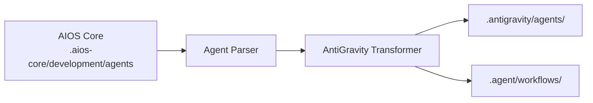

# AIOS Guide for AntiGravity

> **Google's Agentic Development Platform** - Workflow-Based Architecture

---

## Overview

### What is AntiGravity?

AntiGravity is Google's agentic development platform that enables developers to build and orchestrate AI-powered workflows. It features a unique workflow-based approach to agent activation and deep integration with Google Cloud services.

### Why use AIOS with AntiGravity?

AntiGravity offers distinct capabilities:

- **Workflow System**: Orchestrate complex agent interactions
- **Google Cloud Integration**: Native Firebase, GCP services
- **Native MCP**: Built-in Model Context Protocol support
- **@mention Activation**: Standard agent activation
- **Multi-Agent Workflows**: Chain agents together

### Comparison with Other Platforms

| Feature | AntiGravity | Claude Code | Cursor |
|---------|:-----------:|:-----------:|:------:|
| Workflow System | Yes | Task Tool | Composer |
| Google Cloud Native | Yes | No | No |
| MCP Support | Native | Native | Config |
| Agent Chaining | Yes | Subagents | No |

---

## Requirements

### System Requirements

| Requirement | Minimum | Recommended |
|-------------|---------|-------------|
| **RAM** | 4GB | 8GB+ |
| **Disk Space** | 1GB | 2GB+ |
| **Node.js** | 18.0+ | 20.0+ |

### Account Requirements

- **Google Cloud Account**
- **AntiGravity Access** (via Google AI)
- **Firebase Project** (optional, for integrations)

---

## Installation

### Step 1: Install AntiGravity

```bash
# Install via npm
npm install -g @google/antigravity

# Or use the installer from Google
curl -fsSL https://get.antigravity.dev | sh
```

### Step 2: Authenticate

```bash
# Login with Google account
antigravity auth login

# Or set up service account
export GOOGLE_APPLICATION_CREDENTIALS="path/to/credentials.json"
```

### Step 3: Install AIOS

```bash
cd your-project
npx @anthropic/aios init
# Select "AntiGravity" when prompted
```

### Step 4: Verify Installation

```bash
ls -la .antigravity/
ls -la .agent/
```

Expected structure:
```
project/
├── .antigravity/
│   ├── rules.md              # Main rules
│   ├── antigravity.json      # Configuration
│   └── agents/               # Agent definitions
└── .agent/
    └── workflows/            # Workflow definitions
        ├── dev-workflow.yaml
        ├── qa-workflow.yaml
        └── ...
```

---

## Configuration

### Main Configuration

**Location:** `.antigravity/antigravity.json`

```json
{
  "version": "1.0",
  "project": "your-project-name",
  "agents": {
    "default": "dev",
    "available": ["dev", "qa", "architect", "pm", "po", "analyst"]
  },
  "workflows": {
    "directory": ".agent/workflows"
  },
  "mcp": {
    "enabled": true,
    "servers": ["filesystem", "firebase"]
  }
}
```

### Rules File

**Location:** `.antigravity/rules.md`

```markdown
# Synkra AIOS Rules for AntiGravity

## Agent System
- Use @agent-name or workflows for activation
- Follow workflow definitions for complex tasks

## Development Standards
- Write clean, tested code
- Follow existing patterns
- Include comprehensive error handling
```

### Workflow Definitions

**Location:** `.agent/workflows/`

```yaml
# dev-workflow.yaml
name: Developer Workflow
trigger: "@dev"
agent: dev
steps:
  - name: analyze
    action: read_story
    input: "${story_path}"
  - name: implement
    action: write_code
    context: "${analyze.output}"
  - name: test
    action: run_tests
```

---

## Basic Usage

### Starting AntiGravity

```bash
# Start in current project
antigravity start

# Start with specific workflow
antigravity run dev-workflow
```

### Activating Agents

**Via @mention:**
```
@dev implement the user authentication feature

@qa review this module for security issues

@architect design the API gateway
```

**Via Workflow:**
```bash
antigravity workflow run dev --input "implement auth feature"
```

### Agent Commands

```
*help              # Show available commands
*workflow list     # List available workflows
*workflow run X    # Execute workflow X
*exit              # Exit current agent
```

---

## Advanced Usage

### Workflow Orchestration

Create complex multi-agent workflows:

```yaml
# feature-implementation.yaml
name: Feature Implementation
description: Complete feature from story to deployment

stages:
  - name: planning
    agent: architect
    steps:
      - analyze_requirements
      - create_design_doc

  - name: implementation
    agent: dev
    depends_on: planning
    steps:
      - implement_feature
      - write_tests

  - name: quality
    agent: qa
    depends_on: implementation
    steps:
      - run_tests
      - security_review

  - name: documentation
    agent: dev
    depends_on: quality
    steps:
      - update_docs
      - create_changelog
```

### MCP Integration

AntiGravity has native MCP support:

```json
{
  "mcp": {
    "servers": {
      "filesystem": {
        "enabled": true
      },
      "firebase": {
        "enabled": true,
        "project": "your-firebase-project"
      },
      "bigquery": {
        "enabled": true,
        "dataset": "your-dataset"
      }
    }
  }
}
```

### Google Cloud Services

Direct integration with GCP:

```
@dev Deploy this function to Cloud Functions

@devops Set up Cloud Run for this service

@architect Design using Firestore for data storage
```

### Agent Chaining

Chain multiple agents in a workflow:

```yaml
chain:
  - agent: analyst
    task: "Analyze requirements"
    output: requirements

  - agent: architect
    task: "Design solution"
    input: "${requirements}"
    output: design

  - agent: dev
    task: "Implement solution"
    input: "${design}"
```

---

## AntiGravity-Specific Features

### Workflow Dashboard

Access the visual workflow editor:
```bash
antigravity dashboard
```

### Firebase Integration

```yaml
# Use Firebase in workflows
firebase:
  firestore:
    collection: "projects/${project_id}/tasks"
  storage:
    bucket: "project-assets"
```

### Cloud Functions

Deploy agent-powered functions:

```javascript
// functions/agent-handler.js
const { AntiGravity } = require('@google/antigravity');

exports.handleRequest = AntiGravity.createFunction({
  agent: 'dev',
  workflow: 'code-review'
});
```

---

## Agent Synchronization

### How It Works



### Sync Commands

```bash
# Sync all agents and workflows
npm run sync:agents

# Sync for AntiGravity
npm run sync:agents -- --ide antigravity
```

### Agent Format

AntiGravity uses a hybrid format:

```yaml
# .antigravity/agents/dev.yaml
name: dev
displayName: Developer
description: Senior Full Stack Developer

persona:
  role: Full Stack Developer
  expertise:
    - TypeScript/JavaScript
    - Node.js, React
    - Database design
    - Cloud deployment

workflow:
  default: dev-workflow
  triggers:
    - "@dev"
    - "develop"
    - "implement"
```

---

## Known Limitations

### Current Limitations

| Limitation | Workaround |
|------------|------------|
| Google account required | Use service accounts |
| Complex workflow setup | Use templates |
| Limited IDE support | CLI-focused |

### AntiGravity vs Claude Code

| Aspect | AntiGravity | Claude Code |
|--------|-------------|-------------|
| Workflow System | Native | Task Tool |
| Cloud Native | Google | Any |
| MCP | Native | Native |
| CLI | Yes | Yes |

---

## Troubleshooting

### Common Issues

#### Authentication Failed
```
Error: Unable to authenticate
```
**Solution:**
```bash
antigravity auth logout
antigravity auth login
```

#### Workflow Not Found
```
Error: Workflow 'xyz' not found
```
**Solution:**
```bash
# List available workflows
antigravity workflow list

# Check workflow directory
ls .agent/workflows/
```

#### Agent Not Recognized
```
Error: Unknown agent '@xyz'
```
**Solution:**
```bash
# Resync agents
npm run sync:agents

# Verify agent config
cat .antigravity/antigravity.json
```

### Logs

```bash
# View AntiGravity logs
antigravity logs

# Verbose mode
antigravity --verbose start
```

---

## FAQ

**Q: Do I need Google Cloud?**
A: Basic features work without it, but full integration requires a GCP account.

**Q: Can I use non-Google models?**
A: AntiGravity primarily uses Google's models, but some configurations allow external models.

**Q: What's the difference between agents and workflows?**
A: Agents are personas with expertise; workflows orchestrate agent actions in sequences.

---

## Migration

### From Claude Code to AntiGravity

1. Your agents in `.aios-core/` are portable
2. Initialize AntiGravity:
   ```bash
   npx @anthropic/aios init --ide antigravity
   ```
3. Workflow files are generated automatically

### From AntiGravity to Other IDEs

1. AIOS agents remain in `.aios-core/`
2. Initialize for target IDE
3. Platform-specific configs generated

---

## Additional Resources

- [AntiGravity Documentation](https://cloud.google.com/antigravity/docs)
- [Google Cloud AI](https://cloud.google.com/ai)
- [Firebase Integration](https://firebase.google.com)

---

*Synkra AIOS - AntiGravity Platform Guide v1.0*
