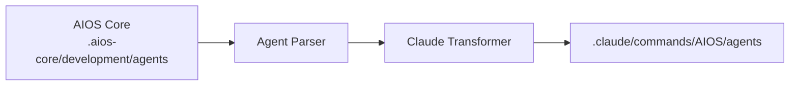

# AIOS Guide for Claude Code

> **Anthropic's Official CLI** - Recommended Platform for AIOS

---

## Overview

### What is Claude Code?

Claude Code is Anthropic's official command-line interface for Claude, designed for developers who want direct, powerful access to Claude's capabilities in their terminal and development workflow.

### Why use AIOS with Claude Code?

Claude Code offers the **best integration** with AIOS due to:

- **Native MCP Support**: Built-in Model Context Protocol for tool extensions
- **Task Tool**: Spawn subagents for complex multi-step operations
- **Hooks System**: Pre and post-execution hooks for automation
- **Skills/Commands**: Native slash command support for agent activation
- **Memory Persistence**: Session context preservation
- **Direct File Access**: Read, write, and edit files natively

### Comparison with Other Platforms

| Feature | Claude Code | Cursor | Windsurf |
|---------|:-----------:|:------:|:--------:|
| MCP Support | Native | Config | Config |
| Subagent Tasks | Yes | No | No |
| Hooks System | Yes | No | No |
| Skills | Native | No | No |
| CLI-based | Yes | No | No |

---

## Requirements

### System Requirements

| Requirement | Minimum | Recommended |
|-------------|---------|-------------|
| **Node.js** | 18.0+ | 20.0+ |
| **npm** | 9.0+ | 10.0+ |
| **Git** | 2.30+ | Latest |
| **OS** | macOS, Linux, Windows (WSL) | macOS, Linux |

### API Requirements

- **Anthropic API Key** or **Claude Pro/Team subscription**
- API access enabled for Claude Code

### Recommended Tools

- GitHub CLI (`gh`) for repository operations
- A modern terminal emulator (iTerm2, Warp, Alacritty)

---

## Installation

### Step 1: Install Claude Code

**Native Installation (Recommended):**

```bash
# macOS, Linux, WSL
curl -fsSL https://claude.ai/install.sh | bash

# Windows PowerShell
irm https://claude.ai/install.ps1 | iex
```

**Alternative Methods:**

```bash
# Homebrew (macOS)
brew install --cask claude-code

# WinGet (Windows)
winget install Anthropic.ClaudeCode
```

> **Note:** NPM installation (`npm install -g @anthropic-ai/claude-code`) is deprecated. Use native installation for auto-updates.

### Step 2: Authenticate

```bash
# Login with your Anthropic account
claude login

# Or set API key directly
export ANTHROPIC_API_KEY="your-api-key"
```

### Step 3: Install AIOS

```bash
# Navigate to your project
cd your-project

# Initialize AIOS
npx @anthropic/aios init

# Select "Claude Code" when prompted for IDE
```

### Step 4: Verify Installation

```bash
# Check installation type and version
claude doctor

# Verify AIOS files were created
ls -la .claude/
```

Expected structure:
```
.claude/
├── commands/
│   └── AIOS/
│       └── agents/        # Synced agents
├── settings.json          # Local settings
└── settings.local.json    # Local overrides

~/.claude/                 # Global config directory
~/.claude.json             # Global MCP configuration
```

---

## Configuration

### Main Configuration File

**Location:** `.claude/CLAUDE.md`

This file contains:
- Project context and rules
- Agent activation instructions
- Development methodology
- AIOS framework understanding

### Environment Variables

```bash
# Required
export ANTHROPIC_API_KEY="sk-ant-..."

# Optional
export CLAUDE_MODEL="claude-sonnet-4-20250514"  # Default model
export CLAUDE_MAX_TOKENS="8192"                 # Max response tokens
export AIOS_DEBUG="true"                        # Enable debug logging
```

### Settings File

**Location:** `.claude/settings.json`

```json
{
  "model": "claude-sonnet-4-20250514",
  "maxTokens": 8192,
  "permissions": {
    "allowedTools": ["Read", "Write", "Edit", "Bash", "Glob", "Grep"],
    "blockedCommands": ["rm -rf /", "sudo rm"]
  }
}
```

### MCP Configuration

**Location:** `~/.claude.json` (global) or `.claude/mcp.json` (project)

```json
{
  "mcpServers": {
    "filesystem": {
      "command": "npx",
      "args": ["-y", "@modelcontextprotocol/server-filesystem", "/path/to/allowed"]
    },
    "github": {
      "command": "npx",
      "args": ["-y", "@modelcontextprotocol/server-github"],
      "env": {
        "GITHUB_TOKEN": "ghp_..."
      }
    }
  }
}
```

---

## Basic Usage

### Starting Claude Code

```bash
# Start in current directory
claude

# Start with specific context
claude --context "Working on feature X"

# Start with a specific file
claude --file src/main.ts
```

### Activating AIOS Agents

Agents are activated using slash commands:

```
/dev         # Developer agent
/qa          # QA Engineer agent
/architect   # Software Architect agent
/pm          # Project Manager agent
/po          # Product Owner agent
/sm          # Scrum Master agent
/analyst     # Business Analyst agent
/devops      # DevOps Engineer agent
```

### Agent Command Syntax

```
/agent-name [task description]

# Examples
/dev implement the login feature following the story
/qa review the authentication module for security issues
/architect design the database schema for user management
```

### Common Workflows

#### Feature Development
```
1. /pm to review the story requirements
2. /architect to design the solution
3. /dev to implement the feature
4. /qa to test the implementation
5. /dev to fix any issues
```

#### Code Review
```
1. /qa review this PR for best practices
2. /dev address the review comments
```

#### Bug Investigation
```
1. /analyst investigate the bug report
2. /dev reproduce and fix the issue
3. /qa verify the fix
```

---

## Advanced Usage

### MCP Servers

Claude Code supports MCP (Model Context Protocol) for extended capabilities:

#### Available MCP Tools

| MCP Server | Purpose |
|------------|---------|
| `filesystem` | File system operations |
| `github` | GitHub API access |
| `playwright` | Browser automation |
| `postgres` | Database queries |

#### Adding MCP Servers

```bash
# Via DevOps agent
/devops
*add-mcp playwright
```

### Task Tool for Subagents

Claude Code can spawn subagents for complex operations:

```
# Automatic subagent spawning
/dev implement this feature

# Claude may spawn:
# - Explore agent for codebase analysis
# - Plan agent for architecture decisions
# - Bash agent for command execution
```

### Hooks System

Create pre and post-execution hooks:

**Location:** `.claude/hooks/`

```javascript
// .claude/hooks/pre-commit.js
module.exports = {
  name: 'pre-commit',
  trigger: 'before:commit',
  execute: async (context) => {
    // Run linting before commit
    await context.bash('npm run lint');
    await context.bash('npm test');
  }
};
```

### Custom Skills

Create reusable skills/commands:

**Location:** `.claude/commands/`

```markdown
<!-- .claude/commands/deploy.md -->
# Deploy Skill

## Description
Deploy the application to production

## Steps
1. Run tests
2. Build the application
3. Deploy to server

## Commands
```bash
npm test
npm run build
npm run deploy
```
```

### Memory and Context

Claude Code maintains session memory:

```
# Reference previous context
"As we discussed earlier..."

# Claude remembers:
# - Files you've worked on
# - Decisions made
# - Code changes
# - Conversation history
```

---

## Claude Code Specific Features

### Native Tool Access

| Tool | Description | Example |
|------|-------------|---------|
| `Read` | Read files | Read entire files or specific lines |
| `Write` | Create files | Write new files with content |
| `Edit` | Modify files | Find and replace text |
| `Bash` | Run commands | Execute shell commands |
| `Glob` | Find files | Pattern matching for files |
| `Grep` | Search content | Regex search in files |
| `Task` | Spawn agents | Complex multi-step operations |
| `WebFetch` | HTTP requests | Fetch web content |
| `WebSearch` | Search web | Get current information |

### Keyboard Shortcuts

| Shortcut | Action |
|----------|--------|
| `Ctrl+C` | Cancel current operation |
| `Ctrl+D` | Exit Claude Code |
| `Ctrl+L` | Clear screen |
| `Up/Down` | Navigate history |

### Status Line

Claude Code shows real-time status:
```
[Agent: dev] [Model: sonnet] [Tokens: 1234/8192] [Cost: $0.02]
```

---

## Agent Synchronization

### How It Works



### Sync Commands

```bash
# Sync all agents
npm run sync:agents

# Sync specific agent
npm run sync:agents -- --agent dev

# Force resync
npm run sync:agents -- --force
```

### Agent File Format

Agents in Claude Code use markdown with YAML frontmatter:

```markdown
---
name: dev
displayName: Developer
description: Senior Full Stack Developer
activation: /dev
---

# Developer Agent

## Expertise
- TypeScript/JavaScript
- Node.js
- React
- Database design

## Workflow
1. Understand requirements
2. Plan implementation
3. Write clean code
4. Test thoroughly
```

### Conflict Resolution

When conflicts occur:

1. Local changes are backed up to `.claude/commands/AIOS/agents/.backup/`
2. Sync prompts for resolution
3. Choose: keep local, use remote, or merge

---

## Known Limitations

### Current Limitations

| Limitation | Workaround |
|------------|------------|
| No GUI | Use terminal or integrate with IDE |
| No real-time collaboration | Use git for collaboration |
| API rate limits | Configure rate limiting in settings |
| Large file handling | Use streaming for large files |

### Platform-Specific Issues

- **Windows**: Use WSL for best experience
- **macOS**: Ensure Xcode CLI tools installed
- **Linux**: May need additional dependencies

### Features in Development

- [ ] Real-time collaboration
- [ ] Enhanced debugging tools
- [ ] Visual diff viewer
- [ ] Plugin system

---

## Troubleshooting

### Common Issues

#### Authentication Failed
```
Error: Authentication failed
```
**Solution:**
```bash
# Re-authenticate
claude logout
claude login

# Or check API key
echo $ANTHROPIC_API_KEY
```

#### MCP Server Not Found
```
Error: MCP server 'xyz' not found
```
**Solution:**
```bash
# List available MCP servers
/devops
*list-mcps

# Install missing server
*add-mcp xyz
```

#### Agent Not Recognized
```
Error: Unknown command '/xyz'
```
**Solution:**
```bash
# Resync agents
npm run sync:agents

# Check agent exists
ls .claude/commands/AIOS/agents/
```

#### Tool Permission Denied
```
Error: Permission denied for tool 'Bash'
```
**Solution:**
Update `.claude/settings.json`:
```json
{
  "permissions": {
    "allowedTools": ["Bash"]
  }
}
```

### Logs and Diagnostics

```bash
# Enable debug mode
export AIOS_DEBUG=true

# View Claude Code logs
cat ~/.claude/logs/latest.log

# Check AIOS logs
cat .aios-core/logs/sync.log
```

### Reset Configuration

```bash
# Reset Claude Code settings
rm -rf ~/.claude/

# Reinitialize
claude login
```

---

## FAQ

### General Questions

**Q: Can I use Claude Code offline?**
A: No, Claude Code requires an internet connection to communicate with the Claude API.

**Q: How much does Claude Code cost?**
A: Claude Code is free, but API usage costs apply based on your Anthropic plan.

**Q: Can I use my own models?**
A: Claude Code only supports Anthropic's Claude models.

### AIOS-Specific Questions

**Q: How do I switch between agents?**
A: Simply use the slash command for the desired agent: `/dev`, `/qa`, etc.

**Q: Can agents communicate with each other?**
A: Yes, through the Task tool which can spawn subagents.

**Q: Where are agent definitions stored?**
A: In `.claude/commands/AIOS/agents/` after sync.

**Q: How often should I sync agents?**
A: After updating AIOS or when agents are modified in the core.

---

## Migration

### From Cursor to Claude Code

1. Export your Cursor rules:
   ```bash
   cp .cursor/rules.md cursor-rules-backup.md
   ```

2. Initialize AIOS with Claude Code:
   ```bash
   npx @anthropic/aios init --ide claude-code
   ```

3. Migrate custom rules:
   - Copy relevant rules to `.claude/CLAUDE.md`
   - Adjust syntax for Claude Code format

4. Sync agents:
   ```bash
   npm run sync:agents
   ```

### From Claude Code to Another IDE

1. Your AIOS agents are stored in `.aios-core/development/agents/`
2. Initialize AIOS for the target IDE
3. Agents will be transformed to the new format automatically

---

## Additional Resources

### Official Documentation
- [Claude Code Documentation](https://code.claude.com/docs)
- [Claude Code Setup Guide](https://code.claude.com/docs/en/setup)
- [Anthropic API Reference](https://docs.anthropic.com/api)
- [MCP Protocol](https://modelcontextprotocol.io)
- [GitHub Repository](https://github.com/anthropics/claude-code)

### Community
- [GitHub Discussions](https://github.com/anthropics/claude-code/discussions)
- [Discord Community](https://discord.gg/anthropic)

### Support
- [GitHub Issues](https://github.com/anthropics/claude-code/issues)
- [Anthropic Support](https://support.anthropic.com)

---

*Synkra AIOS - Claude Code Platform Guide v1.0*
