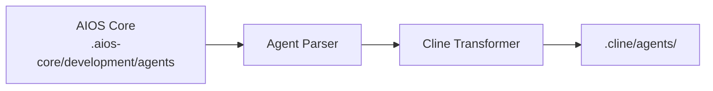

# AIOS Guide for Cline

> **VS Code AI Coding Assistant** - Full VS Code Integration

---

## Overview

### What is Cline?

Cline is a powerful AI coding assistant extension for VS Code that brings autonomous coding capabilities directly into your favorite editor. It can read, write, and execute code while maintaining the familiar VS Code environment.

### Why use AIOS with Cline?

Cline offers seamless VS Code integration for AIOS:

- **Full VS Code Integration**: Works within your existing setup
- **@mention Activation**: Natural agent activation
- **File Operations**: Read, write, edit files directly
- **Terminal Access**: Execute commands
- **Extension Ecosystem**: Compatible with VS Code extensions
- **Approval Workflow**: Safe operations with user confirmation

### Comparison with Other Platforms

| Feature | Cline | Cursor | Claude Code |
|---------|:-----:|:------:|:-----------:|
| VS Code Extension | Yes | No (separate app) | No |
| @mention Activation | Yes | Yes | /command |
| Terminal Access | Yes | Yes | Yes |
| MCP Support | Limited | Config | Native |
| Approval Required | Yes | Optional | Optional |

---

## Requirements

### System Requirements

| Requirement | Minimum | Recommended |
|-------------|---------|-------------|
| **VS Code** | 1.80+ | Latest |
| **RAM** | 4GB | 8GB+ |
| **Node.js** | 18.0+ (for AIOS) | 20.0+ |

### Account Requirements

- **API Key**: OpenAI, Anthropic, or other supported providers
- **VS Code Account** (optional, for sync)

---

## Installation

### Step 1: Install VS Code

Download from [code.visualstudio.com](https://code.visualstudio.com) if not already installed.

### Step 2: Install Cline Extension

1. Open VS Code
2. Go to Extensions (`Cmd/Ctrl + Shift + X`)
3. Search for "Cline"
4. Click Install

Or via command line:
```bash
code --install-extension saoudrizwan.claude-dev
```

### Step 3: Configure Cline

1. Open Cline settings
2. Add your API key (Anthropic, OpenAI, etc.)
3. Configure preferred model

### Step 4: Install AIOS

```bash
cd your-project
npx @anthropic/aios init
# Select "Cline" when prompted
```

### Step 5: Verify Installation

```bash
ls -la .cline/
```

Expected structure:
```
.cline/
├── rules.md           # Main rules configuration
├── agents/            # Agent definitions
│   ├── dev.md
│   ├── qa.md
│   └── ...
└── settings.json      # Local settings
```

---

## Configuration

### Rules File

**Location:** `.cline/rules.md`

```markdown
# Synkra AIOS Rules for Cline

## Agent System
- Activate agents with @agent-name
- Follow agent-specific workflows

## Development Standards
- Write clean, tested code
- Follow existing patterns
- Include error handling
```

### Agent Files

**Location:** `.cline/agents/`

```markdown
# Developer Agent (@dev)

## Role
Senior Full Stack Developer

## Expertise
- TypeScript/JavaScript
- Node.js, React
- Database design

## Workflow
1. Understand requirements
2. Plan implementation
3. Write tested code
```

### Cline Settings

Configure in VS Code settings or `.cline/settings.json`:

```json
{
  "cline.apiProvider": "anthropic",
  "cline.model": "claude-3-5-sonnet",
  "cline.autoApprove": {
    "read": true,
    "write": false,
    "execute": false
  }
}
```

---

## Basic Usage

### Opening Cline

1. Open Command Palette (`Cmd/Ctrl + Shift + P`)
2. Type "Cline: Open"
3. Or use the sidebar icon

### Activating Agents

Use @mentions in the Cline chat:

```
@dev         # Developer agent
@qa          # QA Engineer agent
@architect   # Software Architect
@pm          # Project Manager
@po          # Product Owner
@analyst     # Business Analyst
@devops      # DevOps Engineer
```

### Example Interactions

```
@dev Create a REST API endpoint for user registration

@qa Review the authentication module for security issues

@architect Design the database schema for the e-commerce system
```

### Approval Workflow

Cline asks for approval before:
- Creating/modifying files
- Running terminal commands
- Making significant changes

```
[Cline wants to edit src/auth.ts]
[Allow] [Deny] [Allow All]
```

---

## Advanced Usage

### Multi-File Operations

```
@dev Create a complete CRUD module for products:
- Model in src/models/
- Repository in src/repositories/
- Service in src/services/
- Controller in src/controllers/
- Tests in tests/
```

### Terminal Execution

Cline can run commands:

```
@dev Run the test suite and fix any failures

@devops Set up the Docker development environment
```

### Diff Review

1. Cline shows diffs before applying
2. Review changes in familiar VS Code diff view
3. Accept or reject individual changes

### Context Providers

Add context to your requests:

```
@dev Using the patterns in src/services/userService.ts,
create a new productService.ts

@qa Based on tests/auth.test.ts,
write tests for the payment module
```

---

## Cline-Specific Features

### Approval Settings

| Setting | Description |
|---------|-------------|
| `autoApprove.read` | Auto-approve file reads |
| `autoApprove.write` | Auto-approve file writes |
| `autoApprove.execute` | Auto-approve commands |

### Keyboard Shortcuts

| Shortcut | Action |
|----------|--------|
| `Cmd/Ctrl + Shift + P` | Command Palette |
| `Cmd/Ctrl + .` | Quick approve |
| `Escape` | Cancel operation |

### Task History

View previous interactions:
1. Open Cline panel
2. Click history icon
3. Resume or reference past tasks

### MCP Integration (Limited)

```json
{
  "cline.mcp": {
    "enabled": true,
    "servers": ["filesystem"]
  }
}
```

---

## Agent Synchronization

### How It Works



### Sync Commands

```bash
# Sync all agents
npm run sync:agents

# Sync for Cline specifically
npm run sync:agents -- --ide cline
```

### Agent Format

Cline uses condensed markdown:

```markdown
# Developer Agent

**Activation:** @dev

## Persona
You are a Senior Full Stack Developer with expertise in:
- TypeScript/JavaScript
- Node.js and React
- Database design and optimization

## Workflow
1. Read and understand the story requirements
2. Plan the implementation approach
3. Write clean, well-tested code
4. Update story progress when complete

## Standards
- Follow existing codebase patterns
- Include comprehensive error handling
- Write unit tests for new code
```

---

## Known Limitations

### Current Limitations

| Limitation | Workaround |
|------------|------------|
| Limited MCP | Use basic MCP servers |
| No native subagents | Manual agent switching |
| Approval interrupts flow | Configure auto-approve |
| VS Code only | No standalone version |

### Cline vs Claude Code

| Aspect | Cline | Claude Code |
|--------|-------|-------------|
| Environment | VS Code | Terminal |
| MCP | Limited | Native |
| Task Tool | No | Yes |
| Extensions | Yes | No |

---

## Troubleshooting

### Common Issues

#### Extension Not Loading
```
Issue: Cline not appearing in VS Code
```
**Solution:**
1. Check VS Code version (1.80+)
2. Reload VS Code (`Cmd/Ctrl + Shift + P` > "Reload Window")
3. Reinstall extension

#### API Key Invalid
```
Issue: Authentication failed
```
**Solution:**
1. Open Cline settings
2. Re-enter API key
3. Verify key is active

#### Agent Not Recognized
```
Issue: @dev not activating
```
**Solution:**
```bash
# Resync agents
npm run sync:agents

# Check agent file
cat .cline/agents/dev.md
```

#### Slow Performance
```
Issue: Cline responding slowly
```
**Solution:**
1. Check API quota
2. Use faster model
3. Reduce context size

### Logs

```bash
# VS Code Developer Tools
Help > Toggle Developer Tools > Console

# Extension logs
View > Output > Select "Cline"
```

---

## FAQ

**Q: Is Cline free?**
A: The extension is free, but requires an API key for AI providers (which may have costs).

**Q: Can I use local models?**
A: Yes, Cline supports Ollama and other local model providers.

**Q: Does Cline work offline?**
A: Only with local models configured.

**Q: How do I update agents?**
A: Run `npm run sync:agents` after AIOS updates.

---

## Migration

### From Other Extensions

1. Install AIOS for Cline:
   ```bash
   npx @anthropic/aios init --ide cline
   ```

2. Agents sync automatically

### From Cline to Claude Code

1. Your agents are in `.aios-core/development/agents/`
2. Initialize for Claude Code:
   ```bash
   npx @anthropic/aios init --ide claude-code
   ```

---

## Additional Resources

- [Cline GitHub](https://github.com/cline/cline)
- [VS Code Marketplace](https://marketplace.visualstudio.com/items?itemName=saoudrizwan.claude-dev)
- [AIOS Platform Guide](../README.md)

---

*Synkra AIOS - Cline Platform Guide v1.0*
