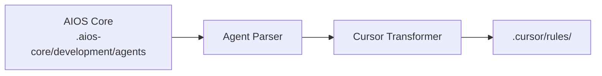

# AIOS Guide for Cursor

> **AI-First Code Editor** - Most Popular AI IDE

---

## Overview

### What is Cursor?

Cursor is an AI-first code editor built on top of VS Code, designed to make developers more productive with integrated AI assistance. It combines familiar VS Code features with powerful AI capabilities including code generation, editing, and conversation.

### Why use AIOS with Cursor?

Cursor is one of the **most popular AI IDEs** with excellent AIOS integration:

- **Large User Base**: Active community and continuous updates
- **@mention Activation**: Natural agent activation with @syntax
- **Composer Integration**: Multi-file editing with AI assistance
- **@codebase Context**: Full project understanding
- **MCP Support**: Extensible via configuration
- **VS Code Compatibility**: Works with VS Code extensions

### Comparison with Other Platforms

| Feature | Cursor | Claude Code | Windsurf |
|---------|:------:|:-----------:|:--------:|
| GUI Interface | Yes | No | Yes |
| @mention Activation | Yes | /command | Yes |
| Composer | Yes | Task Tool | Cascade |
| VS Code Extensions | Yes | No | Limited |
| MCP Support | Config | Native | Config |
| Multi-file Edit | Yes | Yes | Yes |

---

## Requirements

### System Requirements

| Requirement | Minimum | Recommended |
|-------------|---------|-------------|
| **RAM** | 4GB | 8GB+ |
| **Disk Space** | 500MB | 1GB+ |
| **OS** | macOS 10.15+, Windows 10+, Linux | Latest |
| **Node.js** | 18.0+ (for AIOS) | 20.0+ |

### Account Requirements

- **Cursor Account** (free tier available)
- **API Keys** (optional): OpenAI, Anthropic, or use Cursor's built-in models

### Recommended Setup

- Git installed and configured
- GitHub CLI (`gh`) for PR operations
- A Cursor Pro subscription for advanced features

---

## Installation

### Step 1: Install Cursor

1. Download from [cursor.com](https://cursor.com)
2. Run the installer for your platform
3. Launch Cursor and sign in

```bash
# macOS (via Homebrew)
brew install --cask cursor

# Or download directly from cursor.com
```

### Step 2: Configure Cursor Settings

Open Cursor Settings (`Cmd/Ctrl + ,`):

1. **AI Settings** > Enable AI features
2. **Models** > Select preferred model (Claude, GPT-4, etc.)
3. **Rules** > Enable custom rules

### Step 3: Install AIOS

```bash
# Navigate to your project
cd your-project

# Initialize AIOS
npx @anthropic/aios init

# Select "Cursor" when prompted for IDE
```

### Step 4: Verify Installation

Check that AIOS files were created:

```bash
ls -la .cursor/
```

Expected structure:
```
.cursor/
├── rules.md           # Main rules configuration
├── rules/             # Agent rules folder
│   ├── dev.md
│   ├── qa.md
│   ├── architect.md
│   └── ...
└── settings.json      # Local Cursor settings
```

---

## Configuration

### Main Rules File

**Location:** `.cursor/rules.md`

This file contains:
- Project-specific rules and context
- Agent activation instructions
- Development standards
- AIOS framework integration

### Agent Rules Folder

**Location:** `.cursor/rules/`

Each agent has a dedicated file:
```
.cursor/rules/
├── dev.md          # Developer agent rules
├── qa.md           # QA agent rules
├── architect.md    # Architect agent rules
├── pm.md           # Project Manager rules
├── po.md           # Product Owner rules
├── sm.md           # Scrum Master rules
├── analyst.md      # Business Analyst rules
└── devops.md       # DevOps agent rules
```

### Cursor Settings

**Location:** `.cursor/settings.json`

```json
{
  "cursor.ai.enabled": true,
  "cursor.ai.model": "claude-3-5-sonnet",
  "cursor.rules.enabled": true,
  "cursor.rules.path": ".cursor/rules.md"
}
```

### MCP Configuration

**Location:** `~/.cursor/mcp.json` or project `.cursor/mcp.json`

```json
{
  "mcpServers": {
    "filesystem": {
      "command": "npx",
      "args": ["-y", "@modelcontextprotocol/server-filesystem", "."]
    }
  }
}
```

---

## Basic Usage

### Starting Cursor with AIOS

1. Open your project in Cursor
2. The rules in `.cursor/rules.md` are automatically loaded
3. Use the AI chat panel (`Cmd/Ctrl + L`)

### Activating AIOS Agents

Agents are activated using @mentions in chat:

```
@dev         # Developer agent
@qa          # QA Engineer agent
@architect   # Software Architect agent
@pm          # Project Manager agent
@po          # Product Owner agent
@sm          # Scrum Master agent
@analyst     # Business Analyst agent
@devops      # DevOps Engineer agent
```

### Agent Activation Examples

```
@dev implement the authentication feature following the story

@qa review this code for security vulnerabilities

@architect design the microservices architecture for the payment system

@pm create a sprint plan for the next two weeks
```

### Using Composer

Cursor's Composer enables multi-file editing:

1. Open Composer (`Cmd/Ctrl + I`)
2. Describe your changes
3. Select files to modify
4. Review and apply changes

```
# Example Composer prompt
@dev Create a new REST API endpoint for user registration.
Include:
- Route handler in src/routes/
- Validation middleware
- Service layer logic
- Unit tests
```

### Using @codebase

Reference your entire project context:

```
@codebase How is authentication currently implemented?

@codebase @dev Refactor the database queries to use the repository pattern
```

---

## Advanced Usage

### Composer Workflows

#### Multi-File Refactoring
```
@architect @codebase
Refactor the user module to follow clean architecture:
1. Extract interfaces
2. Create repository layer
3. Update services
4. Maintain tests
```

#### Feature Implementation
```
@dev @codebase
Implement the shopping cart feature:
- Cart model and migrations
- CRUD operations
- Session persistence
- API endpoints
```

### Chat Modes

Cursor supports different interaction modes:

| Mode | Use Case |
|------|----------|
| **Chat** | General questions, explanations |
| **Edit** | Inline code modifications |
| **Composer** | Multi-file changes |
| **Terminal** | Command execution |

### Inline Editing

Select code and use `Cmd/Ctrl + K`:

```
# Select code, then:
@dev optimize this function for performance
@qa add error handling to this block
```

### Rules Organization

Organize rules by context:

```
.cursor/
├── rules.md              # Global rules
└── rules/
    ├── agents/           # Agent-specific rules
    │   ├── dev.md
    │   └── qa.md
    ├── patterns/         # Code patterns
    │   ├── api.md
    │   └── testing.md
    └── project/          # Project-specific
        └── conventions.md
```

---

## Cursor-Specific Features

### Superpowers

| Feature | Description |
|---------|-------------|
| **Cmd+K** | Inline AI editing |
| **Cmd+L** | Open AI chat |
| **Cmd+I** | Open Composer |
| **Cmd+Shift+L** | Add selection to chat |
| **Tab** | Accept AI suggestion |

### Keyboard Shortcuts

| Shortcut | Action |
|----------|--------|
| `Cmd/Ctrl + K` | AI Edit |
| `Cmd/Ctrl + L` | AI Chat |
| `Cmd/Ctrl + I` | Composer |
| `Cmd/Ctrl + Shift + K` | Edit with selection |
| `Escape` | Cancel AI operation |

### Context References

Use these in chat or Composer:

| Reference | Description |
|-----------|-------------|
| `@codebase` | Full project context |
| `@file` | Specific file |
| `@folder` | Folder contents |
| `@docs` | Documentation |
| `@web` | Web search |
| `@agent-name` | AIOS agent |

### Model Selection

Switch models based on task:

| Model | Best For |
|-------|----------|
| **Claude 3.5 Sonnet** | Complex reasoning, architecture |
| **GPT-4** | General coding |
| **GPT-4 Turbo** | Fast responses |
| **Cursor Small** | Quick completions |

---

## Agent Synchronization

### How It Works



### Sync Commands

```bash
# Sync all agents
npm run sync:agents

# Sync specific agent
npm run sync:agents -- --agent dev

# Force resync
npm run sync:agents -- --force
```

### Agent File Format

Agents in Cursor use condensed markdown format:

```markdown
# Developer Agent (@dev)

## Role
Senior Full Stack Developer focused on clean, maintainable code.

## Expertise
- TypeScript/JavaScript
- Node.js/React
- Database design
- API development

## Workflow
1. Understand requirements from story
2. Plan implementation approach
3. Write clean, tested code
4. Update story progress

## Patterns
- Follow existing codebase conventions
- Write comprehensive error handling
- Include unit tests for new code
```

### Conflict Resolution

When conflicts occur during sync:

1. Backup created at `.cursor/rules/.backup/`
2. Prompt for resolution strategy
3. Options: keep local, use remote, merge

---

## Known Limitations

### Current Limitations

| Limitation | Workaround |
|------------|------------|
| No native MCP | Use configuration-based MCP |
| No subagent spawning | Manual agent switching |
| Context window limits | Use @codebase selectively |
| Rate limiting | Configure in settings |

### Cursor vs Claude Code

| Aspect | Cursor | Claude Code |
|--------|--------|-------------|
| Task Tool | No | Yes |
| Hooks | No | Yes |
| Skills | No | Native |
| GUI | Yes | No |
| VS Code Ext | Yes | No |

### Known Issues

- Large projects may slow @codebase
- Some VS Code extensions may conflict
- MCP requires manual configuration

---

## Troubleshooting

### Common Issues

#### Rules Not Loading
```
Issue: Agent not responding to @mentions
```
**Solution:**
1. Verify rules file exists: `ls .cursor/rules.md`
2. Check Cursor settings > Rules > Enabled
3. Restart Cursor

#### MCP Not Working
```
Issue: MCP tools not available
```
**Solution:**
```bash
# Verify MCP configuration
cat ~/.cursor/mcp.json

# Check MCP server is installed
npx @modelcontextprotocol/server-filesystem --version
```

#### Slow Performance
```
Issue: Cursor is slow with large projects
```
**Solution:**
1. Exclude large folders in `.cursorignore`
2. Use specific file references instead of @codebase
3. Increase memory allocation in settings

#### Agent Not Recognized
```
Issue: @dev not activating agent
```
**Solution:**
```bash
# Resync agents
npm run sync:agents

# Verify agent file exists
ls .cursor/rules/dev.md
```

### Logs and Diagnostics

```bash
# Cursor logs location
# macOS: ~/Library/Application Support/Cursor/logs/
# Windows: %APPDATA%\Cursor\logs\
# Linux: ~/.config/Cursor/logs/

# View latest log
tail -f ~/Library/Application\ Support/Cursor/logs/main.log
```

### Reset Configuration

```bash
# Backup current config
cp -r .cursor/ .cursor-backup/

# Reinitialize AIOS
npx @anthropic/aios init --ide cursor --force
```

---

## FAQ

### General Questions

**Q: Is Cursor free?**
A: Cursor has a free tier with limited AI requests. Pro subscription available for unlimited access.

**Q: Can I use my own API keys?**
A: Yes, you can configure OpenAI or Anthropic API keys in Cursor settings.

**Q: Does Cursor work offline?**
A: Basic editing works offline, but AI features require internet.

### AIOS-Specific Questions

**Q: How do I switch between agents?**
A: Use @mentions in chat: `@dev`, `@qa`, `@architect`, etc.

**Q: Can I use multiple agents in one prompt?**
A: Yes, but it's recommended to use one agent per task for clarity.

**Q: Where are agent definitions stored?**
A: In `.cursor/rules/` after sync.

**Q: How do I update agents?**
A: Run `npm run sync:agents` after AIOS updates.

---

## Migration

### From VS Code to Cursor

1. Cursor imports VS Code settings automatically
2. Install AIOS:
   ```bash
   npx @anthropic/aios init --ide cursor
   ```
3. Your VS Code extensions should work in Cursor

### From Cursor to Claude Code

1. Export custom rules:
   ```bash
   cp -r .cursor/rules/ cursor-rules-backup/
   ```

2. Initialize AIOS for Claude Code:
   ```bash
   npx @anthropic/aios init --ide claude-code
   ```

3. Agents sync automatically to new format

### From Cursor to Windsurf

1. Export configuration:
   ```bash
   cp .cursor/rules.md cursor-rules-backup.md
   ```

2. Initialize AIOS for Windsurf:
   ```bash
   npx @anthropic/aios init --ide windsurf
   ```

3. Rules transform to Windsurf's XML-tagged format

---

## Additional Resources

### Official Documentation
- [Cursor Documentation](https://cursor.com/docs)
- [Cursor Changelog](https://cursor.com/changelog)
- [Cursor Discord](https://discord.gg/cursor)

### Community
- [Cursor Reddit](https://reddit.com/r/cursor)
- [GitHub Discussions](https://github.com/getcursor/cursor/discussions)

### Tutorials
- [Cursor Tips & Tricks](https://cursor.com/tips)
- [AIOS Integration Guide](../README.md)

---

*Synkra AIOS - Cursor Platform Guide v1.0*
