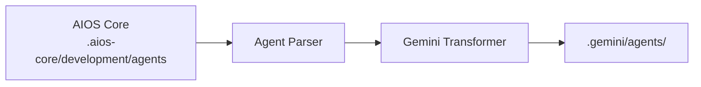

# AIOS Guide for Gemini CLI

> **Google AI CLI Assistant** - Command-Line AI Development

---

## Overview

### What is Gemini CLI?

Gemini CLI is Google's command-line interface for interacting with Gemini AI models. It provides developers with direct terminal access to Google's AI capabilities, including multimodal support for text, code, and images.

### Why use AIOS with Gemini CLI?

Gemini CLI offers unique capabilities:

- **CLI-Based Workflow**: Pure terminal experience
- **Google AI Models**: Access to Gemini models
- **Multimodal Support**: Text, code, and image understanding
- **Prompt-Based Activation**: Natural language agent activation
- **Shell Integration**: Works with your existing tools

### Comparison with Other Platforms

| Feature | Gemini CLI | Claude Code | Cursor |
|---------|:----------:|:-----------:|:------:|
| CLI-Based | Yes | Yes | No |
| Multimodal | Yes | Limited | No |
| Agent Activation | Prompt | /command | @mention |
| MCP Support | No | Native | Config |
| Google Models | Yes | No | No |

---

## Requirements

### System Requirements

| Requirement | Minimum | Recommended |
|-------------|---------|-------------|
| **OS** | macOS, Linux, Windows | macOS, Linux |
| **Node.js** | 18.0+ | 20.0+ |
| **Python** | 3.9+ (optional) | 3.11+ |

### Account Requirements

- **Google AI API Key** or **Google Cloud Account**
- **Gemini API Access**

---

## Installation

### Step 1: Install Gemini CLI

```bash
# Install via npm (requires Node.js 18+)
npm install -g @google/gemini-cli

# Or run without installation
npx @google/gemini-cli

# Or via conda
conda create -y -n gemini_env -c conda-forge nodejs
conda activate gemini_env
npm install -g @google/gemini-cli
```

### Step 2: Authenticate

```bash
# Login with Google account
gemini auth login

# Or set API key
export GOOGLE_AI_API_KEY="your-api-key"
```

### Step 3: Install AIOS

```bash
cd your-project
npx @anthropic/aios init
# Select "Gemini CLI" when prompted
```

### Step 4: Verify Installation

```bash
ls -la .gemini/
```

Expected structure:
```
.gemini/
├── rules.md           # Main rules
├── agents/            # Agent definitions
│   ├── dev.md
│   ├── qa.md
│   └── ...
└── config.json        # CLI configuration
```

---

## Configuration

### Rules File

**Location:** `.gemini/rules.md`

```markdown
# Synkra AIOS Rules for Gemini CLI

## Agent System
- Include agent context in your prompts
- Use "As the [agent] agent..." for activation

## Development Standards
- Write clean, tested code
- Follow existing patterns
```

### CLI Configuration

**Location:** `.gemini/config.json`

```json
{
  "model": "gemini-pro",
  "temperature": 0.7,
  "maxOutputTokens": 8192,
  "agents": {
    "default": "dev",
    "available": ["dev", "qa", "architect", "pm"]
  }
}
```

### Agent Files

**Location:** `.gemini/agents/`

```markdown
# Developer Agent

## Activation
Include "As the AIOS dev agent" in your prompt.

## Persona
Senior Full Stack Developer with expertise in:
- TypeScript/JavaScript
- Node.js, React
- Database design

## Workflow
1. Read requirements
2. Plan implementation
3. Write clean code
4. Test thoroughly
```

---

## Basic Usage

### Starting Gemini CLI

```bash
# Interactive mode
gemini

# Single prompt
gemini "Explain this code"

# With file context
gemini --file src/main.ts "Review this code"
```

### Activating AIOS Agents

Include agent context in prompts:

```bash
# Developer agent
gemini "As the AIOS dev agent, implement the login feature"

# QA agent
gemini "As the AIOS qa agent, review this code for security"

# Architect agent
gemini "As the AIOS architect agent, design the database schema"
```

### With Context Files

```bash
# Include rules file
gemini --context .gemini/rules.md "Implement auth feature"

# Include specific agent
gemini --context .gemini/agents/dev.md "Create user model"
```

### Shell Integration

```bash
# Pipe code for review
cat src/auth.ts | gemini "As AIOS qa, review this code"

# Generate code
gemini "Create a REST API endpoint" > src/api/users.ts

# Interactive session
gemini --interactive
```

---

## Advanced Usage

### Multimodal Capabilities

```bash
# Analyze image
gemini --image screenshot.png "Explain this UI design"

# Code + image
gemini --file src/component.tsx --image mockup.png \
  "Update component to match design"
```

### Session Management

```bash
# Start named session
gemini --session feature-dev

# Continue session
gemini --session feature-dev "Now add tests"

# List sessions
gemini sessions list
```

### Batch Operations

```bash
# Process multiple files
for file in src/*.ts; do
  gemini --file "$file" "As AIOS qa, review this file" >> reviews.md
done
```

### Custom Commands

Create shell aliases:

```bash
# ~/.bashrc or ~/.zshrc
alias gdev='gemini --context .gemini/agents/dev.md'
alias gqa='gemini --context .gemini/agents/qa.md'
alias garch='gemini --context .gemini/agents/architect.md'
```

Usage:
```bash
gdev "Implement user authentication"
gqa "Review the auth module"
```

---

## Gemini CLI-Specific Features

### Model Selection

```bash
# Use specific model
gemini --model gemini-pro "Query"
gemini --model gemini-pro-vision "Analyze image"
```

### Output Formats

```bash
# JSON output
gemini --output json "Generate API schema"

# Markdown
gemini --output markdown "Document this function"

# Code only
gemini --output code "Create a sorting function"
```

### Streaming

```bash
# Enable streaming output
gemini --stream "Write a long explanation"
```

---

## Agent Synchronization

### How It Works



### Sync Commands

```bash
# Sync all agents
npm run sync:agents

# Sync for Gemini CLI
npm run sync:agents -- --ide gemini-cli
```

### Agent Format

Gemini CLI uses prompt-optimized markdown:

```markdown
# Developer Agent

**Activation Phrase:** "As the AIOS dev agent"

## Role
You are a Senior Full Stack Developer working with Synkra AIOS.

## Expertise
- TypeScript/JavaScript
- Node.js, React
- Database design
- API development

## Instructions
When activated:
1. Analyze the request carefully
2. Consider existing code patterns
3. Provide clean, tested solutions
4. Explain your approach

## Response Format
- Start with brief analysis
- Provide code solutions
- Include explanations
- Suggest tests if applicable
```

---

## Known Limitations

### Current Limitations

| Limitation | Workaround |
|------------|------------|
| No MCP support | Use external tools |
| No persistent context | Use sessions |
| Manual agent activation | Use shell aliases |
| No GUI | Terminal only |

### Gemini CLI vs Claude Code

| Aspect | Gemini CLI | Claude Code |
|--------|------------|-------------|
| Provider | Google | Anthropic |
| MCP | No | Native |
| Task Tool | No | Yes |
| Multimodal | Yes | Limited |

---

## Troubleshooting

### Common Issues

#### Authentication Failed
```
Error: Unable to authenticate
```
**Solution:**
```bash
gemini auth logout
gemini auth login
# Or re-set API key
export GOOGLE_AI_API_KEY="new-key"
```

#### Model Not Available
```
Error: Model 'xyz' not found
```
**Solution:**
```bash
# List available models
gemini models list

# Use available model
gemini --model gemini-pro "Query"
```

#### Context Too Long
```
Error: Context exceeds limit
```
**Solution:**
- Break into smaller chunks
- Use specific file references
- Summarize context

### Logs

```bash
# Enable verbose output
gemini --verbose "Query"

# Debug mode
GEMINI_DEBUG=1 gemini "Query"
```

---

## FAQ

**Q: Is Gemini CLI free?**
A: Yes, generous free tier: 60 requests/minute and 1000 requests/day at no cost. Supports Gemini Pro and Gemini Flash models.

**Q: Can I use local models?**
A: No, Gemini CLI requires Google's API.

**Q: Does it work offline?**
A: No, requires internet connection.

**Q: How do I switch agents quickly?**
A: Use shell aliases or include agent context in prompts.

---

## Migration

### From Claude Code to Gemini CLI

1. Install AIOS for Gemini CLI:
   ```bash
   npx @anthropic/aios init --ide gemini-cli
   ```
2. Agents transform to prompt-based format

### From Gemini CLI to Other IDEs

1. AIOS agents in `.aios-core/` are portable
2. Initialize for target IDE
3. Agents transform automatically

---

## Additional Resources

- [Gemini CLI Official Documentation](https://geminicli.com/docs/)
- [Gemini CLI GitHub](https://github.com/google-gemini/gemini-cli)
- [Google AI Documentation](https://ai.google.dev/docs)
- [Google Codelabs Tutorial](https://codelabs.developers.google.com/gemini-cli-hands-on)
- [Google Cloud Gemini CLI](https://docs.cloud.google.com/gemini/docs/codeassist/gemini-cli)

---

*Synkra AIOS - Gemini CLI Platform Guide v1.0*
