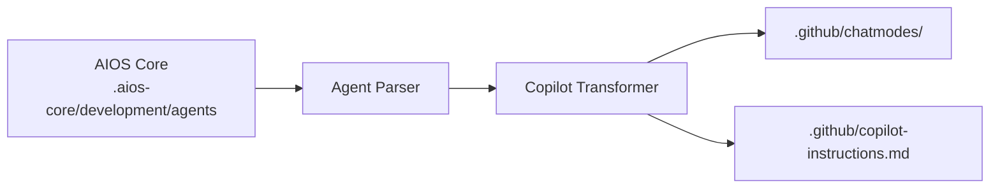

# AIOS Guide for GitHub Copilot

> **GitHub's AI Pair Programmer** - Native GitHub Integration

---

## Overview

### What is GitHub Copilot?

GitHub Copilot is GitHub's AI-powered coding assistant that integrates directly with VS Code and other editors. It offers code completions, chat assistance, and deep GitHub integration for pull requests and code review.

### Why use AIOS with GitHub Copilot?

GitHub Copilot provides unique advantages:

- **GitHub Integration**: Native PR and issue support
- **Ubiquitous**: Available in most editors
- **Chat Modes**: Agent-like behavior via chat modes
- **Code Review**: AI-assisted PR reviews
- **@workspace**: Full project context

### Comparison with Other Platforms

| Feature | GitHub Copilot | Cursor | Claude Code |
|---------|:--------------:|:------:|:-----------:|
| GitHub Native | Yes | No | No |
| Agent Modes | 4 Built-in | @mention | /command |
| MCP Support | Yes | Config | Native |
| PR Integration | Yes | Limited | gh CLI |
| Code Completion | Yes | Yes | No |

---

## Requirements

### System Requirements

| Requirement | Minimum | Recommended |
|-------------|---------|-------------|
| **VS Code** | 1.101+ | Latest |
| **RAM** | 4GB | 8GB+ |
| **Node.js** | 18.0+ (for AIOS) | 20.0+ |

### Account Requirements

- **GitHub Copilot subscription** (Individual, Business, or Enterprise)
- **GitHub account**

### VS Code Settings

Enable agent mode in VS Code:
```json
{
  "chat.agent.enabled": true
}
```

---

## Installation

### Step 1: Install GitHub Copilot Extension

1. Open VS Code
2. Go to Extensions (`Cmd/Ctrl + Shift + X`)
3. Search "GitHub Copilot"
4. Install both:
   - GitHub Copilot
   - GitHub Copilot Chat

### Step 2: Sign In

1. Click "Sign in to GitHub" when prompted
2. Authorize VS Code
3. Verify subscription is active

### Step 3: Install AIOS

```bash
cd your-project
npx @anthropic/aios init
# Select "GitHub Copilot" when prompted
```

### Step 4: Verify Installation

```bash
ls -la .github/
```

Expected structure:
```
.github/
├── copilot-instructions.md    # Main instructions
├── chatmodes/                  # Agent chat modes
│   ├── aios-dev.chatmode.md
│   ├── aios-qa.chatmode.md
│   └── ...
└── agents/                     # Agent definitions
```

---

## Configuration

### Copilot Instructions

**Location:** `.github/copilot-instructions.md`

This file provides global context to Copilot:

```markdown
# Project Instructions for GitHub Copilot

## Project Overview
This project uses Synkra AIOS for AI-orchestrated development.

## Coding Standards
- TypeScript with strict mode
- Follow existing patterns
- Include error handling
- Write unit tests

## Agent System
Use chat modes for specialized assistance.
```

### Chat Modes

**Location:** `.github/chatmodes/`

Each agent has a dedicated chat mode:

```markdown
<!-- aios-dev.chatmode.md -->
---
name: AIOS Developer
description: Senior Full Stack Developer agent
---

# Developer Agent

You are a Senior Full Stack Developer working with Synkra AIOS.

## Expertise
- TypeScript/JavaScript
- Node.js, React
- Database design

## Workflow
1. Read story requirements
2. Plan implementation
3. Write clean, tested code
```

---

## Basic Usage

### Opening Copilot Chat

**Keyboard Shortcuts:**
- Windows/Linux: `Ctrl + Alt + I`
- macOS: `⌃⌘I`

Or: View > Chat

### Built-in Copilot Modes

VS Code provides four built-in modes:

| Mode | Purpose |
|------|---------|
| **Agent** | Autonomous coding - edits files, runs commands, iterates on errors |
| **Plan** | Creates detailed implementation plans before coding |
| **Ask** | Answers questions without making changes |
| **Edit** | Granular control over proposed edits |

### Activating AIOS Agent Modes

1. Open Chat view
2. Click the mode selector (top of chat)
3. Select desired mode (Agent, Plan, Ask, Edit)
4. For AIOS agents, use custom chat modes in `.github/chatmodes/`

### Custom AIOS Modes

| Mode | Purpose |
|------|---------|
| `aios-dev` | Full-stack development |
| `aios-qa` | Quality assurance |
| `aios-architect` | System design |
| `aios-pm` | Project management |

### Example Interactions

```
# In aios-dev mode:
Implement the user authentication feature from the story

# In aios-qa mode:
Review the auth module for security vulnerabilities

# In aios-architect mode:
Design the microservices architecture
```

### Using @workspace

Reference your entire project:

```
@workspace How is error handling implemented?

@workspace Explain the authentication flow
```

### Inline Completions

GitHub Copilot provides inline suggestions:
1. Start typing code
2. Wait for gray suggestion
3. Press Tab to accept
4. Press Escape to dismiss

---

## Advanced Usage

### PR Integration

Use Copilot for pull requests:

```
# In PR description
@copilot summarize the changes in this PR

# In PR review
@copilot explain this code change
```

### Code Review

Request AI-assisted reviews:

```
@copilot review this file for:
- Security issues
- Performance problems
- Best practices
```

### Multi-File Context

Reference specific files:

```
@file:src/auth/login.ts Explain this authentication flow

Using patterns from @file:src/services/userService.ts,
create a productService
```

### Terminal Integration

```
@terminal How do I run the tests?

@terminal Generate a git command to squash commits
```

---

## GitHub Copilot-Specific Features

### Keyboard Shortcuts

| Shortcut | Action |
|----------|--------|
| `Tab` | Accept suggestion |
| `Escape` | Dismiss suggestion |
| `Alt + ]` | Next suggestion |
| `Alt + [` | Previous suggestion |
| `Ctrl + Alt + I` | Open Chat |

### Context References

| Reference | Description |
|-----------|-------------|
| `@workspace` | Full project |
| `@file` | Specific file |
| `@terminal` | Terminal context |
| `@vscode` | VS Code settings |

### Chat Participants

| Participant | Purpose |
|-------------|---------|
| `@workspace` | Project-wide queries |
| `@terminal` | Command assistance |
| `@vscode` | Editor settings |

---

## Agent Synchronization

### How It Works



### Sync Commands

```bash
# Sync all agents
npm run sync:agents

# Sync for GitHub Copilot
npm run sync:agents -- --ide github-copilot
```

### Chat Mode Format

```markdown
---
name: AIOS Developer
description: Full-stack development assistance
---

# Developer Agent

## Role
You are a Senior Full Stack Developer.

## Capabilities
- TypeScript/JavaScript development
- API design and implementation
- Database schema design
- Unit and integration testing

## Guidelines
1. Follow the project's coding standards
2. Write comprehensive error handling
3. Include tests for new functionality
4. Update documentation as needed
```

---

## Known Limitations

### Current Limitations

| Limitation | Workaround |
|------------|------------|
| Limited context window | Use @workspace selectively |
| No subagent spawning | Use background agents (VS Code 1.107+) |
| Model selection limited | Uses GitHub's model selection |

### Recent Additions (2025)

- **MCP Support**: Extend chat with custom capabilities via Model Context Protocol
- **Multi-Agent Orchestration**: Agent HQ for managing multiple agents (VS Code 1.107+)
- **Background Agents**: Run agents in isolated workspaces
- **Subagents**: Delegate tasks within chat sessions

### Copilot vs Claude Code

| Aspect | Copilot | Claude Code |
|--------|---------|-------------|
| Task Tool | No | Yes |
| MCP | No | Native |
| GitHub Native | Yes | gh CLI |
| Inline Complete | Yes | No |

---

## Troubleshooting

### Common Issues

#### Chat Modes Not Appearing
```
Issue: AIOS agent modes not in selector
```
**Solution:**
1. Ensure VS Code 1.101+
2. Enable `chat.agent.enabled: true`
3. Reload VS Code
4. Verify files in `.github/chatmodes/`

#### Copilot Not Suggesting
```
Issue: No inline completions
```
**Solution:**
1. Check subscription status
2. Verify internet connection
3. Check file type is supported
4. Restart VS Code

#### Instructions Not Applied
```
Issue: Copilot ignoring project rules
```
**Solution:**
1. Verify `.github/copilot-instructions.md` exists
2. Check file syntax
3. Reload VS Code

### Logs

```bash
# VS Code Output
View > Output > GitHub Copilot

# Developer Tools
Help > Toggle Developer Tools > Console
```

---

## FAQ

**Q: How much does GitHub Copilot cost?**
A: Individual: $10/month, Business: $19/user/month, Enterprise: custom pricing.

**Q: Can I use other models?**
A: No, Copilot uses OpenAI models exclusively.

**Q: Does it work offline?**
A: No, requires internet connection.

**Q: How do chat modes differ from @mentions?**
A: Chat modes are persistent contexts, while @mentions are per-message references.

---

## Migration

### From Cursor to Copilot

1. Install AIOS for Copilot:
   ```bash
   npx @anthropic/aios init --ide github-copilot
   ```

2. Agents transform to chat modes

### From Copilot to Claude Code

1. Agents stored in `.aios-core/` are portable
2. Initialize for Claude Code:
   ```bash
   npx @anthropic/aios init --ide claude-code
   ```

---

## Additional Resources

- [GitHub Copilot Documentation](https://docs.github.com/copilot)
- [VS Code Copilot Extension](https://marketplace.visualstudio.com/items?itemName=GitHub.copilot)
- [GitHub Copilot Chat](https://marketplace.visualstudio.com/items?itemName=GitHub.copilot-chat)

---

*Synkra AIOS - GitHub Copilot Platform Guide v1.0*
