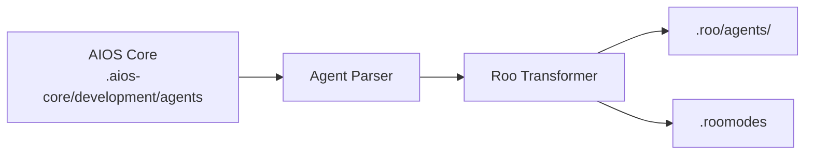

# AIOS Guide for Roo Code

> **Mode-Based VS Code Extension** - Specialized Agent Modes

---

## Overview

### What is Roo Code?

Roo Code is a VS Code extension that uses a mode-based system for AI assistance. Each mode provides specialized context and capabilities, making it easy to switch between different types of tasks.

### Why use AIOS with Roo Code?

Roo Code offers a unique mode-based approach:

- **Mode System**: Dedicated modes for each agent type
- **VS Code Extension**: Works in your existing environment
- **Quick Switching**: Fast mode changes via status bar
- **Custom Modes**: Create specialized workflows
- **Context Awareness**: Modes maintain relevant context

### Comparison with Other Platforms

| Feature | Roo Code | Cline | Cursor |
|---------|:--------:|:-----:|:------:|
| Mode System | Yes | No | No |
| VS Code Extension | Yes | Yes | No |
| Agent Activation | Mode Selector | @mention | @mention |
| MCP Support | No | Limited | Config |

---

## Requirements

### System Requirements

| Requirement | Minimum | Recommended |
|-------------|---------|-------------|
| **VS Code** | 1.80+ | Latest |
| **RAM** | 4GB | 8GB+ |
| **Node.js** | 18.0+ (for AIOS) | 20.0+ |

### Account Requirements

- **API Key**: Anthropic, OpenAI, or other supported providers
- **Roo Code License** (if applicable)

---

## Installation

### Step 1: Install VS Code

Download from [code.visualstudio.com](https://code.visualstudio.com).

### Step 2: Install Roo Code Extension

1. Open VS Code Extensions (`Cmd/Ctrl + Shift + X`)
2. Search "Roo Code" by RooVeterinaryInc
3. Click Install

Or via command line:
```bash
code --install-extension RooVeterinaryInc.roo-cline
```

### Step 3: Configure API Key

1. Open Roo Code settings
2. Enter your API key
3. Select preferred model

### Step 4: Install AIOS

```bash
cd your-project
npx @anthropic/aios init
# Select "Roo Code" when prompted
```

### Step 5: Verify Installation

```bash
ls -la .roo/
```

Expected structure:
```
.roo/
├── rules.md           # Main rules
├── agents/            # Agent definitions
│   ├── dev.md
│   ├── qa.md
│   └── ...
└── .roomodes          # Mode definitions
```

---

## Configuration

### Rules File

**Location:** `.roo/rules.md`

```markdown
# Synkra AIOS Rules for Roo Code

## Agent System
- Use the mode selector to switch agents
- Each mode corresponds to an AIOS agent

## Development Standards
- Write clean, tested code
- Follow existing patterns
```

### Mode Definitions

**Location:** `.roomodes`

```json
{
  "modes": [
    {
      "id": "bmad-dev",
      "name": "Developer",
      "description": "Full-stack development mode",
      "rulesFile": ".roo/agents/dev.md"
    },
    {
      "id": "bmad-qa",
      "name": "QA Engineer",
      "description": "Quality assurance mode",
      "rulesFile": ".roo/agents/qa.md"
    },
    {
      "id": "bmad-architect",
      "name": "Architect",
      "description": "System design mode",
      "rulesFile": ".roo/agents/architect.md"
    }
  ]
}
```

### Agent Files

**Location:** `.roo/agents/`

```markdown
# Developer Mode

## Role
You are a Senior Full Stack Developer.

## Expertise
- TypeScript/JavaScript
- Node.js, React
- Database design
- API development

## Workflow
1. Understand requirements
2. Plan implementation
3. Write clean code
4. Test thoroughly
```

---

## Basic Usage

### Starting Roo Code

1. Open VS Code with your project
2. Roo Code loads automatically
3. Look for mode selector in status bar

### Switching Modes

**Via Status Bar:**
1. Click mode indicator in status bar
2. Select desired mode from list
3. Mode context loads immediately

**Via Command Palette:**
1. `Cmd/Ctrl + Shift + P`
2. Type "Roo: Switch Mode"
3. Select mode

### Built-in Modes

Roo Code ships with several built-in modes:

| Mode | Purpose |
|------|---------|
| **Code** | General-purpose coding tasks |
| **Architect** | Planning and technical leadership |
| **Ask** | Answering questions and providing information |
| **Debug** | Systematic problem diagnosis |
| **Orchestrator** | Coordinating multi-step workflows |

### AIOS Custom Modes

| Mode | Agent | Purpose |
|------|-------|---------|
| `aios-dev` | Developer | Full-stack development |
| `aios-qa` | QA | Quality assurance |
| `aios-architect` | Architect | System design |
| `aios-pm` | PM | Project management |
| `aios-po` | PO | Product ownership |
| `aios-analyst` | Analyst | Business analysis |

### Example Interactions

```
# In Developer mode:
Implement the user authentication feature

# In QA mode:
Review this code for security vulnerabilities

# In Architect mode:
Design the microservices architecture
```

---

## Advanced Usage

### Custom Modes

Create specialized modes:

```json
{
  "modes": [
    {
      "id": "custom-api",
      "name": "API Developer",
      "description": "Specialized API development",
      "rulesFile": ".roo/custom/api-rules.md"
    }
  ]
}
```

### Mode Context Files

Each mode can have dedicated context:

```
.roo/
├── agents/
│   ├── dev.md
│   └── qa.md
└── context/
    ├── dev-context.md    # Additional dev context
    └── qa-context.md     # Additional QA context
```

### Mode Switching Shortcuts

Configure keyboard shortcuts:

```json
{
  "keybindings": [
    {
      "key": "ctrl+shift+1",
      "command": "roo.switchMode",
      "args": "bmad-dev"
    },
    {
      "key": "ctrl+shift+2",
      "command": "roo.switchMode",
      "args": "bmad-qa"
    }
  ]
}
```

### Auto-Apply Changes

Configure automatic change application:

```json
{
  "roo.autoApply": {
    "enabled": true,
    "modes": ["bmad-dev"]
  }
}
```

---

## Roo Code-Specific Features

### Mode Indicator

The status bar shows:
- Current mode name
- Mode icon
- Quick-switch access

### Mode Presets

Create mode presets for common workflows:

```json
{
  "presets": {
    "feature-development": {
      "startMode": "bmad-architect",
      "sequence": ["bmad-architect", "bmad-dev", "bmad-qa"]
    }
  }
}
```

### Context Inheritance

Modes can inherit from base:

```json
{
  "id": "bmad-dev-react",
  "extends": "bmad-dev",
  "additionalRules": ".roo/react-rules.md"
}
```

---

## Agent Synchronization

### How It Works



### Sync Commands

```bash
# Sync all agents
npm run sync:agents

# Sync for Roo Code
npm run sync:agents -- --ide roo-code
```

### Agent Format

Roo Code uses plain markdown:

```markdown
# Developer Agent

**Mode ID:** bmad-dev
**Activation:** Mode selector

## Persona
Senior Full Stack Developer with expertise in modern web technologies.

## Capabilities
- Frontend development (React, Vue)
- Backend development (Node.js, Python)
- Database design (PostgreSQL, MongoDB)
- API development (REST, GraphQL)

## Workflow
1. Review requirements and acceptance criteria
2. Plan implementation approach
3. Write clean, tested code
4. Update documentation
```

---

## Known Limitations

### Current Limitations

| Limitation | Workaround |
|------------|------------|
| No MCP support | Use other tools |
| VS Code only | No standalone |
| Manual mode switching | Use shortcuts |
| Limited context window | Selective context |

### Roo Code vs Cline

| Aspect | Roo Code | Cline |
|--------|----------|-------|
| Agent System | Modes | @mention |
| MCP | No | Limited |
| Auto-apply | Configurable | Approval |

---

## Troubleshooting

### Common Issues

#### Modes Not Loading
```
Issue: Custom modes not appearing
```
**Solution:**
1. Check `.roomodes` file exists and is valid JSON
2. Reload VS Code window
3. Verify agent files exist

#### Mode Context Not Applied
```
Issue: Mode rules not being followed
```
**Solution:**
1. Check rules file path in `.roomodes`
2. Verify rules file content
3. Switch modes to refresh

#### Extension Not Working
```
Issue: Roo Code not responding
```
**Solution:**
1. Check API key is configured
2. Verify model is available
3. Reinstall extension

### Logs

```bash
# VS Code Output panel
View > Output > Roo Code

# Developer Tools
Help > Toggle Developer Tools > Console
```

---

## FAQ

**Q: How is Roo Code different from Cline?**
A: Roo Code uses a mode-based system where you switch contexts, while Cline uses @mentions within a single context.

**Q: Can I use multiple modes at once?**
A: No, only one mode is active at a time, but you can quickly switch between them.

**Q: Are custom modes persistent?**
A: Yes, custom modes defined in `.roomodes` persist with your project.

---

## Migration

### From Cline to Roo Code

1. Install AIOS for Roo Code:
   ```bash
   npx @anthropic/aios init --ide roo-code
   ```
2. Agents convert to modes automatically

### From Roo Code to Cursor

1. AIOS agents in `.aios-core/` are portable
2. Initialize for Cursor:
   ```bash
   npx @anthropic/aios init --ide cursor
   ```

---

## Additional Resources

- [Roo Code Documentation](https://docs.roocode.com/)
- [VS Code Marketplace](https://marketplace.visualstudio.com/items?itemName=RooVeterinaryInc.roo-cline)
- [GitHub Repository](https://github.com/RooCodeInc/Roo-Code)
- [Discord Community](https://discord.gg/roocode)
- [AIOS Platform Guide](../README.md)

---

*Synkra AIOS - Roo Code Platform Guide v1.0*
