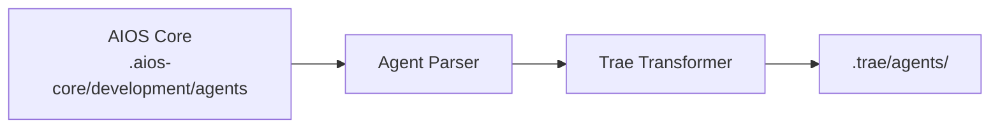

# AIOS Guide for Trae

> **ByteDance's AI Code Editor** - Fast Iteration Development

---

## Overview

### What is Trae?

Trae (The Real AI Engineer) is an AI-powered code editor developed by ByteDance. Built on the VS Code foundation, it combines a sleek interface with powerful AI capabilities, focusing on speed and developer experience. Trae integrates Claude 3.7 Sonnet and GPT-4o models, both currently available for free.

### Why use AIOS with Trae?

Trae offers a modern development experience:

- **Modern UI**: Clean, fast interface
- **@mention Activation**: Standard agent activation
- **Fast Iteration**: Quick feedback loops
- **Builder Mode**: Focused development environment
- **Project Rules**: Custom project configuration
- **Limited MCP**: Basic extensibility

### Comparison with Other Platforms

| Feature | Trae | Cursor | Claude Code |
|---------|:----:|:------:|:-----------:|
| Modern UI | Yes | Yes | No |
| @mention Activation | Yes | Yes | /command |
| Builder Mode | Yes | Composer | Task Tool |
| MCP Support | Limited | Config | Native |
| Speed Focus | Yes | Moderate | Moderate |

---

## Requirements

### System Requirements

| Requirement | Minimum | Recommended |
|-------------|---------|-------------|
| **RAM** | 4GB | 8GB+ |
| **Disk Space** | 500MB | 1GB+ |
| **OS** | macOS 11+, Windows 10+, Linux | Latest |
| **Node.js** | 18.0+ (for AIOS) | 20.0+ |

### Account Requirements

- **Trae Account** (completely free)
- Built-in access to Claude 3.7 Sonnet and GPT-4o at no cost
- No API keys required for basic usage

---

## Installation

### Step 1: Install Trae

1. Download from [trae.ai](https://trae.ai)
2. Run the installer
3. Launch and create account

```bash
# macOS (if Homebrew cask available)
brew install --cask trae

# Or download from website
```

### Step 2: Install AIOS

```bash
cd your-project
npx @anthropic/aios init
# Select "Trae" when prompted
```

### Step 3: Verify Installation

```bash
ls -la .trae/
```

Expected structure:
```
.trae/
├── rules.md           # Main rules
├── agents/            # Agent definitions
│   ├── dev.md
│   ├── qa.md
│   └── ...
└── settings.json      # Local settings
```

---

## Configuration

### Rules File

**Location:** `.trae/rules.md`

```markdown
# Synkra AIOS Rules for Trae

## Agent System
- Use @agent-name to activate agents
- Follow agent workflows

## Development Standards
- Write clean, tested code
- Follow existing patterns
- Fast iteration focus
```

### Agent Files

**Location:** `.trae/agents/`

```markdown
# Developer Agent (@dev)

## Role
Senior Full Stack Developer

## Expertise
- TypeScript/JavaScript
- Node.js, React
- Fast prototyping
- Clean code practices

## Workflow
1. Understand requirements quickly
2. Prototype solution
3. Iterate based on feedback
4. Polish and test
```

### Settings

**Location:** `.trae/settings.json`

```json
{
  "ai": {
    "model": "default",
    "temperature": 0.7
  },
  "rules": {
    "enabled": true,
    "path": ".trae/rules.md"
  },
  "builder": {
    "autoSave": true,
    "previewOnSave": true
  }
}
```

---

## Basic Usage

### Starting Trae

1. Open your project in Trae
2. Rules load automatically from `.trae/rules.md`
3. Use the AI panel for interactions

### Activating Agents

Use @mentions in chat:

```
@dev         # Developer agent
@qa          # QA Engineer agent
@architect   # Software Architect
@pm          # Project Manager
@analyst     # Business Analyst
@devops      # DevOps Engineer
```

### Example Interactions

```
@dev quickly prototype a user login form

@qa do a quick security review of auth module

@architect sketch the API architecture
```

### Builder Mode

Trae's focused development mode:

1. Press `Cmd/Ctrl + B` to enter Builder
2. Describe what you want to build
3. Iterate with real-time preview
4. Exit with changes applied

```
# In Builder mode
@dev Create a responsive navigation component
- Mobile hamburger menu
- Desktop full navigation
- Smooth transitions
```

---

## Advanced Usage

### Fast Iteration Workflow

```
@dev Let's iterate on the checkout flow:
1. First, show me a basic form
2. Add validation
3. Connect to API
4. Add loading states
```

### Inline Suggestions

Trae provides fast inline suggestions:
1. Start typing code
2. See instant suggestions
3. Tab to accept
4. Continue typing for new suggestions

### Context Providers

Add context to requests:

```
@dev Looking at src/components/,
create a new Button component following the same patterns

@qa Based on existing tests,
add tests for the new Button component
```

### Project Rules Integration

Layer rules for complex projects:

```
.trae/
├── rules.md              # Global rules
├── rules/
│   ├── frontend.md       # Frontend-specific
│   ├── backend.md        # Backend-specific
│   └── testing.md        # Testing rules
└── agents/
```

---

## Trae-Specific Features

### Builder Mode

| Feature | Description |
|---------|-------------|
| **Real-time Preview** | See changes instantly |
| **Iterative Building** | Quick feedback loops |
| **Component Focus** | Build one thing at a time |
| **Auto-Save** | Never lose work |

### Keyboard Shortcuts

| Shortcut | Action |
|----------|--------|
| `Cmd/Ctrl + B` | Toggle Builder Mode |
| `Cmd/Ctrl + I` | Open AI Chat |
| `Cmd/Ctrl + .` | Quick Actions |
| `Tab` | Accept suggestion |
| `Escape` | Cancel/Close |

### Speed Features

| Feature | Description |
|---------|-------------|
| **Instant Preview** | Changes render immediately |
| **Smart Caching** | Fast repeat operations |
| **Parallel Processing** | Multiple operations at once |

---

## Agent Synchronization

### How It Works



### Sync Commands

```bash
# Sync all agents
npm run sync:agents

# Sync for Trae
npm run sync:agents -- --ide trae
```

### Agent Format

Trae uses project-rules format:

```markdown
# Developer Agent

**Activation:** @dev

## Persona
Fast-moving Full Stack Developer focused on rapid iteration.

## Expertise
- TypeScript/JavaScript
- React, Vue, Svelte
- Node.js, Deno
- Rapid prototyping

## Approach
- Start simple, iterate quickly
- Show working code fast
- Refine based on feedback
- Keep momentum

## Response Style
- Concise explanations
- Working code first
- Quick iterations
- Clear next steps
```

---

## Known Limitations

### Current Limitations

| Limitation | Workaround |
|------------|------------|
| Limited MCP | Use basic integrations |
| Newer platform | Growing feature set |
| Smaller community | Use official docs |

### Trae vs Cursor

| Aspect | Trae | Cursor |
|--------|------|--------|
| Focus | Speed | Features |
| UI | Modern | VS Code-like |
| MCP | Limited | Config |
| Maturity | Newer | Established |

---

## Troubleshooting

### Common Issues

#### Rules Not Loading
```
Issue: Agent not responding
```
**Solution:**
1. Check `.trae/rules.md` exists
2. Verify syntax
3. Reload Trae

#### Builder Mode Issues
```
Issue: Builder not previewing
```
**Solution:**
1. Check file type is supported
2. Verify preview server running
3. Restart Builder mode

#### Slow Performance
```
Issue: Suggestions taking too long
```
**Solution:**
1. Check network connection
2. Reduce context size
3. Close unused panels

### Logs

```bash
# Trae logs location
# macOS: ~/Library/Application Support/Trae/logs/
# Windows: %APPDATA%\Trae\logs\
# Linux: ~/.config/Trae/logs/
```

---

## FAQ

**Q: What makes Trae different?**
A: Trae focuses on speed and fast iteration, with a modern UI designed for quick development cycles.

**Q: Is Trae free?**
A: Yes, Trae is completely free with no hidden costs. It includes free access to Claude 3.7 Sonnet and GPT-4o models.

**Q: Can I use external models?**
A: Limited support for external API keys.

**Q: How mature is Trae?**
A: Newer platform, actively developed with growing features.

---

## Migration

### From Cursor to Trae

1. Install AIOS for Trae:
   ```bash
   npx @anthropic/aios init --ide trae
   ```
2. Agents transform to Trae format

### From Trae to Other IDEs

1. AIOS agents in `.aios-core/` are portable
2. Initialize for target IDE
3. Agents transform automatically

---

## Additional Resources

- [Trae Official Website](https://www.trae.ai/)
- [Trae IDE Download](https://traeide.com/)
- [Trae Agent (GitHub)](https://github.com/bytedance/trae-agent)
- [AIOS Platform Guide](../README.md)

> **Note:** Trae is developed by ByteDance. As a fork of VS Code, most VS Code extensions are compatible.

---

*Synkra AIOS - Trae Platform Guide v1.0*
