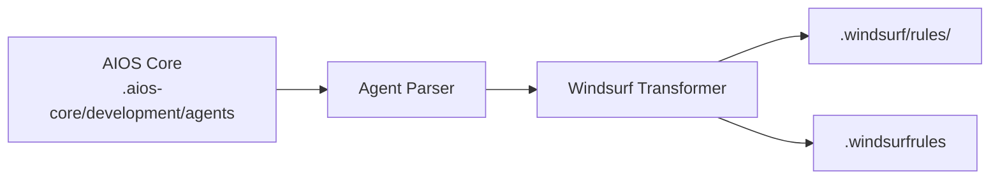

# AIOS Guide for Windsurf

> **AI-Powered Development Environment** - Cascade Flow Innovation

---

## Overview

### What is Windsurf?

Windsurf is an AI-powered development environment that introduces "Cascade" - an innovative approach to AI-assisted coding that maintains context across multiple interactions and files. Built for developers who want deep AI integration in their workflow.

### Why use AIOS with Windsurf?

Windsurf offers unique capabilities for AIOS:

- **Cascade Flow**: Maintains context across complex operations
- **@mention Activation**: Natural agent activation syntax
- **Supercomplete**: Advanced code completion
- **Flows System**: Automated workflow execution
- **MCP Support**: Extensible via configuration
- **XML-tagged Format**: Structured rules processing

### Comparison with Other Platforms

| Feature | Windsurf | Cursor | Claude Code |
|---------|:--------:|:------:|:-----------:|
| Cascade Flow | Yes | No | No |
| @mention Activation | Yes | Yes | /command |
| Supercomplete | Yes | Tab | Tab |
| MCP Support | Config | Config | Native |
| XML Rules Format | Yes | No | No |

---

## Requirements

### System Requirements

| Requirement | Minimum | Recommended |
|-------------|---------|-------------|
| **RAM** | 4GB | 8GB+ |
| **Disk Space** | 500MB | 1GB+ |
| **OS** | macOS 10.15+, Windows 10+, Linux | Latest |
| **Node.js** | 18.0+ (for AIOS) | 20.0+ |

### Account Requirements

- **Windsurf Account** (free tier available)
- **API Keys** (optional): Configure external models

---

## Installation

### Step 1: Install Windsurf

1. Download from [codeium.com/windsurf](https://codeium.com/windsurf)
2. Run the installer
3. Launch and create account

```bash
# macOS (via Homebrew if available)
brew install --cask windsurf

# Or download directly
```

### Step 2: Install AIOS

```bash
cd your-project
npx @anthropic/aios init
# Select "Windsurf" when prompted
```

### Step 3: Verify Installation

```bash
ls -la .windsurfrules
ls -la .windsurf/
```

Expected structure:
```
project/
├── .windsurfrules          # Main rules file
└── .windsurf/
    └── rules/              # Agent rules
        ├── dev.md
        ├── qa.md
        └── ...
```

---

## Configuration

### Main Rules File

**Location:** `.windsurfrules` (root directory)

This file uses XML-tagged markdown format:

```markdown
<rules>
# Synkra AIOS Development Rules

## Agent Integration
- Use @agent-name to activate agents
- Follow agent-specific workflows

## Development Standards
- Write clean, tested code
- Follow project conventions
</rules>

<context>
Project-specific context goes here
</context>
```

### Agent Rules

**Location:** `.windsurf/rules/`

Each agent file follows the XML-tagged format:

```markdown
<agent name="dev">
# Developer Agent

## Expertise
- Full-stack development
- Clean code practices

## Workflow
1. Understand requirements
2. Plan implementation
3. Write tested code
</agent>
```

### MCP Configuration

```json
{
  "mcpServers": {
    "filesystem": {
      "command": "npx",
      "args": ["-y", "@modelcontextprotocol/server-filesystem", "."]
    }
  }
}
```

---

## Basic Usage

### Starting Windsurf

1. Open your project in Windsurf
2. Rules are loaded automatically from `.windsurfrules`
3. Use the AI panel for interactions

### Activating Agents

Use @mentions in the AI chat:

```
@dev         # Developer agent
@qa          # QA Engineer agent
@architect   # Software Architect
@pm          # Project Manager
@po          # Product Owner
@sm          # Scrum Master
@analyst     # Business Analyst
@devops      # DevOps Engineer
```

### Example Interactions

```
@dev implement the user authentication following the story

@qa review this module for security vulnerabilities

@architect design the API gateway architecture
```

### Using Cascade

Cascade maintains context across interactions:

```
# First interaction
@dev Create a user model with validation

# Cascade remembers context
Now add the repository layer

# Continues with same context
Add unit tests for the repository
```

---

## Advanced Usage

### Cascade Workflows

#### Multi-step Implementation
```
@dev @cascade
1. Create the database schema
2. Generate migrations
3. Implement the model layer
4. Add API endpoints
5. Write integration tests
```

#### Complex Refactoring
```
@architect @cascade
Refactor the payment module:
- Extract interfaces
- Implement strategy pattern
- Update all consumers
- Maintain backward compatibility
```

### Supercomplete

Windsurf's advanced completion:

1. Start typing code
2. Wait for Supercomplete suggestions
3. Tab to accept, Escape to dismiss
4. Supercomplete considers full file context

### Flows

Automated workflow execution:

```yaml
# .windsurf/flows/deploy.yaml
name: Deploy Flow
steps:
  - run: npm test
  - run: npm run build
  - run: npm run deploy
```

### Context Tags

Use XML tags for structured context:

```markdown
<context type="database">
Using PostgreSQL 14 with Prisma ORM
</context>

<context type="api">
RESTful API with Express.js
</context>
```

---

## Windsurf-Specific Features

### Cascade Panel

| Feature | Description |
|---------|-------------|
| **Context Memory** | Remembers across interactions |
| **File Tracking** | Tracks modified files |
| **Diff View** | Shows all changes |
| **Rollback** | Undo cascade changes |

### Keyboard Shortcuts

| Shortcut | Action |
|----------|--------|
| `Cmd/Ctrl + I` | Open AI panel |
| `Cmd/Ctrl + Shift + I` | Cascade mode |
| `Tab` | Accept Supercomplete |
| `Escape` | Dismiss suggestion |
| `Cmd/Ctrl + Z` | Undo cascade step |

### XML Rule Tags

| Tag | Purpose |
|-----|---------|
| `<rules>` | Main rules section |
| `<context>` | Project context |
| `<agent>` | Agent definition |
| `<patterns>` | Code patterns |
| `<constraints>` | Limitations |

---

## Agent Synchronization

### How It Works



### Sync Commands

```bash
# Sync all agents
npm run sync:agents

# Sync with Windsurf format
npm run sync:agents -- --ide windsurf
```

### Agent Format

Windsurf agents use XML-tagged markdown:

```markdown
<agent name="dev" activation="@dev">
# Developer Agent

<role>
Senior Full Stack Developer
</role>

<expertise>
- TypeScript/JavaScript
- Node.js, React
- Database design
</expertise>

<workflow>
1. Read story requirements
2. Plan implementation
3. Write clean code
4. Test thoroughly
</workflow>
</agent>
```

---

## Known Limitations

### Current Limitations

| Limitation | Workaround |
|------------|------------|
| No native CLI | Use GUI or integrate with terminal |
| Cascade context limits | Break into smaller cascades |
| Limited MCP | Configuration-based only |

### Windsurf vs Cursor

| Aspect | Windsurf | Cursor |
|--------|----------|--------|
| Flow | Cascade | Composer |
| Format | XML-tagged | Markdown |
| Completion | Supercomplete | Tab |

---

## Troubleshooting

### Common Issues

#### Rules Not Loading
```
Issue: .windsurfrules not recognized
```
**Solution:**
1. Verify file is in project root
2. Check XML syntax is valid
3. Restart Windsurf

#### Cascade Lost Context
```
Issue: Cascade forgets previous context
```
**Solution:**
1. Use `@cascade` explicitly
2. Keep cascades focused
3. Check context limits

#### Agent Not Activating
```
Issue: @dev not recognized
```
**Solution:**
```bash
# Resync agents
npm run sync:agents

# Check format
cat .windsurf/rules/dev.md
```

### Logs Location

```bash
# macOS
~/Library/Application Support/Windsurf/logs/

# Windows
%APPDATA%\Windsurf\logs\

# Linux
~/.config/Windsurf/logs/
```

---

## FAQ

**Q: What is Cascade?**
A: Cascade is Windsurf's AI feature that maintains context across multiple interactions, enabling complex multi-step operations.

**Q: How is Windsurf different from Cursor?**
A: Windsurf uses Cascade for continuous context, while Cursor uses Composer. Windsurf also uses XML-tagged rules format.

**Q: Can I use Windsurf offline?**
A: Basic editing works offline, but AI features require internet.

---

## Migration

### From Cursor to Windsurf

1. Export Cursor rules:
   ```bash
   cp .cursor/rules.md cursor-backup.md
   ```

2. Initialize AIOS for Windsurf:
   ```bash
   npx @anthropic/aios init --ide windsurf
   ```

3. Rules automatically convert to XML-tagged format

### From Windsurf to Other IDEs

1. AIOS agents in `.aios-core/` are IDE-independent
2. Initialize for target IDE
3. Agents transform automatically

---

## Additional Resources

- [Windsurf Documentation](https://codeium.com/windsurf/docs)
- [Codeium Community](https://discord.gg/codeium)
- [AIOS Platform Guide](../README.md)

---

*Synkra AIOS - Windsurf Platform Guide v1.0*
