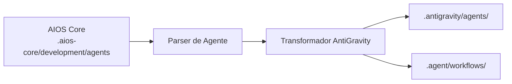

# Guia AIOS para AntiGravity

> 🌐 [EN](../../platforms/antigravity.md) | **PT** | [ES](../../es/platforms/antigravity.md)

---

> **Plataforma de Desenvolvimento Agêntico do Google** - Arquitetura Baseada em Workflows

---

## Visão Geral

### O que é o AntiGravity?

AntiGravity é a plataforma de desenvolvimento agêntico do Google que permite que desenvolvedores construam e orquestrem workflows com IA. Ele apresenta uma abordagem única baseada em workflows para ativação de agentes e integração profunda com serviços do Google Cloud.

### Por que usar AIOS com AntiGravity?

O AntiGravity oferece capacidades distintas:

- **Sistema de Workflows**: Orquestre interações complexas de agentes
- **Integração Google Cloud**: Firebase nativo, serviços GCP
- **MCP Nativo**: Suporte integrado ao Model Context Protocol
- **Ativação @mention**: Ativação padrão de agentes
- **Workflows Multi-Agente**: Encadeie agentes juntos

### Comparação com Outras Plataformas

| Recurso | AntiGravity | Claude Code | Cursor |
|---------|:-----------:|:-----------:|:------:|
| Sistema de Workflow | Sim | Task Tool | Composer |
| Google Cloud Nativo | Sim | Não | Não |
| Suporte MCP | Nativo | Nativo | Config |
| Encadeamento de Agentes | Sim | Subagentes | Não |

---

## Requisitos

### Requisitos de Sistema

| Requisito | Mínimo | Recomendado |
|-----------|--------|-------------|
| **RAM** | 4GB | 8GB+ |
| **Espaço em Disco** | 1GB | 2GB+ |
| **Node.js** | 18.0+ | 20.0+ |

### Requisitos de Conta

- **Conta Google Cloud**
- **Acesso AntiGravity** (via Google AI)
- **Projeto Firebase** (opcional, para integrações)

---

## Instalação

### Passo 1: Instalar o AntiGravity

```bash
# Instalar via npm
npm install -g @google/antigravity

# Ou usar o instalador do Google
curl -fsSL https://get.antigravity.dev | sh
```

### Passo 2: Autenticar

```bash
# Login com conta Google
antigravity auth login

# Ou configurar service account
export GOOGLE_APPLICATION_CREDENTIALS="caminho/para/credentials.json"
```

### Passo 3: Instalar o AIOS

```bash
cd seu-projeto
npx @anthropic/aios init
# Selecione "AntiGravity" quando solicitado
```

### Passo 4: Verificar a Instalação

```bash
ls -la .antigravity/
ls -la .agent/
```

Estrutura esperada:
```
projeto/
├── .antigravity/
│   ├── rules.md              # Regras principais
│   ├── antigravity.json      # Configuração
│   └── agents/               # Definições de agentes
└── .agent/
    └── workflows/            # Definições de workflow
        ├── dev-workflow.yaml
        ├── qa-workflow.yaml
        └── ...
```

---

## Configuração

### Configuração Principal

**Localização:** `.antigravity/antigravity.json`

```json
{
  "version": "1.0",
  "project": "nome-do-seu-projeto",
  "agents": {
    "default": "dev",
    "available": ["dev", "qa", "architect", "pm", "po", "analyst"]
  },
  "workflows": {
    "directory": ".agent/workflows"
  },
  "mcp": {
    "enabled": true,
    "servers": ["filesystem", "firebase"]
  }
}
```

### Arquivo de Regras

**Localização:** `.antigravity/rules.md`

```markdown
# Regras Synkra AIOS para AntiGravity

## Sistema de Agentes
- Use @nome-agente ou workflows para ativação
- Siga definições de workflow para tarefas complexas

## Padrões de Desenvolvimento
- Escreva código limpo e testado
- Siga padrões existentes
- Inclua tratamento abrangente de erros
```

### Definições de Workflow

**Localização:** `.agent/workflows/`

```yaml
# dev-workflow.yaml
name: Workflow do Desenvolvedor
trigger: "@dev"
agent: dev
steps:
  - name: analyze
    action: read_story
    input: "${story_path}"
  - name: implement
    action: write_code
    context: "${analyze.output}"
  - name: test
    action: run_tests
```

---

## Uso Básico

### Iniciando o AntiGravity

```bash
# Iniciar no projeto atual
antigravity start

# Iniciar com workflow específico
antigravity run dev-workflow
```

### Ativando Agentes

**Via @mention:**
```
@dev implemente a feature de autenticação de usuário

@qa revise este módulo para problemas de segurança

@architect projete o API gateway
```

**Via Workflow:**
```bash
antigravity workflow run dev --input "implementar feature de auth"
```

### Comandos de Agente

```
*help              # Mostrar comandos disponíveis
*workflow list     # Listar workflows disponíveis
*workflow run X    # Executar workflow X
*exit              # Sair do agente atual
```

---

## Uso Avançado

### Orquestração de Workflow

Crie workflows multi-agente complexos:

```yaml
# feature-implementation.yaml
name: Implementação de Feature
description: Feature completa da story ao deployment

stages:
  - name: planning
    agent: architect
    steps:
      - analyze_requirements
      - create_design_doc

  - name: implementation
    agent: dev
    depends_on: planning
    steps:
      - implement_feature
      - write_tests

  - name: quality
    agent: qa
    depends_on: implementation
    steps:
      - run_tests
      - security_review

  - name: documentation
    agent: dev
    depends_on: quality
    steps:
      - update_docs
      - create_changelog
```

### Integração MCP

O AntiGravity tem suporte MCP nativo:

```json
{
  "mcp": {
    "servers": {
      "filesystem": {
        "enabled": true
      },
      "firebase": {
        "enabled": true,
        "project": "seu-projeto-firebase"
      },
      "bigquery": {
        "enabled": true,
        "dataset": "seu-dataset"
      }
    }
  }
}
```

### Serviços Google Cloud

Integração direta com GCP:

```
@dev Faça deploy desta função para Cloud Functions

@devops Configure Cloud Run para este serviço

@architect Projete usando Firestore para armazenamento de dados
```

### Encadeamento de Agentes

Encadeie múltiplos agentes em um workflow:

```yaml
chain:
  - agent: analyst
    task: "Analisar requisitos"
    output: requirements

  - agent: architect
    task: "Projetar solução"
    input: "${requirements}"
    output: design

  - agent: dev
    task: "Implementar solução"
    input: "${design}"
```

---

## Recursos Específicos do AntiGravity

### Dashboard de Workflow

Acesse o editor visual de workflow:
```bash
antigravity dashboard
```

### Integração Firebase

```yaml
# Use Firebase em workflows
firebase:
  firestore:
    collection: "projects/${project_id}/tasks"
  storage:
    bucket: "project-assets"
```

### Cloud Functions

Faça deploy de funções com agentes:

```javascript
// functions/agent-handler.js
const { AntiGravity } = require('@google/antigravity');

exports.handleRequest = AntiGravity.createFunction({
  agent: 'dev',
  workflow: 'code-review'
});
```

---

## Sincronização de Agentes

### Como Funciona



### Comandos de Sincronização

```bash
# Sincronizar todos os agentes e workflows
npm run sync:ide

# Sincronizar para AntiGravity
npm run sync:ide -- --ide antigravity
```

### Formato de Agente

O AntiGravity usa um formato híbrido:

```yaml
# .antigravity/agents/dev.yaml
name: dev
displayName: Desenvolvedor
description: Desenvolvedor Full Stack Sênior

persona:
  role: Desenvolvedor Full Stack
  expertise:
    - TypeScript/JavaScript
    - Node.js, React
    - Design de banco de dados
    - Deploy em nuvem

workflow:
  default: dev-workflow
  triggers:
    - "@dev"
    - "desenvolver"
    - "implementar"
```

---

## Limitações Conhecidas

### Limitações Atuais

| Limitação | Solução Alternativa |
|-----------|---------------------|
| Conta Google necessária | Use service accounts |
| Configuração complexa de workflow | Use templates |
| Suporte limitado a IDEs | Foco em CLI |

### AntiGravity vs Claude Code

| Aspecto | AntiGravity | Claude Code |
|---------|-------------|-------------|
| Sistema de Workflow | Nativo | Task Tool |
| Cloud Nativo | Google | Qualquer |
| MCP | Nativo | Nativo |
| CLI | Sim | Sim |

---

## Troubleshooting

### Problemas Comuns

#### Falha de Autenticação
```
Error: Unable to authenticate
```
**Solução:**
```bash
antigravity auth logout
antigravity auth login
```

#### Workflow Não Encontrado
```
Error: Workflow 'xyz' not found
```
**Solução:**
```bash
# Listar workflows disponíveis
antigravity workflow list

# Verificar diretório de workflows
ls .agent/workflows/
```

#### Agente Não Reconhecido
```
Error: Unknown agent '@xyz'
```
**Solução:**
```bash
# Ressincronizar agentes
npm run sync:ide

# Verificar config do agente
cat .antigravity/antigravity.json
```

### Logs

```bash
# Ver logs do AntiGravity
antigravity logs

# Modo verbose
antigravity --verbose start
```

---

## FAQ

**P: Preciso do Google Cloud?**
R: Recursos básicos funcionam sem ele, mas integração completa requer conta GCP.

**P: Posso usar modelos não-Google?**
R: AntiGravity usa principalmente modelos do Google, mas algumas configurações permitem modelos externos.

**P: Qual a diferença entre agentes e workflows?**
R: Agentes são personas com expertise; workflows orquestram ações de agentes em sequências.

---

## Migração

### Do Claude Code para AntiGravity

1. Seus agentes em `.aios-core/` são portáveis
2. Inicialize AntiGravity:
   ```bash
   npx @anthropic/aios init --ide antigravity
   ```
3. Arquivos de workflow são gerados automaticamente

### Do AntiGravity para Outras IDEs

1. Agentes AIOS permanecem em `.aios-core/`
2. Inicialize para a IDE de destino
3. Configs específicas da plataforma são geradas

---

## Recursos Adicionais

- [Documentação AntiGravity](https://cloud.google.com/antigravity/docs)
- [Google Cloud AI](https://cloud.google.com/ai)
- [Integração Firebase](https://firebase.google.com)

---

*Synkra AIOS - Guia da Plataforma AntiGravity v1.0*
