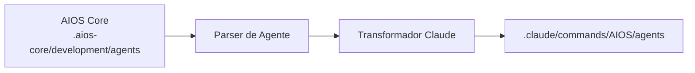

# Guia AIOS para Claude Code

> 🌐 [EN](../../platforms/claude-code.md) | **PT** | [ES](../../es/platforms/claude-code.md)

---

> **CLI Oficial da Anthropic** - Plataforma Recomendada para AIOS

---

## Visão Geral

### O que é o Claude Code?

Claude Code é a interface de linha de comando oficial da Anthropic para o Claude, projetada para desenvolvedores que desejam acesso direto e poderoso às capacidades do Claude em seu terminal e fluxo de trabalho de desenvolvimento.

### Por que usar AIOS com Claude Code?

O Claude Code oferece a **melhor integração** com o AIOS devido a:

- **Suporte MCP Nativo**: Model Context Protocol integrado para extensões de ferramentas
- **Task Tool**: Criar subagentes para operações complexas de múltiplas etapas
- **Sistema de Hooks**: Hooks de pré e pós-execução para automação
- **Skills/Comandos**: Suporte nativo a comandos slash para ativação de agentes
- **Persistência de Memória**: Preservação de contexto da sessão
- **Acesso Direto a Arquivos**: Ler, escrever e editar arquivos nativamente

### Comparação com Outras Plataformas

|---------|:-----------:|:------:|:--------:|
| Suporte MCP | Nativo | Config | Config |
| Tarefas Subagente | Sim | Não | Não |
| Sistema de Hooks | Sim | Não | Não |
| Skills | Nativo | Não | Não |
| Baseado em CLI | Sim | Não | Não |

---

## Requisitos

### Requisitos de Sistema

| Requisito | Mínimo | Recomendado |
|-----------|--------|-------------|
| **Node.js** | 18.0+ | 20.0+ |
| **npm** | 9.0+ | 10.0+ |
| **Git** | 2.30+ | Última versão |
| **SO** | macOS, Linux, Windows (WSL) | macOS, Linux |

### Requisitos de API

- **Chave de API Anthropic** ou **assinatura Claude Pro/Team**
- Acesso à API habilitado para Claude Code

### Ferramentas Recomendadas

- GitHub CLI (`gh`) para operações de repositório
- Um emulador de terminal moderno (iTerm2, Warp, Alacritty)

---

## Instalação

### Passo 1: Instalar o Claude Code

**Instalação Nativa (Recomendada):**

```bash
# macOS, Linux, WSL
curl -fsSL https://claude.ai/install.sh | bash

# Windows PowerShell
irm https://claude.ai/install.ps1 | iex
```

**Métodos Alternativos:**

```bash
# Homebrew (macOS)
brew install --cask claude-code

# WinGet (Windows)
winget install Anthropic.ClaudeCode
```

> **Nota:** Instalação via NPM (`npm install -g @anthropic-ai/claude-code`) está deprecada. Use instalação nativa para atualizações automáticas.

### Passo 2: Autenticar

```bash
# Login com sua conta Anthropic
claude login

# Ou definir a chave API diretamente
export ANTHROPIC_API_KEY="sua-chave-api"
```

### Passo 3: Instalar o AIOS

```bash
# Navegue até seu projeto
cd seu-projeto

# Inicialize o AIOS
npx @anthropic/aios init

# Selecione "Claude Code" quando solicitado para IDE
```

### Passo 4: Verificar a Instalação

```bash
# Verificar tipo de instalação e versão
claude doctor

# Verificar se os arquivos AIOS foram criados
ls -la .claude/
```

Estrutura esperada:
```
.claude/
├── commands/
│   └── AIOS/
│       └── agents/        # Agentes sincronizados
├── settings.json          # Configurações locais
└── settings.local.json    # Sobrescritas locais

~/.claude/                 # Diretório de config global
~/.claude.json             # Configuração MCP global
```

---

## Configuração

### Arquivo de Configuração Principal

**Localização:** `.claude/CLAUDE.md`

Este arquivo contém:
- Contexto e regras do projeto
- Instruções de ativação de agentes
- Metodologia de desenvolvimento
- Entendimento do framework AIOS

### Variáveis de Ambiente

```bash
# Obrigatório
export ANTHROPIC_API_KEY="sk-ant-..."

# Opcional
export CLAUDE_MODEL="claude-sonnet-4-20250514"  # Modelo padrão
export CLAUDE_MAX_TOKENS="8192"                 # Máximo de tokens de resposta
export AIOS_DEBUG="true"                        # Habilitar log de debug
```

### Arquivo de Configurações

**Localização:** `.claude/settings.json`

```json
{
  "model": "claude-sonnet-4-20250514",
  "maxTokens": 8192,
  "permissions": {
    "allowedTools": ["Read", "Write", "Edit", "Bash", "Glob", "Grep"],
    "blockedCommands": ["rm -rf /", "sudo rm"]
  }
}
```

### Configuração MCP

**Localização:** `~/.claude.json` (global) ou `.claude/mcp.json` (projeto)

```json
{
  "mcpServers": {
    "filesystem": {
      "command": "npx",
      "args": ["-y", "@modelcontextprotocol/server-filesystem", "/caminho/permitido"]
    },
    "github": {
      "command": "npx",
      "args": ["-y", "@modelcontextprotocol/server-github"],
      "env": {
        "GITHUB_TOKEN": "ghp_..."
      }
    }
  }
}
```

---

## Uso Básico

### Iniciando o Claude Code

```bash
# Iniciar no diretório atual
claude

# Iniciar com contexto específico
claude --context "Trabalhando na feature X"

# Iniciar com um arquivo específico
claude --file src/main.ts
```

### Ativando Agentes AIOS

Os agentes são ativados usando comandos slash:

```
/dev         # Agente Desenvolvedor
/qa          # Agente Engenheiro de QA
/architect   # Agente Arquiteto de Software
/pm          # Agente Gerente de Projeto
/po          # Agente Product Owner
/sm          # Agente Scrum Master
/analyst     # Agente Analista de Negócios
/devops      # Agente Engenheiro DevOps
```

### Sintaxe de Comando de Agente

```
/nome-agente [descrição da tarefa]

# Exemplos
/dev implemente a feature de login seguindo a story
/qa revise o módulo de autenticação para problemas de segurança
/architect projete o schema do banco de dados para gerenciamento de usuários
```

### Fluxos de Trabalho Comuns

#### Desenvolvimento de Feature
```
1. /pm para revisar os requisitos da story
2. /architect para projetar a solução
3. /dev para implementar a feature
4. /qa para testar a implementação
5. /dev para corrigir quaisquer problemas
```

#### Code Review
```
1. /qa revise este PR para melhores práticas
2. /dev enderece os comentários da revisão
```

#### Investigação de Bug
```
1. /analyst investigue o relatório de bug
2. /dev reproduza e corrija o problema
3. /qa verifique a correção
```

---

## Uso Avançado

### Servidores MCP

O Claude Code suporta MCP (Model Context Protocol) para capacidades estendidas:

#### Ferramentas MCP Disponíveis

| Servidor MCP | Propósito |
|--------------|-----------|
| `filesystem` | Operações de sistema de arquivos |
| `github` | Acesso à API do GitHub |
| `playwright` | Automação de navegador |
| `postgres` | Consultas de banco de dados |

#### Adicionando Servidores MCP

```bash
# Via agente DevOps
/devops
*add-mcp playwright
```

### Task Tool para Subagentes

O Claude Code pode criar subagentes para operações complexas:

```
# Criação automática de subagente
/dev implemente esta feature

# O Claude pode criar:
# - Agente Explore para análise de codebase
# - Agente Plan para decisões de arquitetura
# - Agente Bash para execução de comandos
```

### Sistema de Hooks

Crie hooks de pré e pós-execução:

**Localização:** `.claude/hooks/`

```javascript
// .claude/hooks/pre-commit.js
module.exports = {
  name: 'pre-commit',
  trigger: 'before:commit',
  execute: async (context) => {
    // Executar linting antes do commit
    await context.bash('npm run lint');
    await context.bash('npm test');
  }
};
```

### Skills Personalizadas

Crie skills/comandos reutilizáveis:

**Localização:** `.claude/commands/`

```markdown
<!-- .claude/commands/deploy.md -->
# Skill de Deploy

## Descrição
Fazer deploy da aplicação para produção

## Passos
1. Executar testes
2. Buildar a aplicação
3. Deploy para o servidor

## Comandos
```bash
npm test
npm run build
npm run deploy
```
```

### Memória e Contexto

O Claude Code mantém memória de sessão:

```
# Referenciar contexto anterior
"Como discutimos anteriormente..."

# O Claude lembra:
# - Arquivos trabalhados
# - Decisões tomadas
# - Alterações de código
# - Histórico de conversa
```

---

## Recursos Específicos do Claude Code

### Acesso Nativo a Ferramentas

| Ferramenta | Descrição | Exemplo |
|------------|-----------|---------|
| `Read` | Ler arquivos | Ler arquivos inteiros ou linhas específicas |
| `Write` | Criar arquivos | Escrever novos arquivos com conteúdo |
| `Edit` | Modificar arquivos | Encontrar e substituir texto |
| `Bash` | Executar comandos | Executar comandos shell |
| `Glob` | Encontrar arquivos | Correspondência de padrão para arquivos |
| `Grep` | Buscar conteúdo | Busca regex em arquivos |
| `Task` | Criar agentes | Operações complexas de múltiplas etapas |
| `WebFetch` | Requisições HTTP | Buscar conteúdo web |
| `WebSearch` | Buscar na web | Obter informações atuais |

### Atalhos de Teclado

| Atalho | Ação |
|--------|------|
| `Ctrl+C` | Cancelar operação atual |
| `Ctrl+D` | Sair do Claude Code |
| `Ctrl+L` | Limpar tela |
| `Cima/Baixo` | Navegar histórico |

### Linha de Status

O Claude Code mostra status em tempo real:
```
[Agent: dev] [Model: sonnet] [Tokens: 1234/8192] [Cost: $0.02]
```

---

## Sincronização de Agentes

### Como Funciona



### Comandos de Sincronização

```bash
# Sincronizar todos os agentes
npm run sync:ide

# Sincronizar agente específico
npm run sync:ide

# Forçar ressincronização
npm run sync:ide
```

### Formato de Arquivo de Agente

Agentes no Claude Code usam markdown com frontmatter YAML:

```markdown
---
name: dev
displayName: Desenvolvedor
description: Desenvolvedor Full Stack Sênior
activation: /dev
---

# Agente Desenvolvedor

## Expertise
- TypeScript/JavaScript
- Node.js
- React
- Design de banco de dados

## Fluxo de Trabalho
1. Entender requisitos
2. Planejar implementação
3. Escrever código limpo
4. Testar completamente
```

### Resolução de Conflitos

Quando conflitos ocorrem:

1. Alterações locais são salvas em `.claude/commands/AIOS/agents/.backup/`
2. Sync solicita resolução
3. Escolha: manter local, usar remoto ou mesclar

---

## Limitações Conhecidas

### Limitações Atuais

| Limitação | Solução Alternativa |
|-----------|---------------------|
| Sem GUI | Use terminal ou integre com IDE |
| Sem colaboração em tempo real | Use git para colaboração |
| Limites de taxa de API | Configure limitação de taxa nas configurações |
| Manipulação de arquivos grandes | Use streaming para arquivos grandes |

### Problemas Específicos de Plataforma

- **Windows**: Use WSL para melhor experiência
- **macOS**: Certifique-se de que as ferramentas CLI do Xcode estão instaladas
- **Linux**: Pode precisar de dependências adicionais

### Recursos em Desenvolvimento

- [ ] Colaboração em tempo real
- [ ] Ferramentas de debugging aprimoradas
- [ ] Visualizador de diff visual
- [ ] Sistema de plugins

---

## Troubleshooting

### Problemas Comuns

#### Falha de Autenticação
```
Error: Authentication failed
```
**Solução:**
```bash
# Re-autenticar
claude logout
claude login

# Ou verificar chave API
echo $ANTHROPIC_API_KEY
```

#### Servidor MCP Não Encontrado
```
Error: MCP server 'xyz' not found
```
**Solução:**
```bash
# Listar servidores MCP disponíveis
/devops
*list-mcps

# Instalar servidor faltante
*add-mcp xyz
```

#### Agente Não Reconhecido
```
Error: Unknown command '/xyz'
```
**Solução:**
```bash
# Ressincronizar agentes
npm run sync:ide

# Verificar se o agente existe
ls .claude/commands/AIOS/agents/
```

#### Permissão de Ferramenta Negada
```
Error: Permission denied for tool 'Bash'
```
**Solução:**
Atualize `.claude/settings.json`:
```json
{
  "permissions": {
    "allowedTools": ["Bash"]
  }
}
```

### Logs e Diagnósticos

```bash
# Habilitar modo debug
export AIOS_DEBUG=true

# Ver logs do Claude Code
cat ~/.claude/logs/latest.log

# Verificar logs do AIOS
cat .aios-core/logs/sync.log
```

### Resetar Configuração

```bash
# Resetar configurações do Claude Code
rm -rf ~/.claude/

# Reinicializar
claude login
```

---

## FAQ

### Perguntas Gerais

**P: Posso usar o Claude Code offline?**
R: Não, o Claude Code requer conexão com a internet para comunicar com a API do Claude.

**P: Quanto custa o Claude Code?**
R: O Claude Code é gratuito, mas custos de uso de API se aplicam baseado no seu plano Anthropic.

**P: Posso usar meus próprios modelos?**
R: O Claude Code suporta apenas os modelos Claude da Anthropic.

### Perguntas Específicas do AIOS

**P: Como mudo entre agentes?**
R: Simplesmente use o comando slash para o agente desejado: `/dev`, `/qa`, etc.

**P: Os agentes podem se comunicar entre si?**
R: Sim, através do Task tool que pode criar subagentes.

**P: Onde as definições de agentes são armazenadas?**
R: Em `.claude/commands/AIOS/agents/` após a sincronização.

**P: Com que frequência devo sincronizar agentes?**
R: Após atualizar o AIOS ou quando agentes são modificados no core.

---

## Migração

### Do Cursor para Claude Code

1. Exporte suas regras do Cursor:
   ```bash
   cp .cursor/rules.md cursor-rules-backup.md
   ```

2. Inicialize o AIOS com Claude Code:
   ```bash
   npx @anthropic/aios init --ide claude-code
   ```

3. Migre regras personalizadas:
   - Copie regras relevantes para `.claude/CLAUDE.md`
   - Ajuste a sintaxe para o formato Claude Code

4. Sincronize agentes:
   ```bash
   npm run sync:ide
   ```

### Do Claude Code para Outra IDE

1. Seus agentes AIOS estão armazenados em `.aios-core/development/agents/`
2. Inicialize o AIOS para a IDE de destino
3. Os agentes serão transformados para o novo formato automaticamente

---

## Recursos Adicionais

### Documentação Oficial
- [Documentação do Claude Code](https://code.claude.com/docs)
- [Guia de Setup Claude Code](https://code.claude.com/docs/en/setup)
- [Referência da API Anthropic](https://docs.anthropic.com/api)
- [Protocolo MCP](https://modelcontextprotocol.io)
- [Repositório GitHub](https://github.com/anthropics/claude-code)

### Comunidade
- [GitHub Discussions](https://github.com/anthropics/claude-code/discussions)
- [Comunidade Discord](https://discord.gg/anthropic)

### Suporte
- [GitHub Issues](https://github.com/anthropics/claude-code/issues)
- [Suporte Anthropic](https://support.anthropic.com)

---

*Synkra AIOS - Guia da Plataforma Claude Code v1.0*
