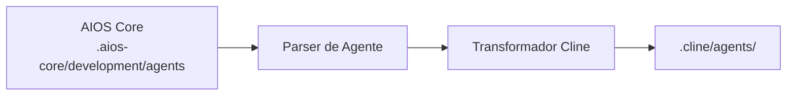

# Guia AIOS para Cline

> **Assistente de Código IA para VS Code** - Integração Completa com VS Code

---

## Visão Geral

### O que é o Cline?

Cline é uma poderosa extensão de assistente de código IA para VS Code que traz capacidades de codificação autônoma diretamente para seu editor favorito. Ele pode ler, escrever e executar código enquanto mantém o ambiente familiar do VS Code.

### Por que usar AIOS com Cline?

O Cline oferece integração perfeita com VS Code para o AIOS:

- **Integração Completa VS Code**: Funciona dentro da sua configuração existente
- **Ativação @mention**: Ativação natural de agentes
- **Operações de Arquivo**: Ler, escrever, editar arquivos diretamente
- **Acesso ao Terminal**: Executar comandos
- **Ecossistema de Extensões**: Compatível com extensões do VS Code
- **Fluxo de Aprovação**: Operações seguras com confirmação do usuário

### Comparação com Outras Plataformas

| Recurso | Cline | Cursor | Claude Code |
|---------|:-----:|:------:|:-----------:|
| Extensão VS Code | Sim | Não (app separado) | Não |
| Ativação @mention | Sim | Sim | /comando |
| Acesso ao Terminal | Sim | Sim | Sim |
| Suporte MCP | Limitado | Config | Nativo |
| Aprovação Necessária | Sim | Opcional | Opcional |

---

## Requisitos

### Requisitos de Sistema

| Requisito | Mínimo | Recomendado |
|-----------|--------|-------------|
| **VS Code** | 1.80+ | Última versão |
| **RAM** | 4GB | 8GB+ |
| **Node.js** | 18.0+ (para AIOS) | 20.0+ |

### Requisitos de Conta

- **Chave de API**: OpenAI, Anthropic ou outros provedores suportados
- **Conta VS Code** (opcional, para sincronização)

---

## Instalação

### Passo 1: Instalar o VS Code

Baixe de [code.visualstudio.com](https://code.visualstudio.com) se ainda não estiver instalado.

### Passo 2: Instalar a Extensão Cline

1. Abra o VS Code
2. Vá para Extensões (`Cmd/Ctrl + Shift + X`)
3. Pesquise "Cline"
4. Clique em Instalar

Ou via linha de comando:
```bash
code --install-extension saoudrizwan.claude-dev
```

### Passo 3: Configurar o Cline

1. Abra as configurações do Cline
2. Adicione sua chave de API (Anthropic, OpenAI, etc.)
3. Configure o modelo preferido

### Passo 4: Instalar o AIOS

```bash
cd seu-projeto
npx @anthropic/aios init
# Selecione "Cline" quando solicitado
```

### Passo 5: Verificar a Instalação

```bash
ls -la .cline/
```

Estrutura esperada:
```
.cline/
├── rules.md           # Configuração principal de regras
├── agents/            # Definições de agentes
│   ├── dev.md
│   ├── qa.md
│   └── ...
└── settings.json      # Configurações locais
```

---

## Configuração

### Arquivo de Regras

**Localização:** `.cline/rules.md`

```markdown
# Regras Synkra AIOS para Cline

## Sistema de Agentes
- Ative agentes com @nome-agente
- Siga workflows específicos do agente

## Padrões de Desenvolvimento
- Escreva código limpo e testado
- Siga padrões existentes
- Inclua tratamento de erros
```

### Arquivos de Agentes

**Localização:** `.cline/agents/`

```markdown
# Agente Desenvolvedor (@dev)

## Papel
Desenvolvedor Full Stack Sênior

## Expertise
- TypeScript/JavaScript
- Node.js, React
- Design de banco de dados

## Fluxo de Trabalho
1. Entender requisitos
2. Planejar implementação
3. Escrever código testado
```

### Configurações do Cline

Configure nas configurações do VS Code ou `.cline/settings.json`:

```json
{
  "cline.apiProvider": "anthropic",
  "cline.model": "claude-3-5-sonnet",
  "cline.autoApprove": {
    "read": true,
    "write": false,
    "execute": false
  }
}
```

---

## Uso Básico

### Abrindo o Cline

1. Abra a Paleta de Comandos (`Cmd/Ctrl + Shift + P`)
2. Digite "Cline: Open"
3. Ou use o ícone da barra lateral

### Ativando Agentes

Use @mentions no chat do Cline:

```
@dev         # Agente desenvolvedor
@qa          # Agente engenheiro de QA
@architect   # Arquiteto de software
@pm          # Gerente de projeto
@po          # Product owner
@analyst     # Analista de negócios
@devops      # Engenheiro DevOps
```

### Exemplos de Interação

```
@dev Crie um endpoint REST API para registro de usuário

@qa Revise o módulo de autenticação para problemas de segurança

@architect Projete o schema do banco de dados para o sistema de e-commerce
```

### Fluxo de Aprovação

O Cline pede aprovação antes de:
- Criar/modificar arquivos
- Executar comandos no terminal
- Fazer alterações significativas

```
[Cline quer editar src/auth.ts]
[Permitir] [Negar] [Permitir Todos]
```

---

## Uso Avançado

### Operações Multi-Arquivo

```
@dev Crie um módulo CRUD completo para produtos:
- Modelo em src/models/
- Repositório em src/repositories/
- Serviço em src/services/
- Controller em src/controllers/
- Testes em tests/
```

### Execução no Terminal

O Cline pode executar comandos:

```
@dev Execute a suíte de testes e corrija quaisquer falhas

@devops Configure o ambiente de desenvolvimento Docker
```

### Revisão de Diff

1. O Cline mostra diffs antes de aplicar
2. Revise alterações na visualização familiar de diff do VS Code
3. Aceite ou rejeite alterações individuais

### Provedores de Contexto

Adicione contexto às suas solicitações:

```
@dev Usando os padrões em src/services/userService.ts,
crie um novo productService.ts

@qa Baseado em tests/auth.test.ts,
escreva testes para o módulo de pagamento
```

---

## Recursos Específicos do Cline

### Configurações de Aprovação

| Configuração | Descrição |
|--------------|-----------|
| `autoApprove.read` | Auto-aprovar leituras de arquivo |
| `autoApprove.write` | Auto-aprovar escritas de arquivo |
| `autoApprove.execute` | Auto-aprovar comandos |

### Atalhos de Teclado

| Atalho | Ação |
|--------|------|
| `Cmd/Ctrl + Shift + P` | Paleta de Comandos |
| `Cmd/Ctrl + .` | Aprovação rápida |
| `Escape` | Cancelar operação |

### Histórico de Tarefas

Veja interações anteriores:
1. Abra o painel do Cline
2. Clique no ícone de histórico
3. Retome ou referencie tarefas passadas

### Integração MCP (Limitada)

```json
{
  "cline.mcp": {
    "enabled": true,
    "servers": ["filesystem"]
  }
}
```

---

## Sincronização de Agentes

### Como Funciona



### Comandos de Sincronização

```bash
# Sincronizar todos os agentes
npm run sync:agents

# Sincronizar especificamente para Cline
npm run sync:agents -- --ide cline
```

### Formato de Agente

O Cline usa markdown condensado:

```markdown
# Agente Desenvolvedor

**Ativação:** @dev

## Persona
Você é um Desenvolvedor Full Stack Sênior com expertise em:
- TypeScript/JavaScript
- Node.js e React
- Design e otimização de banco de dados

## Fluxo de Trabalho
1. Ler e entender os requisitos da story
2. Planejar a abordagem de implementação
3. Escrever código limpo e bem testado
4. Atualizar progresso da story quando completo

## Padrões
- Seguir padrões existentes do codebase
- Incluir tratamento abrangente de erros
- Escrever testes unitários para código novo
```

---

## Limitações Conhecidas

### Limitações Atuais

| Limitação | Solução Alternativa |
|-----------|---------------------|
| MCP limitado | Use servidores MCP básicos |
| Sem subagentes nativos | Troca manual de agente |
| Aprovação interrompe fluxo | Configure auto-aprovação |
| Apenas VS Code | Sem versão standalone |

### Cline vs Claude Code

| Aspecto | Cline | Claude Code |
|---------|-------|-------------|
| Ambiente | VS Code | Terminal |
| MCP | Limitado | Nativo |
| Task Tool | Não | Sim |
| Extensões | Sim | Não |

---

## Troubleshooting

### Problemas Comuns

#### Extensão Não Carregando
```
Problema: Cline não aparece no VS Code
```
**Solução:**
1. Verifique versão do VS Code (1.80+)
2. Recarregue VS Code (`Cmd/Ctrl + Shift + P` > "Reload Window")
3. Reinstale a extensão

#### Chave de API Inválida
```
Problema: Falha na autenticação
```
**Solução:**
1. Abra configurações do Cline
2. Re-insira a chave de API
3. Verifique se a chave está ativa

#### Agente Não Reconhecido
```
Problema: @dev não ativando
```
**Solução:**
```bash
# Ressincronizar agentes
npm run sync:agents

# Verificar arquivo do agente
cat .cline/agents/dev.md
```

#### Performance Lenta
```
Problema: Cline respondendo devagar
```
**Solução:**
1. Verifique cota da API
2. Use modelo mais rápido
3. Reduza tamanho do contexto

### Logs

```bash
# Ferramentas de Desenvolvedor do VS Code
Help > Toggle Developer Tools > Console

# Logs da extensão
View > Output > Selecione "Cline"
```

---

## FAQ

**P: O Cline é gratuito?**
R: A extensão é gratuita, mas requer uma chave de API para provedores de IA (que podem ter custos).

**P: Posso usar modelos locais?**
R: Sim, o Cline suporta Ollama e outros provedores de modelos locais.

**P: O Cline funciona offline?**
R: Apenas com modelos locais configurados.

**P: Como atualizo os agentes?**
R: Execute `npm run sync:agents` após atualizações do AIOS.

---

## Migração

### De Outras Extensões

1. Instale AIOS para Cline:
   ```bash
   npx @anthropic/aios init --ide cline
   ```

2. Agentes sincronizam automaticamente

### Do Cline para Claude Code

1. Seus agentes estão em `.aios-core/development/agents/`
2. Inicialize para Claude Code:
   ```bash
   npx @anthropic/aios init --ide claude-code
   ```

---

## Recursos Adicionais

- [GitHub do Cline](https://github.com/cline/cline)
- [VS Code Marketplace](https://marketplace.visualstudio.com/items?itemName=saoudrizwan.claude-dev)
- [Guia de Plataformas AIOS](../README.md)

---

*Synkra AIOS - Guia da Plataforma Cline v1.0*
