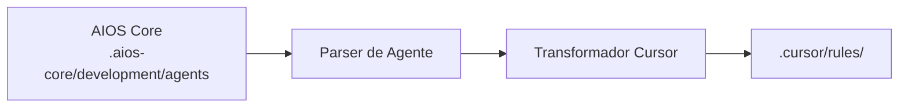

# Guia AIOS para Cursor

> **Editor de Código AI-First** - IDE com IA Mais Popular

---

## Visão Geral

### O que é o Cursor?

Cursor é um editor de código AI-first construído sobre o VS Code, projetado para tornar desenvolvedores mais produtivos com assistência de IA integrada. Ele combina recursos familiares do VS Code com poderosas capacidades de IA incluindo geração de código, edição e conversação.

### Por que usar AIOS com Cursor?

O Cursor é uma das **IDEs com IA mais populares** com excelente integração AIOS:

- **Grande Base de Usuários**: Comunidade ativa e atualizações contínuas
- **Ativação @mention**: Ativação natural de agentes com sintaxe @
- **Integração Composer**: Edição multi-arquivo com assistência IA
- **Contexto @codebase**: Entendimento completo do projeto
- **Suporte MCP**: Extensível via configuração
- **Compatibilidade VS Code**: Funciona com extensões do VS Code

### Comparação com Outras Plataformas

| Recurso | Cursor | Claude Code | Windsurf |
|---------|:------:|:-----------:|:--------:|
| Interface GUI | Sim | Não | Sim |
| Ativação @mention | Sim | /comando | Sim |
| Composer | Sim | Task Tool | Cascade |
| Extensões VS Code | Sim | Não | Limitado |
| Suporte MCP | Config | Nativo | Config |
| Edição Multi-arquivo | Sim | Sim | Sim |

---

## Requisitos

### Requisitos de Sistema

| Requisito | Mínimo | Recomendado |
|-----------|--------|-------------|
| **RAM** | 4GB | 8GB+ |
| **Espaço em Disco** | 500MB | 1GB+ |
| **SO** | macOS 10.15+, Windows 10+, Linux | Última versão |
| **Node.js** | 18.0+ (para AIOS) | 20.0+ |

### Requisitos de Conta

- **Conta Cursor** (tier gratuito disponível)
- **Chaves de API** (opcional): OpenAI, Anthropic, ou use modelos nativos do Cursor

### Configuração Recomendada

- Git instalado e configurado
- GitHub CLI (`gh`) para operações de PR
- Assinatura Cursor Pro para recursos avançados

---

## Instalação

### Passo 1: Instalar o Cursor

1. Baixe em [cursor.com](https://cursor.com)
2. Execute o instalador para sua plataforma
3. Inicie o Cursor e faça login

```bash
# macOS (via Homebrew)
brew install --cask cursor

# Ou baixe diretamente de cursor.com
```

### Passo 2: Configurar as Configurações do Cursor

Abra Configurações do Cursor (`Cmd/Ctrl + ,`):

1. **AI Settings** > Habilitar recursos de IA
2. **Models** > Selecionar modelo preferido (Claude, GPT-4, etc.)
3. **Rules** > Habilitar regras personalizadas

### Passo 3: Instalar o AIOS

```bash
# Navegue até seu projeto
cd seu-projeto

# Inicialize o AIOS
npx @anthropic/aios init

# Selecione "Cursor" quando solicitado para IDE
```

### Passo 4: Verificar a Instalação

Verifique se os arquivos AIOS foram criados:

```bash
ls -la .cursor/
```

Estrutura esperada:
```
.cursor/
├── rules.md           # Configuração principal de regras
├── rules/             # Pasta de regras de agentes
│   ├── dev.md
│   ├── qa.md
│   ├── architect.md
│   └── ...
└── settings.json      # Configurações locais do Cursor
```

---

## Configuração

### Arquivo de Regras Principal

**Localização:** `.cursor/rules.md`

Este arquivo contém:
- Regras e contexto específicos do projeto
- Instruções de ativação de agentes
- Padrões de desenvolvimento
- Integração do framework AIOS

### Pasta de Regras de Agentes

**Localização:** `.cursor/rules/`

Cada agente tem um arquivo dedicado:
```
.cursor/rules/
├── dev.md          # Regras do agente desenvolvedor
├── qa.md           # Regras do agente QA
├── architect.md    # Regras do agente arquiteto
├── pm.md           # Regras do gerente de projeto
├── po.md           # Regras do product owner
├── sm.md           # Regras do scrum master
├── analyst.md      # Regras do analista de negócios
└── devops.md       # Regras do agente DevOps
```

### Configurações do Cursor

**Localização:** `.cursor/settings.json`

```json
{
  "cursor.ai.enabled": true,
  "cursor.ai.model": "claude-3-5-sonnet",
  "cursor.rules.enabled": true,
  "cursor.rules.path": ".cursor/rules.md"
}
```

### Configuração MCP

**Localização:** `~/.cursor/mcp.json` ou projeto `.cursor/mcp.json`

```json
{
  "mcpServers": {
    "filesystem": {
      "command": "npx",
      "args": ["-y", "@modelcontextprotocol/server-filesystem", "."]
    }
  }
}
```

---

## Uso Básico

### Iniciando o Cursor com AIOS

1. Abra seu projeto no Cursor
2. As regras em `.cursor/rules.md` são carregadas automaticamente
3. Use o painel de chat IA (`Cmd/Ctrl + L`)

### Ativando Agentes AIOS

Agentes são ativados usando @mentions no chat:

```
@dev         # Agente desenvolvedor
@qa          # Agente engenheiro de QA
@architect   # Agente arquiteto de software
@pm          # Agente gerente de projeto
@po          # Agente product owner
@sm          # Agente scrum master
@analyst     # Agente analista de negócios
@devops      # Agente engenheiro DevOps
```

### Exemplos de Ativação de Agentes

```
@dev implemente a feature de autenticação seguindo a story

@qa revise este código para vulnerabilidades de segurança

@architect projete a arquitetura de microserviços para o sistema de pagamento

@pm crie um plano de sprint para as próximas duas semanas
```

### Usando o Composer

O Composer do Cursor permite edição multi-arquivo:

1. Abra o Composer (`Cmd/Ctrl + I`)
2. Descreva suas alterações
3. Selecione arquivos para modificar
4. Revise e aplique alterações

```
# Exemplo de prompt do Composer
@dev Crie um novo endpoint REST API para registro de usuário.
Inclua:
- Handler de rota em src/routes/
- Middleware de validação
- Lógica da camada de serviço
- Testes unitários
```

### Usando @codebase

Referencie o contexto completo do seu projeto:

```
@codebase Como a autenticação está atualmente implementada?

@codebase @dev Refatore as queries do banco de dados para usar o padrão repository
```

---

## Uso Avançado

### Fluxos de Trabalho do Composer

#### Refatoração Multi-Arquivo
```
@architect @codebase
Refatore o módulo de usuário para seguir clean architecture:
1. Extrair interfaces
2. Criar camada de repositório
3. Atualizar serviços
4. Manter testes
```

#### Implementação de Feature
```
@dev @codebase
Implemente a feature de carrinho de compras:
- Modelo e migrations do carrinho
- Operações CRUD
- Persistência de sessão
- Endpoints de API
```

### Modos de Chat

O Cursor suporta diferentes modos de interação:

| Modo | Caso de Uso |
|------|-------------|
| **Chat** | Perguntas gerais, explicações |
| **Edit** | Modificações inline de código |
| **Composer** | Alterações multi-arquivo |
| **Terminal** | Execução de comandos |

### Edição Inline

Selecione código e use `Cmd/Ctrl + K`:

```
# Selecione código, então:
@dev otimize esta função para performance
@qa adicione tratamento de erros a este bloco
```

### Organização de Regras

Organize regras por contexto:

```
.cursor/
├── rules.md              # Regras globais
└── rules/
    ├── agents/           # Regras específicas de agentes
    │   ├── dev.md
    │   └── qa.md
    ├── patterns/         # Padrões de código
    │   ├── api.md
    │   └── testing.md
    └── project/          # Específico do projeto
        └── conventions.md
```

---

## Recursos Específicos do Cursor

### Superpoderes

| Recurso | Descrição |
|---------|-----------|
| **Cmd+K** | Edição IA inline |
| **Cmd+L** | Abrir chat IA |
| **Cmd+I** | Abrir Composer |
| **Cmd+Shift+L** | Adicionar seleção ao chat |
| **Tab** | Aceitar sugestão IA |

### Atalhos de Teclado

| Atalho | Ação |
|--------|------|
| `Cmd/Ctrl + K` | Edição IA |
| `Cmd/Ctrl + L` | Chat IA |
| `Cmd/Ctrl + I` | Composer |
| `Cmd/Ctrl + Shift + K` | Editar com seleção |
| `Escape` | Cancelar operação IA |

### Referências de Contexto

Use estas no chat ou Composer:

| Referência | Descrição |
|------------|-----------|
| `@codebase` | Contexto completo do projeto |
| `@file` | Arquivo específico |
| `@folder` | Conteúdo da pasta |
| `@docs` | Documentação |
| `@web` | Busca web |
| `@nome-agente` | Agente AIOS |

### Seleção de Modelo

Mude de modelo baseado na tarefa:

| Modelo | Melhor Para |
|--------|-------------|
| **Claude 3.5 Sonnet** | Raciocínio complexo, arquitetura |
| **GPT-4** | Codificação geral |
| **GPT-4 Turbo** | Respostas rápidas |
| **Cursor Small** | Completações rápidas |

---

## Sincronização de Agentes

### Como Funciona



### Comandos de Sincronização

```bash
# Sincronizar todos os agentes
npm run sync:agents

# Sincronizar agente específico
npm run sync:agents -- --agent dev

# Forçar ressincronização
npm run sync:agents -- --force
```

### Formato de Arquivo de Agente

Agentes no Cursor usam formato markdown condensado:

```markdown
# Agente Desenvolvedor (@dev)

## Papel
Desenvolvedor Full Stack Sênior focado em código limpo e manutenível.

## Expertise
- TypeScript/JavaScript
- Node.js/React
- Design de banco de dados
- Desenvolvimento de API

## Fluxo de Trabalho
1. Entender requisitos da story
2. Planejar abordagem de implementação
3. Escrever código limpo e testado
4. Atualizar progresso da story

## Padrões
- Seguir convenções existentes do codebase
- Escrever tratamento abrangente de erros
- Incluir testes unitários para código novo
```

### Resolução de Conflitos

Quando conflitos ocorrem durante o sync:

1. Backup criado em `.cursor/rules/.backup/`
2. Prompt para estratégia de resolução
3. Opções: manter local, usar remoto, mesclar

---

## Limitações Conhecidas

### Limitações Atuais

| Limitação | Solução Alternativa |
|-----------|---------------------|
| Sem MCP nativo | Use MCP baseado em configuração |
| Sem spawn de subagente | Troca manual de agente |
| Limites de janela de contexto | Use @codebase seletivamente |
| Rate limiting | Configure nas configurações |

### Cursor vs Claude Code

| Aspecto | Cursor | Claude Code |
|---------|--------|-------------|
| Task Tool | Não | Sim |
| Hooks | Não | Sim |
| Skills | Não | Nativo |
| GUI | Sim | Não |
| Ext VS Code | Sim | Não |

### Problemas Conhecidos

- Projetos grandes podem deixar @codebase lento
- Algumas extensões VS Code podem conflitar
- MCP requer configuração manual

---

## Troubleshooting

### Problemas Comuns

#### Regras Não Carregando
```
Problema: Agente não responde a @mentions
```
**Solução:**
1. Verifique se arquivo de regras existe: `ls .cursor/rules.md`
2. Confira Cursor settings > Rules > Enabled
3. Reinicie o Cursor

#### MCP Não Funcionando
```
Problema: Ferramentas MCP não disponíveis
```
**Solução:**
```bash
# Verificar configuração MCP
cat ~/.cursor/mcp.json

# Verificar se servidor MCP está instalado
npx @modelcontextprotocol/server-filesystem --version
```

#### Performance Lenta
```
Problema: Cursor está lento com projetos grandes
```
**Solução:**
1. Exclua pastas grandes em `.cursorignore`
2. Use referências específicas de arquivo ao invés de @codebase
3. Aumente alocação de memória nas configurações

#### Agente Não Reconhecido
```
Problema: @dev não ativa agente
```
**Solução:**
```bash
# Ressincronizar agentes
npm run sync:agents

# Verificar se arquivo do agente existe
ls .cursor/rules/dev.md
```

### Logs e Diagnósticos

```bash
# Localização dos logs do Cursor
# macOS: ~/Library/Application Support/Cursor/logs/
# Windows: %APPDATA%\Cursor\logs\
# Linux: ~/.config/Cursor/logs/

# Ver log mais recente
tail -f ~/Library/Application\ Support/Cursor/logs/main.log
```

### Resetar Configuração

```bash
# Backup da configuração atual
cp -r .cursor/ .cursor-backup/

# Reinicializar AIOS
npx @anthropic/aios init --ide cursor --force
```

---

## FAQ

### Perguntas Gerais

**P: O Cursor é gratuito?**
R: O Cursor tem um tier gratuito com requisições IA limitadas. Assinatura Pro disponível para acesso ilimitado.

**P: Posso usar minhas próprias chaves de API?**
R: Sim, você pode configurar chaves de API OpenAI ou Anthropic nas configurações do Cursor.

**P: O Cursor funciona offline?**
R: Edição básica funciona offline, mas recursos de IA requerem internet.

### Perguntas Específicas do AIOS

**P: Como mudo entre agentes?**
R: Use @mentions no chat: `@dev`, `@qa`, `@architect`, etc.

**P: Posso usar múltiplos agentes em um prompt?**
R: Sim, mas é recomendado usar um agente por tarefa para clareza.

**P: Onde as definições de agentes são armazenadas?**
R: Em `.cursor/rules/` após a sincronização.

**P: Como atualizo os agentes?**
R: Execute `npm run sync:agents` após atualizações do AIOS.

---

## Migração

### Do VS Code para Cursor

1. O Cursor importa configurações do VS Code automaticamente
2. Instale o AIOS:
   ```bash
   npx @anthropic/aios init --ide cursor
   ```
3. Suas extensões VS Code devem funcionar no Cursor

### Do Cursor para Claude Code

1. Exporte regras personalizadas:
   ```bash
   cp -r .cursor/rules/ cursor-rules-backup/
   ```

2. Inicialize AIOS para Claude Code:
   ```bash
   npx @anthropic/aios init --ide claude-code
   ```

3. Agentes sincronizam automaticamente para o novo formato

### Do Cursor para Windsurf

1. Exporte configuração:
   ```bash
   cp .cursor/rules.md cursor-rules-backup.md
   ```

2. Inicialize AIOS para Windsurf:
   ```bash
   npx @anthropic/aios init --ide windsurf
   ```

3. Regras transformam para o formato XML-tagged do Windsurf

---

## Recursos Adicionais

### Documentação Oficial
- [Documentação do Cursor](https://cursor.com/docs)
- [Changelog do Cursor](https://cursor.com/changelog)
- [Discord do Cursor](https://discord.gg/cursor)

### Comunidade
- [Reddit do Cursor](https://reddit.com/r/cursor)
- [GitHub Discussions](https://github.com/getcursor/cursor/discussions)

### Tutoriais
- [Dicas e Truques do Cursor](https://cursor.com/tips)
- [Guia de Integração AIOS](../README.md)

---

*Synkra AIOS - Guia da Plataforma Cursor v1.0*
