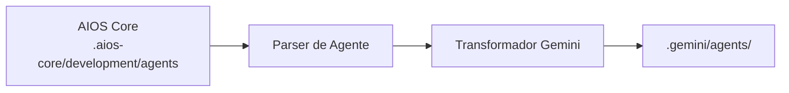

# Guia AIOS para Gemini CLI

> **Assistente CLI do Google AI** - Desenvolvimento com IA em Linha de Comando

---

## Visão Geral

### O que é o Gemini CLI?

Gemini CLI é a interface de linha de comando do Google para interagir com modelos Gemini AI. Ele fornece aos desenvolvedores acesso direto via terminal às capacidades de IA do Google, incluindo suporte multimodal para texto, código e imagens.

### Por que usar AIOS com Gemini CLI?

O Gemini CLI oferece capacidades únicas:

- **Fluxo de Trabalho CLI**: Experiência pura de terminal
- **Modelos Google AI**: Acesso aos modelos Gemini
- **Suporte Multimodal**: Entendimento de texto, código e imagens
- **Ativação por Prompt**: Ativação de agentes em linguagem natural
- **Integração Shell**: Funciona com suas ferramentas existentes

### Comparação com Outras Plataformas

| Recurso | Gemini CLI | Claude Code | Cursor |
|---------|:----------:|:-----------:|:------:|
| Baseado em CLI | Sim | Sim | Não |
| Multimodal | Sim | Limitado | Não |
| Ativação de Agente | Prompt | /comando | @mention |
| Suporte MCP | Não | Nativo | Config |
| Modelos Google | Sim | Não | Não |

---

## Requisitos

### Requisitos de Sistema

| Requisito | Mínimo | Recomendado |
|-----------|--------|-------------|
| **SO** | macOS, Linux, Windows | macOS, Linux |
| **Node.js** | 18.0+ | 20.0+ |
| **Python** | 3.9+ (opcional) | 3.11+ |

### Requisitos de Conta

- **Chave de API Google AI** ou **Conta Google Cloud**
- **Acesso à API Gemini**

---

## Instalação

### Passo 1: Instalar o Gemini CLI

```bash
# Instalar via npm (requer Node.js 18+)
npm install -g @google/gemini-cli

# Ou executar sem instalação
npx @google/gemini-cli

# Ou via conda
conda create -y -n gemini_env -c conda-forge nodejs
conda activate gemini_env
npm install -g @google/gemini-cli
```

### Passo 2: Autenticar

```bash
# Login com conta Google
gemini auth login

# Ou definir chave de API
export GOOGLE_AI_API_KEY="sua-chave-api"
```

### Passo 3: Instalar o AIOS

```bash
cd seu-projeto
npx @anthropic/aios init
# Selecione "Gemini CLI" quando solicitado
```

### Passo 4: Verificar a Instalação

```bash
ls -la .gemini/
```

Estrutura esperada:
```
.gemini/
├── rules.md           # Regras principais
├── agents/            # Definições de agentes
│   ├── dev.md
│   ├── qa.md
│   └── ...
└── config.json        # Configuração do CLI
```

---

## Configuração

### Arquivo de Regras

**Localização:** `.gemini/rules.md`

```markdown
# Regras Synkra AIOS para Gemini CLI

## Sistema de Agentes
- Inclua contexto de agente em seus prompts
- Use "Como agente [agente]..." para ativação

## Padrões de Desenvolvimento
- Escreva código limpo e testado
- Siga padrões existentes
```

### Configuração do CLI

**Localização:** `.gemini/config.json`

```json
{
  "model": "gemini-pro",
  "temperature": 0.7,
  "maxOutputTokens": 8192,
  "agents": {
    "default": "dev",
    "available": ["dev", "qa", "architect", "pm"]
  }
}
```

### Arquivos de Agente

**Localização:** `.gemini/agents/`

```markdown
# Agente Desenvolvedor

## Ativação
Inclua "Como agente AIOS dev" no seu prompt.

## Persona
Desenvolvedor Full Stack Sênior com expertise em:
- TypeScript/JavaScript
- Node.js, React
- Design de banco de dados

## Fluxo de Trabalho
1. Ler requisitos
2. Planejar implementação
3. Escrever código limpo
4. Testar completamente
```

---

## Uso Básico

### Iniciando o Gemini CLI

```bash
# Modo interativo
gemini

# Prompt único
gemini "Explique este código"

# Com contexto de arquivo
gemini --file src/main.ts "Revise este código"
```

### Ativando Agentes AIOS

Inclua contexto de agente nos prompts:

```bash
# Agente desenvolvedor
gemini "Como agente AIOS dev, implemente a feature de login"

# Agente QA
gemini "Como agente AIOS qa, revise este código para segurança"

# Agente arquiteto
gemini "Como agente AIOS architect, projete o schema do banco de dados"
```

### Com Arquivos de Contexto

```bash
# Incluir arquivo de regras
gemini --context .gemini/rules.md "Implemente feature de auth"

# Incluir agente específico
gemini --context .gemini/agents/dev.md "Crie modelo de usuário"
```

### Integração Shell

```bash
# Pipe código para revisão
cat src/auth.ts | gemini "Como AIOS qa, revise este código"

# Gerar código
gemini "Crie um endpoint REST API" > src/api/users.ts

# Sessão interativa
gemini --interactive
```

---

## Uso Avançado

### Capacidades Multimodais

```bash
# Analisar imagem
gemini --image screenshot.png "Explique este design de UI"

# Código + imagem
gemini --file src/component.tsx --image mockup.png \
  "Atualize componente para corresponder ao design"
```

### Gerenciamento de Sessão

```bash
# Iniciar sessão nomeada
gemini --session feature-dev

# Continuar sessão
gemini --session feature-dev "Agora adicione testes"

# Listar sessões
gemini sessions list
```

### Operações em Lote

```bash
# Processar múltiplos arquivos
for file in src/*.ts; do
  gemini --file "$file" "Como AIOS qa, revise este arquivo" >> reviews.md
done
```

### Comandos Personalizados

Crie aliases no shell:

```bash
# ~/.bashrc ou ~/.zshrc
alias gdev='gemini --context .gemini/agents/dev.md'
alias gqa='gemini --context .gemini/agents/qa.md'
alias garch='gemini --context .gemini/agents/architect.md'
```

Uso:
```bash
gdev "Implemente autenticação de usuário"
gqa "Revise o módulo de auth"
```

---

## Recursos Específicos do Gemini CLI

### Seleção de Modelo

```bash
# Usar modelo específico
gemini --model gemini-pro "Query"
gemini --model gemini-pro-vision "Analisar imagem"
```

### Formatos de Saída

```bash
# Saída JSON
gemini --output json "Gere schema de API"

# Markdown
gemini --output markdown "Documente esta função"

# Apenas código
gemini --output code "Crie uma função de ordenação"
```

### Streaming

```bash
# Habilitar saída streaming
gemini --stream "Escreva uma explicação longa"
```

---

## Sincronização de Agentes

### Como Funciona



### Comandos de Sincronização

```bash
# Sincronizar todos os agentes
npm run sync:agents

# Sincronizar para Gemini CLI
npm run sync:agents -- --ide gemini-cli
```

### Formato de Agente

O Gemini CLI usa markdown otimizado para prompt:

```markdown
# Agente Desenvolvedor

**Frase de Ativação:** "Como agente AIOS dev"

## Papel
Você é um Desenvolvedor Full Stack Sênior trabalhando com Synkra AIOS.

## Expertise
- TypeScript/JavaScript
- Node.js, React
- Design de banco de dados
- Desenvolvimento de API

## Instruções
Quando ativado:
1. Analise o pedido cuidadosamente
2. Considere padrões de código existentes
3. Forneça soluções limpas e testadas
4. Explique sua abordagem

## Formato de Resposta
- Comece com breve análise
- Forneça soluções de código
- Inclua explicações
- Sugira testes se aplicável
```

---

## Limitações Conhecidas

### Limitações Atuais

| Limitação | Solução Alternativa |
|-----------|---------------------|
| Sem suporte MCP | Use ferramentas externas |
| Sem contexto persistente | Use sessões |
| Ativação manual de agente | Use aliases do shell |
| Sem GUI | Apenas terminal |

### Gemini CLI vs Claude Code

| Aspecto | Gemini CLI | Claude Code |
|---------|------------|-------------|
| Provedor | Google | Anthropic |
| MCP | Não | Nativo |
| Task Tool | Não | Sim |
| Multimodal | Sim | Limitado |

---

## Troubleshooting

### Problemas Comuns

#### Falha de Autenticação
```
Error: Unable to authenticate
```
**Solução:**
```bash
gemini auth logout
gemini auth login
# Ou redefinir chave de API
export GOOGLE_AI_API_KEY="nova-chave"
```

#### Modelo Não Disponível
```
Error: Model 'xyz' not found
```
**Solução:**
```bash
# Listar modelos disponíveis
gemini models list

# Usar modelo disponível
gemini --model gemini-pro "Query"
```

#### Contexto Muito Longo
```
Error: Context exceeds limit
```
**Solução:**
- Divida em partes menores
- Use referências específicas de arquivo
- Resuma o contexto

### Logs

```bash
# Habilitar saída verbose
gemini --verbose "Query"

# Modo debug
GEMINI_DEBUG=1 gemini "Query"
```

---

## FAQ

**P: O Gemini CLI é gratuito?**
R: Sim, tier gratuito generoso: 60 requisições/minuto e 1000 requisições/dia sem custo. Suporta modelos Gemini Pro e Gemini Flash.

**P: Posso usar modelos locais?**
R: Não, o Gemini CLI requer a API do Google.

**P: Funciona offline?**
R: Não, requer conexão com internet.

**P: Como troco de agentes rapidamente?**
R: Use aliases do shell ou inclua contexto de agente nos prompts.

---

## Migração

### Do Claude Code para Gemini CLI

1. Instale AIOS para Gemini CLI:
   ```bash
   npx @anthropic/aios init --ide gemini-cli
   ```
2. Agentes transformam para formato baseado em prompt

### Do Gemini CLI para Outras IDEs

1. Agentes AIOS em `.aios-core/` são portáveis
2. Inicialize para a IDE de destino
3. Agentes transformam automaticamente

---

## Recursos Adicionais

- [Documentação Oficial Gemini CLI](https://geminicli.com/docs/)
- [GitHub Gemini CLI](https://github.com/google-gemini/gemini-cli)
- [Documentação Google AI](https://ai.google.dev/docs)
- [Tutorial Google Codelabs](https://codelabs.developers.google.com/gemini-cli-hands-on)
- [Google Cloud Gemini CLI](https://docs.cloud.google.com/gemini/docs/codeassist/gemini-cli)

---

*Synkra AIOS - Guia da Plataforma Gemini CLI v1.0*
