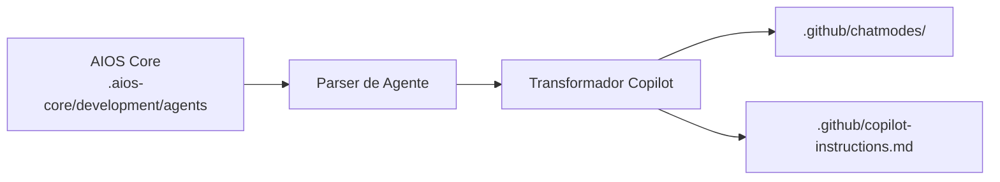

# Guia AIOS para GitHub Copilot

> 🌐 [EN](../../platforms/github-copilot.md) | **PT** | [ES](../../es/platforms/github-copilot.md)

---

> **Programador Par IA do GitHub** - Integração Nativa com GitHub

---

## Visão Geral

### O que é o GitHub Copilot?

GitHub Copilot é o assistente de codificação com IA do GitHub que se integra diretamente com o VS Code e outros editores. Ele oferece completações de código, assistência via chat e integração profunda com GitHub para pull requests e revisão de código.

### Por que usar AIOS com GitHub Copilot?

O GitHub Copilot fornece vantagens únicas:

- **Integração GitHub**: Suporte nativo a PRs e issues
- **Ubíquo**: Disponível na maioria dos editores
- **Modos de Chat**: Comportamento de agente via modos de chat
- **Revisão de Código**: Revisões de PR assistidas por IA
- **@workspace**: Contexto completo do projeto

### Comparação com Outras Plataformas

| Recurso | GitHub Copilot | Cursor | Claude Code |
|---------|:--------------:|:------:|:-----------:|
| GitHub Nativo | Sim | Não | Não |
| Modos de Agente | 4 Built-in | @mention | /comando |
| Suporte MCP | Sim | Config | Nativo |
| Integração PR | Sim | Limitada | gh CLI |
| Code Completion | Sim | Sim | Não |

---

## Requisitos

### Requisitos de Sistema

| Requisito | Mínimo | Recomendado |
|-----------|--------|-------------|
| **VS Code** | 1.101+ | Última versão |
| **RAM** | 4GB | 8GB+ |
| **Node.js** | 18.0+ (para AIOS) | 20.0+ |

### Requisitos de Conta

- **Assinatura GitHub Copilot** (Individual, Business ou Enterprise)
- **Conta GitHub**

### Configurações do VS Code

Habilite o modo de agente no VS Code:
```json
{
  "chat.agent.enabled": true
}
```

---

## Instalação

### Passo 1: Instalar a Extensão GitHub Copilot

1. Abra o VS Code
2. Vá para Extensões (`Cmd/Ctrl + Shift + X`)
3. Pesquise "GitHub Copilot"
4. Instale ambas:
   - GitHub Copilot
   - GitHub Copilot Chat

### Passo 2: Fazer Login

1. Clique em "Sign in to GitHub" quando solicitado
2. Autorize o VS Code
3. Verifique se a assinatura está ativa

### Passo 3: Instalar o AIOS

```bash
cd seu-projeto
npx @anthropic/aios init
# Selecione "GitHub Copilot" quando solicitado
```

### Passo 4: Verificar a Instalação

```bash
ls -la .github/
```

Estrutura esperada:
```
.github/
├── copilot-instructions.md    # Instruções principais
├── chatmodes/                  # Modos de chat de agentes
│   ├── aios-dev.chatmode.md
│   ├── aios-qa.chatmode.md
│   └── ...
└── agents/                     # Definições de agentes
```

---

## Configuração

### Instruções do Copilot

**Localização:** `.github/copilot-instructions.md`

Este arquivo fornece contexto global ao Copilot:

```markdown
# Instruções do Projeto para GitHub Copilot

## Visão Geral do Projeto
Este projeto usa Synkra AIOS para desenvolvimento orquestrado por IA.

## Padrões de Código
- TypeScript com modo strict
- Siga padrões existentes
- Inclua tratamento de erros
- Escreva testes unitários

## Sistema de Agentes
Use modos de chat para assistência especializada.
```

### Modos de Chat

**Localização:** `.github/chatmodes/`

Cada agente tem um modo de chat dedicado:

```markdown
<!-- aios-dev.chatmode.md -->
---
name: AIOS Developer
description: Agente Desenvolvedor Full Stack Sênior
---

# Agente Desenvolvedor

Você é um Desenvolvedor Full Stack Sênior trabalhando com Synkra AIOS.

## Expertise
- TypeScript/JavaScript
- Node.js, React
- Design de banco de dados

## Fluxo de Trabalho
1. Ler requisitos da story
2. Planejar implementação
3. Escrever código limpo e testado
```

---

## Uso Básico

### Abrindo o Chat do Copilot

**Atalhos de Teclado:**
- Windows/Linux: `Ctrl + Alt + I`
- macOS: `⌃⌘I`

Ou: View > Chat

### Modos Built-in do Copilot

O VS Code fornece quatro modos built-in:

| Modo | Propósito |
|------|-----------|
| **Agent** | Codificação autônoma - edita arquivos, executa comandos, itera em erros |
| **Plan** | Cria planos de implementação detalhados antes de codificar |
| **Ask** | Responde perguntas sem fazer alterações |
| **Edit** | Controle granular sobre edições propostas |

### Ativando Modos de Agente AIOS

1. Abra a visualização de Chat
2. Clique no seletor de modo (topo do chat)
3. Selecione o modo desejado (Agent, Plan, Ask, Edit)
4. Para agentes AIOS, use modos de chat personalizados em `.github/chatmodes/`

### Modos AIOS Personalizados

| Modo | Propósito |
|------|-----------|
| `aios-dev` | Desenvolvimento full-stack |
| `aios-qa` | Garantia de qualidade |
| `aios-architect` | Design de sistema |
| `aios-pm` | Gerenciamento de projeto |

### Exemplos de Interação

```
# No modo aios-dev:
Implemente a feature de autenticação de usuário da story

# No modo aios-qa:
Revise o módulo de auth para vulnerabilidades de segurança

# No modo aios-architect:
Projete a arquitetura de microserviços
```

### Usando @workspace

Referencie todo o seu projeto:

```
@workspace Como o tratamento de erros está implementado?

@workspace Explique o fluxo de autenticação
```

### Completações Inline

O GitHub Copilot fornece sugestões inline:
1. Comece a digitar código
2. Aguarde a sugestão cinza
3. Pressione Tab para aceitar
4. Pressione Escape para dispensar

---

## Uso Avançado

### Integração com PR

Use o Copilot para pull requests:

```
# Na descrição do PR
@copilot resuma as alterações neste PR

# Na revisão do PR
@copilot explique esta alteração de código
```

### Revisão de Código

Solicite revisões assistidas por IA:

```
@copilot revise este arquivo para:
- Problemas de segurança
- Problemas de performance
- Melhores práticas
```

### Contexto Multi-Arquivo

Referencie arquivos específicos:

```
@file:src/auth/login.ts Explique este fluxo de autenticação

Usando padrões de @file:src/services/userService.ts,
crie um productService
```

### Integração com Terminal

```
@terminal Como executo os testes?

@terminal Gere um comando git para squash de commits
```

---

## Recursos Específicos do GitHub Copilot

### Atalhos de Teclado

| Atalho | Ação |
|--------|------|
| `Tab` | Aceitar sugestão |
| `Escape` | Dispensar sugestão |
| `Alt + ]` | Próxima sugestão |
| `Alt + [` | Sugestão anterior |
| `Ctrl + Alt + I` | Abrir Chat |

### Referências de Contexto

| Referência | Descrição |
|------------|-----------|
| `@workspace` | Projeto completo |
| `@file` | Arquivo específico |
| `@terminal` | Contexto do terminal |
| `@vscode` | Configurações do VS Code |

### Participantes do Chat

| Participante | Propósito |
|--------------|-----------|
| `@workspace` | Consultas em todo o projeto |
| `@terminal` | Assistência com comandos |
| `@vscode` | Configurações do editor |

---

## Sincronização de Agentes

### Como Funciona



### Comandos de Sincronização

```bash
# Sincronizar todos os agentes
npm run sync:ide

# Sincronizar para GitHub Copilot
npm run sync:ide -- --ide github-copilot
```

### Formato de Chat Mode

```markdown
---
name: AIOS Developer
description: Assistência de desenvolvimento full-stack
---

# Agente Desenvolvedor

## Papel
Você é um Desenvolvedor Full Stack Sênior.

## Capacidades
- Desenvolvimento TypeScript/JavaScript
- Design e implementação de API
- Design de schema de banco de dados
- Testes unitários e de integração

## Diretrizes
1. Siga os padrões de código do projeto
2. Escreva tratamento de erros abrangente
3. Inclua testes para novas funcionalidades
4. Atualize documentação conforme necessário
```

---

## Limitações Conhecidas

### Limitações Atuais

| Limitação | Solução Alternativa |
|-----------|---------------------|
| Janela de contexto limitada | Use @workspace seletivamente |
| Sem spawn de subagente | Use background agents (VS Code 1.107+) |
| Seleção de modelo limitada | Usa seleção de modelo do GitHub |

### Adições Recentes (2025)

- **Suporte MCP**: Estenda o chat com capacidades customizadas via Model Context Protocol
- **Orquestração Multi-Agente**: Agent HQ para gerenciar múltiplos agentes (VS Code 1.107+)
- **Background Agents**: Execute agentes em workspaces isolados
- **Subagentes**: Delegue tarefas dentro de sessões de chat

### Copilot vs Claude Code

| Aspecto | Copilot | Claude Code |
|---------|---------|-------------|
| Task Tool | Não | Sim |
| MCP | Não | Nativo |
| GitHub Nativo | Sim | gh CLI |
| Completação Inline | Sim | Não |

---

## Troubleshooting

### Problemas Comuns

#### Modos de Chat Não Aparecendo
```
Problema: Modos de agente AIOS não no seletor
```
**Solução:**
1. Certifique-se de ter VS Code 1.101+
2. Habilite `chat.agent.enabled: true`
3. Recarregue o VS Code
4. Verifique arquivos em `.github/chatmodes/`

#### Copilot Não Sugerindo
```
Problema: Sem completações inline
```
**Solução:**
1. Verifique status da assinatura
2. Verifique conexão com internet
3. Verifique se o tipo de arquivo é suportado
4. Reinicie o VS Code

#### Instruções Não Aplicadas
```
Problema: Copilot ignorando regras do projeto
```
**Solução:**
1. Verifique se `.github/copilot-instructions.md` existe
2. Confira sintaxe do arquivo
3. Recarregue o VS Code

### Logs

```bash
# Saída do VS Code
View > Output > GitHub Copilot

# Ferramentas de Desenvolvedor
Help > Toggle Developer Tools > Console
```

---

## FAQ

**P: Quanto custa o GitHub Copilot?**
R: Individual: $10/mês, Business: $19/usuário/mês, Enterprise: preço personalizado.

**P: Posso usar outros modelos?**
R: Não, o Copilot usa exclusivamente modelos OpenAI.

**P: Funciona offline?**
R: Não, requer conexão com internet.

**P: Como os modos de chat diferem de @mentions?**
R: Modos de chat são contextos persistentes, enquanto @mentions são referências por mensagem.

---

## Migração

### Do Cursor para Copilot

1. Instale AIOS para Copilot:
   ```bash
   npx @anthropic/aios init --ide github-copilot
   ```

2. Agentes transformam para modos de chat

### Do Copilot para Claude Code

1. Agentes armazenados em `.aios-core/` são portáveis
2. Inicialize para Claude Code:
   ```bash
   npx @anthropic/aios init --ide claude-code
   ```

---

## Recursos Adicionais

- [Documentação do GitHub Copilot](https://docs.github.com/copilot)
- [Extensão VS Code Copilot](https://marketplace.visualstudio.com/items?itemName=GitHub.copilot)
- [GitHub Copilot Chat](https://marketplace.visualstudio.com/items?itemName=GitHub.copilot-chat)

---

*Synkra AIOS - Guia da Plataforma GitHub Copilot v1.0*
