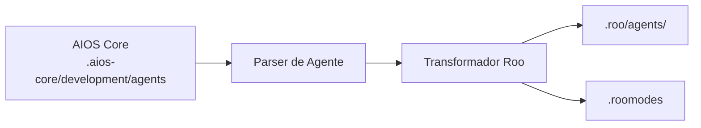

# Guia AIOS para Roo Code

> **Extensão VS Code Baseada em Modos** - Modos de Agentes Especializados

---

## Visão Geral

### O que é o Roo Code?

Roo Code é uma extensão do VS Code que usa um sistema baseado em modos para assistência de IA. Cada modo fornece contexto e capacidades especializadas, facilitando a troca entre diferentes tipos de tarefas.

### Por que usar AIOS com Roo Code?

O Roo Code oferece uma abordagem única baseada em modos:

- **Sistema de Modos**: Modos dedicados para cada tipo de agente
- **Extensão VS Code**: Funciona no seu ambiente existente
- **Troca Rápida**: Mudança rápida de modo via barra de status
- **Modos Personalizados**: Crie workflows especializados
- **Consciência de Contexto**: Modos mantêm contexto relevante

### Comparação com Outras Plataformas

| Recurso | Roo Code | Cline | Cursor |
|---------|:--------:|:-----:|:------:|
| Sistema de Modos | Sim | Não | Não |
| Extensão VS Code | Sim | Sim | Não |
| Ativação de Agente | Seletor de Modo | @mention | @mention |
| Suporte MCP | Não | Limitado | Config |

---

## Requisitos

### Requisitos de Sistema

| Requisito | Mínimo | Recomendado |
|-----------|--------|-------------|
| **VS Code** | 1.80+ | Última versão |
| **RAM** | 4GB | 8GB+ |
| **Node.js** | 18.0+ (para AIOS) | 20.0+ |

### Requisitos de Conta

- **Chave de API**: Anthropic, OpenAI ou outros provedores suportados
- **Licença Roo Code** (se aplicável)

---

## Instalação

### Passo 1: Instalar o VS Code

Baixe de [code.visualstudio.com](https://code.visualstudio.com).

### Passo 2: Instalar a Extensão Roo Code

1. Abra Extensões do VS Code (`Cmd/Ctrl + Shift + X`)
2. Pesquise "Roo Code" por RooVeterinaryInc
3. Clique em Instalar

Ou via linha de comando:
```bash
code --install-extension RooVeterinaryInc.roo-cline
```

### Passo 3: Configurar Chave de API

1. Abra as configurações do Roo Code
2. Insira sua chave de API
3. Selecione o modelo preferido

### Passo 4: Instalar o AIOS

```bash
cd seu-projeto
npx @anthropic/aios init
# Selecione "Roo Code" quando solicitado
```

### Passo 5: Verificar a Instalação

```bash
ls -la .roo/
```

Estrutura esperada:
```
.roo/
├── rules.md           # Regras principais
├── agents/            # Definições de agentes
│   ├── dev.md
│   ├── qa.md
│   └── ...
└── .roomodes          # Definições de modo
```

---

## Configuração

### Arquivo de Regras

**Localização:** `.roo/rules.md`

```markdown
# Regras Synkra AIOS para Roo Code

## Sistema de Agentes
- Use o seletor de modo para trocar agentes
- Cada modo corresponde a um agente AIOS

## Padrões de Desenvolvimento
- Escreva código limpo e testado
- Siga padrões existentes
```

### Definições de Modo

**Localização:** `.roomodes`

```json
{
  "modes": [
    {
      "id": "bmad-dev",
      "name": "Desenvolvedor",
      "description": "Modo de desenvolvimento full-stack",
      "rulesFile": ".roo/agents/dev.md"
    },
    {
      "id": "bmad-qa",
      "name": "Engenheiro de QA",
      "description": "Modo de garantia de qualidade",
      "rulesFile": ".roo/agents/qa.md"
    },
    {
      "id": "bmad-architect",
      "name": "Arquiteto",
      "description": "Modo de design de sistema",
      "rulesFile": ".roo/agents/architect.md"
    }
  ]
}
```

### Arquivos de Agente

**Localização:** `.roo/agents/`

```markdown
# Modo Desenvolvedor

## Papel
Você é um Desenvolvedor Full Stack Sênior.

## Expertise
- TypeScript/JavaScript
- Node.js, React
- Design de banco de dados
- Desenvolvimento de API

## Fluxo de Trabalho
1. Entender requisitos
2. Planejar implementação
3. Escrever código limpo
4. Testar completamente
```

---

## Uso Básico

### Iniciando o Roo Code

1. Abra o VS Code com seu projeto
2. O Roo Code carrega automaticamente
3. Procure o seletor de modo na barra de status

### Trocando Modos

**Via Barra de Status:**
1. Clique no indicador de modo na barra de status
2. Selecione o modo desejado da lista
3. O contexto do modo carrega imediatamente

**Via Paleta de Comandos:**
1. `Cmd/Ctrl + Shift + P`
2. Digite "Roo: Switch Mode"
3. Selecione o modo

### Modos Built-in

O Roo Code vem com vários modos built-in:

| Modo | Propósito |
|------|-----------|
| **Code** | Tarefas gerais de codificação |
| **Architect** | Planejamento e liderança técnica |
| **Ask** | Responder perguntas e fornecer informações |
| **Debug** | Diagnóstico sistemático de problemas |
| **Orchestrator** | Coordenação de workflows multi-etapa |

### Modos AIOS Personalizados

| Modo | Agente | Propósito |
|------|--------|-----------|
| `aios-dev` | Desenvolvedor | Desenvolvimento full-stack |
| `aios-qa` | QA | Garantia de qualidade |
| `aios-architect` | Arquiteto | Design de sistema |
| `aios-pm` | PM | Gerenciamento de projeto |
| `aios-po` | PO | Product ownership |
| `aios-analyst` | Analista | Análise de negócios |

### Exemplos de Interação

```
# No modo Desenvolvedor:
Implemente a feature de autenticação de usuário

# No modo QA:
Revise este código para vulnerabilidades de segurança

# No modo Arquiteto:
Projete a arquitetura de microserviços
```

---

## Uso Avançado

### Modos Personalizados

Crie modos especializados:

```json
{
  "modes": [
    {
      "id": "custom-api",
      "name": "Desenvolvedor API",
      "description": "Desenvolvimento especializado de API",
      "rulesFile": ".roo/custom/api-rules.md"
    }
  ]
}
```

### Arquivos de Contexto de Modo

Cada modo pode ter contexto dedicado:

```
.roo/
├── agents/
│   ├── dev.md
│   └── qa.md
└── context/
    ├── dev-context.md    # Contexto adicional dev
    └── qa-context.md     # Contexto adicional QA
```

### Atalhos para Troca de Modo

Configure atalhos de teclado:

```json
{
  "keybindings": [
    {
      "key": "ctrl+shift+1",
      "command": "roo.switchMode",
      "args": "bmad-dev"
    },
    {
      "key": "ctrl+shift+2",
      "command": "roo.switchMode",
      "args": "bmad-qa"
    }
  ]
}
```

### Auto-Aplicar Alterações

Configure aplicação automática de alterações:

```json
{
  "roo.autoApply": {
    "enabled": true,
    "modes": ["bmad-dev"]
  }
}
```

---

## Recursos Específicos do Roo Code

### Indicador de Modo

A barra de status mostra:
- Nome do modo atual
- Ícone do modo
- Acesso rápido para troca

### Presets de Modo

Crie presets de modo para workflows comuns:

```json
{
  "presets": {
    "feature-development": {
      "startMode": "bmad-architect",
      "sequence": ["bmad-architect", "bmad-dev", "bmad-qa"]
    }
  }
}
```

### Herança de Contexto

Modos podem herdar de base:

```json
{
  "id": "bmad-dev-react",
  "extends": "bmad-dev",
  "additionalRules": ".roo/react-rules.md"
}
```

---

## Sincronização de Agentes

### Como Funciona



### Comandos de Sincronização

```bash
# Sincronizar todos os agentes
npm run sync:agents

# Sincronizar para Roo Code
npm run sync:agents -- --ide roo-code
```

### Formato de Agente

O Roo Code usa markdown simples:

```markdown
# Agente Desenvolvedor

**ID do Modo:** bmad-dev
**Ativação:** Seletor de modo

## Persona
Desenvolvedor Full Stack Sênior com expertise em tecnologias web modernas.

## Capacidades
- Desenvolvimento frontend (React, Vue)
- Desenvolvimento backend (Node.js, Python)
- Design de banco de dados (PostgreSQL, MongoDB)
- Desenvolvimento de API (REST, GraphQL)

## Fluxo de Trabalho
1. Revisar requisitos e critérios de aceitação
2. Planejar abordagem de implementação
3. Escrever código limpo e testado
4. Atualizar documentação
```

---

## Limitações Conhecidas

### Limitações Atuais

| Limitação | Solução Alternativa |
|-----------|---------------------|
| Sem suporte MCP | Use outras ferramentas |
| Apenas VS Code | Sem versão standalone |
| Troca manual de modo | Use atalhos |
| Janela de contexto limitada | Contexto seletivo |

### Roo Code vs Cline

| Aspecto | Roo Code | Cline |
|---------|----------|-------|
| Sistema de Agentes | Modos | @mention |
| MCP | Não | Limitado |
| Auto-aplicar | Configurável | Aprovação |

---

## Troubleshooting

### Problemas Comuns

#### Modos Não Carregando
```
Problema: Modos personalizados não aparecem
```
**Solução:**
1. Verifique se arquivo `.roomodes` existe e é JSON válido
2. Recarregue janela do VS Code
3. Verifique se arquivos de agente existem

#### Contexto de Modo Não Aplicado
```
Problema: Regras do modo não sendo seguidas
```
**Solução:**
1. Verifique caminho do arquivo de regras em `.roomodes`
2. Verifique conteúdo do arquivo de regras
3. Troque modos para atualizar

#### Extensão Não Funcionando
```
Problema: Roo Code não responde
```
**Solução:**
1. Verifique se chave de API está configurada
2. Verifique se modelo está disponível
3. Reinstale a extensão

### Logs

```bash
# Painel de Saída do VS Code
View > Output > Roo Code

# Ferramentas de Desenvolvedor
Help > Toggle Developer Tools > Console
```

---

## FAQ

**P: Como o Roo Code é diferente do Cline?**
R: O Roo Code usa um sistema baseado em modos onde você troca contextos, enquanto o Cline usa @mentions dentro de um único contexto.

**P: Posso usar múltiplos modos ao mesmo tempo?**
R: Não, apenas um modo está ativo por vez, mas você pode trocar rapidamente entre eles.

**P: Modos personalizados são persistentes?**
R: Sim, modos personalizados definidos em `.roomodes` persistem com seu projeto.

---

## Migração

### Do Cline para Roo Code

1. Instale AIOS para Roo Code:
   ```bash
   npx @anthropic/aios init --ide roo-code
   ```
2. Agentes convertem para modos automaticamente

### Do Roo Code para Cursor

1. Agentes AIOS em `.aios-core/` são portáveis
2. Inicialize para Cursor:
   ```bash
   npx @anthropic/aios init --ide cursor
   ```

---

## Recursos Adicionais

- [Documentação Roo Code](https://docs.roocode.com/)
- [VS Code Marketplace](https://marketplace.visualstudio.com/items?itemName=RooVeterinaryInc.roo-cline)
- [Repositório GitHub](https://github.com/RooCodeInc/Roo-Code)
- [Comunidade Discord](https://discord.gg/roocode)
- [Guia de Plataformas AIOS](../README.md)

---

*Synkra AIOS - Guia da Plataforma Roo Code v1.0*
