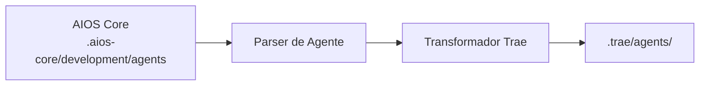

# Guia AIOS para Trae

> **Editor de Código IA da ByteDance** - Desenvolvimento de Iteração Rápida

---

## Visão Geral

### O que é o Trae?

Trae (The Real AI Engineer) é um editor de código com IA desenvolvido pela ByteDance. Construído sobre a base do VS Code, ele combina uma interface elegante com poderosas capacidades de IA, focando em velocidade e experiência do desenvolvedor. O Trae integra modelos Claude 3.7 Sonnet e GPT-4o, ambos atualmente disponíveis gratuitamente.

### Por que usar AIOS com Trae?

O Trae oferece uma experiência de desenvolvimento moderna:

- **UI Moderna**: Interface limpa e rápida
- **Ativação @mention**: Ativação padrão de agentes
- **Iteração Rápida**: Ciclos de feedback rápidos
- **Modo Builder**: Ambiente de desenvolvimento focado
- **Regras de Projeto**: Configuração personalizada de projeto
- **MCP Limitado**: Extensibilidade básica

### Comparação com Outras Plataformas

| Recurso | Trae | Cursor | Claude Code |
|---------|:----:|:------:|:-----------:|
| UI Moderna | Sim | Sim | Não |
| Ativação @mention | Sim | Sim | /comando |
| Modo Builder | Sim | Composer | Task Tool |
| Suporte MCP | Limitado | Config | Nativo |
| Foco em Velocidade | Sim | Moderado | Moderado |

---

## Requisitos

### Requisitos de Sistema

| Requisito | Mínimo | Recomendado |
|-----------|--------|-------------|
| **RAM** | 4GB | 8GB+ |
| **Espaço em Disco** | 500MB | 1GB+ |
| **SO** | macOS 11+, Windows 10+, Linux | Última versão |
| **Node.js** | 18.0+ (para AIOS) | 20.0+ |

### Requisitos de Conta

- **Conta Trae** (completamente gratuito)
- Acesso integrado a Claude 3.7 Sonnet e GPT-4o sem custo
- Nenhuma chave de API necessária para uso básico

---

## Instalação

### Passo 1: Instalar o Trae

1. Baixe de [trae.ai](https://trae.ai)
2. Execute o instalador
3. Inicie e crie conta

```bash
# macOS (se Homebrew cask disponível)
brew install --cask trae

# Ou baixe do site
```

### Passo 2: Instalar o AIOS

```bash
cd seu-projeto
npx @anthropic/aios init
# Selecione "Trae" quando solicitado
```

### Passo 3: Verificar a Instalação

```bash
ls -la .trae/
```

Estrutura esperada:
```
.trae/
├── rules.md           # Regras principais
├── agents/            # Definições de agentes
│   ├── dev.md
│   ├── qa.md
│   └── ...
└── settings.json      # Configurações locais
```

---

## Configuração

### Arquivo de Regras

**Localização:** `.trae/rules.md`

```markdown
# Regras Synkra AIOS para Trae

## Sistema de Agentes
- Use @nome-agente para ativar agentes
- Siga workflows dos agentes

## Padrões de Desenvolvimento
- Escreva código limpo e testado
- Siga padrões existentes
- Foco em iteração rápida
```

### Arquivos de Agente

**Localização:** `.trae/agents/`

```markdown
# Agente Desenvolvedor (@dev)

## Papel
Desenvolvedor Full Stack Sênior

## Expertise
- TypeScript/JavaScript
- Node.js, React
- Prototipagem rápida
- Práticas de código limpo

## Fluxo de Trabalho
1. Entender requisitos rapidamente
2. Prototipar solução
3. Iterar baseado em feedback
4. Polir e testar
```

### Configurações

**Localização:** `.trae/settings.json`

```json
{
  "ai": {
    "model": "default",
    "temperature": 0.7
  },
  "rules": {
    "enabled": true,
    "path": ".trae/rules.md"
  },
  "builder": {
    "autoSave": true,
    "previewOnSave": true
  }
}
```

---

## Uso Básico

### Iniciando o Trae

1. Abra seu projeto no Trae
2. Regras carregam automaticamente de `.trae/rules.md`
3. Use o painel de IA para interações

### Ativando Agentes

Use @mentions no chat:

```
@dev         # Agente desenvolvedor
@qa          # Agente engenheiro de QA
@architect   # Arquiteto de software
@pm          # Gerente de projeto
@analyst     # Analista de negócios
@devops      # Engenheiro DevOps
```

### Exemplos de Interação

```
@dev prototipe rapidamente um formulário de login de usuário

@qa faça uma revisão rápida de segurança do módulo auth

@architect esboce a arquitetura da API
```

### Modo Builder

Modo de desenvolvimento focado do Trae:

1. Pressione `Cmd/Ctrl + B` para entrar no Builder
2. Descreva o que quer construir
3. Itere com preview em tempo real
4. Saia com alterações aplicadas

```
# No modo Builder
@dev Crie um componente de navegação responsivo
- Menu hambúrguer mobile
- Navegação completa desktop
- Transições suaves
```

---

## Uso Avançado

### Fluxo de Trabalho de Iteração Rápida

```
@dev Vamos iterar no fluxo de checkout:
1. Primeiro, me mostre um formulário básico
2. Adicione validação
3. Conecte à API
4. Adicione estados de loading
```

### Sugestões Inline

O Trae fornece sugestões inline rápidas:
1. Comece a digitar código
2. Veja sugestões instantâneas
3. Tab para aceitar
4. Continue digitando para novas sugestões

### Provedores de Contexto

Adicione contexto às solicitações:

```
@dev Olhando para src/components/,
crie um novo componente Button seguindo os mesmos padrões

@qa Baseado nos testes existentes,
adicione testes para o novo componente Button
```

### Integração de Regras de Projeto

Camadas de regras para projetos complexos:

```
.trae/
├── rules.md              # Regras globais
├── rules/
│   ├── frontend.md       # Específico de frontend
│   ├── backend.md        # Específico de backend
│   └── testing.md        # Regras de teste
└── agents/
```

---

## Recursos Específicos do Trae

### Modo Builder

| Recurso | Descrição |
|---------|-----------|
| **Preview em Tempo Real** | Veja alterações instantaneamente |
| **Construção Iterativa** | Ciclos de feedback rápidos |
| **Foco em Componente** | Construa uma coisa por vez |
| **Auto-Save** | Nunca perca trabalho |

### Atalhos de Teclado

| Atalho | Ação |
|--------|------|
| `Cmd/Ctrl + B` | Alternar Modo Builder |
| `Cmd/Ctrl + I` | Abrir Chat IA |
| `Cmd/Ctrl + .` | Ações Rápidas |
| `Tab` | Aceitar sugestão |
| `Escape` | Cancelar/Fechar |

### Recursos de Velocidade

| Recurso | Descrição |
|---------|-----------|
| **Preview Instantâneo** | Alterações renderizam imediatamente |
| **Cache Inteligente** | Operações repetidas rápidas |
| **Processamento Paralelo** | Múltiplas operações ao mesmo tempo |

---

## Sincronização de Agentes

### Como Funciona



### Comandos de Sincronização

```bash
# Sincronizar todos os agentes
npm run sync:agents

# Sincronizar para Trae
npm run sync:agents -- --ide trae
```

### Formato de Agente

O Trae usa formato project-rules:

```markdown
# Agente Desenvolvedor

**Ativação:** @dev

## Persona
Desenvolvedor Full Stack ágil focado em iteração rápida.

## Expertise
- TypeScript/JavaScript
- React, Vue, Svelte
- Node.js, Deno
- Prototipagem rápida

## Abordagem
- Comece simples, itere rapidamente
- Mostre código funcionando rápido
- Refine baseado em feedback
- Mantenha o momentum

## Estilo de Resposta
- Explicações concisas
- Código funcionando primeiro
- Iterações rápidas
- Próximos passos claros
```

---

## Limitações Conhecidas

### Limitações Atuais

| Limitação | Solução Alternativa |
|-----------|---------------------|
| MCP limitado | Use integrações básicas |
| Plataforma mais nova | Conjunto de recursos crescente |
| Comunidade menor | Use docs oficiais |

### Trae vs Cursor

| Aspecto | Trae | Cursor |
|---------|------|--------|
| Foco | Velocidade | Recursos |
| UI | Moderna | Estilo VS Code |
| MCP | Limitado | Config |
| Maturidade | Mais novo | Estabelecido |

---

## Troubleshooting

### Problemas Comuns

#### Regras Não Carregando
```
Problema: Agente não responde
```
**Solução:**
1. Verifique se `.trae/rules.md` existe
2. Verifique a sintaxe
3. Recarregue o Trae

#### Problemas no Modo Builder
```
Problema: Builder não faz preview
```
**Solução:**
1. Verifique se tipo de arquivo é suportado
2. Verifique se servidor de preview está rodando
3. Reinicie o modo Builder

#### Performance Lenta
```
Problema: Sugestões demorando muito
```
**Solução:**
1. Verifique conexão de rede
2. Reduza tamanho do contexto
3. Feche painéis não utilizados

### Logs

```bash
# Localização dos logs do Trae
# macOS: ~/Library/Application Support/Trae/logs/
# Windows: %APPDATA%\Trae\logs\
# Linux: ~/.config/Trae/logs/
```

---

## FAQ

**P: O que torna o Trae diferente?**
R: O Trae foca em velocidade e iteração rápida, com uma UI moderna projetada para ciclos de desenvolvimento rápidos.

**P: O Trae é gratuito?**
R: Sim, o Trae é completamente gratuito sem custos ocultos. Inclui acesso gratuito aos modelos Claude 3.7 Sonnet e GPT-4o.

**P: Posso usar modelos externos?**
R: Suporte limitado para chaves de API externas.

**P: Quão maduro é o Trae?**
R: Plataforma mais nova, ativamente desenvolvida com recursos crescentes.

---

## Migração

### Do Cursor para Trae

1. Instale AIOS para Trae:
   ```bash
   npx @anthropic/aios init --ide trae
   ```
2. Agentes transformam para formato Trae

### Do Trae para Outras IDEs

1. Agentes AIOS em `.aios-core/` são portáveis
2. Inicialize para a IDE de destino
3. Agentes transformam automaticamente

---

## Recursos Adicionais

- [Site Oficial do Trae](https://www.trae.ai/)
- [Download Trae IDE](https://traeide.com/)
- [Trae Agent (GitHub)](https://github.com/bytedance/trae-agent)
- [Guia de Plataformas AIOS](../README.md)

> **Nota:** O Trae é desenvolvido pela ByteDance. Como um fork do VS Code, a maioria das extensões do VS Code são compatíveis.

---

*Synkra AIOS - Guia da Plataforma Trae v1.0*
