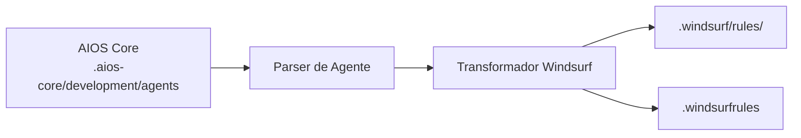

# Guia AIOS para Windsurf

> **Ambiente de Desenvolvimento com IA** - Inovação Cascade Flow

---

## Visão Geral

### O que é o Windsurf?

Windsurf é um ambiente de desenvolvimento com IA que introduz o "Cascade" - uma abordagem inovadora para codificação assistida por IA que mantém contexto através de múltiplas interações e arquivos. Construído para desenvolvedores que querem integração profunda de IA em seu fluxo de trabalho.

### Por que usar AIOS com Windsurf?

O Windsurf oferece capacidades únicas para o AIOS:

- **Cascade Flow**: Mantém contexto através de operações complexas
- **Ativação @mention**: Sintaxe natural de ativação de agentes
- **Supercomplete**: Completação avançada de código
- **Sistema de Flows**: Execução automatizada de workflows
- **Suporte MCP**: Extensível via configuração
- **Formato XML-tagged**: Processamento estruturado de regras

### Comparação com Outras Plataformas

| Recurso | Windsurf | Cursor | Claude Code |
|---------|:--------:|:------:|:-----------:|
| Cascade Flow | Sim | Não | Não |
| Ativação @mention | Sim | Sim | /comando |
| Supercomplete | Sim | Tab | Tab |
| Suporte MCP | Config | Config | Nativo |
| Formato XML | Sim | Não | Não |

---

## Requisitos

### Requisitos de Sistema

| Requisito | Mínimo | Recomendado |
|-----------|--------|-------------|
| **RAM** | 4GB | 8GB+ |
| **Espaço em Disco** | 500MB | 1GB+ |
| **SO** | macOS 10.15+, Windows 10+, Linux | Última versão |
| **Node.js** | 18.0+ (para AIOS) | 20.0+ |

### Requisitos de Conta

- **Conta Windsurf** (tier gratuito disponível)
- **Chaves de API** (opcional): Configurar modelos externos

---

## Instalação

### Passo 1: Instalar o Windsurf

1. Baixe em [codeium.com/windsurf](https://codeium.com/windsurf)
2. Execute o instalador
3. Inicie e crie conta

```bash
# macOS (via Homebrew se disponível)
brew install --cask windsurf

# Ou baixe diretamente
```

### Passo 2: Instalar o AIOS

```bash
cd seu-projeto
npx @anthropic/aios init
# Selecione "Windsurf" quando solicitado
```

### Passo 3: Verificar a Instalação

```bash
ls -la .windsurfrules
ls -la .windsurf/
```

Estrutura esperada:
```
projeto/
├── .windsurfrules          # Arquivo de regras principal
└── .windsurf/
    └── rules/              # Regras de agentes
        ├── dev.md
        ├── qa.md
        └── ...
```

---

## Configuração

### Arquivo de Regras Principal

**Localização:** `.windsurfrules` (diretório raiz)

Este arquivo usa formato markdown com tags XML:

```markdown
<rules>
# Regras de Desenvolvimento Synkra AIOS

## Integração de Agentes
- Use @nome-agente para ativar agentes
- Siga workflows específicos do agente

## Padrões de Desenvolvimento
- Escreva código limpo e testado
- Siga convenções do projeto
</rules>

<context>
Contexto específico do projeto vai aqui
</context>
```

### Regras de Agentes

**Localização:** `.windsurf/rules/`

Cada arquivo de agente segue o formato XML-tagged:

```markdown
<agent name="dev">
# Agente Desenvolvedor

## Expertise
- Desenvolvimento full-stack
- Práticas de código limpo

## Fluxo de Trabalho
1. Entender requisitos
2. Planejar implementação
3. Escrever código testado
</agent>
```

### Configuração MCP

```json
{
  "mcpServers": {
    "filesystem": {
      "command": "npx",
      "args": ["-y", "@modelcontextprotocol/server-filesystem", "."]
    }
  }
}
```

---

## Uso Básico

### Iniciando o Windsurf

1. Abra seu projeto no Windsurf
2. Regras são carregadas automaticamente de `.windsurfrules`
3. Use o painel de IA para interações

### Ativando Agentes

Use @mentions no chat de IA:

```
@dev         # Agente desenvolvedor
@qa          # Agente engenheiro de QA
@architect   # Arquiteto de software
@pm          # Gerente de projeto
@po          # Product owner
@sm          # Scrum master
@analyst     # Analista de negócios
@devops      # Engenheiro DevOps
```

### Exemplos de Interação

```
@dev implemente a autenticação de usuário seguindo a story

@qa revise este módulo para vulnerabilidades de segurança

@architect projete a arquitetura do API gateway
```

### Usando o Cascade

O Cascade mantém contexto entre interações:

```
# Primeira interação
@dev Crie um modelo de usuário com validação

# O Cascade lembra o contexto
Agora adicione a camada de repositório

# Continua com o mesmo contexto
Adicione testes unitários para o repositório
```

---

## Uso Avançado

### Workflows Cascade

#### Implementação Multi-etapa
```
@dev @cascade
1. Criar o schema do banco de dados
2. Gerar migrations
3. Implementar a camada de modelo
4. Adicionar endpoints de API
5. Escrever testes de integração
```

#### Refatoração Complexa
```
@architect @cascade
Refatore o módulo de pagamento:
- Extrair interfaces
- Implementar padrão strategy
- Atualizar todos os consumidores
- Manter compatibilidade retroativa
```

### Supercomplete

Completação avançada do Windsurf:

1. Comece a digitar código
2. Aguarde sugestões do Supercomplete
3. Tab para aceitar, Escape para dispensar
4. Supercomplete considera contexto completo do arquivo

### Flows

Execução automatizada de workflow:

```yaml
# .windsurf/flows/deploy.yaml
name: Deploy Flow
steps:
  - run: npm test
  - run: npm run build
  - run: npm run deploy
```

### Tags de Contexto

Use tags XML para contexto estruturado:

```markdown
<context type="database">
Usando PostgreSQL 14 com Prisma ORM
</context>

<context type="api">
API RESTful com Express.js
</context>
```

---

## Recursos Específicos do Windsurf

### Painel Cascade

| Recurso | Descrição |
|---------|-----------|
| **Memória de Contexto** | Lembra entre interações |
| **Rastreamento de Arquivos** | Rastreia arquivos modificados |
| **Visualização Diff** | Mostra todas as alterações |
| **Rollback** | Desfazer alterações do cascade |

### Atalhos de Teclado

| Atalho | Ação |
|--------|------|
| `Cmd/Ctrl + I` | Abrir painel IA |
| `Cmd/Ctrl + Shift + I` | Modo Cascade |
| `Tab` | Aceitar Supercomplete |
| `Escape` | Dispensar sugestão |
| `Cmd/Ctrl + Z` | Desfazer etapa cascade |

### Tags de Regras XML

| Tag | Propósito |
|-----|-----------|
| `<rules>` | Seção de regras principal |
| `<context>` | Contexto do projeto |
| `<agent>` | Definição de agente |
| `<patterns>` | Padrões de código |
| `<constraints>` | Limitações |

---

## Sincronização de Agentes

### Como Funciona



### Comandos de Sincronização

```bash
# Sincronizar todos os agentes
npm run sync:agents

# Sincronizar com formato Windsurf
npm run sync:agents -- --ide windsurf
```

### Formato de Agente

Agentes Windsurf usam markdown com tags XML:

```markdown
<agent name="dev" activation="@dev">
# Agente Desenvolvedor

<role>
Desenvolvedor Full Stack Sênior
</role>

<expertise>
- TypeScript/JavaScript
- Node.js, React
- Design de banco de dados
</expertise>

<workflow>
1. Ler requisitos da story
2. Planejar implementação
3. Escrever código limpo
4. Testar completamente
</workflow>
</agent>
```

---

## Limitações Conhecidas

### Limitações Atuais

| Limitação | Solução Alternativa |
|-----------|---------------------|
| Sem CLI nativo | Use GUI ou integre com terminal |
| Limites de contexto Cascade | Divida em cascades menores |
| MCP limitado | Apenas baseado em configuração |

### Windsurf vs Cursor

| Aspecto | Windsurf | Cursor |
|---------|----------|--------|
| Flow | Cascade | Composer |
| Formato | XML-tagged | Markdown |
| Completação | Supercomplete | Tab |

---

## Troubleshooting

### Problemas Comuns

#### Regras Não Carregando
```
Problema: .windsurfrules não reconhecido
```
**Solução:**
1. Verifique se o arquivo está na raiz do projeto
2. Confira se a sintaxe XML está válida
3. Reinicie o Windsurf

#### Cascade Perdeu Contexto
```
Problema: Cascade esquece contexto anterior
```
**Solução:**
1. Use `@cascade` explicitamente
2. Mantenha cascades focados
3. Verifique limites de contexto

#### Agente Não Ativando
```
Problema: @dev não reconhecido
```
**Solução:**
```bash
# Ressincronizar agentes
npm run sync:agents

# Verificar formato
cat .windsurf/rules/dev.md
```

### Localização de Logs

```bash
# macOS
~/Library/Application Support/Windsurf/logs/

# Windows
%APPDATA%\Windsurf\logs\

# Linux
~/.config/Windsurf/logs/
```

---

## FAQ

**P: O que é Cascade?**
R: Cascade é o recurso de IA do Windsurf que mantém contexto através de múltiplas interações, permitindo operações complexas de múltiplas etapas.

**P: Como o Windsurf é diferente do Cursor?**
R: O Windsurf usa Cascade para contexto contínuo, enquanto o Cursor usa Composer. O Windsurf também usa formato de regras XML-tagged.

**P: Posso usar o Windsurf offline?**
R: Edição básica funciona offline, mas recursos de IA requerem internet.

---

## Migração

### Do Cursor para Windsurf

1. Exporte regras do Cursor:
   ```bash
   cp .cursor/rules.md cursor-backup.md
   ```

2. Inicialize AIOS para Windsurf:
   ```bash
   npx @anthropic/aios init --ide windsurf
   ```

3. Regras convertem automaticamente para formato XML-tagged

### Do Windsurf para Outras IDEs

1. Agentes AIOS em `.aios-core/` são independentes de IDE
2. Inicialize para a IDE de destino
3. Agentes transformam automaticamente

---

## Recursos Adicionais

- [Documentação do Windsurf](https://codeium.com/windsurf/docs)
- [Comunidade Codeium](https://discord.gg/codeium)
- [Guia de Plataformas AIOS](../README.md)

---

*Synkra AIOS - Guia da Plataforma Windsurf v1.0*
