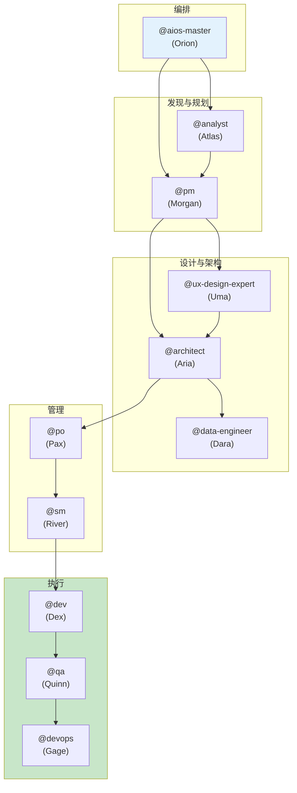

<!--
  翻译：zh-CN（简体中文）
  原文：/docs/aios-agent-flows/README.md
  最后同步：2026-02-22
-->

# AIOS 代理流程 - 代理详细文档

> 🌐 [PT](../../aios-agent-flows/README.md) | [EN](../../en/aios-agent-flows/README.md) | [ES](../../es/aios-agent-flows/README.md) | **ZH**

---

**版本：** 1.0.0
**最后更新：** 2026-02-05
**状态：** 官方文档

---

## 概述

此文件夹包含所有 AIOS 代理的详细文档，包括：

- 每个代理的**完整系统**
- 操作的 **Mermaid 流程图**
- 命令到任务的**映射**
- 代理之间的**集成**
- 涉及每个代理的**工作流**
- **最佳实践**和故障排除

---

## 已文档化的代理

| 代理 | 角色 | 原型 | 文档 |
|--------|---------|-----------|-----------|
| **@aios-master** | Orion | 编排者 | [aios-master-system.md](./aios-master-system.md) |
| **@analyst** | Atlas | 研究员 | [analyst-system.md](./analyst-system.md) |
| **@architect** | Aria | 愿景者 | [architect-system.md](./architect-system.md) |
| **@data-engineer** | Dara | 数据圣人 | [data-engineer-system.md](./data-engineer-system.md) |
| **@dev** | Dex | 构建者 | [dev-system.md](./dev-system.md) |
| **@devops** | Gage | 守护者 | [devops-system.md](./devops-system.md) |
| **@pm** | Morgan | 策略师 | [pm-system.md](./pm-system.md) |
| **@qa** | Quinn | 守护者 | [qa-system.md](./qa-system.md) |
| **@sm** | River | 协调者 | [sm-system.md](./sm-system.md) |
| **@squad-creator** | Nova | 创建者 | [squad-creator-system.md](./squad-creator-system.md) |
| **@ux-design-expert** | Uma | 设计师 | [ux-design-expert-system.md](./ux-design-expert-system.md) |

---

## 每个文档的结构

每个代理文档都遵循以下标准结构：

```
1. 概述
   - 主要职责
   - 核心原则

2. 完整文件列表
   - 核心任务
   - 代理定义
   - 模板
   - 检查清单
   - 相关文件

3. 系统流程图
   - 完整的 Mermaid 图
   - 操作流程

4. 命令映射
   - 命令 → 任务
   - 参数和选项

5. 相关工作流
   - 使用该代理的工作流
   - 代理在每个工作流中的角色

6. 代理之间的集成
   - 从谁接收输入
   - 向谁提供输出
   - 协作

7. 配置
   - 配置文件
   - 可用工具
   - 限制

8. 最佳实践
   - 何时使用
   - 避免什么

9. 故障排除
   - 常见问题
   - 解决方案

10. 变更日志
    - 版本历史
```

---

## 代理关系图



---

## 如何使用本文档

### 了解代理

1. 访问所需代理的文档
2. 阅读**概述**了解角色
3. 查阅**命令**了解功能
4. 查看**工作流**了解上下文

### 调试问题

1. 直接转到**故障排除**部分
2. 查阅**流程图**了解流程
3. 检查**集成**了解依赖关系

### 扩展系统

1. 分析**文件列表**了解需要修改什么
2. 遵循**最佳实践**保持一致性
3. 更改后更新**变更日志**

---

## 与其他文档的关系

| 文档 | 位置 | 目的 |
|--------------|-------------|-----------|
| 代理参考指南 | [docs/agent-reference-guide.md](../agent-reference-guide.md) | 快速参考 |
| 工作流指南 | [docs/guides/workflows-guide.md](../guides/workflows-guide.md) | 工作流指南 |
| AIOS 工作流 | [docs/aios-workflows/](../aios-workflows/) | 工作流详情 |
| 架构 | [docs/architecture/](../architecture/) | 技术架构 |

---

## 贡献

添加或更新代理文档时：

1. 遵循上述标准结构
2. 包含更新的 Mermaid 图
3. 保持变更日志更新
4. 创建 EN 和 ES 翻译

---

*AIOS 代理流程文档 v1.0 - 代理系统详细文档*
