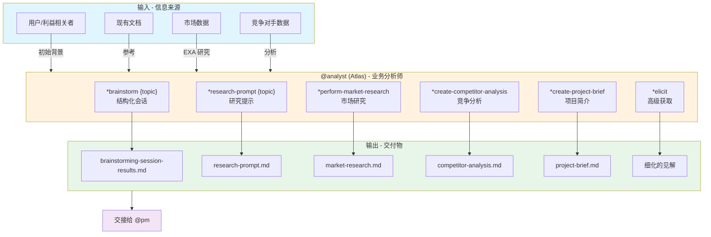
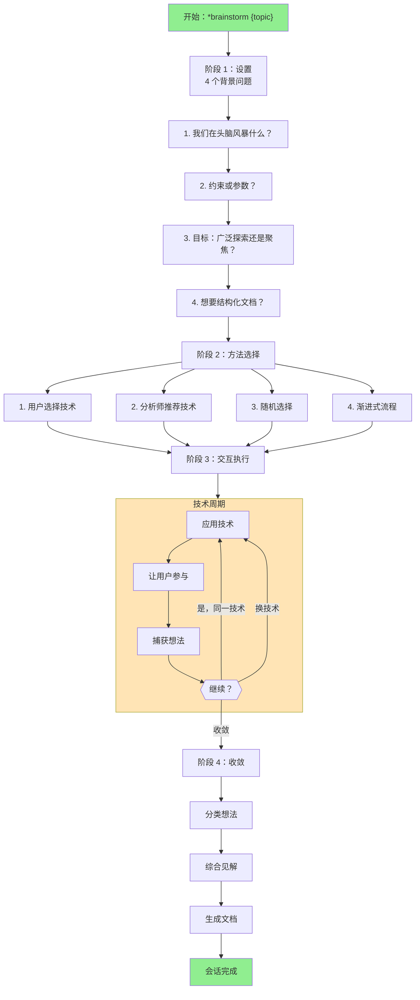
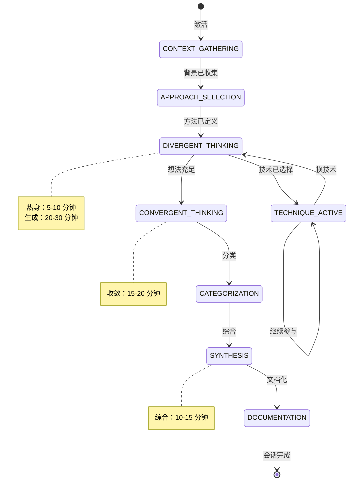
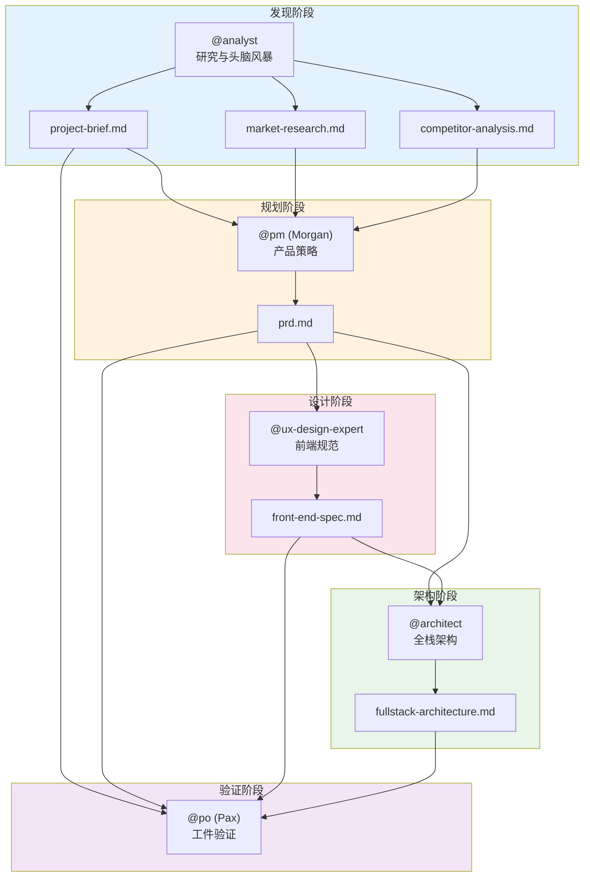
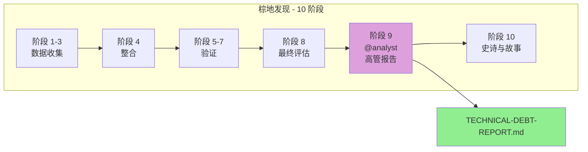

<!--
  翻译：zh-CN（简体中文）
  原文：/docs/aios-agent-flows/analyst-system.md
  最后同步：2026-02-22
-->

# 分析师代理 (@analyst) 系统 - AIOS

> **版本：** 1.0.0
> **创建日期：** 2026-02-04
> **负责人：** @analyst (Atlas)
> **状态：** 官方文档

---

## 概述

本文档描述 **@analyst (Atlas)** 代理的完整系统，包括所有涉及的文件、工作流程、可用命令、模板和代理之间的集成。

分析师代理设计用于：
- 进行市场研究和竞争分析
- 促进结构化的头脑风暴会话
- 创建项目简介和深度研究提示
- 为决策提供可操作的见解
- 支持项目发现（棕地文档）
- 生成高管意识报告

---

## 代理资料

| 属性 | 值 |
|----------|-------|
| **名称** | Atlas |
| **ID** | analyst |
| **标题** | 业务分析师 |
| **图标** | :mag: |
| **原型** | 解码者 |
| **星座** | :scorpius: 天蝎座 |
| **语气** | 分析性、好奇、创意 |
| **签名** | "-- Atlas，探究真相 :mag_right:" |

### 核心原则

1. **好奇心驱动的探究** - 主动提问以发现潜在真相
2. **客观和基于证据的分析** - 基于可验证的数据
3. **战略情境化** - 在更广泛的战略背景下定位
4. **促进清晰和共同理解** - 精确表达需求
5. **创意探索和发散思维** - 收敛前广泛生成想法
6. **结构化和有条理的方法** - 系统方法确保全面性
7. **以行动为导向的输出** - 清晰可操作的交付物
8. **协作伙伴关系** - 迭代细化的伙伴关系
9. **保持广泛视角** - 对市场趋势的意识
10. **信息诚信** - 准确表示来源

---

## 完整文件列表

### 代理核心文件

| 文件 | 目的 |
|---------|-----------|
| `.aios-core/development/agents/analyst.md` | 分析师代理核心定义 |
| `.claude/commands/AIOS/agents/analyst.md` | 用于激活 @analyst 的 Claude Code 命令 |

### 分析师任务

| 文件 | 命令 | 目的 |
|---------|---------|-----------|
| `.aios-core/development/tasks/facilitate-brainstorming-session.md` | `*brainstorm {topic}` | 主要任务 - 促进结构化头脑风暴会话 |
| `.aios-core/development/tasks/analyst-facilitate-brainstorming.md` | `*brainstorm {topic}` | 头脑风暴任务的交互变体 |
| `.aios-core/development/tasks/create-deep-research-prompt.md` | `*research-prompt {topic}` | 生成深度研究调查提示 |
| `.aios-core/development/tasks/advanced-elicitation.md` | `*elicit` | 高级需求获取会话 |
| `.aios-core/development/tasks/create-doc.md` | `*doc-out` | 从 YAML 模板创建文档 |
| `.aios-core/development/tasks/document-project.md` | `*create-project-brief` | 现有项目文档 |
| `.aios-core/development/tasks/calculate-roi.md` | (相关) | ROI 和成本节约计算 |

### 相关分析任务

| 文件 | 目的 |
|---------|-----------|
| `.aios-core/development/tasks/analyze-brownfield.md` | 棕地项目分析 |
| `.aios-core/development/tasks/analyze-framework.md` | 现有框架分析 |
| `.aios-core/development/tasks/analyze-performance.md` | 性能分析 |
| `.aios-core/development/tasks/analyze-project-structure.md` | 项目结构分析 |
| `.aios-core/development/tasks/analyze-cross-artifact.md` | 跨工件分析 |

### 分析师模板

| 文件 | 目的 |
|---------|-----------|
| `.aios-core/product/templates/project-brief-tmpl.yaml` | 项目简介模板 |
| `.aios-core/product/templates/market-research-tmpl.yaml` | 市场研究模板 |
| `.aios-core/product/templates/competitor-analysis-tmpl.yaml` | 竞争分析模板 |
| `.aios-core/product/templates/brainstorming-output-tmpl.yaml` | 头脑风暴会话输出模板 |

### 数据文件

| 文件 | 目的 |
|---------|-----------|
| `.aios-core/development/data/aios-kb.md` | AIOS 知识库 |
| `.aios-core/development/data/brainstorming-techniques.md` | 可用的头脑风暴技术 |

### 使用分析师的工作流

| 文件 | 阶段 | 目的 |
|---------|------|-----------|
| `.aios-core/development/workflows/greenfield-fullstack.yaml` | 阶段 1 | 发现与规划 - 创建 project-brief.md |
| `.aios-core/development/workflows/brownfield-discovery.yaml` | 阶段 9 | 高管意识报告 |

---

## 流程图：分析师完整系统



### 头脑风暴流程图



### 会话状态图



---

## 流程图：与其他代理的集成



### 棕地发现工作流流程



---

## 命令到任务的映射

### 研究与分析命令

| 命令 | 任务文件 | 操作 |
|---------|-----------|----------|
| `*perform-market-research` | `create-doc.md` + 模板 | 创建市场研究报告 |
| `*create-competitor-analysis` | `create-doc.md` + 模板 | 创建详细竞争分析 |
| `*research-prompt {topic}` | `create-deep-research-prompt.md` | 生成深度研究提示 |

### 构思与发现命令

| 命令 | 任务文件 | 操作 |
|---------|-----------|----------|
| `*brainstorm {topic}` | `facilitate-brainstorming-session.md` | 促进结构化头脑风暴会话 |
| `*create-project-brief` | `document-project.md` | 创建项目简介 |
| `*elicit` | `advanced-elicitation.md` | 高级获取会话 |

### 工具命令

| 命令 | 操作 |
|---------|----------|
| `*help` | 显示所有可用命令 |
| `*doc-out` | 输出完整文档 |
| `*session-info` | 显示当前会话详情 |
| `*guide` | 代理使用指南 |
| `*yolo` | 切换跳过确认 |
| `*exit` | 退出分析师模式 |

---

## 模板和数据结构

### 项目简介模板

```yaml
template:
  id: project-brief-template-v2
  name: 项目简介
  version: 2.0
  output:
    format: markdown
    filename: docs/brief.md
```

**主要部分：**
- 执行摘要
- 问题陈述
- 建议解决方案
- 目标用户（主要/次要）
- 目标与成功指标
- MVP 范围（核心功能/范围外）
- MVP 后愿景
- 技术考虑
- 约束与假设
- 风险与开放问题

### 市场研究模板

```yaml
template:
  id: market-research-template-v2
  name: 市场研究报告
  version: 2.0
  output:
    format: markdown
    filename: docs/market-research.md
```

**主要部分：**
- 执行摘要
- 研究目标与方法
- 市场概览（TAM/SAM/SOM、趋势）
- 客户分析（细分、JTBD、旅程）
- 竞争格局
- 行业分析（波特五力）
- 机会评估
- 战略建议

### 竞争分析模板

```yaml
template:
  id: competitor-analysis-template-v2
  name: 竞争分析报告
  version: 2.0
  output:
    format: markdown
    filename: docs/competitor-analysis.md
```

**主要部分：**
- 执行摘要
- 分析范围与方法
- 竞争格局概览
- 单个竞争对手档案
- 比较分析（功能、SWOT、定位）
- 战略分析（蓝海、漏洞）
- 战略建议
- 监控与情报计划

### 头脑风暴输出模板

```yaml
template:
  id: brainstorming-output-template-v2
  name: 头脑风暴会话结果
  version: 2.0
  output:
    format: markdown
    filename: docs/brainstorming-session-results.md
```

**主要部分：**
- 执行摘要（主题、技术、想法数量）
- 技术会话（每个使用的技术）
- 想法分类
  - 即时机会
  - 未来创新
  - 登月计划
  - 见解与学习
- 行动规划（前 3 优先事项）
- 反思与后续

---

## 深度研究流程

### 研究焦点类型

1. **产品验证研究** - 验证假设和市场契合度
2. **市场机会研究** - 市场规模和潜力
3. **用户和客户研究** - 人物画像、JTBD、痛点
4. **竞争情报研究** - 详细竞争对手分析
5. **技术和创新研究** - 趋势和技术评估
6. **行业和生态系统研究** - 价值链和动态
7. **战略选项研究** - 评估战略方向
8. **风险和可行性研究** - 识别和评估风险
9. **自定义研究焦点** - 定制目标

### 研究提示结构

```markdown
## 研究目标
[明确的目标陈述]

## 背景上下文
[来自输入的相关信息]

## 研究问题
### 主要问题（必须回答）
1. [具体、可操作的问题]
...

### 次要问题（可选）
1. [支持性问题]
...

## 研究方法
### 信息来源
- [来源类型和优先级]

### 分析框架
- [具体框架]

## 预期交付物
### 执行摘要
- 关键发现和见解
- 关键影响
- 建议的行动

## 成功标准
[如何评估研究是否达到目标]
```

---

## 工具和集成

### 可用工具

| 工具 | 目的 |
|------------|-----------|
| **exa** | 高级网络搜索市场和技术 |
| **context7** | 库文档查找 |
| **google-workspace** | 研究文档（Drive、Docs、Sheets） |
| **clickup** | 捕获和组织想法 |

### 与其他代理的集成

| 代理 | 协作类型 |
|--------|---------------------|
| **@pm (Morgan)** | 分析师为 PRD 创建提供研究和分析 |
| **@po (Pax)** | 分析师提供市场见解和竞争分析 |
| **@architect** | 分析师可提供技术研究 |
| **@ux-design-expert** | 分析师提供用户研究支持 UX 决策 |

---

## 执行模式

### 1. YOLO 模式 - 快速自主（0-1 提示）
- 带日志的自主决策
- 与用户最小交互
- **最适合：** 简单、确定性的任务

### 2. 交互模式 - 平衡教育（5-10 提示）[默认]
- 明确的决策检查点
- 教育性解释
- **最适合：** 学习、复杂决策

### 3. 预检规划 - 全面规划
- 任务分析阶段（识别歧义）
- 零歧义执行
- **最适合：** 模糊需求、关键工作

---

## 最佳实践

### 市场研究

1. **定义清晰目标** - 知道研究将支持什么决策
2. **使用多个来源** - 结合一手和二手来源
3. **尽可能量化** - TAM/SAM/SOM 有清晰计算
4. **识别假设** - 记录限制和前提
5. **聚焦可操作见解** - 不仅是数据，还有建议

### 竞争分析

1. **优先排序竞争对手** - 使用优先级矩阵（市场份额 vs 威胁）
2. **深度分析优先级 1-2** - 详细档案
3. **持续监控** - 建立更新节奏
4. **识别蓝海** - 寻找未竞争的市场空间
5. **记录来源** - 用于验证和未来更新

### 头脑风暴会话

1. **做促进者，而非生成者** - 引导用户生成自己的想法
2. **一次一个技术** - 不要混合多个技术
3. **数量优先于质量** - 目标：60 分钟 100 个想法
4. **延迟判断** - 先生成，后评估
5. **记录所有** - 捕获即使"疯狂"的想法
6. **管理精力** - 监控参与度，提供休息

### 高级获取

1. **方法前的背景** - 选择方法前分析内容
2. **使用 1-9 格式** - 始终展示编号选项
3. **提供详细理由** - 解释权衡和决策
4. **等待响应** - 不要在没有用户输入时继续
5. **保持简洁** - 聚焦可操作见解

---

## 故障排除

### 头脑风暴会话停滞

**症状：** 用户停止生成想法，回应简短

**解决方案：**
1. 检查精力水平："您对这个方向感觉如何？"
2. 提供换技术："想尝试不同的方法吗？"
3. 使用更具体的提示
4. 休息后再继续

### 研究数据不足

**症状：** EXA 返回少量结果，小众市场

**解决方案：**
1. 扩大搜索范围（相关术语）
2. 使用相邻市场的类比
3. 结合一手研究（访谈）
4. 清楚记录差距和不确定性

### 项目简介不完整

**症状：** 部分模糊，缺乏具体性

**解决方案：**
1. 使用高级获取深入
2. 要求具体例子
3. 用场景挑战假设
4. 必要时多会话迭代

### 竞争分析肤浅

**症状：** 只有竞争对手列表没有见解

**解决方案：**
1. 应用结构化框架（波特、SWOT）
2. 聚焦差异化和漏洞
3. 包括定位分析
4. 生成具体战略建议

---

## 参考

### 主要任务

- [任务：facilitate-brainstorming-session.md](.aios-core/development/tasks/facilitate-brainstorming-session.md)
- [任务：create-deep-research-prompt.md](.aios-core/development/tasks/create-deep-research-prompt.md)
- [任务：advanced-elicitation.md](.aios-core/development/tasks/advanced-elicitation.md)
- [任务：create-doc.md](.aios-core/development/tasks/create-doc.md)
- [任务：document-project.md](.aios-core/development/tasks/document-project.md)

### 模板

- [模板：project-brief-tmpl.yaml](.aios-core/product/templates/project-brief-tmpl.yaml)
- [模板：market-research-tmpl.yaml](.aios-core/product/templates/market-research-tmpl.yaml)
- [模板：competitor-analysis-tmpl.yaml](.aios-core/product/templates/competitor-analysis-tmpl.yaml)
- [模板：brainstorming-output-tmpl.yaml](.aios-core/product/templates/brainstorming-output-tmpl.yaml)

### 工作流

- [工作流：greenfield-fullstack.yaml](.aios-core/development/workflows/greenfield-fullstack.yaml)
- [工作流：brownfield-discovery.yaml](.aios-core/development/workflows/brownfield-discovery.yaml)

### 代理

- [代理：analyst.md](.aios-core/development/agents/analyst.md)

---

## 摘要

| 方面 | 详情 |
|---------|----------|
| **核心任务总数** | 6 个任务文件 |
| **模板总数** | 4 个 YAML 模板 |
| **研究命令** | 3 个（`*perform-market-research`、`*create-competitor-analysis`、`*research-prompt`） |
| **构思命令** | 3 个（`*brainstorm`、`*create-project-brief`、`*elicit`） |
| **使用的工作流** | 2 个（greenfield-fullstack、brownfield-discovery） |
| **消费代理** | @pm、@po、@architect、@ux-design-expert |
| **集成工具** | exa、context7、google-workspace、clickup |
| **执行模式** | 3 种（YOLO、交互式、预检） |

---

## 变更日志

| 日期 | 作者 | 描述 |
|------|-------|-----------|
| 2026-02-04 | @analyst | 创建包含流程图和完整映射的初始文档 |

---

*-- Atlas，探究真相 :mag_right:*
