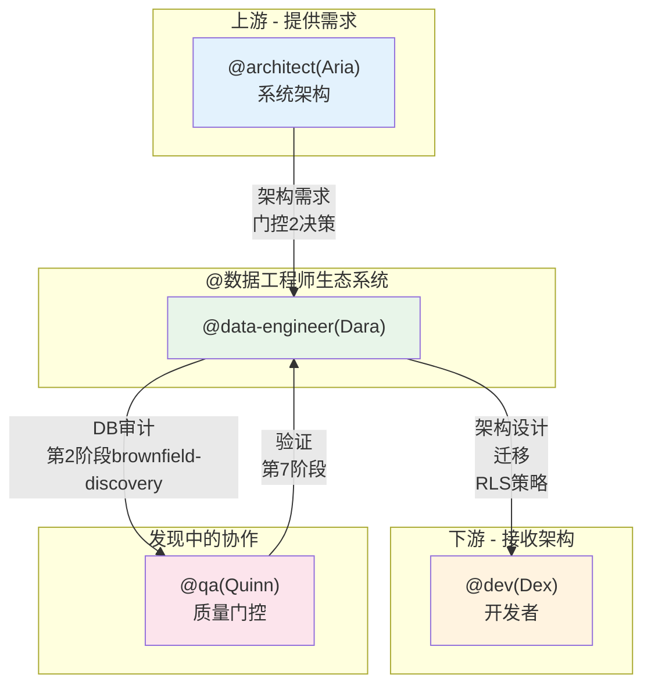

# 数据工程师代理系统 (@data-engineer) - AIOS

> **版本:** 1.0.0
> **创建于:** 2026-02-04
> **所有者:** @data-engineer (Dara - The Sage)
> **状态:** 官方文档

---

## 概览

**@数据工程师(Dara)**是AIOS的数据库架构师和运营工程师，负责架构设计、迁移、安全性(RLS)、性能优化和DBA操作。该代理充当**Sage(智者)**，建模业务领域，使用快照和回滚实现安全迁移，并确保数据完整性和安全性。

### 主要特征

| 特征 | 描述 |
|------|------|
| **角色名** | Dara - The Sage |
| **原型** | Sage / Gemini |
| **语气** | 技术、精确、方法性、安全意识强 |
| **焦点** | 架构设计、迁移、RLS、性能、DBA操作 |
| **签名** | "-- Dara，架构数据" |

### 数据库的关键原则

- **正确性优先于速度** - 先正确，再优化
- **一切版本化和可逆** - 快照+回滚脚本
- **默认安全** - RLS、约束、触发器确保一致性
- **处处幂等** - 安全多次执行操作
- **领域驱动设计** - 建模前理解业务
- **访问模式优先** - 基于如何查询数据的设计
- **深度防御** - RLS+默认值+检查约束+触发器
- **集成可观测性** - 日志、指标、执行计划
- **零停机为目标** - 仔细规划迁移

### 特征词汇

- 查询
- 建模
- 存储
- 配置
- 规范化
- 索引
- 迁移

---

## 完整文件列表

### @data-engineer的核心任务文件

| 文件 | 命令 | 目的 |
|------|------|------|
| `.aios-core/development/tasks/db-domain-modeling.md` | `*model-domain` | 交互式域建模会话 |
| `.aios-core/development/tasks/setup-database.md` | `*setup-database [type]` | 数据库项目设置(Supabase、PostgreSQL、MongoDB、MySQL、SQLite) |
| `.aios-core/development/tasks/db-bootstrap.md` | `*bootstrap` | 创建标准Supabase项目结构 |
| `.aios-core/development/tasks/db-env-check.md` | `*env-check` | 验证数据库环境变量 |
| `.aios-core/development/tasks/db-apply-migration.md` | `*apply-migration {path}` | 应用迁移(含快照和锁定建议) |
| `.aios-core/development/tasks/db-dry-run.md` | `*dry-run {path}` | 测试迁移无提交 |
| `.aios-core/development/tasks/db-seed.md` | `*seed {path}` | 应用种子数据(幂等) |
| `.aios-core/development/tasks/db-snapshot.md` | `*snapshot {label}` | 创建架构快照 |
| `.aios-core/development/tasks/db-rollback.md` | `*rollback {snapshot_or_file}` | 恢复快照或执行回滚 |
| `.aios-core/development/tasks/db-smoke-test.md` | `*smoke-test {version}` | 全面的数据库测试 |
| `.aios-core/development/tasks/security-audit.md` | `*security-audit {scope}` | 安全审计(rls、架构、完整) |
| `.aios-core/development/tasks/analyze-performance.md` | `*analyze-performance {type}` | 性能分析(查询、热路径、交互) |
| `.aios-core/development/tasks/db-policy-apply.md` | `*policy-apply {table} {mode}` | 安装RLS策略(KISS或详细) |
| `.aios-core/development/tasks/test-as-user.md` | `*test-as-user {user_id}` | 模拟用户以测试RLS |
| `.aios-core/development/tasks/db-verify-order.md` | `*verify-order {path}` | 验证DDL顺序以处理依赖 |
| `.aios-core/development/tasks/db-load-csv.md` | `*load-csv {table} {file}` | 安全的CSV加载程序(staging->merge) |
| `.aios-core/development/tasks/db-run-sql.md` | `*run-sql {file_or_inline}` | 执行原始SQL(含事务) |
| `.aios-core/development/tasks/create-deep-research-prompt.md` | `*research {topic}` | 生成深度研究提示 |
| `.aios-core/development/tasks/execute-checklist.md` | `*execute-checklist {checklist}` | 执行DBA检查清单 |
| `.aios-core/development/tasks/create-doc.md` | `*doc-out` | 完整文档输出 |

### 代理定义文件

| 文件 | 目的 |
|------|------|
| `.aios-core/development/agents/data-engineer.md` | @data-engineer代理核心定义(角色、命令、工作流) |
| `.claude/commands/AIOS/agents/data-engineer.md` | Claude Code命令激活@data-engineer |

### SQL模板文件

| 文件 | 目的 |
|------|------|
| `schema-design-tmpl.yaml` | 架构文档模板 |
| `rls-policies-tmpl.yaml` | RLS策略模板 |
| `migration-plan-tmpl.yaml` | 迁移计划模板 |
| `index-strategy-tmpl.yaml` | 索引策略模板 |
| `tmpl-migration-script.sql` | 迁移脚本模板 |
| `tmpl-rollback-script.sql` | 回滚脚本模板 |
| `tmpl-smoke-test.sql` | 烟雾测试模板 |
| `tmpl-rls-kiss-policy.sql` | RLS KISS策略模板 |
| `tmpl-rls-granular-policies.sql` | 详细RLS策略模板 |
| `tmpl-staging-copy-merge.sql` | CSV暂存合并模板 |
| `tmpl-seed-data.sql` | 种子数据模板 |
| `tmpl-comment-on-examples.sql` | COMMENT ON示例 |

### 检查清单文件

| 文件 | 目的 |
|------|------|
| `dba-predeploy-checklist.md` | 部署前DBA检查清单 |
| `dba-rollback-checklist.md` | 回滚检查清单 |
| `database-design-checklist.md` | 数据库设计检查清单 |

### 数据/知识文件

| 文件 | 目的 |
|------|------|
| `database-best-practices.md` | 数据库最佳实践 |
| `supabase-patterns.md` | Supabase模式 |
| `postgres-tuning-guide.md` | PostgreSQL调优指南 |
| `rls-security-patterns.md` | RLS安全模式 |
| `migration-safety-guide.md` | 迁移安全指南 |

### 使用@data-engineer的工作流

| 文件 | 目的 |
|------|------|
| `.aios-core/development/workflows/brownfield-discovery.yaml` | Brownfield发现工作流(第2和第5阶段) |

---

## 命令到任务的映射

### 架构和设计命令

| 命令 | 任务文件 | 操作 |
|------|---------|------|
| `*create-schema` | (内联) | 数据库架构设计 |
| `*create-rls-policies` | (内联) | RLS策略设计 |
| `*create-migration-plan` | (内联) | 创建迁移策略 |
| `*design-indexes` | (内联) | 索引策略设计 |
| `*model-domain` | `db-domain-modeling.md` | 交互式建模会话 |

### DBA操作命令

| 命令 | 任务文件 | 操作 |
|------|---------|------|
| `*setup-database [type]` | `setup-database.md` | 项目设置(supabase/postgresql/mongodb/mysql/sqlite) |
| `*bootstrap` | `db-bootstrap.md` | Supabase结构脚手架 |
| `*env-check` | `db-env-check.md` | 验证环境变量 |
| `*apply-migration {path}` | `db-apply-migration.md` | 应用迁移(含安全快照) |
| `*dry-run {path}` | `db-dry-run.md` | 测试迁移无提交 |
| `*seed {path}` | `db-seed.md` | 应用幂等种子数据 |
| `*snapshot {label}` | `db-snapshot.md` | 创建架构快照 |
| `*rollback {target}` | `db-rollback.md` | 恢复快照或回滚 |
| `*smoke-test {version}` | `db-smoke-test.md` | 验证测试 |

### 安全和性能命令(整合 - Story 6.1.2.3)

| 命令 | 任务文件 | 操作 |
|------|---------|------|
| `*security-audit rls` | `security-audit.md` | RLS覆盖审计 |
| `*security-audit schema` | `security-audit.md` | 架构质量审计 |
| `*security-audit full` | `security-audit.md` | 完整审计 |
| `*analyze-performance query` | `analyze-performance.md` | EXPLAIN ANALYZE查询 |
| `*analyze-performance hotpaths` | `analyze-performance.md` | 检测系统瓶颈 |
| `*analyze-performance interactive` | `analyze-performance.md` | 交互优化会话 |
| `*policy-apply {table} {mode}` | `db-policy-apply.md` | 安装RLS策略(KISS或详细) |
| `*test-as-user {user_id}` | `test-as-user.md` | 模拟用户测试RLS |
| `*verify-order {path}` | `db-verify-order.md` | 验证DDL顺序 |

### 数据操作命令

| 命令 | 任务文件 | 操作 |
|------|---------|------|
| `*load-csv {table} {file}` | `db-load-csv.md` | 安全的CSV加载程序 |
| `*run-sql {file_or_inline}` | `db-run-sql.md` | 执行SQL(含事务) |

### 上下文和会话命令

| 命令 | 操作 |
|------|------|
| `*help` | 显示所有可用命令 |
| `*guide` | 显示完整使用指南 |
| `*yolo` | 切换确认(跳过/要求) |
| `*exit` | 退出data-engineer模式 |
| `*doc-out` | 完整文档输出 |
| `*execute-checklist {checklist}` | 执行DBA检查清单 |
| `*research {topic}` | 生成深度研究提示 |

---

## 代理间的集成

### 协作图



### 当使用其他代理时

| 任务 | 代理 | 原因 |
|------|------|------|
| 系统架构 | @architect | 应用级模式、API设计 |
| 应用代码 | @dev | 仓库模式、DAL实现 |
| 前端设计 | @ux-design-expert | UI/UX设计 |
| Git操作 | @github-devops | 推送、PR、部署 |

---

## 配置

### 必需的环境变量

```bash
# Supabase数据库连接
SUPABASE_DB_URL="postgresql://postgres.[PASSWORD]@[PROJECT-REF].supabase.co:6543/postgres?sslmode=require"

# 用于备份/分析(直接连接)
# SUPABASE_DB_URL="postgresql://postgres.[PASSWORD]@[PROJECT-REF].supabase.co:5432/postgres"
```

### 标准目录结构(Supabase)

```
supabase/
├── migrations/      # 迁移文件
│   └── README.md
├── seeds/           # 种子数据
│   └── README.md
├── tests/           # 烟雾测试
│   └── README.md
├── rollback/        # 回滚脚本
│   └── README.md
├── snapshots/       # 架构快照
├── docs/            # 文档
│   ├── SCHEMA.md
│   └── migration-log.md
├── config.toml      # 本地配置
└── .gitignore
```

---

## 最佳实践

### 何时使用@data-engineer

**使用@data-engineer进行:**
- 数据库架构设计
- 域建模
- 迁移和版本控制
- RLS策略和安全性
- 查询优化和性能
- DBA操作(备份、恢复、烟雾测试)
- 安全和质量审计

**不要使用@data-engineer进行:**
- 系统架构(使用@architect)
- 应用代码(使用@dev)
- Git操作(使用@github-devops)
- 前端/UI(使用@ux-design-expert)

### 安全迁移工作流

```bash
# 1. 任何迁移前
*snapshot pre_migration

# 2. 测试迁移
*dry-run path/to/migration.sql

# 3. 应用迁移
*apply-migration path/to/migration.sql

# 4. 验证结果
*smoke-test
*security-audit rls

# 5. 如有问题
*rollback supabase/snapshots/{TS}_pre_migration.sql
```

### 表模式

每个表应有基线:
- `id`(UUID主键)
- `created_at`(时间戳)
- `updated_at`(时间戳)
- 关系的外键
- 默认启用RLS
- 外键和频繁查询列的索引

### 安全性

- 从不暴露机密 - 自动redact密码/令牌
- 优先使用Pooler连接(端口6543)和SSL
- 没有Auth层时，警告`auth.uid()`返回NULL
- RLS应以正反例验证
- Service角色密钥绕过RLS - 极度谨慎使用
- 总是为多语句操作使用事务
- 构建动态SQL前验证用户输入

---

## 故障排除

### 数据库连接失败

```
错误: pg_dump: error: connection failed
```

**解决方案:**
1. 验证SUPABASE_DB_URL: `*env-check`
2. 检查连接字符串格式
3. 验证SSL模式
4. 手动测试连接: `psql "$SUPABASE_DB_URL"`

### 迁移执行失败

**情况:** `*apply-migration`中途失败

**操作:** PostgreSQL已自动回滚事务

**下一步:**
1. 修复迁移文件
2. `*dry-run`测试
3. 再次`*apply-migration`

### 锁定已持有

```
错误: Another migration is running
```

**解决方案:**
1. 等待其他迁移完成
2. 检查卡住的锁:
   ```sql
   SELECT * FROM pg_locks WHERE locktype = 'advisory';
   ```
3. 如必要手动取消锁定

### RLS策略不工作

**症状:** 用户看到不应该看到的数据

**解决方案:**
1. 检查RLS是否启用: `*security-audit rls`
2. 以特定用户身份测试: `*test-as-user {user_id}`
3. 检查USING子句是否正确
4. 检查`auth.uid()`返回预期值

---

## 参考

### @data-engineer任务

- [db-domain-modeling.md](.aios-core/development/tasks/db-domain-modeling.md)
- [setup-database.md](.aios-core/development/tasks/setup-database.md)
- [db-apply-migration.md](.aios-core/development/tasks/db-apply-migration.md)
- [security-audit.md](.aios-core/development/tasks/security-audit.md)
- [analyze-performance.md](.aios-core/development/tasks/analyze-performance.md)
- [db-snapshot.md](.aios-core/development/tasks/db-snapshot.md)
- [db-rollback.md](.aios-core/development/tasks/db-rollback.md)
- [db-bootstrap.md](.aios-core/development/tasks/db-bootstrap.md)

### 代理

- [data-engineer.md](.aios-core/development/agents/data-engineer.md)

### 工作流

- [brownfield-discovery.yaml](.aios-core/development/workflows/brownfield-discovery.yaml)

---

## 总结

| 方面 | 详情 |
|------|------|
| **总核心任务** | 20个任务文件 |
| **主要命令** | 25+命令 |
| **支持的数据库** | 5(Supabase、PostgreSQL、MongoDB、MySQL、SQLite) |
| **审计类型** | 3(rls、架构、完整) |
| **性能分析类型** | 3(查询、热路径、交互) |
| **SQL模板** | 12个模板 |
| **DBA检查清单** | 3个 |
| **数据文件** | 5个知识文件 |
| **集成工作流** | 1(brownfield-discovery) |
| **协作代理** | 3(@architect、@dev、@qa) |
| **brownfield-discovery阶段** | 2(第2阶段: 收集、第5阶段: 验证) |

---

*-- Dara，架构数据*
