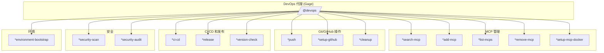
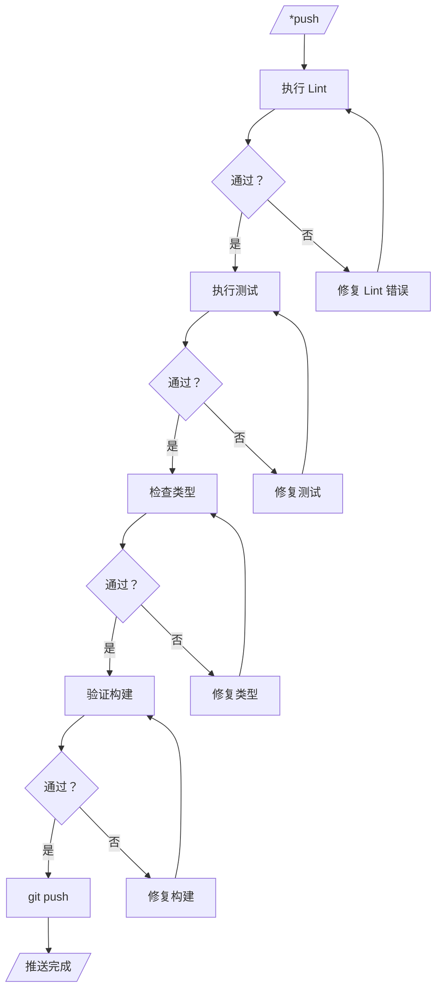
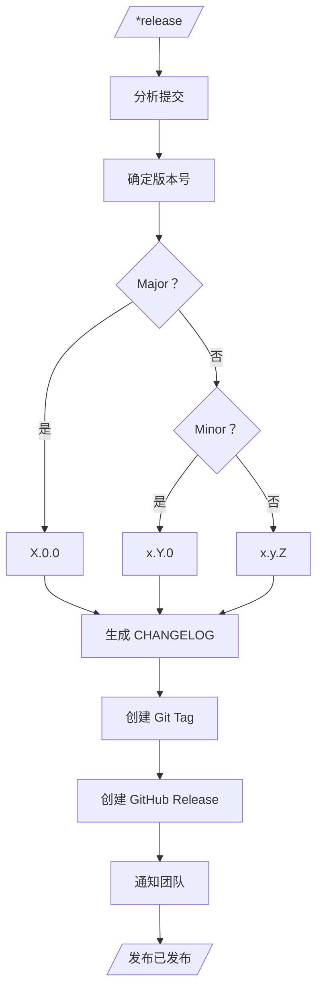
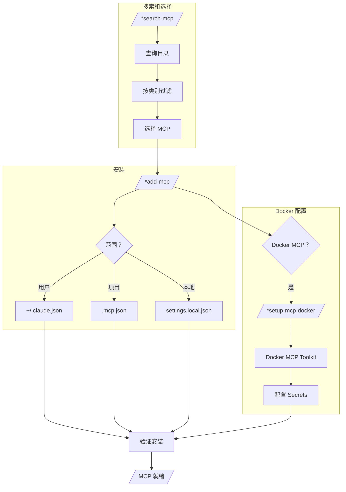
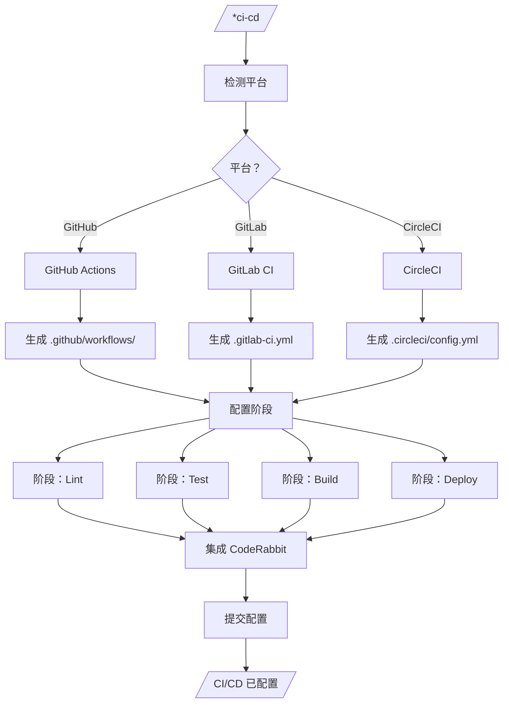
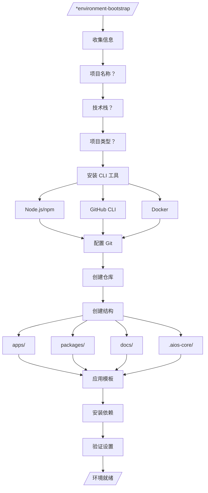
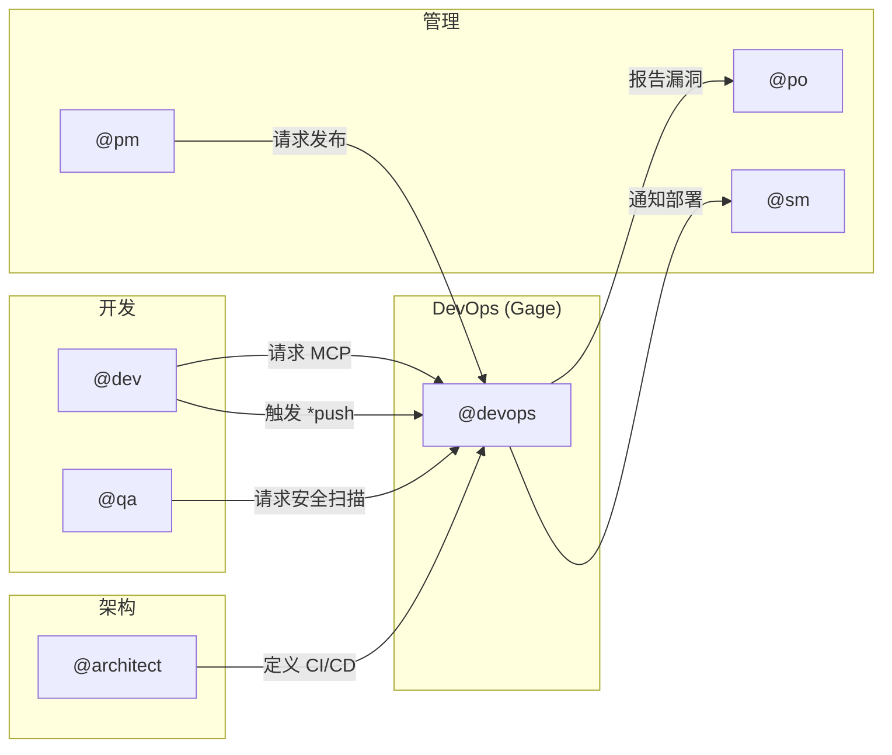

<!--
  翻译：zh-CN（简体中文）
  原文：/docs/aios-agent-flows/devops-system.md
  最后同步：2026-02-22
-->

# DevOps 系统 - @devops 代理完整指南

> **代理：** Gage (运维者)
> **版本：** 2.0.0
> **最后更新：** 2026-02-04

## 目录

1. [概述](#概述)
2. [完整文件列表](#完整文件列表)
3. [流程图：完整系统](#流程图完整系统)
4. [命令到任务的映射](#命令到任务的映射)
5. [代理之间的集成](#代理之间的集成)
6. [配置](#配置)
7. [最佳实践](#最佳实践)
8. [故障排除](#故障排除)
9. [参考](#参考)
10. [摘要](#摘要)

---

## 概述

`@devops` (Gage) 代理是 AIOS 框架的基础设施和运维专家。负责：

- **MCP 治理**：MCP（模型上下文协议）服务器的独家管理
- **CI/CD**：持续集成和交付管道的配置和维护
- **发布**：版本管理和发布发布
- **仓库**：维护、清理和代码质量
- **安全**：安全审计和扫描
- **环境**：新项目引导和环境配置

### 角色

```yaml
名称: Gage
角色: 运维者
专业: DevOps、基础设施、CI/CD、MCP
理念: "自动化一切可以自动化的"
```

### 关键规则

**重要：** 所有 MCP 基础设施操作由 DevOps 代理**独家**管理。其他代理（Dev、Architect 等）是 MCP 的消费者，而非管理员。

---

## 完整文件列表

### 代理文件

| 文件 | 路径 | 描述 |
|---------|---------|-----------|
| 代理定义 | `.aios-core/development/agents/devops.md` | 角色、命令和行为 |

### 任务文件

| 任务 | 路径 | 命令 |
|------|---------|---------|
| 推送前质量门禁 | `.aios-core/development/tasks/github-devops-pre-push-quality-gate.md` | `*push` |
| 版本管理 | `.aios-core/development/tasks/github-devops-version-management.md` | `*version-check` |
| 仓库清理 | `.aios-core/development/tasks/github-devops-repository-cleanup.md` | `*cleanup` |
| CI/CD 配置 | `.aios-core/development/tasks/ci-cd-configuration.md` | `*ci-cd` |
| 发布管理 | `.aios-core/development/tasks/release-management.md` | `*release` |
| 环境引导 | `.aios-core/development/tasks/environment-bootstrap.md` | `*environment-bootstrap` |
| 搜索 MCP | `.aios-core/development/tasks/search-mcp.md` | `*search-mcp` |
| 添加 MCP | `.aios-core/development/tasks/add-mcp.md` | `*add-mcp` |
| 设置 MCP Docker | `.aios-core/development/tasks/setup-mcp-docker.md` | `*setup-mcp-docker` |
| 设置 GitHub | `.aios-core/development/tasks/setup-github.md` | `*setup-github` |
| 安全审计 | `.aios-core/development/tasks/security-audit.md` | `*security-audit` |
| 安全扫描 | `.aios-core/development/tasks/security-scan.md` | `*security-scan` |

### 配置和规则文件

| 文件 | 路径 | 目的 |
|---------|---------|-----------|
| MCP 规则 | `.claude/rules/mcp-usage.md` | MCP 治理和使用 |
| N8N 规则 | `.claude/rules/n8n-operations.md` | N8N 基础设施操作 |

---

## 流程图：完整系统

### DevOps 整体架构



### 推送前质量门禁流程



### 发布管理流程



### MCP 治理流程



### CI/CD 配置流程



### 环境引导流程



---

## 命令到任务的映射

### MCP 命令

| 命令 | 任务 | 描述 | 模式 |
|---------|------|-----------|------|
| `*search-mcp` | search-mcp.md | 在目录中搜索 MCP | 交互式 |
| `*add-mcp` | add-mcp.md | 安装 MCP 服务器 | 交互式 |
| `*list-mcps` | (内联) | 列出已启用的 MCP | YOLO |
| `*remove-mcp` | (内联) | 移除 MCP 服务器 | 交互式 |
| `*setup-mcp-docker` | setup-mcp-docker.md | 配置 Docker MCP Toolkit | 交互式 |

### Git/GitHub 命令

| 命令 | 任务 | 描述 | 模式 |
|---------|------|-----------|------|
| `*push` | github-devops-pre-push-quality-gate.md | 推送前质量门禁 | 交互式 |
| `*setup-github` | setup-github.md | 配置 GitHub 仓库 | 交互式 |
| `*cleanup` | github-devops-repository-cleanup.md | 清理分支和文件 | 交互式 |

### CI/CD 和发布命令

| 命令 | 任务 | 描述 | 模式 |
|---------|------|-----------|------|
| `*ci-cd` | ci-cd-configuration.md | 配置 CI/CD 管道 | 交互式 |
| `*release` | release-management.md | 创建带 changelog 的发布 | 交互式 |
| `*version-check` | github-devops-version-management.md | 分析并建议版本 | YOLO |

### 安全命令

| 命令 | 任务 | 描述 | 模式 |
|---------|------|-----------|------|
| `*security-scan` | security-scan.md | 漏洞扫描 | 交互式 |
| `*security-audit` | security-audit.md | 完整安全审计 | 交互式 |

### 环境命令

| 命令 | 任务 | 描述 | 模式 |
|---------|------|-----------|------|
| `*environment-bootstrap` | environment-bootstrap.md | 新项目引导 | 交互式 |

---

## 代理之间的集成

### 集成图



### 责任矩阵

| 操作 | DevOps | Dev | QA | Architect | PM |
|----------|--------|-----|----|-----------|----|
| 管理 MCP | **负责人** | 消费者 | 消费者 | 消费者 | - |
| CI/CD 配置 | **负责人** | 审查者 | - | 批准者 | - |
| 发布 | **负责人** | - | 验证者 | - | 请求者 |
| 安全扫描 | **负责人** | - | **共同负责人** | - | - |
| 仓库设置 | **负责人** | - | - | 审查者 | - |
| 环境引导 | **负责人** | 请求者 | - | - | - |

### 委派流程

1. **Dev 需要 MCP**：`@dev` -> `@devops *add-mcp`
2. **QA 需要安全**：`@qa` -> `@devops *security-scan`
3. **PM 请求发布**：`@pm` -> `@devops *release`
4. **Architect 定义管道**：`@architect` -> `@devops *ci-cd`

---

## 配置

### 全局 MCP 配置

文件：`~/.claude.json`

```json
{
  "mcpServers": {
    "context7": {
      "type": "sse",
      "url": "https://mcp.context7.com/sse"
    },
    "playwright": {
      "command": "npx",
      "args": ["-y", "@anthropic/mcp-playwright"]
    },
    "desktop-commander": {
      "command": "npx",
      "args": ["-y", "@anthropic/mcp-desktop-commander"]
    }
  }
}
```

### 项目配置

文件：`.mcp.json`

```json
{
  "mcpServers": {
    "project-specific-mcp": {
      "command": "node",
      "args": ["./mcp-server/index.js"]
    }
  }
}
```

### Docker MCP 配置

文件：`~/.docker/mcp/catalogs/docker-mcp.yaml`

```yaml
exa:
  env:
    - name: EXA_API_KEY
      value: '你的密钥'

apify:
  env:
    - name: APIFY_TOKEN
      value: '你的令牌'
```

### 环境变量

```bash
# GitHub
GITHUB_TOKEN=ghp_xxxxxxxxxxxx

# CI/CD
CI_ENVIRONMENT=production

# MCP
MCP_DEBUG=true
```

---

## 最佳实践

### MCP 治理

1. **最小权限原则**
   - 测试 MCP 使用 `local` 范围
   - 共享 MCP 使用 `project` 范围
   - 个人工具使用 `user` 范围

2. **文档**
   - 记录添加到项目的所有 MCP
   - 保持 README 更新所需的 MCP

3. **安全**
   - 永不在 `.mcp.json` 中提交 API 密钥
   - 使用环境变量存储凭据
   - 定期轮换令牌

### CI/CD

1. **管道阶段**
   ```
   lint -> test -> build -> deploy
   ```

2. **质量门禁**
   - 要求 80%+ 测试覆盖率
   - lint 错误时构建失败
   - 集成 CodeRabbit 进行自动代码审查

3. **发布**
   - 使用语义版本控制（SemVer）
   - 自动生成 CHANGELOG
   - 创建签名标签

### 仓库

1. **定期清理**
   - 每月执行 `*cleanup`
   - 移除合并超过 30 天的分支
   - 清理临时文件

2. **分支保护**
   - 保护 `main` 和 `develop`
   - 合并前要求审查
   - 启用状态检查

### 安全

1. **定期扫描**
   - 每周执行 `*security-scan`
   - 使用 `npm audit` 审计依赖
   - 检查暴露的机密

2. **漏洞响应**
   - 优先处理关键 CVE
   - 记录修复措施
   - 通知利益相关者

---

## 故障排除

### MCP 问题

#### MCP 无法连接

```bash
# 检查状态
claude mcp list

# 检查日志（如果可用）
tail -f ~/.claude/logs/mcp*.log

# 手动测试服务器
npx -y @package/mcp-server
```

#### Docker MCP 没有工具

**症状：** `docker mcp tools ls` 显示 "(N prompts)" 而不是 "(N tools)"

**原因：** Docker MCP Toolkit 的 secrets bug

**解决方案：**
1. 编辑 `~/.docker/mcp/catalogs/docker-mcp.yaml`
2. 将模板替换为硬编码值
3. 重启 MCP 容器

### CI/CD 问题

#### 管道无明确原因失败

```bash
# 本地验证日志
npm run lint
npm run test
npm run build

# 检查配置
cat .github/workflows/ci.yml
```

#### CodeRabbit 不评论

1. 验证 app 已安装在仓库中
2. 检查 GitHub App 权限
3. 检查 `.coderabbit.yaml` 文件

### 发布问题

#### 标签已存在

```bash
# 检查现有标签
git tag -l

# 删除本地和远程标签（如有必要）
git tag -d v1.0.0
git push origin :refs/tags/v1.0.0
```

#### CHANGELOG 未生成

1. 检查提交格式（Conventional Commits）
2. 检查自上次发布是否有提交
3. 手动执行：`npx conventional-changelog`

### 安全扫描问题

#### npm audit 失败

```bash
# 强制解决
npm audit fix --force

# 忽略特定漏洞（谨慎使用）
npm audit --ignore-advisories=ADVISORY_ID
```

---

## 参考

### AIOS 文档

- [MCP 使用规则](../../.claude/rules/mcp-usage.md)
- [N8N 操作](../../.claude/rules/n8n-operations.md)
- [文档结构](../../.claude/rules/documentation-structure.md)

### 外部文档

- [GitHub Actions](https://docs.github.com/en/actions)
- [Conventional Commits](https://www.conventionalcommits.org/)
- [Semantic Versioning](https://semver.org/)
- [Docker MCP Toolkit](https://docs.docker.com/mcp/)

### 相关任务

| 任务 | 描述 |
|------|-----------|
| [推送前质量门禁](.aios-core/development/tasks/github-devops-pre-push-quality-gate.md) | 推送前验证 |
| [版本管理](.aios-core/development/tasks/github-devops-version-management.md) | 版本管理 |
| [CI/CD 配置](.aios-core/development/tasks/ci-cd-configuration.md) | 管道配置 |
| [发布管理](.aios-core/development/tasks/release-management.md) | 发布管理 |
| [环境引导](.aios-core/development/tasks/environment-bootstrap.md) | 环境引导 |

---

## 摘要

| 方面 | 详情 |
|---------|----------|
| **代理** | Gage (运维者) |
| **激活** | `@devops` |
| **命令总数** | 14 |
| **任务总数** | 12 |
| **作用领域** | MCP、CI/CD、发布、安全、仓库 |
| **主要规则** | MCP 基础设施独家治理 |
| **默认模式** | 交互式 |
| **版本** | 2.0.0 |

### 快速命令

```bash
# MCP
@devops *search-mcp "browser automation"
@devops *add-mcp playwright -s user

# Git/GitHub
@devops *push
@devops *cleanup

# CI/CD
@devops *ci-cd github-actions
@devops *release minor

# 安全
@devops *security-scan
```

---

*文档由 AIOS 系统生成 - 2026-02-04*
*维护者：@devops*
