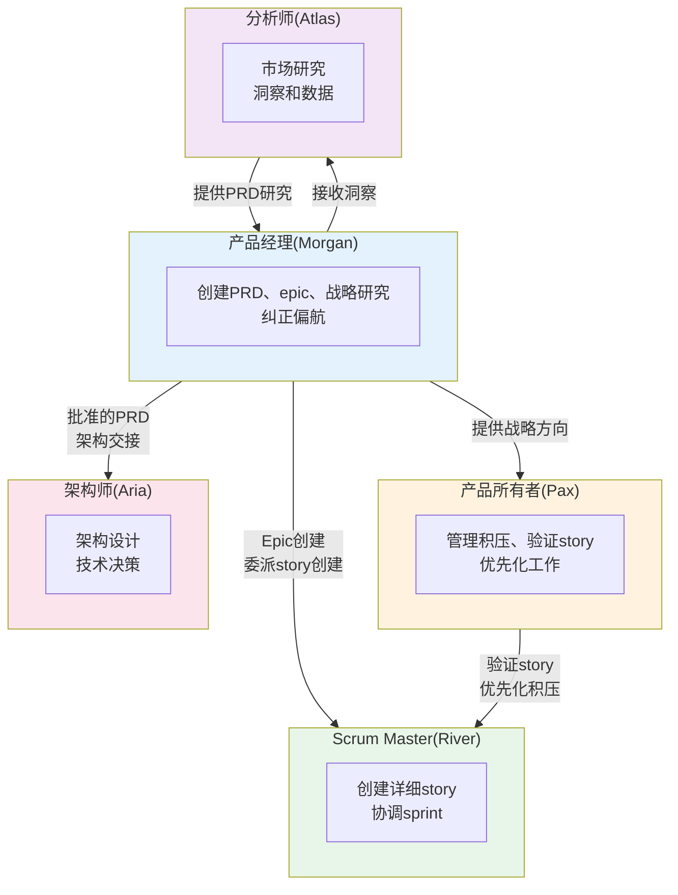

# 产品经理(PM)代理系统 - AIOS

> **版本:** 1.0.0
> **创建于:** 2026-02-04
> **所有者:** @pm (Morgan)
> **状态:** 官方文档

---

## 概览

本文档描述了AIOS产品经理(PM)代理的完整系统，包括所有涉及的文件、工作流、可用命令和代理间的集成。

PM代理设计用于:
- 为Greenfield和Brownfield项目创建和管理产品需求文档(PRD)
- 用集成质量规划定义和结构化epic
- 进行战略研究和市场分析
- 在开发期间纠正偏航
- 将大文档分解为可管理的部分
- 与其他代理协作以确保战略一致

### 角色: Morgan - 战略家

| 属性 | 值 |
|------|-----|
| **名称** | Morgan |
| **ID** | pm |
| **职位** | 产品经理 |
| **图标** | :clipboard: |
| **原型** | 战略家 |
| **星座** | 魔羯座 |
| **语气** | 战略性 |
| **签名** | "-- Morgan，规划未来:bar_chart:" |

---

## 完整文件列表

### 代理定义文件

| 文件 | 目的 |
|------|------|
| `.aios-core/development/agents/pm.md` | PM代理核心定义 |
| `.claude/commands/AIOS/agents/pm.md` | Claude Code命令激活@pm |

### PM任务

| 文件 | 命令 | 目的 |
|------|------|------|
| `.aios-core/development/tasks/create-doc.md` | `*create-prd` | 从YAML模板创建文档 |
| `.aios-core/development/tasks/correct-course.md` | `*correct-course` | 分析和纠正项目偏航 |
| `.aios-core/development/tasks/create-deep-research-prompt.md` | `*research` | 生成深度研究提示 |
| `.aios-core/development/tasks/brownfield-create-epic.md` | `*create-epic` | 为Brownfield增强创建epic |
| `.aios-core/development/tasks/brownfield-create-story.md` | `*create-story` | 为Brownfield创建story |
| `.aios-core/development/tasks/execute-checklist.md` | `*checklist` | 执行检查清单验证 |
| `.aios-core/development/tasks/shard-doc.md` | `*shard-prd` | 分解大文档 |

### PM模板

| 文件 | 目的 |
|------|------|
| `.aios-core/product/templates/prd-tmpl.yaml` | Greenfield项目的PRD模板 |
| `.aios-core/product/templates/brownfield-prd-tmpl.yaml` | Brownfield项目的PRD模板 |

### PM检查清单

| 文件 | 目的 |
|------|------|
| `.aios-core/product/checklists/pm-checklist.md` | PRD验证检查清单 |
| `.aios-core/product/checklists/change-checklist.md` | 变化导航检查清单 |

### 使用PM的工作流

| 文件 | 阶段 | 目的 |
|------|------|------|
| `.aios-core/development/workflows/brownfield-discovery.yaml` | 第10阶段 | Discovery后的epic和story创建 |

---

## 命令到任务的映射

### 文档创建命令

| 命令 | 任务文件 | 模板 | 描述 |
|------|---------|------|------|
| `*create-prd` | `create-doc.md` | `prd-tmpl.yaml` | 为Greenfield项目创建PRD |
| `*create-brownfield-prd` | `create-doc.md` | `brownfield-prd-tmpl.yaml` | 为Brownfield项目创建PRD |
| `*shard-prd` | `shard-doc.md` | N/A | 将PRD分解为较小文件 |
| `*doc-out` | `create-doc.md` | N/A | 生成完整文档 |

### 战略规划命令

| 命令 | 任务文件 | 描述 |
|------|---------|------|
| `*create-epic` | `brownfield-create-epic.md` | 为Brownfield增强创建epic |
| `*create-story` | `brownfield-create-story.md` | 为Brownfield创建独立story |
| `*research {topic}` | `create-deep-research-prompt.md` | 生成深度研究提示 |
| `*correct-course` | `correct-course.md` | 导航变化和偏航 |

### 实用命令

| 命令 | 描述 |
|------|------|
| `*help` | 显示所有可用命令 |
| `*session-info` | 显示当前会话详情 |
| `*guide` | 完整代理使用指南 |
| `*yolo` | 切换确认模式 |
| `*exit` | 退出PM模式 |

---

## 任务详情

### Task: create-doc.md (PRD创建)

**目的:** 使用交互YAML模板创建产品需求文档。

**执行模式:**
1. **YOLO模式** - 自主，最少交互(0-1提示)
2. **交互模式[默认]** - 决策检查点(5-10提示)
3. **飞行前规划** - 完整前期规划

**处理流:**
- 解析YAML模板
- 设置偏好
- 处理部分
- 如果elicit: true则呈现选项1-9(等待回应)
- 保存文件
- 继续更多部分或完成

**强制提取格式:**
- 选项1: 总是"继续下一部分"
- 选项2-9: 来自`data/elicitation-methods`的方法
- 结束: "选择1-9或仅输入问题/反馈:"

### Task: brownfield-create-epic.md

**目的:** 为较小Brownfield增强(1-3 stories)创建焦点epic。

**何时使用:**
- 增强可在1-3 stories中完成
- 无显著架构变化
- 遵循项目现有模式
- 最少集成复杂性

**代理分配指南:**

| 变化类型 | 预测代理 |
|---------|---------|
| 数据库变化 | @dev、@data-engineer |
| API/后端变化 | @dev、@architect |
| 前端/UI变化 | @dev、@ux-design-expert |
| 部署/基础设施 | @dev、@devops |
| 安全功能 | @dev(关注OWASP) |

### Task: correct-course.md

**目的:** 使用`change-checklist.md`导航开发期间的显著变化。

**纠正过程:**
1. 初始设置 - 交互模式
2. 执行检查清单 - 第1-4部分
3. 起草变化 - 提议
4. 生成Sprint变化提议
5. 最终确定和确定下一步

---

## 代理间的集成

### 协作图

### 交接矩阵

| 从 | 到 | 触发器 | 工件 |
|----|-----|--------|------|
| @pm | @architect | PRD批准 | `docs/prd.md`+架构师提示 |
| @pm | @ux-design-expert | PRD含UI | `docs/prd.md`+UX专家提示 |
| @pm | @sm | Epic创建 | Epic文档+Story Manager交接 |
| @pm | @po | PRD验证 | PRD草稿 |
| @analyst | @pm | 研究完成 | 研究结果 |
| @pm | @pm(自我) | 偏航检测 | Sprint变化提议 |

---

## 模板结构

### Greenfield PRD模板(prd-tmpl.yaml)

| 部分 | ID | 引出 | 描述 |
|------|----|----|------|
| 目标和背景 | goals-context | 否 | 项目目标和背景 |
| 需求 | requirements | **是** | FR+NFR |
| UI设计目标 | ui-goals | **是** | UX/UI愿景(条件) |
| 技术假设 | technical-assumptions | **是** | 技术决策 |
| Epic列表 | epic-list | **是** | 批准的epic列表 |
| Epic详情 | epic-details | **是** | Story和AC详述 |
| 检查清单结果 | checklist-results | 否 | pm-checklist结果 |
| 下一步 | next-steps | 否 | 下一代理提示 |

### Brownfield PRD模板(brownfield-prd-tmpl.yaml)

| 部分 | ID | 引出 | 描述 |
|------|----|----|------|
| 介绍分析 | intro-analysis | 否 | 现有项目分析 |
| 需求 | requirements | **是** | FR+NFR+CR(兼容性) |
| UI增强目标 | ui-enhancement-goals | 否 | 与现有UI集成 |
| 技术约束 | technical-constraints | 否 | 限制和集成 |
| Epic结构 | epic-structure | **是** | Epic结构 |
| Epic详情 | epic-details | **是** | 含集成验证的Story |

---

## PM检查清单详情

### PM检查清单(pm-checklist.md)

**9个验证类别:**

| # | 类别 | 焦点 |
|---|------|------|
| 1 | 问题定义和语境 | 问题、目标、用户研究 |
| 2 | MVP范围定义 | 核心功能、边界、验证 |
| 3 | 用户体验需求 | 旅程、可用性、UI |
| 4 | 功能需求 | 功能、质量、用户story |
| 5 | 非功能需求 | 性能、安全、可靠性 |
| 6 | Epic和Story结构 | Epic、分解、第一个epic |
| 7 | 技术指导 | 架构、决策、实现 |
| 8 | 跨职能需求 | 数据、集成、操作 |
| 9 | 清晰和通信 | 文档、利益相关者一致 |

**类别状态:**
- **通过**: 90%+完整
- **部分**: 60-89%完整
- **失败**: <60%完整

**最终决定:**
- **准备好架构**: PRD完整且结构化
- **需要细化**: 需要额外工作

---

## 最佳实践

### PRD创建

1. **总是从项目简报开始** - 简报提供关键基础
2. **使用交互模式** - 对复杂PRD，引出至关重要
3. **用检查清单验证** - 在交接前执行pm-checklist
4. **分解大文档** - 使用`*shard-prd`用于可维护性
5. **记录决策** - 记录技术和范围选择的理由

### Brownfield Epic创建

1. **首先评估范围** - 如果>3 stories，考虑完整PRD
2. **分析现有项目** - 在提议变化前理解模式
3. **规划质量门控** - 为每个story包括适当验证
4. **识别专科代理** - 根据变化类型分配专家
5. **包括回滚计划** - 总是有逆转策略

### 路线纠正

1. **不要跳到解决方案** - 首先完全理解问题
2. **评估级联影响** - 变化涟漪穿过项目
3. **记录权衡** - 对成本和好处诚实
4. **获得明确批准** - 从不假设隐含同意
5. **定义成功标准** - 我们如何知道变化有效?

---

## 故障排除

### PRD未通过检查清单

**常见原因:**
- 问题未清晰定义
- MVP过大或过小
- 需求模糊

**解决方案:**
- 检查失败类别
- 细化特定需求
- 用利益相关者验证范围

### Epic太复杂

**常见原因:**
- 尝试做太多
- 需要架构变化

**解决方案:**
- 分为多个epic
- 考虑完整Brownfield PRD
- 咨询@architect用于技术决策

### 开发期间检测到变化

**常见原因:**
- 需求发现太晚
- 发现技术限制
- 基于反馈的枢纽

**解决方案:**
- 执行`*correct-course`
- 遵循change-checklist
- 记录提议并获得批准

---

## 参考

- [Agent: pm.md](.aios-core/development/agents/pm.md)
- [Task: create-doc.md](.aios-core/development/tasks/create-doc.md)
- [Task: brownfield-create-epic.md](.aios-core/development/tasks/brownfield-create-epic.md)
- [Task: correct-course.md](.aios-core/development/tasks/correct-course.md)
- [Template: prd-tmpl.yaml](.aios-core/product/templates/prd-tmpl.yaml)
- [Template: brownfield-prd-tmpl.yaml](.aios-core/product/templates/brownfield-prd-tmpl.yaml)
- [Checklist: pm-checklist.md](.aios-core/product/checklists/pm-checklist.md)
- [Checklist: change-checklist.md](.aios-core/product/checklists/change-checklist.md)
- [Workflow: brownfield-discovery.yaml](.aios-core/development/workflows/brownfield-discovery.yaml)

---

## 总结

| 方面 | 详情 |
|------|------|
| **总任务** | 7个任务文件 |
| **模板** | 2(Greenfield+Brownfield PRD) |
| **检查清单** | 2(PM验证+变化导航) |
| **工作流** | 1(Brownfield发现 - 第10阶段) |
| **主要命令** | 7个(`*create-prd`、`*create-epic`、`*research`等) |
| **协作代理** | @po、@sm、@architect、@analyst、@ux-design-expert |
| **主要交接** | PM->架构师(批准的PRD) |

---

*-- Morgan，规划未来:bar_chart:*
