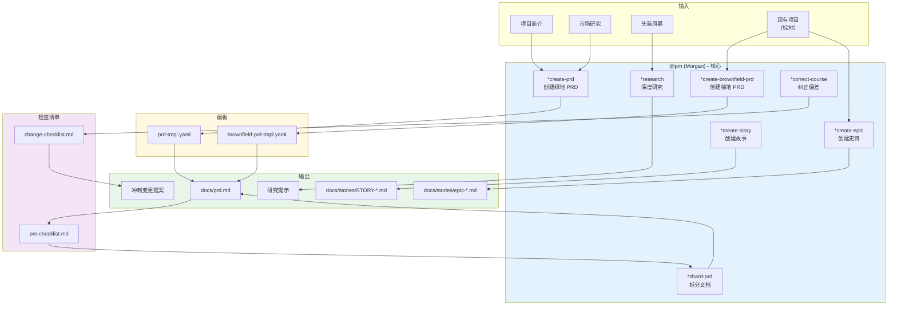
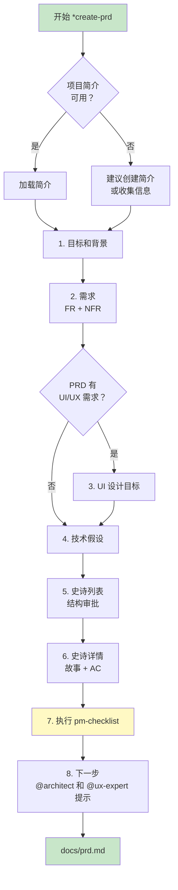
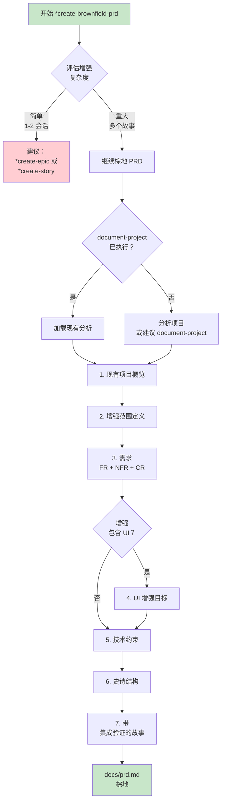
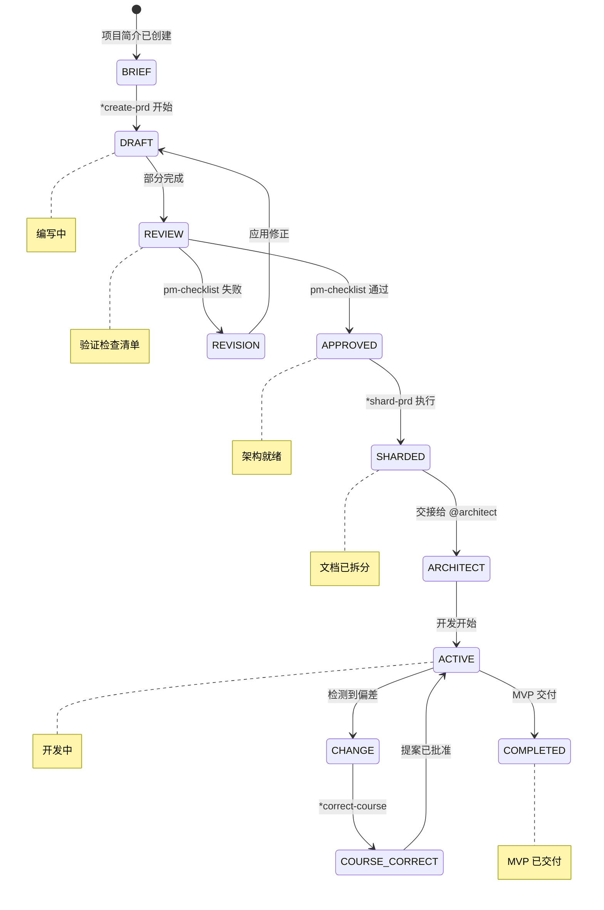
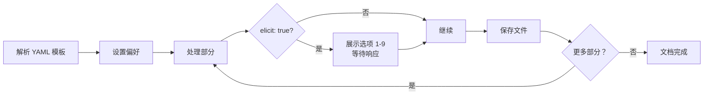
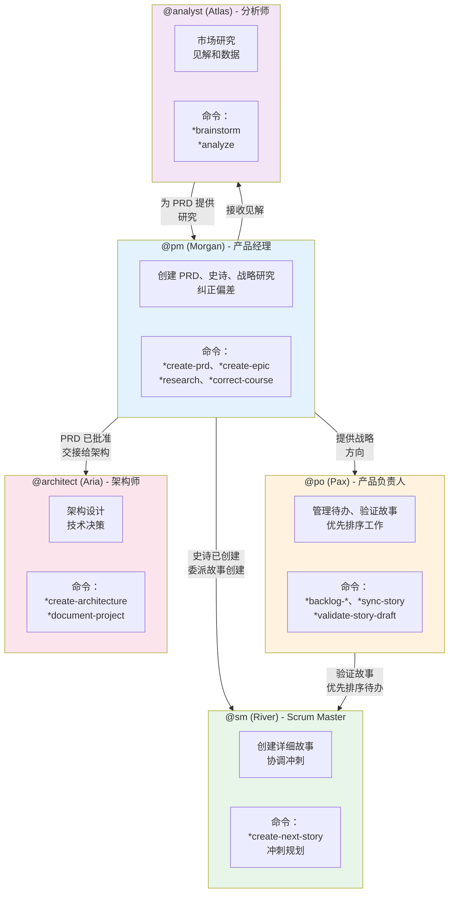
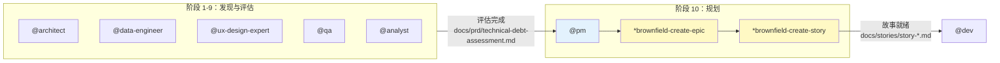

<!--
  翻译：zh-CN（简体中文）
  原文：/docs/aios-agent-flows/pm-system.md
  最后同步：2026-02-22
-->

# 产品经理 (PM) 代理系统 - AIOS

> **版本：** 1.0.0
> **创建日期：** 2026-02-04
> **负责人：** @pm (Morgan)
> **状态：** 官方文档

---

## 概述

本文档描述 AIOS 产品经理 (PM) 代理的完整系统，包括所有涉及的文件、工作流程、可用命令和代理之间的集成。

PM 代理设计用于：
- 为绿地和棕地项目创建和管理产品需求文档 (PRD)
- 定义和构建带集成质量规划的史诗
- 进行战略研究和市场分析
- 在开发期间纠正偏差
- 将大型文档拆分为可管理的部分
- 与其他代理协作确保战略一致性

### 角色：Morgan - 策略师

| 属性 | 值 |
|----------|-------|
| **名称** | Morgan |
| **ID** | pm |
| **标题** | 产品经理 |
| **图标** | :clipboard: |
| **原型** | 策略师 |
| **星座** | 摩羯座 |
| **语气** | 战略性 |
| **签名** | "-- Morgan，规划未来 :bar_chart:" |

---

## 完整文件列表

### 代理定义文件

| 文件 | 目的 |
|---------|-----------|
| `.aios-core/development/agents/pm.md` | PM 代理核心定义 |
| `.claude/commands/AIOS/agents/pm.md` | 用于激活 @pm 的 Claude Code 命令 |

### @pm 任务

| 文件 | 命令 | 目的 |
|---------|---------|-----------|
| `.aios-core/development/tasks/create-doc.md` | `*create-prd` | 从 YAML 模板创建文档 |
| `.aios-core/development/tasks/correct-course.md` | `*correct-course` | 分析并纠正项目偏差 |
| `.aios-core/development/tasks/create-deep-research-prompt.md` | `*research` | 生成深度研究提示 |
| `.aios-core/development/tasks/brownfield-create-epic.md` | `*create-epic` | 为棕地项目创建史诗 |
| `.aios-core/development/tasks/brownfield-create-story.md` | `*create-story` | 为棕地创建故事 |
| `.aios-core/development/tasks/execute-checklist.md` | `*checklist` | 执行检查清单验证 |
| `.aios-core/development/tasks/shard-doc.md` | `*shard-prd` | 拆分大型文档 |

### @pm 模板

| 文件 | 目的 |
|---------|-----------|
| `.aios-core/product/templates/prd-tmpl.yaml` | 绿地项目 PRD 模板 |
| `.aios-core/product/templates/brownfield-prd-tmpl.yaml` | 棕地项目 PRD 模板 |

### @pm 检查清单

| 文件 | 目的 |
|---------|-----------|
| `.aios-core/product/checklists/pm-checklist.md` | PRD 验证检查清单 |
| `.aios-core/product/checklists/change-checklist.md` | 变更导航检查清单 |

### 使用 @pm 的工作流

| 文件 | 阶段 | 目的 |
|---------|------|-----------|
| `.aios-core/development/workflows/brownfield-discovery.yaml` | 阶段 10 | 发现后创建史诗和故事 |

---

## 流程图：PM 完整系统



### 绿地 PRD 流程图



### 棕地 PRD 流程图



---

## PRD 生命周期图



---

## 命令到任务的映射

### 文档创建命令

| 命令 | 任务文件 | 模板 | 描述 |
|---------|-----------|----------|-----------|
| `*create-prd` | `create-doc.md` | `prd-tmpl.yaml` | 为绿地项目创建 PRD |
| `*create-brownfield-prd` | `create-doc.md` | `brownfield-prd-tmpl.yaml` | 为棕地项目创建 PRD |
| `*shard-prd` | `shard-doc.md` | N/A | 将 PRD 拆分为更小的文件 |
| `*doc-out` | `create-doc.md` | N/A | 生成完整文档 |

### 战略规划命令

| 命令 | 任务文件 | 描述 |
|---------|-----------|-----------|
| `*create-epic` | `brownfield-create-epic.md` | 为棕地增强创建史诗 |
| `*create-story` | `brownfield-create-story.md` | 为棕地创建独立故事 |
| `*research {topic}` | `create-deep-research-prompt.md` | 生成深度研究提示 |
| `*correct-course` | `correct-course.md` | 导航变更和偏差 |

### 工具命令

| 命令 | 描述 |
|---------|-----------|
| `*help` | 显示所有可用命令 |
| `*session-info` | 显示当前会话详情 |
| `*guide` | 代理完整使用指南 |
| `*yolo` | 切换确认模式 |
| `*exit` | 退出 PM 模式 |

---

## 任务详情

### 任务：create-doc.md（PRD 创建）

**目的：** 使用交互式 YAML 模板创建产品需求文档。

**执行模式：**
1. **YOLO 模式** - 自主，最小交互（0-1 提示）
2. **交互模式** [默认] - 决策检查点（5-10 提示）
3. **预检规划** - 完整的前期规划

**处理流程：**



**强制获取格式：**
- 选项 1：始终是"继续下一部分"
- 选项 2-9：来自 `data/elicitation-methods` 的获取方法
- 以"选择 1-9 或直接输入您的问题/反馈："结束

---

### 任务：brownfield-create-epic.md

**目的：** 为较小的棕地增强（1-3 个故事）创建聚焦的史诗。

**何时使用：**
- 1-3 个故事可完成的增强
- 无重大架构变更
- 遵循项目现有模式
- 最小集成复杂度

**史诗结构：**

```markdown
## 史诗：{{增强名称}} - 棕地增强

### 史诗目标
{{1-2 句描述目标和价值}}

### 史诗描述
**现有系统上下文：**
- 当前相关功能
- 技术栈
- 集成点

**增强详情：**
- 添加/更改的内容
- 如何集成
- 成功标准

### 故事（带质量规划）
1. **故事 1：{{标题}}**
   - 描述
   - **预测代理**：@dev、@db-sage 等
   - **质量门禁**：提交前、PR 前、部署前

### 风险缓解
- 主要风险
- 缓解策略
- 回滚计划
```

**代理分配指南：**

| 变更类型 | 预测代理 |
|-----------------|------------------|
| 数据库变更 | @dev、@db-sage |
| API/后端变更 | @dev、@architect |
| 前端/UI 变更 | @dev、@ux-expert |
| 部署/基础设施 | @dev、@github-devops |
| 安全功能 | @dev（OWASP 焦点） |

---

### 任务：create-deep-research-prompt.md

**目的：** 生成结构化的深度分析研究提示。

**可用研究类型：**

| # | 类型 | 描述 |
|---|------|-----------|
| 1 | 产品验证研究 | 验证假设和市场契合度 |
| 2 | 市场机会研究 | 分析市场规模和潜力 |
| 3 | 用户和客户研究 | 人物画像、待完成工作、痛点 |
| 4 | 竞争情报研究 | 竞争对手分析 |
| 5 | 技术和创新研究 | 技术趋势 |
| 6 | 行业和生态系统研究 | 价值链和生态系统 |
| 7 | 战略选项研究 | 评估战略方向 |
| 8 | 风险和可行性研究 | 识别和评估风险 |
| 9 | 自定义研究焦点 | 自定义研究 |

**研究提示结构：**

```markdown
## 研究目标
[目标的清晰声明]

## 背景上下文
[来自简介、头脑风暴或输入的背景]

## 研究问题
### 主要问题（必须回答）
1. [具体、可操作的问题]

### 次要问题（可选）
1. [支持性问题]

## 研究方法
### 信息来源
### 分析框架
### 数据要求

## 预期交付物
### 执行摘要
### 详细分析
### 支持材料

## 成功标准
[如何评估研究是否达到目标]
```

---

### 任务：correct-course.md

**目的：** 使用 `change-checklist.md` 导航开发期间的重大变更。

**课程纠正流程：**

```mermaid
flowchart TD
    TRIGGER[检测到变更] --> SETUP[1. 初始设置<br/>交互模式]
    SETUP --> CHECKLIST[2. 执行检查清单<br/>部分 1-4]
    CHECKLIST --> DRAFT[3. 起草变更<br/>提案]
    DRAFT --> PROPOSAL[4. 生成冲刺<br/>变更提案]
    PROPOSAL --> FINALIZE[5. 最终确定和<br/>确定下一步]

    subgraph PROPOSAL_CONTENT["冲刺变更提案"]
        ISSUE[问题摘要]
        EPIC_IMPACT[史诗影响]
        ARTIFACT_ADJUST[工件调整]
        PATH[推荐路径]
        MVP_IMPACT[MVP 影响]
        ACTION[行动计划]
        HANDOFF[代理交接计划]
    end

    FINALIZE --> HANDOFF_DECISION{变更<br/>性质？}
    HANDOFF_DECISION -->|可实施| IMPLEMENT[通过<br/>@po/@sm 实施]
    HANDOFF_DECISION -->|需要重新规划| ESCALATE[升级到<br/>@pm/@architect]
```

**变更检查清单部分：**
1. 理解触发器和上下文
2. 史诗影响评估
3. 工件冲突和影响分析
4. 前进路径评估
5. 冲刺变更提案组件
6. 最终审查和交接

---

## 代理之间的集成

### 协作图



### 交接矩阵

| 从 | 到 | 触发器 | 工件 |
|----|------|---------|----------|
| @pm | @architect | PRD 已批准 | `docs/prd.md` + 架构师提示 |
| @pm | @ux-expert | PRD 有 UI | `docs/prd.md` + UX 专家提示 |
| @pm | @sm | 史诗已创建 | 史诗文档 + 故事管理交接 |
| @pm | @po | PRD 待验证 | PRD 草稿 |
| @analyst | @pm | 研究完成 | 研究发现 |
| @pm | @pm (自己) | 检测到偏差 | 冲刺变更提案 |

### 棕地发现工作流流程



---

## 模板结构

### 绿地 PRD 模板 (prd-tmpl.yaml)

| 部分 | ID | 获取 | 描述 |
|-------|----|----|-----------|
| 目标和背景 | goals-context | 否 | 项目目标和背景 |
| 需求 | requirements | **是** | FR + NFR |
| UI 设计目标 | ui-goals | **是** | UX/UI 愿景（条件性） |
| 技术假设 | technical-assumptions | **是** | 技术决策 |
| 史诗列表 | epic-list | **是** | 待批准的史诗列表 |
| 史诗详情 | epic-details | **是** | 详细故事和 AC |
| 检查清单结果 | checklist-results | 否 | pm-checklist 结果 |
| 下一步 | next-steps | 否 | 下一代理提示 |

### 棕地 PRD 模板 (brownfield-prd-tmpl.yaml)

| 部分 | ID | 获取 | 描述 |
|-------|----|----|-----------|
| 简介分析 | intro-analysis | 否 | 现有项目分析 |
| 需求 | requirements | **是** | FR + NFR + CR（兼容性） |
| UI 增强目标 | ui-enhancement-goals | 否 | 与现有 UI 集成 |
| 技术约束 | technical-constraints | 否 | 约束和集成 |
| 史诗结构 | epic-structure | **是** | 史诗结构 |
| 史诗详情 | epic-details | **是** | 带集成验证的故事 |

---

## 检查清单详情

### PM 检查清单 (pm-checklist.md)

**9 个验证类别：**

| # | 类别 | 焦点 |
|---|-----------|------|
| 1 | 问题定义和上下文 | 问题、目标、用户研究 |
| 2 | MVP 范围定义 | 核心功能、边界、验证 |
| 3 | 用户体验需求 | 旅程、可用性、UI |
| 4 | 功能需求 | 功能、质量、用户故事 |
| 5 | 非功能需求 | 性能、安全、可靠性 |
| 6 | 史诗和故事结构 | 史诗、分解、第一个史诗 |
| 7 | 技术指导 | 架构、决策、实现 |
| 8 | 跨职能需求 | 数据、集成、运维 |
| 9 | 清晰度和沟通 | 文档、利益相关者一致 |

**类别状态：**
- **通过**：90%+ 完成
- **部分**：60-89% 完成
- **失败**：<60% 完成

**最终决定：**
- **架构就绪**：PRD 完整且结构化
- **需要细化**：需要额外工作

### 变更检查清单 (change-checklist.md)

**6 个导航部分：**

| # | 部分 | 目的 |
|---|-------|-----------|
| 1 | 理解触发器和上下文 | 识别问题和初始影响 |
| 2 | 史诗影响评估 | 分析对当前和未来史诗的影响 |
| 3 | 工件冲突分析 | 审查 PRD、架构、前端规范 |
| 4 | 前进路径评估 | 评估选项（调整、回滚、重新范围） |
| 5 | 冲刺变更提案 | 提案组件 |
| 6 | 最终审查和交接 | 批准和下一步 |

---

## 最佳实践

### PRD 创建

1. **始终从项目简介开始** - 简介提供基本基础
2. **使用交互模式** - 对于复杂 PRD，获取至关重要
3. **使用检查清单验证** - 交接前执行 pm-checklist
4. **拆分大型文档** - 使用 `*shard-prd` 提高可维护性
5. **记录决策** - 技术和范围选择的理由

### 棕地史诗创建

1. **首先评估范围** - 如果 > 3 个故事，考虑完整 PRD
2. **分析现有项目** - 提议变更前理解模式
3. **规划质量门禁** - 为每个故事包含适当的验证
4. **识别专家代理** - 根据变更类型分配专家
5. **包含回滚计划** - 始终有回退策略

### 课程纠正

1. **不要跳到解决方案** - 首先完全理解问题
2. **评估级联影响** - 变更会波及整个项目
3. **记录权衡** - 诚实说明成本和收益
4. **获得明确批准** - 永不假设隐含同意
5. **定义成功标准** - 如何知道变更有效？

---

## 故障排除

### PRD 未通过检查清单

**常见原因：**
- 问题未清晰定义
- MVP 太大或太小
- 需求模糊

**解决方案：**
- 审查失败的类别
- 细化具体需求
- 与利益相关者验证范围

### 史诗太复杂

**常见原因：**
- 试图在一个史诗中做太多
- 需要架构变更

**解决方案：**
- 分成多个史诗
- 考虑完整的棕地 PRD
- 咨询 @architect 进行技术决策

### 开发期间检测到变更

**常见原因：**
- 需求发现较晚
- 遇到技术限制
- 基于反馈转向

**解决方案：**
- 执行 `*correct-course`
- 遵循变更检查清单
- 记录提案并获得批准

### 模板未找到

**常见原因：**
- 路径不正确
- 模板已重命名

**解决方案：**
- 检查 `.aios-core/product/templates/`
- 使用 create-doc 列出可用模板
- 必要时更新代理中的引用

---

## 参考

- [代理定义：pm.md](.aios-core/development/agents/pm.md)
- [任务：create-doc.md](.aios-core/development/tasks/create-doc.md)
- [任务：brownfield-create-epic.md](.aios-core/development/tasks/brownfield-create-epic.md)
- [任务：correct-course.md](.aios-core/development/tasks/correct-course.md)
- [模板：prd-tmpl.yaml](.aios-core/product/templates/prd-tmpl.yaml)
- [模板：brownfield-prd-tmpl.yaml](.aios-core/product/templates/brownfield-prd-tmpl.yaml)
- [检查清单：pm-checklist.md](.aios-core/product/checklists/pm-checklist.md)
- [检查清单：change-checklist.md](.aios-core/product/checklists/change-checklist.md)
- [工作流：brownfield-discovery.yaml](.aios-core/development/workflows/brownfield-discovery.yaml)

---

## 摘要

| 方面 | 详情 |
|---------|----------|
| **任务总数** | 7 个任务文件 |
| **模板** | 2 个（PRD 绿地 + 棕地） |
| **检查清单** | 2 个（PM 验证 + 变更导航） |
| **工作流** | 1 个（棕地发现 - 阶段 10） |
| **主要命令** | 7 个（`*create-prd`、`*create-epic`、`*research` 等） |
| **协作代理** | @po、@sm、@architect、@analyst、@ux-expert |
| **主要交接** | PM -> 架构师（PRD 已批准） |

---

## 变更日志

| 日期 | 作者 | 描述 |
|------|-------|-----------|
| 2026-02-04 | 技术文档专家 | 创建初始文档 |
| 2026-02-04 | 技术文档专家 | 添加 Mermaid 图（6 个流程图 + 1 个状态图） |

---

*-- Morgan，规划未来 :bar_chart:*
