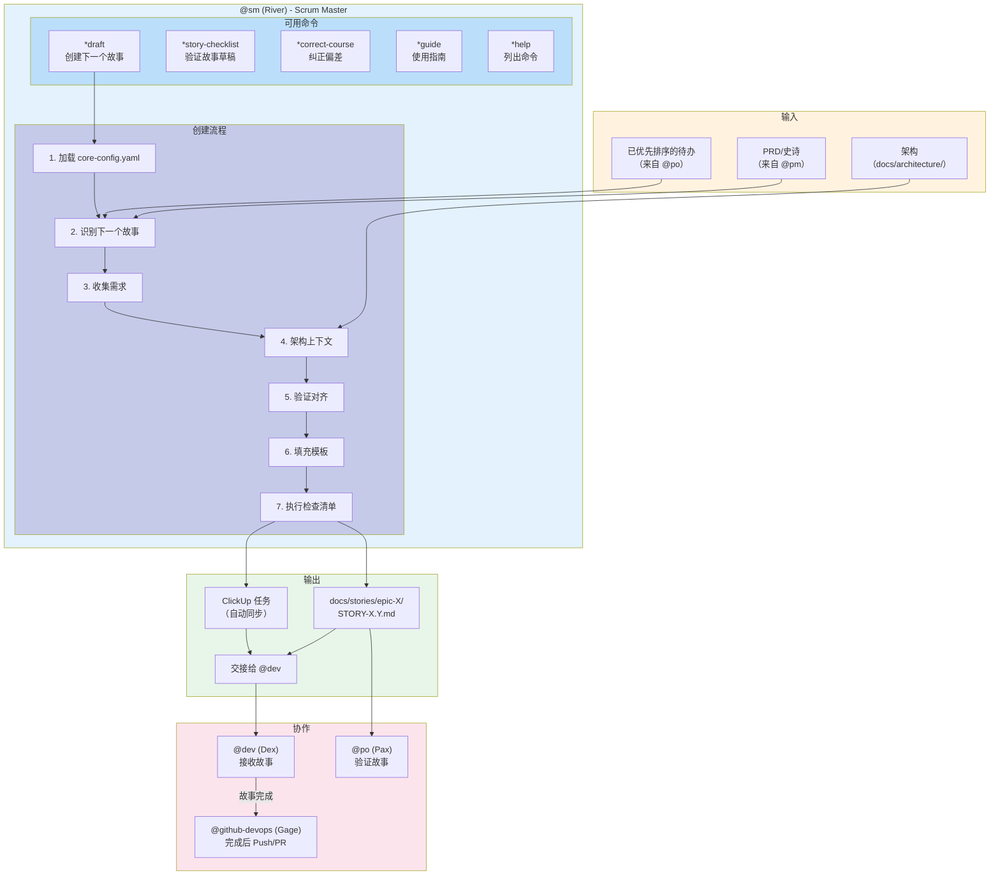
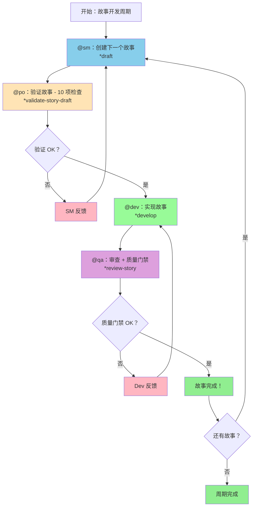
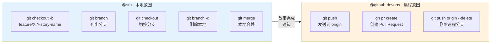
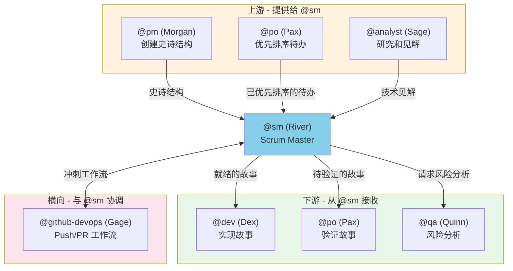

<!--
  翻译：zh-CN（简体中文）
  原文：/docs/aios-agent-flows/sm-system.md
  最后同步：2026-02-22
-->

# @sm 代理系统

> **版本：** 1.0.0
> **创建日期：** 2026-02-04
> **负责人：** @sm (River - 协调者)
> **状态：** 官方文档

---

## 概述

**@sm (River)** 代理是 AIOS 的技术 Scrum Master，专门负责故事准备和敏捷流程促进。其主要角色是创建详细、可操作的故事，使开发代理能够以最少的额外研究进行实现。

**主要职责：**
- 用户故事的创建和细化
- 史诗管理和需求分解
- 冲刺规划促进
- 敏捷流程指导
- 开发者交接准备
- 开发期间本地分支管理

**原型：** 协调者（双鱼座）
**沟通语气：** 共情、协作、流畅
**关键词汇：** 适应、转向、调整、简化、连接、流动、移除

---

## 完整文件列表

### @sm 核心任务文件

| 文件 | 命令 | 目的 |
|---------|---------|-----------|
| `.aios-core/development/tasks/sm-create-next-story.md` | `*draft` | 创建待办列表中下一个故事的主要任务 |
| `.aios-core/development/tasks/create-next-story.md` | `*draft` | 故事创建任务的完整版本 |
| `.aios-core/development/tasks/execute-checklist.md` | `*story-checklist` | 执行故事草稿验证检查清单 |
| `.aios-core/development/tasks/correct-course.md` | `*correct-course` | 分析并纠正流程偏差 |
| `.aios-core/development/tasks/collaborative-edit.md` | - | 文档协作编辑 |
| `.aios-core/development/tasks/init-project-status.md` | - | 项目状态初始化 |

### 代理定义文件

| 文件 | 目的 |
|---------|-----------|
| `.aios-core/development/agents/sm.md` | SM 代理核心定义 |
| `.claude/commands/AIOS/agents/sm.md` | 用于激活 @sm 的 Claude Code 命令 |
| `.cursor/rules/sm.md` | Cursor IDE 规则 |
| `.cursor/rules/sm.mdc` | Cursor 编译规则 |

### 使用的检查清单文件

| 文件 | 目的 |
|---------|-----------|
| `.aios-core/product/checklists/story-draft-checklist.md` | 验证故事草稿的质量和完整性 |
| `.aios-core/product/checklists/story-dod-checklist.md` | 故事完成定义 |
| `.aios-core/product/checklists/change-checklist.md` | 变更和课程纠正导航 |
| `.aios-core/product/checklists/po-master-checklist.md` | 验证中使用的主检查清单 |

### 其他代理的相关文件

| 文件 | 代理 | 目的 |
|---------|--------|-----------|
| `.aios-core/development/agents/po.md` | @po | 与 @sm 在待办和冲刺规划上协调 |
| `.aios-core/development/agents/dev.md` | @dev | 从 @sm 接收故事进行实现 |
| `.aios-core/development/agents/pm.md` | @pm | 创建 @sm 分解为故事的史诗 |
| `.aios-core/development/agents/devops.md` | @github-devops | 接收已完成故事进行 push/PR |
| `.aios-core/development/agents/qa.md` | @qa | 在风险分析上协调 |

### 使用 @sm 的工作流文件

| 文件 | 目的 |
|---------|-----------|
| `.aios-core/development/workflows/story-development-cycle.yaml` | 完整的故事开发周期 |
| `.aios-core/development/workflows/greenfield-fullstack.yaml` | 绿地全栈工作流 |
| `.aios-core/development/workflows/greenfield-service.yaml` | 绿地服务工作流 |
| `.aios-core/development/workflows/greenfield-ui.yaml` | 绿地 UI 工作流 |
| `.aios-core/development/workflows/brownfield-fullstack.yaml` | 棕地全栈工作流 |
| `.aios-core/development/workflows/brownfield-service.yaml` | 棕地服务工作流 |
| `.aios-core/development/workflows/brownfield-ui.yaml` | 棕地 UI 工作流 |

### 配置文件

| 文件 | 目的 |
|---------|-----------|
| `.aios-core/core-config.yaml` | 中央配置（devStoryLocation 等） |
| `.aios-core/development/scripts/unified-activation-pipeline.js` | 智能问候管道 |
| `.aios-core/development/scripts/agent-assignment-resolver.js` | 代理分配解析 |

---

## 流程图：@sm 完整系统



### 故事开发周期图



### 分支管理图



---

## 命令到任务的映射

| 命令 | 任务文件 | 操作 |
|---------|-----------|----------|
| `*draft` | `sm-create-next-story.md` / `create-next-story.md` | 创建待办中下一个故事 |
| `*story-checklist` | `execute-checklist.md` | 执行 `story-draft-checklist.md` |
| `*correct-course` | `correct-course.md` | 分析并纠正流程偏差 |
| `*help` | (内置) | 显示可用命令 |
| `*guide` | (内置) | 显示代理使用指南 |
| `*session-info` | (内置) | 显示当前会话详情 |
| `*exit` | (内置) | 退出 Scrum Master 模式 |

---

## 代理之间的集成

### 集成流程



### 协作矩阵

| 代理 | 关系 | 操作 |
|--------|----------------|------|
| **@pm (Morgan)** | 接收自 | 史诗结构、已分片 PRD |
| **@po (Pax)** | 协调 | 待办优先排序、冲刺规划 |
| **@dev (Dex)** | 交付给 | 准备实现的故事 |
| **@qa (Quinn)** | 请求 | 故事的风险分析 |
| **@github-devops (Gage)** | 委派给 | 推送分支、创建 PR |
| **@analyst (Sage)** | 咨询 | 研究和技术见解 |

### 委派给 @github-devops

@sm 只管理本地 Git 操作。远程操作**始终**委派给 @github-devops：

**@sm 允许的操作：**
- `git checkout -b feature/X.Y-story-name` - 创建本地分支
- `git branch` - 列出分支
- `git branch -d branch-name` - 删除本地分支
- `git checkout branch-name` - 切换分支
- `git merge branch-name` - 本地合并

**禁止的操作（使用 @github-devops）：**
- `git push` - 发送到远程
- `git push origin --delete` - 删除远程分支
- `gh pr create` - 创建 Pull Request

---

## 配置

### core-config.yaml（相关键）

```yaml
# 故事位置
devStoryLocation: docs/stories

# PRD 分片或单一
prdSharded: true
prdShardedLocation: docs/prd/epics

# 架构
architectureVersion: v4
architectureSharded: true
architectureShardedLocation: docs/architecture

# QA
qaLocation: docs/qa

# CodeRabbit 集成
coderabbit_integration:
  enabled: true  # 控制 @sm 是否在故事中填充 CodeRabbit 部分
```

### 代理依赖

```yaml
dependencies:
  tasks:
    - create-next-story.md
    - execute-checklist.md
    - correct-course.md
  templates:
    - story-tmpl.yaml
  checklists:
    - story-draft-checklist.md
  tools:
    - git               # 仅本地分支操作
    - clickup           # 跟踪冲刺进度
    - context7          # 研究技术需求
```

---

## 最佳实践

### 故事创建

1. **始终从 PRD/史诗开始** - 不要发明需求
2. **包含带引用的引用** - `[来源：architecture/tech-stack.md#database]`
3. **完整填充 Dev Notes** - 从架构中提取的技术上下文
4. **创建后执行检查清单** - `*story-checklist` 验证质量
5. **不要假设信息** - 如果找不到，声明"未找到具体指导"

### 分支管理

1. **使用命名约定** - `feature/X.Y-story-name`（X.Y = 史诗.故事）
2. **开始故事时创建分支** - 隔离开发
3. **不要尝试 push** - 始终委派给 @github-devops
4. **本地解决冲突** - 在请求 push 之前

### 与其他代理的协作

1. **尊重边界** - 不要实现代码，不要创建 PR
2. **记录交接** - 清楚说明 @dev 需要做什么
3. **与 @po 协调** - 创建故事前进行待办优先排序
4. **通知 @github-devops** - 当故事准备好 push 时

### 故事验证

1. **执行检查清单** - 创建后执行 `*story-checklist`
2. **审查所有 6 个标准** - 目标、技术、引用、自包含、测试、CodeRabbit
3. **交接前修正** - 不完整的故事会阻塞 @dev
4. **记录偏差** - 如果史诗和架构之间有冲突

---

## 故障排除

### 故事在 ClickUp 中未找到

**症状：** 步骤 5.1 的史诗验证失败

**解决方案：**
1. 验证史诗是否存在于 ClickUp 待办列表中
2. 确认标签：`epic`、`epic-{epicNum}`
3. 状态应为"规划中"或"进行中"
4. 必要时手动创建史诗：
   ```
   名称：'史诗 {epicNum}：{史诗标题}'
   列表：待办
   标签：['epic', 'epic-{epicNum}']
   状态：规划中
   ```

### core-config.yaml 未找到

**症状：** 任务停止并显示文件未找到消息

**解决方案：**
1. 从 `GITHUB aios-core/core-config.yaml` 复制
2. 或执行 AIOS 安装器：`npm run aios:install`
3. 配置 `devStoryLocation`、`prdSharded` 等

### 检查清单在多个类别返回 FAIL

**症状：** 故事草稿有多个验证问题

**解决方案：**
1. 审查引用的架构文件
2. 验证 PRD/史诗是否完整
3. 使用文件回退策略查找替代文件
4. 在 Dev Notes 中添加关于差距的注释

### 本地分支未同步

**症状：** 尝试集成时合并冲突

**解决方案：**
1. 执行 `git fetch origin` 更新引用
2. 本地合并基础分支：`git merge main`
3. 在请求 @github-devops push 之前解决冲突

### CodeRabbit 部分未出现在故事中

**症状：** 创建的故事没有 CodeRabbit 集成部分

**原因：** core-config.yaml 中 `coderabbit_integration.enabled: false`

**解决方案：**
1. 检查 `core-config.yaml`
2. 如果有意，故事将有跳过通知
3. 要启用，设置 `coderabbit_integration.enabled: true`

---

## 参考

### 代理文件
- [代理：sm.md](.aios-core/development/agents/sm.md)
- [任务：create-next-story.md](.aios-core/development/tasks/create-next-story.md)
- [任务：execute-checklist.md](.aios-core/development/tasks/execute-checklist.md)
- [任务：correct-course.md](.aios-core/development/tasks/correct-course.md)

### 检查清单
- [检查清单：story-draft-checklist.md](.aios-core/product/checklists/story-draft-checklist.md)
- [检查清单：story-dod-checklist.md](.aios-core/product/checklists/story-dod-checklist.md)
- [检查清单：change-checklist.md](.aios-core/product/checklists/change-checklist.md)

### 工作流
- [工作流：story-development-cycle.yaml](.aios-core/development/workflows/story-development-cycle.yaml)
- [工作流：greenfield-fullstack.yaml](.aios-core/development/workflows/greenfield-fullstack.yaml)
- [工作流：brownfield-fullstack.yaml](.aios-core/development/workflows/brownfield-fullstack.yaml)

### 配置
- [核心配置](../.aios-core/core-config.yaml)

### 相关文档
- [待办管理系统](../BACKLOG-MANAGEMENT-SYSTEM.md)

---

## 摘要

| 方面 | 详情 |
|---------|----------|
| **代理** | @sm (River) - Scrum Master |
| **原型** | 协调者（双鱼座） |
| **任务文件总数** | 6 个核心任务 |
| **可用命令** | 7 个（`*draft`、`*story-checklist`、`*correct-course`、`*help`、`*guide`、`*session-info`、`*exit`） |
| **使用的检查清单** | 4 个检查清单 |
| **使用 @sm 的工作流** | 7 个工作流 |
| **工具** | git（本地）、clickup、context7 |
| **协作** | @pm、@po、@dev、@qa、@github-devops、@analyst |
| **委派给** | @github-devops（远程操作） |
| **主要职责** | 创建详细、可操作的故事 |

---

## 变更日志

| 日期 | 作者 | 描述 |
|------|-------|-----------|
| 2026-02-04 | @dev | 创建初始文档 |

---

*-- River，移除障碍*
