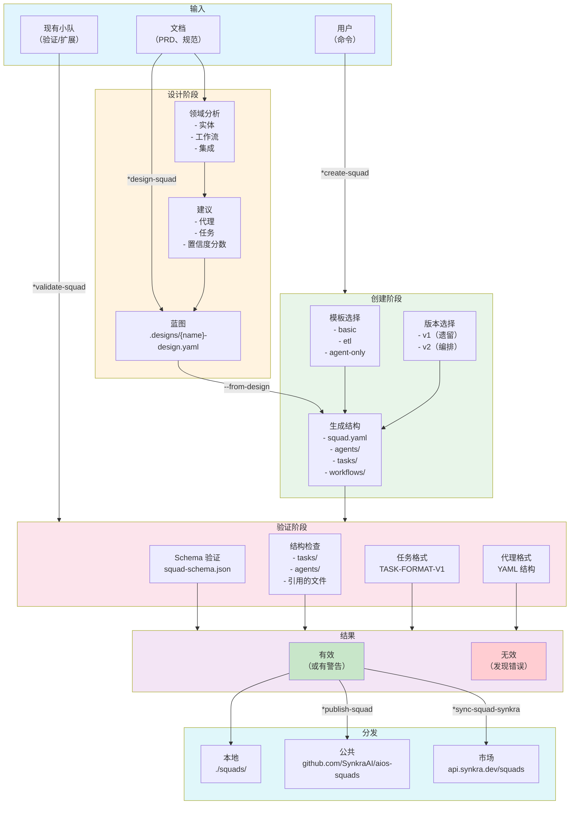
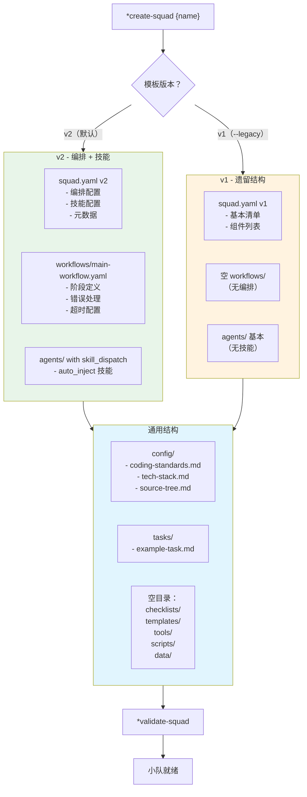
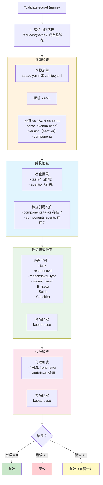
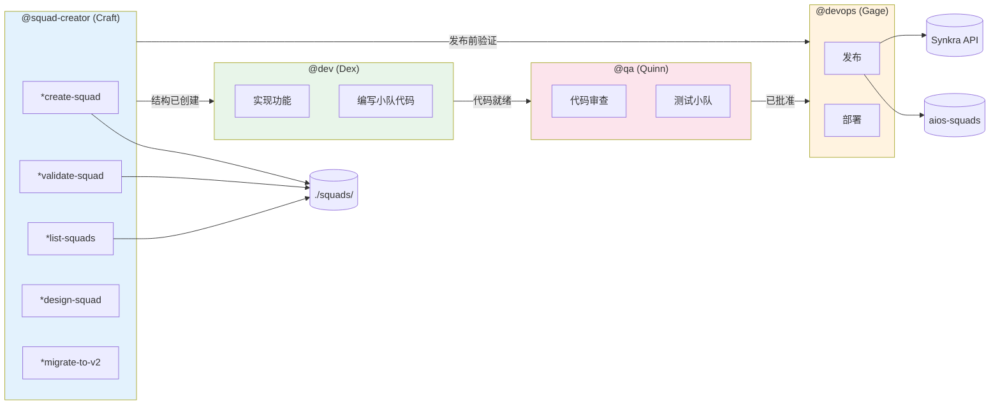
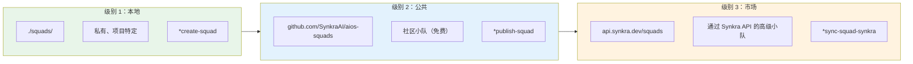

<!--
  翻译：zh-CN（简体中文）
  原文：/docs/aios-agent-flows/squad-creator-system.md
  最后同步：2026-02-22
-->

# AIOS 小队创建和管理系统

> **版本：** 1.0.0
> **创建日期：** 2026-02-04
> **负责人：** @squad-creator (Craft)
> **状态：** 官方文档

---

## 概述

**小队创建者** (Craft) 是 AIOS 用于创建、验证、发布和管理小队的专业代理。小队是代理、任务、工作流和资源的模块化包，可在项目之间重用。

该系统实现了 AIOS 的**任务优先架构**，其中任务是执行的主要入口点，代理编排这些任务。

### 系统目的

- **创建小队**遵循 AIOS 模式和结构
- **验证小队**针对 JSON Schema 和任务规范
- **列出小队**项目本地
- **分发小队**在 3 个级别（本地、aios-squads、Synkra API）
- **迁移小队**到带编排和技能的 v2 格式
- **分析和扩展**现有小队

### 基本原则

1. **任务优先架构**：任务是入口点，代理编排
2. **强制验证**：分发前始终验证
3. **JSON Schema**：清单针对 schema 验证
4. **3 级分发**：本地、公共（aios-squads）、市场（Synkra API）
5. **与 aios-core 集成**：小队与框架协同工作

---

## 完整文件列表

### 代理定义核心文件

| 文件 | 目的 |
|---------|-----------|
| `.aios-core/development/agents/squad-creator.md` | 小队创建者代理核心定义 |
| `.claude/commands/AIOS/agents/squad-creator.md` | 用于激活 @squad-creator 的 Claude Code 命令 |

### @squad-creator 任务文件

| 文件 | 命令 | 目的 | 状态 |
|---------|---------|-----------|--------|
| `.aios-core/development/tasks/squad-creator-create.md` | `*create-squad` | 创建带完整结构的新小队 | 活跃 |
| `.aios-core/development/tasks/squad-creator-design.md` | `*design-squad` | 分析文档并生成蓝图 | 活跃 |
| `.aios-core/development/tasks/squad-creator-validate.md` | `*validate-squad` | 验证小队针对 schema 和模式 | 活跃 |
| `.aios-core/development/tasks/squad-creator-list.md` | `*list-squads` | 列出本地小队 | 活跃 |
| `.aios-core/development/tasks/squad-creator-analyze.md` | `*analyze-squad` | 分析结构并建议改进 | 活跃 |
| `.aios-core/development/tasks/squad-creator-extend.md` | `*extend-squad` | 使用新组件扩展小队 | 活跃 |
| `.aios-core/development/tasks/squad-creator-migrate.md` | `*migrate-to-v2` | 迁移小队到 v2 格式 | 活跃 |
| `.aios-core/development/tasks/squad-generate-skills.md` | `*generate-skills` | 生成小队知识技能 | 活跃 |
| `.aios-core/development/tasks/squad-generate-workflow.md` | `*generate-workflow` | 生成 YAML 编排工作流 | 活跃 |
| `.aios-core/development/tasks/squad-creator-download.md` | `*download-squad` | 从公共仓库下载小队 | 占位符（Sprint 8） |
| `.aios-core/development/tasks/squad-creator-publish.md` | `*publish-squad` | 发布小队到 aios-squads | 占位符（Sprint 8） |
| `.aios-core/development/tasks/squad-creator-sync-synkra.md` | `*sync-squad-synkra` | 同步小队到 Synkra API | 占位符（Sprint 8） |

### 相关任务文件

| 文件 | 命令 | 目的 |
|---------|---------|-----------|
| `.aios-core/development/tasks/create-agent.md` | `*create-agent` | 创建单个代理定义 |
| `.aios-core/development/tasks/create-task.md` | `*create-task` | 创建单个任务文件 |
| `.aios-core/development/tasks/create-workflow.md` | `*create-workflow` | 创建编排工作流 |

### 支持脚本

| 文件 | 类/函数 | 目的 |
|---------|---------------|-----------|
| `.aios-core/development/scripts/squad/squad-generator.js` | `SquadGenerator` | 生成完整小队结构 |
| `.aios-core/development/scripts/squad/squad-validator.js` | `SquadValidator` | 验证小队针对 schema 和模式 |
| `.aios-core/development/scripts/squad/squad-loader.js` | `SquadLoader` | 加载和解析小队 |
| `.aios-core/development/scripts/squad/squad-designer.js` | `SquadDesigner` | 分析文档并生成蓝图 |
| `.aios-core/development/scripts/squad/squad-analyzer.js` | `SquadAnalyzer` | 分析小队结构 |
| `.aios-core/development/scripts/squad/squad-extender.js` | `SquadExtender` | 扩展现有小队 |
| `.aios-core/development/scripts/squad/squad-migrator.js` | `SquadMigrator` | 迁移小队到 v2 |
| `.aios-core/development/scripts/squad/squad-downloader.js` | `SquadDownloader` | 从仓库下载小队 |
| `.aios-core/development/scripts/squad/squad-publisher.js` | `SquadPublisher` | 发布小队 |

### JSON Schema

| 文件 | 目的 |
|---------|-----------|
| `.aios-core/schemas/squad-schema.json` | squad.yaml 验证 schema |
| `.aios-core/schemas/squad-design-schema.json` | 蓝图验证 schema |

### 输出文件（生成的小队）

| 目录 | 目的 |
|-----------|-----------|
| `./squads/{squad-name}/` | 小队根目录 |
| `./squads/{squad-name}/squad.yaml` | 小队清单（必需） |
| `./squads/{squad-name}/README.md` | 小队文档 |
| `./squads/{squad-name}/agents/` | 代理定义 |
| `./squads/{squad-name}/tasks/` | 任务定义 |
| `./squads/{squad-name}/workflows/` | 编排工作流 |
| `./squads/{squad-name}/config/` | 配置文件 |
| `./squads/.designs/` | *design-squad 生成的蓝图 |

---

## 流程图：小队管理完整系统



---

## 流程图：v1 vs v2 模板的小队创建



---

## 流程图：带蓝图的设计流程

```mermaid
flowchart TB
    subgraph INPUT["输入阶段"]
        DOCS["文档文件<br/>- PRD<br/>- 规范<br/>- 需求"]
        VERBAL["口头描述<br/>（交互式）"]
        DOMAIN["领域提示<br/>--domain 标志"]
    end

    INPUT --> NORMALIZE["1. 输入规范化<br/>- 解析 markdown/yaml/json<br/>- 提取文本内容<br/>- 合并来源"]

    NORMALIZE --> ANALYZE["2. 领域分析"]

    subgraph ANALYZE["分析管道"]
        ENTITY["实体提取<br/>- 名词/专有名词<br/>- 领域术语<br/>- 组概念"]
        WORKFLOW["工作流检测<br/>- 动作动词<br/>- 顺序流程<br/>- I/O 模式"]
        INTEGRATION["集成映射<br/>- 外部系统<br/>- API/服务"]
        STAKE["利益相关者 ID<br/>- 用户角色<br/>- 人物画像"]
    end

    ANALYZE --> RECOMMEND["3. 建议引擎"]

    subgraph RECOMMEND["建议"]
        AGENTS["代理生成<br/>- 工作流角色<br/>- 步骤命令<br/>- 置信度计算"]
        TASKS_R["任务生成<br/>- TASK-FORMAT-V1<br/>- 输入的 Entrada<br/>- 输出的 Saida"]
        DEDUP["去重<br/>- 合并 >70% 重叠"]
    end

    RECOMMEND --> REVIEW["4. 交互审查"]

    subgraph REVIEW["用户细化"]
        CONFIRM["[A]接受代理"]
        MODIFY["[M]修改代理"]
        REJECT["[R]拒绝代理"]
        ADD["[A]添加自定义"]
    end

    REVIEW --> BLUEPRINT["蓝图输出<br/>.designs/{name}-design.yaml"]

    BLUEPRINT --> CREATE["*create-squad --from-design"]

    style INPUT fill:#e1f5fe
    style ANALYZE fill:#fff3e0
    style RECOMMEND fill:#e8f5e9
    style REVIEW fill:#fce4ec
```



---

## 流程图：验证管道



---

## 命令到任务的映射

### 小队管理命令

| 命令 | 任务文件 | 操作 |
|---------|-----------|----------|
| `*create-squad` | `squad-creator-create.md` | 创建带完整结构的小队 |
| `*create-squad --from-design` | `squad-creator-create.md` | 从蓝图创建小队 |
| `*design-squad` | `squad-creator-design.md` | 通过文档分析设计小队 |
| `*validate-squad` | `squad-creator-validate.md` | 验证小队针对 schema |
| `*list-squads` | `squad-creator-list.md` | 列出本地小队 |
| `*analyze-squad` | `squad-creator-analyze.md` | 分析结构并建议改进 |
| `*extend-squad` | `squad-creator-extend.md` | 用新组件扩展小队 |

### 编排和技能命令（v2）

| 命令 | 任务文件 | 操作 |
|---------|-----------|----------|
| `*generate-skills` | `squad-generate-skills.md` | 生成小队知识技能 |
| `*generate-workflow` | `squad-generate-workflow.md` | 生成 YAML 编排工作流 |
| `*migrate-to-v2` | `squad-creator-migrate.md` | 迁移小队到 v2 格式 |

### 分发命令（Sprint 8 - 占位符）

| 命令 | 任务文件 | 操作 |
|---------|-----------|----------|
| `*download-squad` | `squad-creator-download.md` | 从 aios-squads 下载小队 |
| `*publish-squad` | `squad-creator-publish.md` | 发布小队到 aios-squads |
| `*sync-squad-synkra` | `squad-creator-sync-synkra.md` | 同步小队到 Synkra API |

### 单个组件命令

| 命令 | 任务文件 | 操作 |
|---------|-----------|----------|
| `*create-agent` | `create-agent.md` | 创建代理定义 |
| `*create-task` | `create-task.md` | 创建任务文件 |
| `*create-workflow` | `create-workflow.md` | 创建编排工作流 |

---

## 生成的小队结构

### v2（默认 - 带编排）

```text
./squads/{squad-name}/
├── squad.yaml                    # v2 清单（编排 + 技能）
├── README.md                     # 文档
├── config/
│   ├── coding-standards.md      # 代码标准
│   ├── tech-stack.md            # 技术栈
│   └── source-tree.md           # 文档化结构
├── agents/
│   └── example-agent.md         # 带 skill_dispatch 的代理
├── tasks/
│   └── example-task.md          # 遵循 TASK-FORMAT-V1 的任务
├── workflows/
│   └── main-workflow.yaml       # 带阶段的工作流（v2）
├── checklists/
│   └── .gitkeep
├── templates/
│   └── .gitkeep
├── tools/
│   └── .gitkeep
├── scripts/
│   └── .gitkeep
└── data/
    └── .gitkeep
```

### v1（遗留）

```text
./squads/{squad-name}/
├── squad.yaml                    # v1 清单（基本）
├── README.md
├── config/
│   ├── coding-standards.md
│   ├── tech-stack.md
│   └── source-tree.md
├── agents/
│   └── example-agent.md
├── tasks/
│   └── example-agent-task.md
├── workflows/
│   └── .gitkeep                 # 空（无编排）
├── checklists/
│   └── .gitkeep
├── templates/
│   └── .gitkeep
├── tools/
│   └── .gitkeep
├── scripts/
│   └── .gitkeep
└── data/
    └── .gitkeep
```

---

## 代理之间的协作图



---

## 可用模板

| 模板 | 描述 | 组件 |
|----------|-----------|-------------|
| `basic` | 最小结构 | 1 个代理、1 个任务 |
| `etl` | 数据处理 | 2 个代理（extractor、transformer）、3 个任务、scripts |
| `agent-only` | 仅代理 | 2 个代理（primary、helper）、无任务 |
| `custom` | 通过蓝图 | 由设计定义 |

## 模板版本

| 版本 | 描述 | 功能 |
|--------|-----------|----------|
| `v2` | **默认** - 完整编排 | squad.yaml v2、workflow.yaml、代理中的 skill_dispatch |
| `v1` | 遗留结构 | 基本 squad.yaml、无编排/技能 |

---

## squad.yaml 的 JSON Schema

### 必需字段

```yaml
name: string          # kebab-case，2-50 字符
version: string       # semver（1.0.0）
```

### 可选字段

```yaml
short-title: string   # 最多 100 字符
description: string   # 最多 500 字符
author: string
license: MIT | Apache-2.0 | ISC | GPL-3.0 | UNLICENSED
slashPrefix: string   # 命令前缀
tags: string[]        # 发现关键词

aios:
  minVersion: string  # AIOS 最低版本
  type: squad

components:
  tasks: string[]     # 任务文件
  agents: string[]    # 代理文件
  workflows: string[]
  checklists: string[]
  templates: string[]
  tools: string[]
  scripts: string[]

config:
  extends: extend | override | none
  coding-standards: string
  tech-stack: string
  source-tree: string

dependencies:
  node: string[]
  python: string[]
  squads: string[]
```

---

## 验证错误代码

| 代码 | 严重性 | 描述 |
|--------|------------|-----------|
| `MANIFEST_NOT_FOUND` | 错误 | squad.yaml 或 config.yaml 未找到 |
| `YAML_PARSE_ERROR` | 错误 | YAML 语法无效 |
| `SCHEMA_ERROR` | 错误 | 清单不符合 JSON Schema |
| `FILE_NOT_FOUND` | 错误 | 引用的文件不存在 |
| `DEPRECATED_MANIFEST` | 警告 | 使用 config.yaml 而非 squad.yaml |
| `MISSING_DIRECTORY` | 警告 | 预期目录未找到 |
| `NO_TASKS` | 警告 | tasks/ 中无任务文件 |
| `TASK_MISSING_FIELD` | 警告 | 任务缺少推荐字段 |
| `AGENT_INVALID_FORMAT` | 警告 | 代理文件可能不符合格式 |
| `INVALID_NAMING` | 警告 | 文件名不是 kebab-case |

---

## 分发级别



---

## 最佳实践

### 小队创建

1. **始终从设计开始** - 复杂项目使用 `*design-squad`
2. **遵循任务优先** - 任务是主要入口点
3. **默认使用 v2** - 支持编排和技能
4. **分发前验证** - `*validate-squad` 必需
5. **良好文档** - README.md 和 YAML 注释

### 组件组织

1. **命名**：始终使用 kebab-case
2. **任务**：包含 TASK-FORMAT-V1 所有必需字段
3. **代理**：使用带 `agent:` 块的 YAML frontmatter
4. **配置**：指定继承模式（extend/override/none）

### 验证

1. **提交前**：提交前执行 `*validate-squad`
2. **CI/CD**：在管道中集成验证
3. **严格模式**：使用 `--strict` 将警告视为错误
4. **修正**：处理警告以提高质量

### 分发

1. **本地测试** - 发布前验证和使用
2. **文档** - 完整 README 和清晰描述
3. **版本控制** - 正确使用 semver
4. **许可证** - 指定适当的许可证

---

## 故障排除

### 小队未出现在 *list-squads

- 验证目录在 `./squads/` 中存在
- 检查 `squad.yaml` 或 `config.yaml` 存在
- 验证清单的 YAML 语法

### 验证失败 SCHEMA_ERROR

- 检查 `name` 字段（必须是 kebab-case）
- 检查 `version` 字段（必须是 semver：1.0.0）
- 使用 YAML linter 验证语法

### 验证失败 FILE_NOT_FOUND

- 验证 `components` 中列出的文件
- 检查相对路径（相对于小队目录）
- 创建缺失文件或从列表中移除

### 任务报告 TASK_MISSING_FIELD

- 添加必需字段：
  - `task:`、`responsavel:`、`responsavel_type:`
  - `atomic_layer:`、`Entrada:`、`Saida:`、`Checklist:`
- 遵循 TASK-FORMAT-SPECIFICATION-V1 格式

### 蓝图生成失败

- 提供更详细的文档
- 使用 `--verbose` 查看分析
- 使用 `--domain` 提供上下文

### *create-squad --from-design 失败

- 验证蓝图在指定路径存在
- 验证蓝图的 YAML 语法
- 检查所有必需字段是否存在

---

## 参考

- [任务：squad-creator-create.md](.aios-core/development/tasks/squad-creator-create.md)
- [任务：squad-creator-validate.md](.aios-core/development/tasks/squad-creator-validate.md)
- [任务：squad-creator-design.md](.aios-core/development/tasks/squad-creator-design.md)
- [脚本：squad-generator.js](.aios-core/development/scripts/squad/squad-generator.js)
- [脚本：squad-validator.js](.aios-core/development/scripts/squad/squad-validator.js)
- [Schema：squad-schema.json](.aios-core/schemas/squad-schema.json)
- [代理：squad-creator.md](.aios-core/development/agents/squad-creator.md)
- [命令：squad-creator.md](.claude/commands/AIOS/agents/squad-creator.md)

---

## 摘要

| 方面 | 详情 |
|---------|----------|
| **核心任务总数** | 12 个任务文件 |
| **活跃任务** | 9 个（create、design、validate、list、analyze、extend、migrate、generate-skills、generate-workflow） |
| **占位符任务** | 3 个（download、publish、sync-synkra） |
| **支持脚本** | 9 个脚本在 squad/ |
| **Schemas** | 2 个（squad-schema、squad-design-schema） |
| **模板** | 3 个（basic、etl、agent-only） |
| **模板版本** | 2 个（v1 遗留、v2 编排） |
| **分发级别** | 3 个（本地、aios-squads、Synkra API） |

---

## 变更日志

| 日期 | 作者 | 描述 |
|------|-------|-----------|
| 2026-02-04 | @squad-creator | 创建包含 7 个 Mermaid 图的初始文档 |

---

*-- Craft，始终结构化*
