# UX设计专家系统 AIOS

> **版本:** 1.0.0
> **创建于:** 2026-02-04
> **所有者:** @ux-design-expert (Uma)
> **状态:** 官方文档

---

## 概览

本文档描述了**UX设计专家(Uma)**代理的完整系统，包括所有涉及的文件、工作流、可用命令、与其他代理的集成和AIOS工作流。

UX设计专家是一个混合型代理，结合了:
- **Sally的UX原则** - 同理心、用户研究、以用户为中心的设计
- **Brad Frost的系统原则** - 原子设计、设计令牌、指标和ROI

### 目的

该代理旨在:
- 进行用户研究并创建角色
- 创建线框和交互流
- 审计现有代码库以识别UI冗余
- 提取和整合设计令牌
- 构建原子组件(原子、分子、有机体)
- 确保无障碍访问(WCAG AA/AAA)
- 计算设计系统的ROI和节省

---

## 5阶段架构

UX设计专家分5个阶段运营，每个阶段有特定命令:

```mermaid
flowchart TB
    subgraph PHASE1["第1阶段: UX研究"]
        R1["*research<br/>用户研究"]
        R2["*wireframe<br/>创建线框"]
        R3["*generate-ui-prompt<br/>v0/Lovable提示"]
        R4["*create-front-end-spec<br/>前端规范"]
    end

    subgraph PHASE2["第2阶段: 设计系统审计"]
        A1["*audit {path}<br/>扫描冗余"]
        A2["*consolidate<br/>智能聚类"]
        A3["*shock-report<br/>视觉HTML报告"]
    end

    subgraph PHASE3["第3阶段: 设计令牌"]
        T1["*tokenize<br/>提取令牌"]
        T2["*setup<br/>初始化DS"]
        T3["*migrate<br/>迁移策略"]
        T4["*upgrade-tailwind<br/>升级Tailwind v4"]
        T5["*bootstrap-shadcn<br/>安装Shadcn/Radix"]
    end

    subgraph PHASE4["第4阶段: 组件构建"]
        B1["*build {component}<br/>构建原子"]
        B2["*compose {molecule}<br/>组成分子"]
        B3["*extend {component}<br/>添加变体"]
    end

    subgraph PHASE5["第5阶段: 质量与文档"]
        Q1["*document<br/>模式库"]
        Q2["*a11y-check<br/>WCAG审计"]
        Q3["*calculate-roi<br/>计算ROI"]
    end

    PHASE1 --> PHASE2
    PHASE2 --> PHASE3
    PHASE3 --> PHASE4
    PHASE4 --> PHASE5

    style PHASE1 fill:#e3f2fd
    style PHASE2 fill:#fff3e0
    style PHASE3 fill:#e8f5e9
    style PHASE4 fill:#fce4ec
    style PHASE5 fill:#f3e5f5
```

---

## 完整文件列表

### 代理定义文件

| 文件 | 目的 |
|------|------|
| `.aios-core/development/agents/ux-design-expert.md` | 完整的代理定义(角色、命令、工作流) |
| `.claude/commands/AIOS/agents/ux-design-expert.md` | Claude Code命令激活@ux-design-expert |

### 按阶段的任务

#### 第1阶段: UX研究与设计(4个任务)

| 文件 | 命令 | 目的 |
|------|------|------|
| `.aios-core/development/tasks/ux-user-research.md` | `*research` | 进行用户研究、创建角色和旅程 |
| `.aios-core/development/tasks/ux-create-wireframe.md` | `*wireframe` | 创建低/中/高保真线框 |
| `.aios-core/development/tasks/generate-ai-frontend-prompt.md` | `*generate-ui-prompt` | 为v0.dev、Lovable.ai生成提示 |
| `.aios-core/development/tasks/create-doc.md` | `*create-front-end-spec` | 创建详细的前端规范 |

#### 第2阶段: 设计系统审计(3个任务)

| 文件 | 命令 | 目的 |
|------|------|------|
| `.aios-core/development/tasks/audit-codebase.md` | `*audit {path}` | 扫描代码库的UI冗余 |
| `.aios-core/development/tasks/consolidate-patterns.md` | `*consolidate` | 用HSL聚类减少冗余 |
| `.aios-core/development/tasks/generate-shock-report.md` | `*shock-report` | 生成视觉HTML报告 |

#### 第3阶段: 设计令牌与设置(7个任务)

| 文件 | 命令 | 目的 |
|------|------|------|
| `.aios-core/development/tasks/extract-tokens.md` | `*tokenize` | 提取设计令牌(YAML、JSON、CSS、DTCG) |
| `.aios-core/development/tasks/setup-design-system.md` | `*setup` | 初始化设计系统结构 |
| `.aios-core/development/tasks/generate-migration-strategy.md` | `*migrate` | 生成4阶段迁移策略 |
| `.aios-core/development/tasks/tailwind-upgrade.md` | `*upgrade-tailwind` | 升级到Tailwind CSS v4 |
| `.aios-core/development/tasks/audit-tailwind-config.md` | `*audit-tailwind-config` | 验证Tailwind配置 |
| `.aios-core/development/tasks/export-design-tokens-dtcg.md` | `*export-dtcg` | 导出W3C DTCG令牌 |
| `.aios-core/development/tasks/bootstrap-shadcn-library.md` | `*bootstrap-shadcn` | 安装Shadcn/Radix UI |

#### 第4阶段: 原子组件构建(3个任务)

| 文件 | 命令 | 目的 |
|------|------|------|
| `.aios-core/development/tasks/build-component.md` | `*build {component}` | 构建原子组件(React + TypeScript) |
| `.aios-core/development/tasks/compose-molecule.md` | `*compose {molecule}` | 从现有原子组成分子 |
| `.aios-core/development/tasks/extend-pattern.md` | `*extend {component}` | 向现有组件添加变体 |

#### 第5阶段: 质量与文档(3个任务)

| 文件 | 命令 | 目的 |
|------|------|------|
| `.aios-core/development/tasks/generate-documentation.md` | `*document` | 生成模式库文档 |
| `.aios-core/development/tasks/calculate-roi.md` | `*calculate-roi` | 计算ROI和成本节省 |
| `.aios-core/development/checklists/accessibility-wcag-checklist.md` | `*a11y-check` | WCAG无障碍审计 |

#### 通用任务(2个任务)

| 文件 | 命令 | 目的 |
|------|------|------|
| `.aios-core/development/tasks/ux-ds-scan-artifact.md` | `*scan {path\|url}` | 分析HTML/React以提取模式 |
| `.aios-core/development/tasks/integrate-Squad.md` | `*integrate {squad}` | 与扩展小组连接 |

---

## 总结

| 方面 | 详情 |
|------|------|
| **总任务数** | 22个任务 |
| **总命令数** | 19个命令+4个通用 |
| **工作流阶段** | 5阶段 |
| **协作代理** | 4个 |

---

*-- Uma，以同理心设计*
