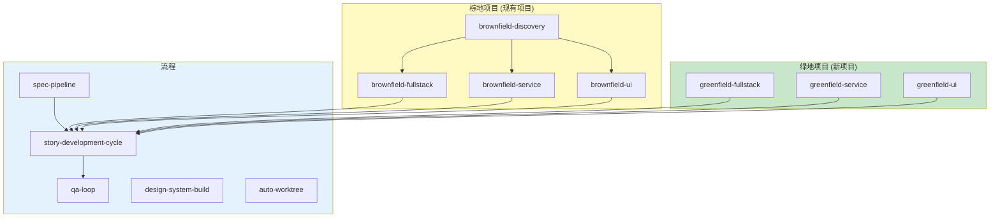
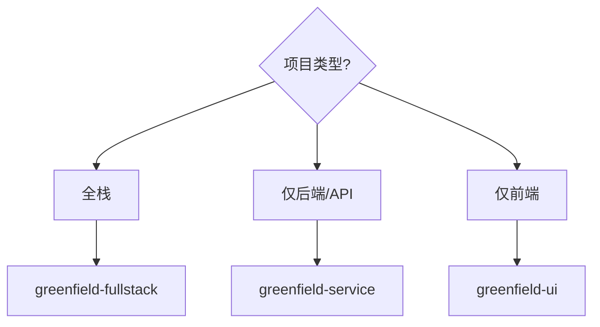
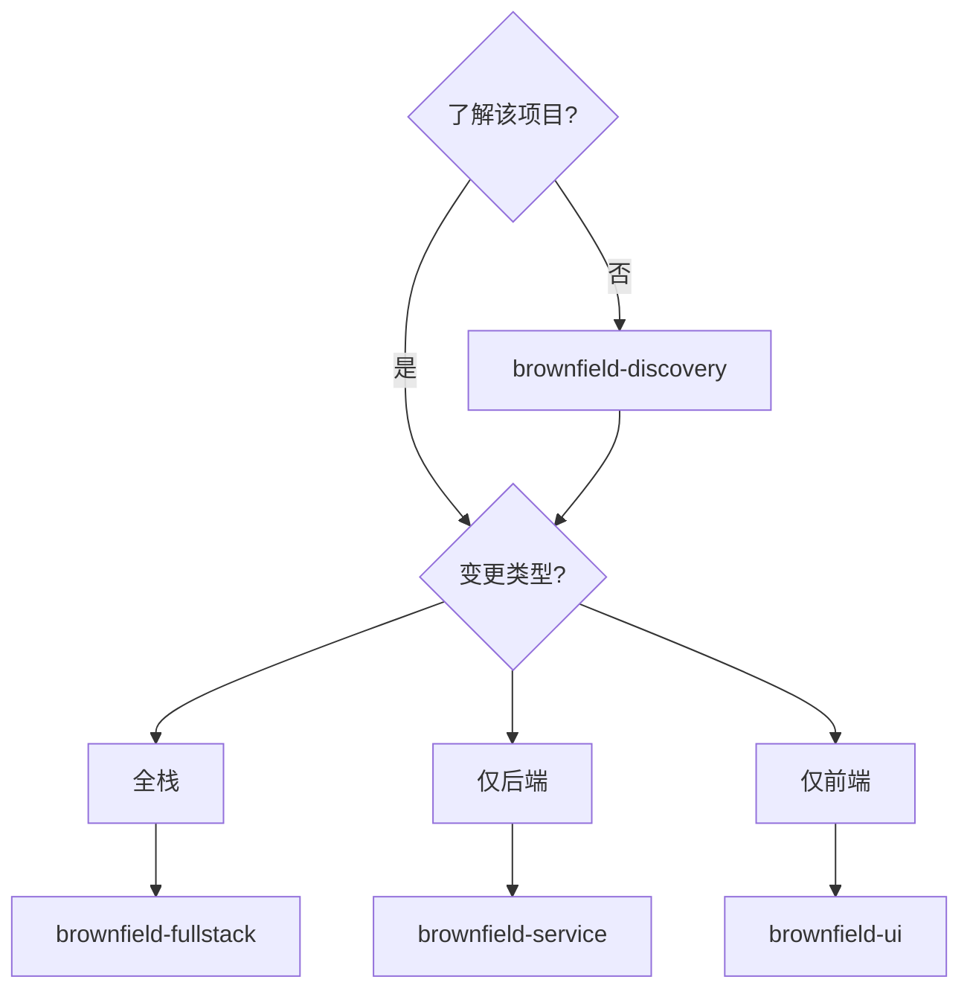

# AIOS 工作流 - 工作流详细文档

> 🌐 **简体中文** | [PT](../../aios-workflows/README.md) | [EN](../../en/aios-workflows/README.md) | [ES](../../es/aios-workflows/README.md)

---

**版本:** 1.0.0
**最后更新:** 2026-02-05
**状态:** 官方文档

---

## 概述

本文件夹包含 AIOS 所有工作流的详细文档,包括:

- **完整的 Mermaid 图表** (流程图、序列图、状态图)
- **详细的步骤** 包括输入/输出
- **参与的代理** 及其角色
- **决策点** 和条件
- **前置条件** 和配置
- **故障排除** 和执行模式

---

## 文档化的工作流

### 按项目类型

| 类型 | 工作流 | 描述 | 文档 |
|------|--------|------|------|
| **绿地项目** | 全栈 | 从零开始的全栈应用 | [greenfield-fullstack-workflow.md](./greenfield-fullstack-workflow.md) |
| **绿地项目** | 服务 | 从零开始的后端/API | [greenfield-service-workflow.md](./greenfield-service-workflow.md) |
| **绿地项目** | UI | 从零开始的前端 | [greenfield-ui-workflow.md](./greenfield-ui-workflow.md) |
| **棕地项目** | 发现 | 现有项目分析 | [brownfield-discovery-workflow.md](./brownfield-discovery-workflow.md) |
| **棕地项目** | 全栈 | 现有全栈演进 | [brownfield-fullstack-workflow.md](./brownfield-fullstack-workflow.md) |
| **棕地项目** | 服务 | 现有后端演进 | [brownfield-service-workflow.md](./brownfield-service-workflow.md) |
| **棕地项目** | UI | 现有前端演进 | [brownfield-ui-workflow.md](./brownfield-ui-workflow.md) |

### 按流程

| 流程 | 工作流 | 描述 | 文档 |
|------|--------|------|------|
| **开发** | 故事周期 | 完整的故事周期 | [story-development-cycle-workflow.md](./story-development-cycle-workflow.md) |
| **质量** | 质量保证循环 | 质量周期 | [qa-loop-workflow.md](./qa-loop-workflow.md) |
| **规范** | 规范管道 | 规范管道 | [spec-pipeline-workflow.md](./spec-pipeline-workflow.md) |
| **设计** | 设计系统 | 设计系统构建 | [design-system-build-quality-workflow.md](./design-system-build-quality-workflow.md) |
| **Git** | 自动工作树 | 自动工作树管理 | [auto-worktree-workflow.md](./auto-worktree-workflow.md) |

---

## 每个文档的结构

每个工作流文档遵循这个标准结构:

```
1. 概述
   - 工作流的目标
   - 支持的项目类型
   - 何时使用/不使用

2. Mermaid 图表
   - 主流程图
   - 状态图
   - 序列图

3. 详细步骤
   - ID、代理、动作
   - 输入和输出
   - 成功标准
   - 状态转换

4. 参与的代理
   - 每个代理的角色
   - 相关命令

5. 执行的任务
   - 按阶段的任务映射
   - 任务文件

6. 前置条件
   - 必需的配置
   - 前置文档
   - 集成工具

7. 输入和输出
   - 工作流输入
   - 生成的输出

8. 决策点
   - 分支条件
   - 阻塞标准

9. 执行模式
   - YOLO (自主)
   - Interactive (平衡)
   - Pre-Flight (规划)

10. 故障排除
    - 常见问题
    - 日志和诊断

11. 变更日志
    - 版本历史
```

---

## 工作流地图



---

## 工作流选择指南

### 新项目?



### 现有项目?



---

## 工作流之间的流程

| 从 | 到 | 条件 |
|----|-----|------|
| `brownfield-discovery` | `brownfield-*` | 完成分析后 |
| `greenfield-*` | `story-development-cycle` | 每个故事 |
| `brownfield-*` | `story-development-cycle` | 每个故事 |
| `spec-pipeline` | `story-development-cycle` | 规范批准后 |
| `story-development-cycle` | `qa-loop` | 质量保证阶段 |

---

## 如何使用本文档

### 启动项目

1. 使用上面的 **选择指南** 选择工作流
2. 阅读选定工作流的 **概述**
3. 检查 **前置条件**
4. 按顺序遵循 **步骤**

### 理解流程

1. 分析 **Mermaid 图表**
2. 查看 **参与的代理** 及其角色
3. 查阅 **决策点**

### 调试问题

1. 转至 **故障排除** 部分
2. 检查 **日志和诊断**
3. 查阅每个步骤的 **成功标准**

---

## 与其他文档的关系

| 文档 | 位置 | 用途 |
|------|------|------|
| 工作流指南 | [docs/guides/workflows-guide.md](../../guides/workflows-guide.md) | 一般指南 |
| 代理流程 | [docs/aios-agent-flows/](../../aios-agent-flows/) | 代理详情 |
| 代理参考 | [docs/agent-reference-guide.md](../../agent-reference-guide.md) | 快速参考 |

---

## 贡献

要添加或更新工作流文档:

1. 遵循上面描述的标准结构
2. 包括完整的 Mermaid 图表
3. 记录所有输入/输出
4. 保持变更日志最新
5. 创建 EN 和 ES 翻译

---

*AIOS 工作流文档 v1.0 - 开发工作流的详细文档*
