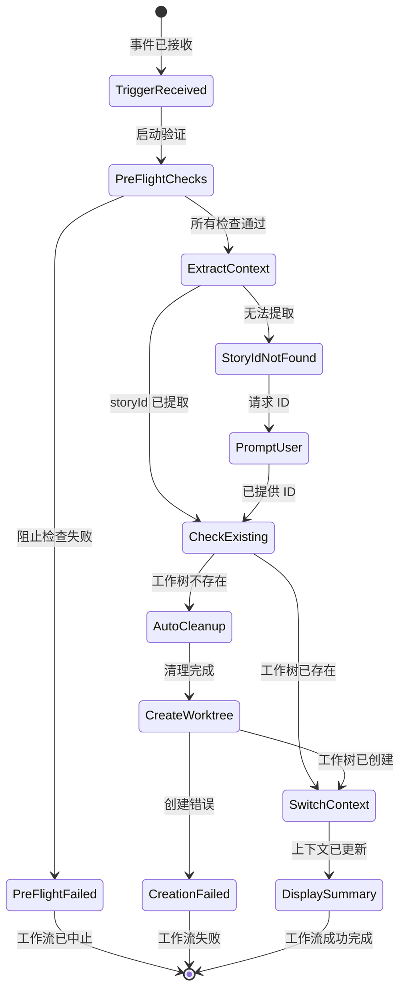
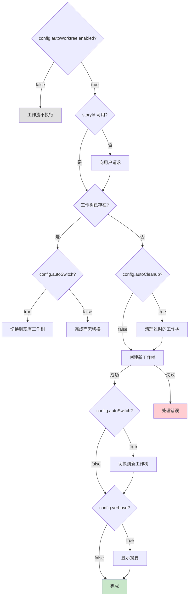
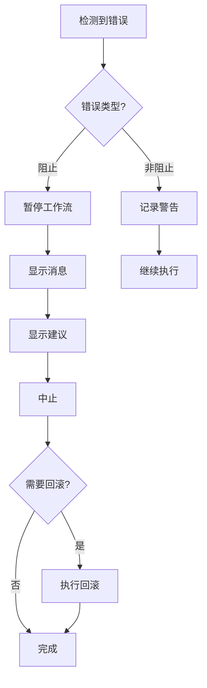

# 自动工作树工作流

**版本:** 1.0
**创建:** 2026-01-28
**作者:** @architect (Aria)
**故事:** 1.4 - Epic 1 - 工作树管理器

---

## 概览

**自动工作树**是一个自动化工作流，为故事开发创建和管理隔离的 Git 工作树。它是**Auto-Claude ADE** (自主开发引擎)基础设施的一部分，允许多个故事的并行开发而无分支冲突。

### 主要好处

| 好处 | 描述 |
|------|------|
| **隔离** | 每个故事在单独的目录和分支中工作 |
| **并行性** | 多个故事可以同时开发 |
| **自动化** | 启动故事时自动创建工作树 |
| **清理** | 过时的工作树可以自动删除 |

### 工作流何时被触发

1. **事件 `story_started`**: 当 `@dev` 启动故事时
2. **事件 `story_assigned`**: 当 `@po` 分配故事时 (可选)
3. **手动命令**: `*auto-worktree`

---

## 工作流图

### 主流程

```mermaid
flowchart TB
    subgraph TRIGGER["触发器"]
        T1[story_started<br/>@dev]
        T2[story_assigned<br/>@po]
        T3[*auto-worktree<br/>手动]
    end

    subgraph PREFLIGHT["飞行前检查"]
        PF1{Git 存储库?}
        PF2{支持工作树?}
        PF3{WorktreeManager?}
        PF4{工作树限制?}
    end

    subgraph WORKFLOW["工作流序列"]
        S1["步骤 1: 提取故事上下文<br/>提取故事 ID"]
        S2["步骤 2: 检查现有<br/>检查现有工作树"]
        S3["步骤 3: 自动清理<br/>清理过时的工作树"]
        S4["步骤 4: 创建工作树<br/>创建隔离工作树"]
        S5["步骤 5: 切换上下文<br/>切换到工作树"]
        S6["步骤 6: 显示摘要<br/>显示摘要"]
    end

    subgraph OUTPUT["输出"]
        O1[storyId]
        O2[worktree.path]
        O3[worktree.branch]
        O4[worktree.status]
    end

    T1 --> PF1
    T2 --> PF1
    T3 --> PF1

    PF1 -->|是| PF2
    PF1 -->|否| ERR1[错误: 非 git 存储库]

    PF2 -->|是| PF3
    PF2 -->|否| ERR2[错误: Git < 2.5]

    PF3 -->|存在| PF4
    PF3 -->|不存在| ERR3[错误: AIOS 不完整]

    PF4 -->|正常| S1
    PF4 -->|接近限制| WARN1[警告: 接近限制]
    WARN1 --> S1

    S1 --> S2
    S2 -->|存在| S5
    S2 -->|不存在| S3
    S3 --> S4
    S4 -->|成功| S5
    S4 -->|失败| ERR4[错误: 创建失败]
    S5 --> S6
    S6 --> O1
    S6 --> O2
    S6 --> O3
    S6 --> O4

    style TRIGGER fill:#e1f5fe
    style PREFLIGHT fill:#fff3e0
    style WORKFLOW fill:#e8f5e9
    style OUTPUT fill:#f3e5f5
    style ERR1 fill:#ffcdd2
    style ERR2 fill:#ffcdd2
    style ERR3 fill:#ffcdd2
    style ERR4 fill:#ffcdd2
    style WARN1 fill:#fff9c4
```

### 状态图



### 组件架构

```mermaid
graph TB
    subgraph AIOS["AIOS 核心"]
        WF[auto-worktree.yaml<br/>工作流定义]
        TK[create-worktree.md<br/>任务定义]
    end

    subgraph INFRA["基础设施"]
        WM[worktree-manager.js<br/>WorktreeManager 类]
        GIT[Git CLI<br/>git worktree]
    end

    subgraph FS["文件系统"]
        WT[.aios/worktrees/{storyId}/<br/>工作树目录]
        LOG[.aios/logs/merges/<br/>合并审计日志]
    end

    subgraph AGENTS["代理"]
        DEV[@dev<br/>Gage - DevOps]
        PO[@po<br/>产品所有者]
    end

    DEV -->|启动故事| WF
    PO -->|分配故事| WF
    WF -->|执行| TK
    TK -->|使用| WM
    WM -->|执行| GIT
    GIT -->|创建| WT
    WM -->|记录| LOG

    style AIOS fill:#e3f2fd
    style INFRA fill:#fce4ec
    style FS fill:#f3e5f5
    style AGENTS fill:#e8f5e9
```

---

## 详细步骤

### 步骤 1: 提取故事上下文

| 属性 | 值 |
|------|-----|
| **阶段** | 1 - 提取上下文 |
| **操作** | `extract_story_info` |
| **代理** | 系统 (自动) |
| **阻止** | 是 |

**描述:**
从触发器上下文提取故事 ID。在多个来源中搜索:

1. 显式参数 `storyId`
2. 故事文件路径 (`storyFile`)
3. 当前任务 (`currentTask.storyId`)
4. 当前分支名称 (约定 `story-X.Y`)

**输入:**
```typescript
interface TriggerContext {
  storyId?: string;
  storyFile?: string;
  currentTask?: { storyId: string };
}
```

**输出:**
```typescript
{ storyId: string }
```

**如果失败错误:**
```
无法确定故事 ID。请明确提供。
```

---

### 步骤 2: 检查现有

| 属性 | 值 |
|------|-----|
| **阶段** | 2 - 检查现有 |
| **操作** | `check_worktree_exists` |
| **代理** | 系统 (自动) |
| **阻止** | 否 (可以跳过切换) |

**描述:**
检查故事的工作树是否已存在。如果存在，跳到步骤 5 (切换上下文)。

**逻辑:**
```javascript
const manager = new WorktreeManager();
const exists = await manager.exists(storyId);

if (exists) {
  const config = await manager.getConfig();
  if (!config.autoSwitch) {
    return { exists: true, action: 'skip' };
  }
  return { exists: true, action: 'switch' };
}
return { exists: false, action: 'create' };
```

**输出:**
```typescript
interface CheckResult {
  exists: boolean;
  worktree?: WorktreeInfo;
  action: 'switch' | 'skip' | 'create';
}
```

---

### 步骤 3: 自动清理

| 属性 | 值 |
|------|-----|
| **阶段** | 3 - 自动清理 |
| **操作** | `cleanup_stale_worktrees` |
| **代理** | @devops (Gage) |
| **条件** | `config.autoCleanup === true` |

**描述:**
在创建新的工作树前自动删除过时的工作树 (30 天未使用)。此步骤仅在配置中启用 `autoCleanup` 时执行。

**过时标准:**
- 工作树创建超过 `staleDays` (默认: 30 天)

**输出:**
```typescript
interface CleanupResult {
  cleaned: number;
  removedIds: string[];
}
```

**日志:**
```
清理了 {cleaned} 个过时的工作树
```

---

### 步骤 4: 创建工作树

| 属性 | 值 |
|------|-----|
| **阶段** | 4 - 创建工作树 |
| **操作** | `create_isolated_worktree` |
| **代理** | @devops (Gage) |
| **任务** | `create-worktree.md` |
| **阻止** | 是 |

**描述:**
使用 WorktreeManager 为故事创建新的隔离工作树。

**创建的结构:**
```
.aios/worktrees/{storyId}/     # 工作目录
分支: auto-claude/{storyId}   # Git 分支
```

**输入:**
```typescript
{ storyId: string }
```

**输出:**
```typescript
interface CreateResult {
  success: boolean;
  worktree: WorktreeInfo;
  path: string;
  branch: string;
  error?: string;
}
```

**执行的 Git 命令:**
```bash
git worktree add .aios/worktrees/{storyId} -b auto-claude/{storyId}
```

---

### 步骤 5: 切换上下文

| 属性 | 值 |
|------|-----|
| **阶段** | 5 - 切换上下文 |
| **操作** | `switch_to_worktree` |
| **代理** | 系统 (自动) |
| **条件** | `config.autoSwitch === true` |

**描述:**
配置环境变量并显示导航到工作树的说明。

**环境变量:**
```bash
AIOS_WORKTREE=/path/to/.aios/worktrees/{storyId}
AIOS_STORY={storyId}
```

**输出:**
```typescript
interface SwitchResult {
  worktreePath: string;
  instructions: string;  // "cd /path/to/worktree"
}
```

---

### 步骤 6: 显示摘要

| 属性 | 值 |
|------|-----|
| **阶段** | 6 - 摘要 |
| **操作** | `show_summary` |
| **代理** | 系统 (自动) |
| **条件** | `config.verbose === true` |

**描述:**
显示操作的完整摘要，包括工作树信息和后续步骤。

**输出模板:**
```
+------------------------------------------------------------------+
|  自动工作树完成                                                   |
+------------------------------------------------------------------+

故事:      {storyId}
工作树:    {worktree.path}
分支:      {worktree.branch}
状态:      {worktree.status}

-------------------------------------------------------------------
快速参考:

导航:     cd {worktree.path}
状态:     *list-worktrees
合并:      *merge-worktree {storyId}
删除:      *remove-worktree {storyId}

-------------------------------------------------------------------
您现在在隔离环境中工作。
这里的更改在合并前不会影响主分支。
```

---

## 参与的代理

### @devops (Gage)

| 责任 | 描述 |
|------|------|
| **工作树创建** | 执行 `create-worktree.md` 任务 |
| **工作树删除** | 执行 `remove-worktree.md` 任务 |
| **自动清理** | 删除过时的工作树 |
| **工作树合并** | 执行 `merge-worktree.md` 任务 |

**代理命令:**
- `*create-worktree {storyId}` - 创建隔离工作树
- `*list-worktrees` - 列表活跃工作树
- `*remove-worktree {storyId}` - 删除工作树
- `*merge-worktree {storyId}` - 合并工作树
- `*cleanup-worktrees` - 清理过时的工作树

### @dev (开发人员)

| 责任 | 描述 |
|------|------|
| **主要触发** | 启动故事时启动工作流 |
| **开发** | 在隔离工作树内工作 |

### @po (产品所有者)

| 责任 | 描述 |
|------|------|
| **次要触发** | 分配故事时可能启动创建 |

---

## 执行的任务

### create-worktree.md

| 属性 | 值 |
|------|-----|
| **位置** | `.aios-core/development/tasks/create-worktree.md` |
| **代理** | @devops (Gage) |
| **版本** | 1.0 |
| **故事** | 1.3 |

**执行模式:**

| 模式 | 提示 | 推荐用途 |
|------|------|----------|
| **YOLO** (默认) | 0-1 | 快速故事设置 |
| **Interactive** | 2-3 | 新用户 |

**前置条件:**
- [x] 当前目录是 git 存储库
- [x] WorktreeManager 可用
- [x] 未达工作树限制

**后置条件:**
- [x] 工作树目录存在
- [x] 分支 `auto-claude/{storyId}` 存在

---

## 前置条件

### 系统要求

| 要求 | 最低版本 | 验证 |
|------|-----------|-------|
| **Git** | >= 2.5 | `git --version` |
| **Node.js** | >= 18 | `node --version` |
| **AIOS 核心** | 已安装 | 检查 `.aios-core/` |

### NPM 依赖

| 包 | 用途 |
|------|-----|
| **execa** | Git 命令执行 |
| **chalk** | 终端颜色 |

### 必需的文件

```
.aios-core/
  infrastructure/
    scripts/
      worktree-manager.js     # WorktreeManager 类
  development/
    workflows/
      auto-worktree.yaml       # 工作流定义
    tasks/
      create-worktree.md       # 创建任务
      list-worktrees.md        # 列表任务
      remove-worktree.md       # 删除任务
      merge-worktree.md        # 合并任务
```

---

## 输入和输出

### 工作流输入

| 输入 | 类型 | 必需 | 来源 | 描述 |
|-----|------|------|------|------|
| `storyId` | 字符串 | 是* | 上下文或用户 | 故事 ID (例如: 故事-42, 1.3) |
| `storyFile` | 字符串 | 否 | 上下文 | 故事文件路径 |
| `currentTask` | 对象 | 否 | 上下文 | 当前执行的任务 |

*必需，但可从上下文自动提取。

### 工作流输出

| 输出 | 类型 | 描述 |
|-----|------|------|
| `storyId` | 字符串 | 已处理的故事 ID |
| `worktree` | WorktreeInfo | 工作树信息对象 |
| `path` | 字符串 | 工作树的绝对路径 |
| `branch` | 字符串 | 分支名称 (`auto-claude/{storyId}`) |

### WorktreeInfo 接口

```typescript
interface WorktreeInfo {
  storyId: string;           // 'STORY-42'
  path: string;              // '/abs/path/.aios/worktrees/STORY-42'
  branch: string;            // 'auto-claude/STORY-42'
  createdAt: Date;           // 创建日期
  uncommittedChanges: number; // 未提交的更改数
  status: 'active' | 'stale'; // 基于年龄的状态
}
```

---

## 决策点

### 决策图



### 影响决策的配置

| 配置 | 默认 | 影响 |
|------|------|------|
| `enabled` | true | 启用/禁用工作流 |
| `createOnAssign` | false | @po 分配故事时创建工作树 |
| `autoSwitch` | true | 自动切换到工作树 |
| `verbose` | true | 完成时显示摘要 |
| `autoCleanup` | false | 自动清理过时的工作树 |
| `maxWorktrees` | 10 | 同时工作树限制 |
| `staleDays` | 30 | 将工作树视为过时的天数 |

---

## 错误处理

### 阻止错误

| 错误 | 原因 | 解决方案 |
|------|------|---------|
| `Not a git repository` | 目录不是 git 存储库 | 执行 `git init` |
| `Git worktree not supported` | Git < 2.5 | 升级 Git |
| `WorktreeManager not found` | AIOS 不完整 | 重新安装 AIOS |
| `Maximum worktrees limit reached` | >= 10 个工作树 | 执行 `*cleanup-worktrees` |
| `Could not determine story ID` | 未找到 ID | 明确提供 ID |
| `Worktree creation failed` | git worktree 错误 | 检查 git 状态 |

### 非阻止错误 (警告)

| 警告 | 原因 | 操作 |
|------|------|------|
| `Approaching worktree limit` | 接近限制 | 考虑清理 |
| `Could not delete branch` | 分支受保护或正在使用 | 手动删除 |

### 错误恢复流程



---

## 故障排查

### 问题: 未创建工作树

**症状:**
- 命令 `*create-worktree` 失败
- 消息 "Failed to create worktree"

**诊断:**
```bash
# 检查是否是 git 存储库
git rev-parse --is-inside-work-tree

# 检查 git 版本
git --version

# 检查现有的工作树
git worktree list

# 检查 WorktreeManager 存在
ls .aios-core/infrastructure/scripts/worktree-manager.js
```

**解决方案:**
1. 初始化存储库: `git init`
2. 升级 Git 至 >= 2.5
3. 清理工作树: `*cleanup-worktrees`
4. 删除特定工作树: `*remove-worktree {storyId}`

---

### 问题: 达到工作树限制

**症状:**
- 消息 "Maximum worktrees limit (10) reached"

**诊断:**
```bash
# 列出所有工作树
*list-worktrees

# 检查数量
git worktree list | wc -l
```

**解决方案:**
1. 清理过时工作树: `*cleanup-worktrees`
2. 删除未使用的工作树: `*remove-worktree {storyId}`
3. 增加限制 (如需): 在 `.aios/config.yaml` 中

---

### 问题: 合并时冲突

**症状:**
- `*merge-worktree` 失败
- 带文件冲突列表的消息

**诊断:**
```bash
# 检查冲突文件
git diff --name-only --diff-filter=U

# 查看差异
git diff HEAD...auto-claude/{storyId}
```

**解决方案:**
1. 在工作树中手动解决冲突
2. 重新设置工作树基: `git rebase main` (在工作树内)
3. 使用分阶段合并: `*merge-worktree {storyId} --staged`

---

### 问题: 工作树损坏

**症状:**
- 工作树中 git 命令失败
- 工作树显示为 "locked"

**诊断:**
```bash
# 检查工作树状态
git worktree list

# 检查是否locked
ls .git/worktrees/{storyId}/locked
```

**解决方案:**
1. 删除锁: `rm .git/worktrees/{storyId}/locked`
2. 强制删除工作树: `*remove-worktree {storyId} --force`
3. 手动删除:
   ```bash
   git worktree remove .aios/worktrees/{storyId} --force
   git branch -D auto-claude/{storyId}
   ```

---

### 问题: 未检测到故事 ID

**症状:**
- 消息 "Could not determine story ID"

**解决方案:**
1. 明确提供 ID: `*auto-worktree 故事-42`
2. 检查故事文件是否存在
3. 检查当前分支名称是否遵循约定

---

## 相关命令

| 命令 | 描述 | 示例 |
|------|------|------|
| `*create-worktree` | 手动创建工作树 | `*create-worktree 故事-42` |
| `*list-worktrees` | 列出所有工作树 | `*list-worktrees` |
| `*remove-worktree` | 删除工作树 | `*remove-worktree 故事-42` |
| `*merge-worktree` | 合并工作树 | `*merge-worktree 故事-42` |
| `*cleanup-worktrees` | 清理过时的工作树 | `*cleanup-worktrees` |

---

## 参考

### 框架文件

| 文件 | 路径 |
|------|------|
| **工作流定义** | `.aios-core/development/workflows/auto-worktree.yaml` |
| **任务创建** | `.aios-core/development/tasks/create-worktree.md` |
| **WorktreeManager** | `.aios-core/infrastructure/scripts/worktree-manager.js` |

### 相关文档

- [Git 工作树文档](https://git-scm.com/docs/git-worktree)
- Epic 1 - 工作树管理器 (故事 1.1-1.5)
- Auto-Claude ADE 架构

### 相关故事

| 故事 | 标题 |
|------|------|
| 1.1 | WorktreeManager 核心类 |
| 1.2 | 合并功能 |
| 1.3 | 工作树管理的 CLI 命令 |
| 1.4 | 自动工作树工作流集成 |
| 1.5 | 项目上下文中的工作树状态 |

---

## 版本历史

| 版本 | 日期 | 作者 | 更改 |
|------|------|------|------|
| 1.0 | 2026-01-28 | @architect (Aria) | 初始版本 |

---

*自动由 AIOS-FULLSTACK 生成的文档*
