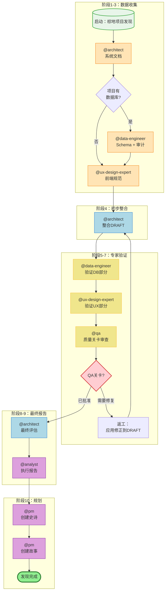
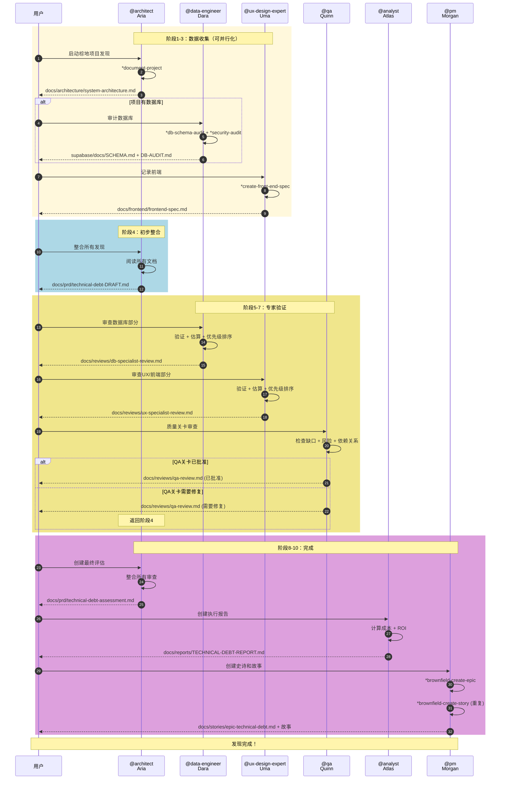
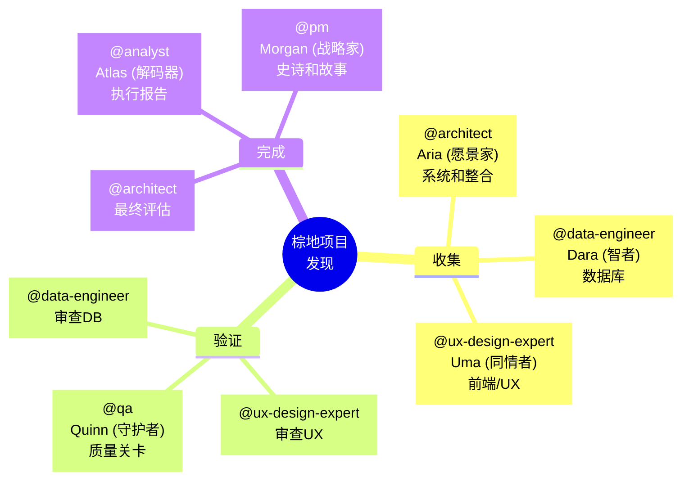
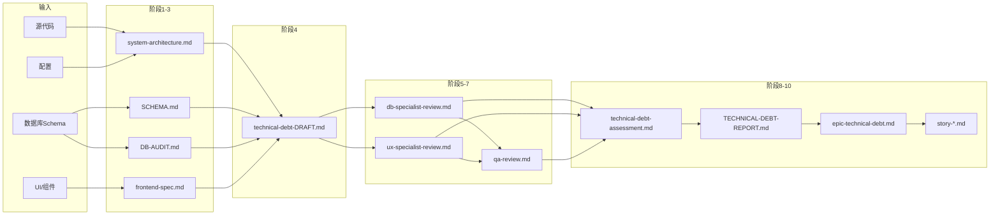
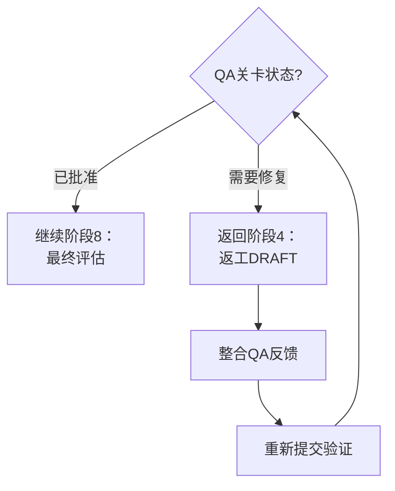
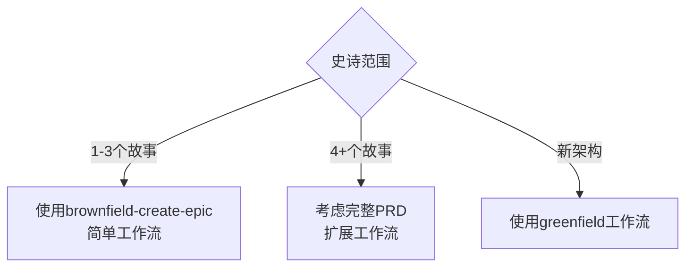

# 工作流：棕地项目发现

**ID：** `brownfield-discovery`
**版本：** 2.0
**类型：** 棕地项目（现有项目）
**估计时长：** 4-8小时
**最后更新：** 2026-02-04

---

## 概述

**棕地项目发现**是一个完整的多代理工作流，用于评估现有项目中的技术债务。专门为从Lovable、v0.dev或遗留代码库迁移的项目设计，该工作流：

- 全面记录系统
- 识别所有层（系统、数据库、前端）的技术债务
- 通过领域专家验证发现
- 为利益相关者生成执行报告
- 创建准备好开发的史诗和故事

### 主要用例

| 场景 | 推荐 |
|------|------|
| Lovable/v0.dev项目迁移 | 是 |
| 完整代码库审计 | 是 |
| 现代化规划 | 是 |
| 投资前评估 | 是 |
| 遗留项目入职 | 是 |
| 技术尽职调查 | 是 |
| 新项目（绿地项目） | 否 - 使用 `greenfield-*` 工作流 |
| 隔离增强 | 否 - 使用 `brownfield-create-story` |

---

## 工作流图



---

## 详细序列图



---

## 详细步骤

### 阶段1：收集 - 系统

| 属性 | 值 |
|------|-----|
| **步骤ID** | `system_documentation` |
| **阶段** | 1 |
| **阶段名称** | 收集：系统 |
| **代理** | `@architect` (Aria) |
| **操作** | `*document-project` |
| **需要询问** | 是 |
| **估计时长** | 30-60分钟 |
| **输出** | `docs/architecture/system-architecture.md` |

**代理分析的内容：**
- 技术栈（React、Vite、Tailwind等）
- 文件夹结构和组件
- 依赖关系和版本
- 现有代码模式
- 集成点
- 配置（env、build、deploy）

**识别的债务（系统级别）：**
- 过时的依赖关系
- 代码重复
- 缺少测试
- 硬编码配置
- 过度耦合

---

### 阶段2：收集 - 数据库

| 属性 | 值 |
|------|-----|
| **步骤ID** | `database_documentation` |
| **阶段** | 2 |
| **阶段名称** | 收集：数据库 |
| **代理** | `@data-engineer` (Dara - Sage) |
| **操作** | `*db-schema-audit` + `*security-audit` |
| **条件** | `project_has_database` |
| **需要询问** | 是 |
| **估计时长** | 20-40分钟 |
| **输出** | `supabase/docs/SCHEMA.md`、`supabase/docs/DB-AUDIT.md` |

**代理分析的内容：**
- 完整schema（表、列、类型）
- 关系和外键
- 现有和缺失的索引
- RLS策略（覆盖和质量）
- 视图和函数
- 性能（已知的慢查询）

**识别的债务（数据级别）：**
- 无RLS的表
- 缺失的索引
- 不当的规范化
- 缺少约束
- 未版本化的迁移
- 孤立数据

---

### 阶段3：收集 - 前端/UX

| 属性 | 值 |
|------|-----|
| **步骤ID** | `frontend_documentation` |
| **阶段** | 3 |
| **阶段名称** | 收集：前端/UX |
| **代理** | `@ux-design-expert` (Uma - Empathizer) |
| **操作** | `*create-front-end-spec` |
| **需要询问** | 是 |
| **估计时长** | 30-45分钟 |
| **输出** | `docs/frontend/frontend-spec.md` |

**代理分析的内容：**
- 现有UI组件
- 使用的设计系统/令牌
- 布局模式
- 用户流程
- 响应性
- 可访问性（a11y）
- 视觉一致性
- 感知性能

**识别的债务（UX/UI级别）：**
- 视觉不一致
- 重复的组件
- 缺少设计系统
- 可访问性问题
- 移动端未优化
- 缺少加载/错误状态
- 缺少用户反馈

---

### 阶段4：初步整合

| 属性 | 值 |
|------|-----|
| **步骤ID** | `initial_consolidation` |
| **阶段** | 4 |
| **阶段名称** | 初步整合 |
| **代理** | `@architect` (Aria) |
| **操作** | `consolidate_findings_draft` (工作流-操作) |
| **需要询问** | 是 |
| **估计时长** | 30-45分钟 |
| **输出** | `docs/prd/technical-debt-DRAFT.md` |

**要求作为输入：**
- `docs/architecture/system-architecture.md`
- `supabase/docs/SCHEMA.md` (如果存在)
- `supabase/docs/DB-AUDIT.md` (如果存在)
- `docs/frontend/frontend-spec.md`

**生成的DRAFT结构：**

```markdown
# 技术债务评估 - DRAFT
## 专家审查待处理

### 1. 系统债务
[来自system-architecture.md的列表]

### 2. 数据库债务
[来自DB-AUDIT.md的列表]
待处理：@data-engineer的审查

### 3. 前端/UX债务
[来自frontend-spec.md的列表]
待处理：@ux-design-expert的审查

### 4. 初步矩阵
| ID | 债务 | 区域 | 影响 | 工作量 | 优先级 |
|----|------|------|------|--------|--------|

### 5. 专家问题
- @data-engineer：[关于数据库的问题]
- @ux-design-expert：[关于UX的问题]
```

---

### 阶段5：验证 - 数据库

| 属性 | 值 |
|------|-----|
| **步骤ID** | `database_specialist_review` |
| **阶段** | 5 |
| **阶段名称** | 验证：数据库 |
| **代理** | `@data-engineer` (Dara) |
| **操作** | `review_and_validate` (工作流-操作) |
| **需要询问** | 是 |
| **估计时长** | 20-30分钟 |
| **输出** | `docs/reviews/db-specialist-review.md` |

**专家的职责：**

1. **验证识别的债务**
   - 确认是否真的是问题
   - 调整严重性（如需要）
   - 添加未识别的债务

2. **估算成本**
   - 解决每个债务的小时数
   - 复杂性（简单/中等/复杂）
   - 技术依赖关系

3. **优先级排序（DB视角）**
   - 安全风险
   - 性能影响
   - 维护负债

4. **回答问题**
   - 回答@architect的问题
   - 澄清技术要点

---

### 阶段6：验证 - UX/前端

| 属性 | 值 |
|------|-----|
| **步骤ID** | `ux_specialist_review` |
| **阶段** | 6 |
| **阶段名称** | 验证：UX/前端 |
| **代理** | `@ux-design-expert` (Uma) |
| **操作** | `review_and_validate` (工作流-操作) |
| **需要询问** | 是 |
| **估计时长** | 20-30分钟 |
| **输出** | `docs/reviews/ux-specialist-review.md` |

**专家的职责：**

1. **验证识别的债务**
   - 确认是否影响UX
   - 调整严重性（如需要）
   - 添加未识别的债务

2. **估算成本**
   - 解决每个债务的小时数
   - 视觉对比功能影响
   - 需要设计审查

3. **优先级排序（UX视角）**
   - 用户体验影响
   - 可访问性问题
   - 视觉一致性

4. **回答问题**
   - 回答@architect的问题
   - 建议设计解决方案

---

### 阶段7：验证 - QA审查

| 属性 | 值 |
|------|-----|
| **步骤ID** | `qa_general_review` |
| **阶段** | 7 |
| **阶段名称** | 验证：QA审查 |
| **代理** | `@qa` (Quinn - Guardian) |
| **操作** | `review_assessment` (工作流-操作) |
| **需要询问** | 是 |
| **估计时长** | 30-45分钟 |
| **输出** | `docs/reviews/qa-review.md` |

**QA的职责：**

1. **识别缺口**
   - 未覆盖的债务
   - 未分析的区域
   - 跨域风险

2. **评估风险**
   - 安全风险
   - 回归风险
   - 集成风险

3. **验证依赖关系**
   - 解决顺序是否有意义？
   - 债务之间的依赖关系
   - 潜在的阻碍

4. **建议测试**
   - 解决后所需的测试
   - 债务的验收标准
   - 质量指标

5. **质量关卡**
   - 评估是否完整？
   - 是否可以继续规划？
   - **决策：** `已批准` | `需要修复`

---

### 阶段8：最终评估

| 属性 | 值 |
|------|-----|
| **步骤ID** | `final_assessment` |
| **阶段** | 8 |
| **阶段名称** | 最终评估 |
| **代理** | `@architect` (Aria) |
| **操作** | `finalize_assessment` (工作流-操作) |
| **条件** | `qa_review_approved` |
| **需要询问** | 是 |
| **估计时长** | 30-45分钟 |
| **输出** | `docs/prd/technical-debt-assessment.md` |

**最终整合包括：**
1. 整合@data-engineer的调整
2. 整合@ux-design-expert的调整
3. 处理@qa的缺口
4. 使用专家的输入重新计算优先级
5. 定义最终解决顺序

**最终文档的结构：**

```markdown
# 技术债务评估 - 最终

## 执行摘要
- 总债务数：X
- 关键：Y | 高：Z | 中等：W
- 估计总工作量：XXX小时

## 完整债务清单

### 系统（由@architect验证）
| ID | 债务 | 严重性 | 小时 | 优先级 |

### 数据库（由@data-engineer验证）
| ID | 债务 | 严重性 | 小时 | 优先级 |

### 前端/UX（由@ux-design-expert验证）
| ID | 债务 | 严重性 | 小时 | 优先级 |

## 最终优先级矩阵

## 解决计划

## 风险和缓解

## 成功标准
```

---

### 阶段9：执行报告

| 属性 | 值 |
|------|-----|
| **步骤ID** | `executive_awareness_report` |
| **阶段** | 9 |
| **阶段名称** | 执行报告 |
| **代理** | `@analyst` (Atlas - Decoder) |
| **操作** | `create_awareness_report` (工作流-操作) |
| **需要询问** | 是 |
| **估计时长** | 30-45分钟 |
| **输出** | `docs/reports/TECHNICAL-DEBT-REPORT.md` |

**目的：** 为利益相关者理解所识别技术债务的成本和影响的文档。

**报告结构：**

```markdown
# 技术债务报告
**项目：** [名称]
**日期：** [日期]

## 执行摘要（1页）
### 当前状况
### 关键数字
| 指标 | 值 |
|------|-----|
| 总债务数 | X |
| 关键债务 | Y |
| 总工作量 | Z小时 |
| 估计成本 | 人民币XX,XXX |

## 成本分析
### 解决的成本
### 不解决的成本（累积风险）

## 业务影响
### 性能
### 安全
### 用户体验
### 可维护性

## 推荐时间表
### 阶段1：快速胜利（1-2周）
### 阶段2：基础（2-4周）
### 阶段3：优化（4-6周）

## 解决的ROI

## 后续步骤
```

---

### 阶段10：规划（史诗+故事）

| 属性 | 值 |
|------|-----|
| **步骤ID** | `epic_creation` + `story_creation` |
| **阶段** | 10 |
| **阶段名称** | 规划 |
| **代理** | `@pm` (Morgan - Strategist) |
| **操作** | `*brownfield-create-epic`、`*brownfield-create-story` |
| **需要询问** | 是 |
| **估计时长** | 30-60分钟 |
| **输出** | `docs/stories/epic-technical-debt.md`、`docs/stories/story-*.md` |

**史诗包括：**
- 史诗的目标
- 范围（哪些债务）
- 成功标准
- 时间表（来自报告）
- 批准的预算
- 故事列表

**每个故事包括：**
- 清晰的任务
- 具体的验收标准
- 所需的测试（来自QA审查）
- 由专家验证的估算
- 完成定义

---

## 参与的代理



### 代理配置

| 代理 | ID | 原型 | 主要专长 |
|------|-----|------|---------|
| Aria | `@architect` | 愿景家 | 系统架构、整体设计 |
| Dara | `@data-engineer` | 智者 | PostgreSQL、Supabase、RLS、迁移 |
| Uma | `@ux-design-expert` | 同情者 | 原子设计、设计令牌、可访问性 |
| Quinn | `@qa` | 守护者 | 质量关卡、测试、可追溯性 |
| Atlas | `@analyst` | 解码器 | 研究、分析、ROI |
| Morgan | `@pm` | 战略家 | PRD、史诗、优先级 |

---

## 执行的任务

### 自动化任务（任务参考）

| 任务 | 代理 | 阶段 | 描述 |
|------|------|------|------|
| `document-project` | @architect | 1 | 系统完整文档 |
| `db-schema-audit` | @data-engineer | 2 | 数据库schema审计 |
| `security-audit` | @data-engineer | 2 | 安全审计（RLS、PII） |
| `create-front-end-spec` | @ux-design-expert | 3 | 前端规范 |
| `brownfield-create-epic` | @pm | 10 | 技术债务史诗创建 |
| `brownfield-create-story` | @pm | 10 | 故事创建（可重复） |

### 手动操作（工作流-操作）

| 操作 | 代理 | 阶段 | 描述 |
|------|------|------|------|
| `consolidate_findings_draft` | @architect | 4 | 整合DRAFT初稿 |
| `review_and_validate` | @data-engineer | 5 | 验证数据库债务 |
| `review_and_validate` | @ux-design-expert | 6 | 验证UX债务 |
| `review_assessment` | @qa | 7 | 质量关卡审查 |
| `finalize_assessment` | @architect | 8 | 最终评估 |
| `create_awareness_report` | @analyst | 9 | 执行报告 |

---

## 前置条件

### 环境

- [ ] 访问项目存储库
- [ ] 已安装Supabase CLI（如有数据库）
- [ ] 数据库凭证可用
- [ ] 对所有文件的读取权限

### 先前的文档

- [ ] 对项目目的的基本理解
- [ ] 知道报告的利益相关者

### 使用的工具

| 工具 | 代理 | 目的 |
|------|------|------|
| `git` | @architect | 存储库分析 |
| `supabase-cli` | @data-engineer | 数据库审计 |
| `psql` | @data-engineer | 审计查询 |
| `coderabbit` | @qa | 自动代码审查 |
| `exa` | @analyst | 市场研究/基准 |

---

## 输入和输出

### 工件映射



### 最终工件结构

```text
docs/
├── architecture/
│   └── system-architecture.md         [阶段1]
├── frontend/
│   └── frontend-spec.md               [阶段3]
├── reviews/
│   ├── db-specialist-review.md        [阶段5]
│   ├── ux-specialist-review.md        [阶段6]
│   └── qa-review.md                   [阶段7]
├── prd/
│   ├── technical-debt-DRAFT.md        [阶段4]
│   └── technical-debt-assessment.md   [阶段8]
├── reports/
│   └── TECHNICAL-DEBT-REPORT.md       [阶段9] ← 利益相关者
└── stories/
    ├── epic-technical-debt.md         [阶段10]
    ├── story-1.1-*.md
    └── story-1.2-*.md

supabase/
└── docs/
    ├── SCHEMA.md                      [阶段2]
    └── DB-AUDIT.md                    [阶段2]
```

---

## 决策点

### 决策点1：项目有数据库?

```mermaid
flowchart TD
    Q1{项目有<br/>数据库?}
    Q1 -->|是| A1[执行阶段2：<br/>@data-engineer审计DB]
    Q1 -->|否| A2[跳过阶段2：<br/>直接到阶段3]
    A1 --> B[阶段3：前端]
    A2 --> B
```

**标准：**
- 存在 `supabase/` 文件夹或类似？
- 有迁移文件？
- 项目使用Supabase、PostgreSQL或其他DB？

---

### 决策点2：QA关卡



**批准标准：**
- 所有债务由专家验证
- 无未识别的关键缺口
- 依赖关系有意义
- 风险已映射

**需要修复标准：**
- 未处理的缺口
- 债务缺少验证
- 未缓解的跨域风险
- 不一致的依赖关系

---

### 决策点3：范围增长



---

## 故障排除

### 问题：阶段2由于缺少DB访问权限而失败

**症状：** `psql：连接被拒绝` 或凭证无效

**解决方案：**
1. 检查环境中的 `SUPABASE_DB_URL`
2. 手动测试连接：`psql "$SUPABASE_DB_URL" -c "SELECT 1"`
3. 确认网络权限（VPN、防火墙）
4. 如果无法访问，跳过阶段2并记录为债务

---

### 问题：评估太大

**症状：** DRAFT中识别了超过50个债务

**解决方案：**
1. 按严重性优先级债务（关键>高>中等）
2. 将类似债务分组到类别中
3. 考虑按区域的多个史诗（DB、前端、基础设施）
4. 关注前10-15个债务的第一个周期

---

### 问题：专家意见不同

**症状：** @data-engineer和@ux-design-expert优先级冲突

**解决方案：**
1. @architect作为调解人
2. 使用客观优先级框架（RICE、ICE）
3. 考虑跨域影响（慢DB影响UX）
4. 在最终评估中记录权衡

---

### 问题：QA关卡无限循环

**症状：** 多次需要修复

**解决方案：**
1. 与@qa审查批准标准
2. 关注特定缺口（不是所有）
3. 考虑在条件下批准
4. 如果被阻止，升级到利益相关者

---

### 问题：执行报告与利益相关者不共鸣

**症状：** 反馈报告太技术性

**解决方案：**
1. 使用业务语言，而不是技术
2. 关注人民币成本（而不是小时数）
3. 包括类比和比较
4. 添加影响的视觉图表

---

## 参考

### 工作流文件

| 文件 | 位置 |
|------|------|
| 工作流定义 | `.aios-core/development/workflows/brownfield-discovery.yaml` |
| 任务：brownfield-create-epic | `.aios-core/development/tasks/brownfield-create-epic.md` |
| 任务：brownfield-create-story | `.aios-core/development/tasks/brownfield-create-story.md` |
| 任务：db-schema-audit | `.aios-core/development/tasks/db-schema-audit.md` |
| 任务：security-audit | `.aios-core/development/tasks/security-audit.md` |

### 代理

| 代理 | 位置 |
|------|------|
| @architect | `.aios-core/development/agents/architect.md` |
| @data-engineer | `.aios-core/development/agents/data-engineer.md` |
| @ux-design-expert | `.aios-core/development/agents/ux-design-expert.md` |
| @qa | `.aios-core/development/agents/qa.md` |
| @analyst | `.aios-core/development/agents/analyst.md` |
| @pm | `.aios-core/development/agents/pm.md` |

---

## 时间估计

| 复杂度 | 最小时间 | 典型时间 | 最大时间 |
|--------|---------|---------|---------|
| 简单项目（无DB） | 3小时 | 4小时 | 5小时 |
| 中等项目 | 4小时 | 5-6小时 | 7小时 |
| 复杂项目 | 6小时 | 7-8小时 | 10+小时 |

**增加时间的因素：**
- 大数据库，有许多表
- 具有许多组件的前端
- 多个外部集成
- QA关卡的返工
- 利益相关者有许多问题

---

## 发现后的后续步骤

1. **呈现** `TECHNICAL-DEBT-REPORT.md` 给利益相关者
2. **获取批准** 预算
3. **优先级** 待办事项中的故事
4. **启动开发**：`@dev` 实现 `story-1.1`
5. **监控进度** 通过ClickUp/GitHub

---

*生成时间：2026-02-04*
*工作流版本：2.0*
*维护者：@devops*
