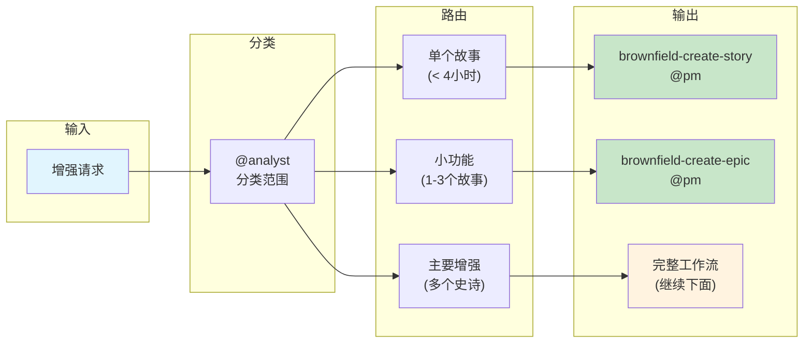
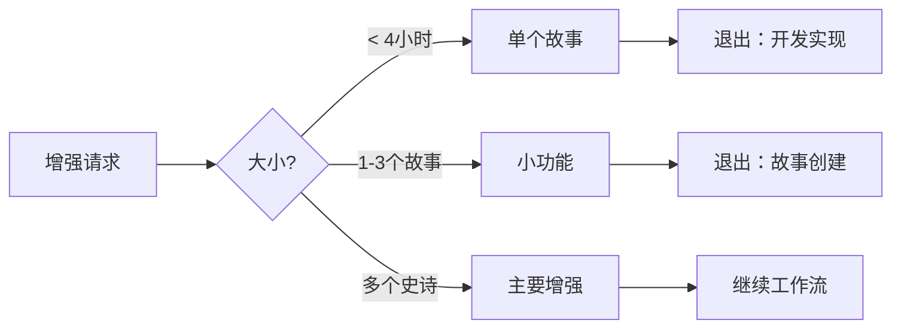
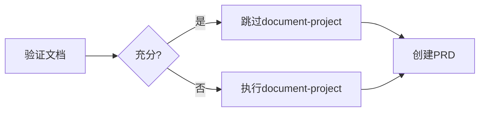
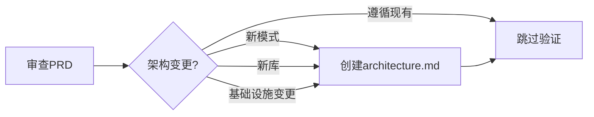
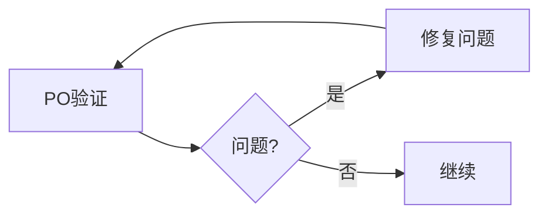
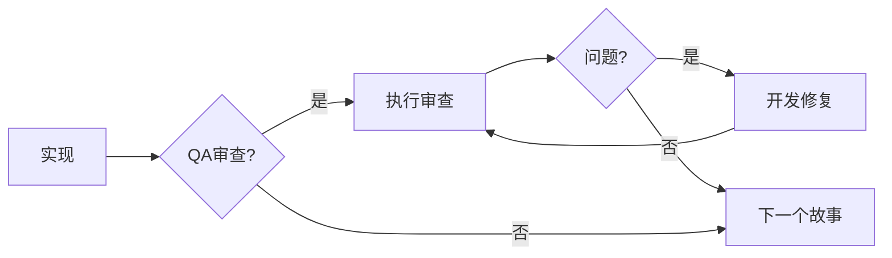
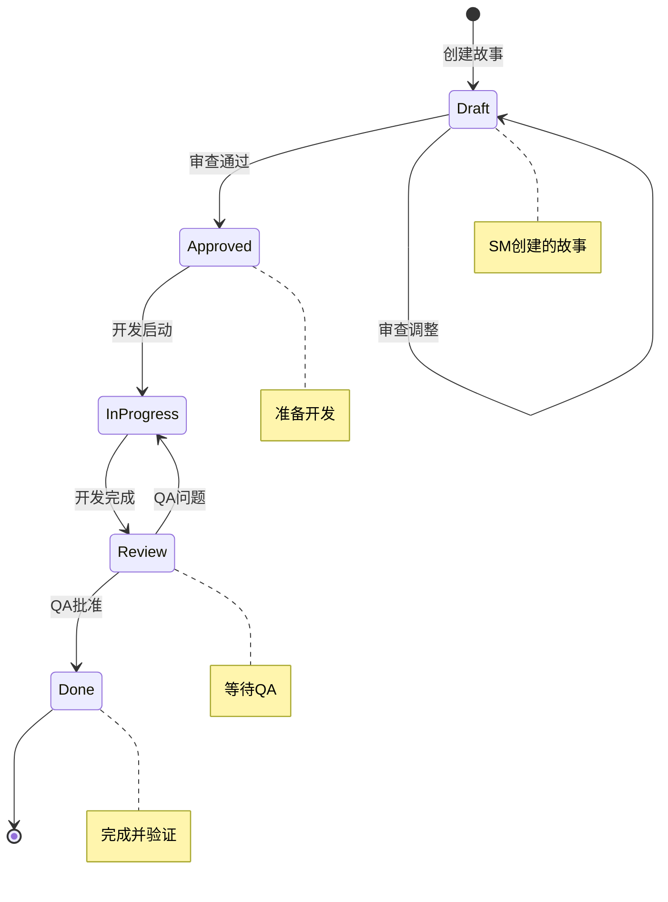
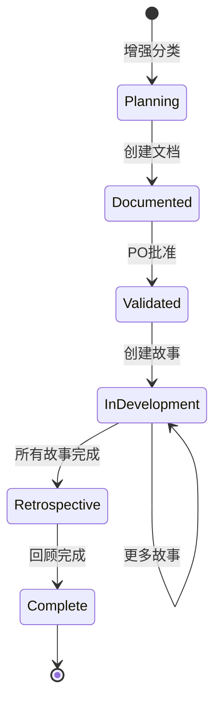

# 工作流：棕地项目全栈增强

> **版本：** 1.0.0
> **创建时间：** 2026-02-04
> **类型：** 棕地项目开发
> **状态：** 官方文档
> **源文件：** `.aios-core/development/workflows/brownfield-fullstack.yaml`

---

## 概述

**棕地项目全栈增强**工作流设计用于通过新功能、现代化或重大变更来增强现有的全栈应用程序。此工作流处理现有系统的分析和安全集成，确保修改不会破坏已建立的功能。

### 何时使用此工作流

**在以下情况下使用此工作流：**

- 增强需要协调的故事
- 需要架构更改
- 需要大量集成工作
- 需要评估和风险缓解
- 多个团队成员将从事相关更改

**支持的项目类型：**

- `feature-addition` - 添加新功能
- `refactoring` - 重构现有代码
- `modernization` - 现代化技术
- `integration-enhancement` - 增强集成

---

## 主工作流图

```mermaid
flowchart TB
    subgraph CLASSIFICATION["1. 增强分类"]
        START[("启动：棕地项目增强")] --> ANALYST_CLASSIFY
        ANALYST_CLASSIFY["@analyst<br/>分类增强范围"]
    end

    ANALYST_CLASSIFY --> DECISION_SIZE{{"增强规模?"}}

    subgraph ROUTING["2. 按大小路由"]
        DECISION_SIZE -->|"单个故事<br/>(< 4小时)"| PM_STORY
        DECISION_SIZE -->|"小功能<br/>(1-3个故事)"| PM_EPIC
        DECISION_SIZE -->|"主要增强<br/>(多个史诗)"| ANALYST_DOCS

        PM_STORY["@pm<br/>brownfield-create-story"]
        PM_EPIC["@pm<br/>brownfield-create-epic"]
    end

    PM_STORY --> EXIT_STORY[/"输出：开发实现"/]
    PM_EPIC --> EXIT_EPIC[/"输出：故事创建"/]

    subgraph DOCUMENTATION["3. 文档验证"]
        ANALYST_DOCS["@analyst<br/>验证现有文档"]
        ANALYST_DOCS --> DECISION_DOCS{{"文档充分?"}}
        DECISION_DOCS -->|否| ARCHITECT_DOCPROJ["@architect<br/>document-project"]
        DECISION_DOCS -->|是| PM_PRD["@pm<br/>创建brownfield-prd.md"]
        ARCHITECT_DOCPROJ --> PM_PRD
    end

    subgraph PLANNING["4. 规划"]
        PM_PRD --> DECISION_ARCH{{"架构<br/>变更?"}}
        DECISION_ARCH -->|是| ARCHITECT_ARCH["@architect<br/>创建architecture.md"]
        DECISION_ARCH -->|否| PO_VALIDATE
        ARCHITECT_ARCH --> PO_VALIDATE["@po<br/>验证工件<br/>(po-master-checklist)"]
    end

    subgraph VALIDATION["5. 验证和修正"]
        PO_VALIDATE --> DECISION_ISSUES{{"PO发现<br/>问题?"}}
        DECISION_ISSUES -->|是| FIX_ISSUES["修复问题<br/>(相关代理)"]
        FIX_ISSUES --> PO_VALIDATE
        DECISION_ISSUES -->|否| PO_SHARD["@po<br/>分片文档"]
    end

    subgraph DEVELOPMENT["6. 开发周期"]
        PO_SHARD --> SM_STORY["@sm<br/>创建故事"]
        SM_STORY --> DECISION_STORY_TYPE{{"文档<br/>类型?"}}
        DECISION_STORY_TYPE -->|"PRD分片"| SM_NEXT["create-next-story"]
        DECISION_STORY_TYPE -->|"棕地文档"| SM_BROWNFIELD["create-brownfield-story"]
        SM_NEXT --> DECISION_REVIEW{{"审查草稿?"}}
        SM_BROWNFIELD --> DECISION_REVIEW
        DECISION_REVIEW -->|是| REVIEW_APPROVE["审查和批准"]
        DECISION_REVIEW -->|否| DEV_IMPLEMENT
        REVIEW_APPROVE --> DEV_IMPLEMENT["@dev<br/>实现故事"]
    end

    subgraph QA_CYCLE["7. QA周期"]
        DEV_IMPLEMENT --> DECISION_QA{{"QA审查?"}}
        DECISION_QA -->|是| QA_REVIEW["@qa<br/>审查实现"]
        DECISION_QA -->|否| DECISION_MORE_STORIES
        QA_REVIEW --> DECISION_QA_ISSUES{{"问题?"}}
        DECISION_QA_ISSUES -->|是| DEV_FIX["@dev<br/>修复反馈"]
        DECISION_QA_ISSUES -->|否| DECISION_MORE_STORIES
        DEV_FIX --> QA_REVIEW
    end

    subgraph COMPLETION["8. 完成"]
        DECISION_MORE_STORIES{{"更多故事?"}}
        DECISION_MORE_STORIES -->|是| SM_STORY
        DECISION_MORE_STORIES -->|否| DECISION_RETRO
        DECISION_RETRO{{"回顾?"}}
        DECISION_RETRO -->|是| PO_RETRO["@po<br/>史诗回顾"]
        DECISION_RETRO -->|否| COMPLETE
        PO_RETRO --> COMPLETE[("项目完成")]
    end

    style START fill:#87CEEB
    style COMPLETE fill:#90EE90
    style EXIT_STORY fill:#90EE90
    style EXIT_EPIC fill:#90EE90
    style PM_STORY fill:#87CEEB
    style PM_EPIC fill:#87CEEB
    style PM_PRD fill:#FFE4B5
    style ARCHITECT_ARCH fill:#FFE4B5
    style PO_SHARD fill:#ADD8E6
    style SM_STORY fill:#ADD8E6
    style DEV_IMPLEMENT fill:#ADD8E6
    style REVIEW_APPROVE fill:#F0E68C
    style QA_REVIEW fill:#F0E68C
    style PO_RETRO fill:#F0E68C
```

---

## 简化的路由图

---

## 详细步骤

### 步骤1：增强分类

| 属性 | 值 |
|------|-----|
| **代理** | @analyst (Atlas) |
| **操作** | 分类增强范围 |
| **输入** | 用户的增强描述 |
| **输出** | 分类：single_story / small_feature / major_enhancement |

**流程：**

分析师确定增强的复杂性以路由到适当的路径。向用户提出的关键问题是：

> "你能描述增强的范围吗？这是一个小修复、功能添加还是需要架构更改的较大增强？"

**分类标准：**

- **单个故事** (< 4小时)：使用任务 `brownfield-create-story`
- **小功能** (1-3个故事)：使用任务 `brownfield-create-epic`
- **主要增强** (多个史诗)：继续完整工作流

---

### 步骤2：决策路由

| 路由 | 代理 | 任务 | 下一步操作 |
|------|------|------|----------|
| `single_story` | @pm | `brownfield-create-story` | 创建故事后退出工作流 |
| `small_feature` | @pm | `brownfield-create-epic` | 创建史诗后退出工作流 |
| `major_enhancement` | - | - | 继续下一步 |

---

### 步骤3：文档验证

| 属性 | 值 |
|------|-----|
| **代理** | @analyst (Atlas) |
| **操作** | 验证现有文档 |
| **条件** | 仅适用于 `major_enhancement` |
| **输入** | 代码库和现有文档 |
| **输出** | 评估：documentation_adequate / documentation_inadequate |

**验证清单：**

- [ ] 架构文档存在吗？
- [ ] API规范是否最新？
- [ ] 代码编码标准是否已记录？
- [ ] 文档是否最新且全面？

**决策：**

- **如果充分**：跳过 `document-project`，继续创建PRD
- **如果不充分**：先执行 `document-project`

---

### 步骤4：项目分析（条件性）

| 属性 | 值 |
|------|-----|
| **代理** | @architect (Aria) |
| **任务** | `document-project` |
| **条件** | 如果文档不充分，则执行 |
| **输入** | 现有代码库 |
| **输出** | `brownfield-architecture.md` (或多个文档) |

**目的：**

捕获系统的当前状态、技术债务和限制。发现结果将传递给PRD创建。

**任务文件：** `.aios-core/development/tasks/document-project.md`

---

### 步骤5：创建棕地项目PRD

| 属性 | 值 |
|------|-----|
| **代理** | @pm (Morgan) |
| **模板** | `brownfield-prd-tmpl` |
| **要求** | 现有文档或步骤4的分析 |
| **输出** | `docs/prd.md` |

**说明：**

- 如果执行了 `document-project`，请参考其输出以避免重新分析
- 如果跳过，请使用项目的现有文档
- **重要**：将最终 `prd.md` 复制到项目的 `docs/` 文件夹

---

### 步骤6：架构决策

| 属性 | 值 |
|------|-----|
| **代理** | @pm (Morgan) / @architect (Aria) |
| **操作** | 确定是否需要架构文档 |
| **条件** | 创建PRD后 |

**创建架构文档的标准：**

- [ ] 需要新的架构模式
- [ ] 需要采用新的库/框架
- [ ] 平台/基础设施变更
- [ ] 遵循现有模式？ -> 跳过创建故事

---

### 步骤7：创建架构（条件性）

| 属性 | 值 |
|------|-----|
| **代理** | @architect (Aria) |
| **模板** | `brownfield-architecture-tmpl` |
| **要求** | `prd.md` |
| **条件** | 需要架构变更 |
| **输出** | `docs/architecture.md` |

**说明：**

仅为重大架构更改创建架构文档。

**重要**：将最终 `architecture.md` 复制到项目的 `docs/` 文件夹

---

### 步骤8：PO验证

| 属性 | 值 |
|------|-----|
| **代理** | @po (Pax) |
| **清单** | `po-master-checklist` |
| **输入** | 所有创建的工件 |
| **输出** | 验证或问题列表 |

**清单文件：** `.aios-core/development/checklists/po-master-checklist.md`

**流程：**

验证所有文档的：
- 集成安全性
- 完整性
- 需求对齐
- 特定的棕地项目风险

---

### 步骤9：问题修复（条件性）

| 属性 | 值 |
|------|-----|
| **代理** | 可变（取决于问题） |
| **条件** | PO发现问题 |
| **操作** | 修复并重新导出更新的文档 |

**流程：**

1. PO识别问题
2. 相关代理修复
3. 更新的文档保存在 `docs/` 中
4. 返回进行PO验证

---

### 步骤10：文档分片

| 属性 | 值 |
|------|-----|
| **代理** | @po (Pax) |
| **任务** | `shard-doc` |
| **输入** | 项目中验证的文档 |
| **输出** | `docs/prd/` 和 `docs/architecture/` 中的分片内容 |

**执行选项：**

- **选项A**：使用PO代理进行分片：`@po` 并要求分片 `docs/prd.md`
- **选项B**：手动：将任务 `shard-doc` + `docs/prd.md` 拖到聊天中

**任务文件：** `.aios-core/development/tasks/shard-doc.md`

---

### 步骤11：创建故事

| 属性 | 值 |
|------|-----|
| **代理** | @sm (River) |
| **重复** | 对于每个史诗或增强 |
| **输入** | 分片的文档或棕地文档 |
| **输出** | `story.md` 处于"草稿"状态 |

**任务决策：**

| 文档类型 | 任务 |
|---------|------|
| PRD分片 | `create-next-story` |
| 棕地文档 | `create-brownfield-story` |

**任务文件：**
- `.aios-core/development/tasks/create-next-story.md`
- `.aios-core/development/tasks/create-brownfield-story.md`

---

### 步骤12：草稿审查（可选）

| 属性 | 值 |
|------|-----|
| **代理** | @analyst / @pm |
| **条件** | 用户希望审查故事 |
| **输入** | `story.md` 处于草稿状态 |
| **输出** | 更新的故事：草稿 -> 已批准 |

**注意**：任务 `story-review` 正在开发中。

---

### 步骤13：实现

| 属性 | 值 |
|------|-----|
| **代理** | @dev (Dex) |
| **要求** | 已批准的故事 |
| **输出** | 实现文件 |

**说明：**

1. 开发代理（新聊天会话）：`@dev`
2. 实现已批准的故事
3. 使用所有更改更新文件列表
4. 完成时将故事标记为"审查"

---

### 步骤14：QA审查（可选）

| 属性 | 值 |
|------|-----|
| **代理** | @qa (Quinn) |
| **任务** | `review-story` |
| **要求** | 实现的文件 |
| **输出** | 审查的实现 |

**流程：**

1. QA代理（新聊天会话）：`@qa` -> `review-story`
2. 具有重构能力的高级开发人员审查
3. 直接修复小问题
4. 为剩余项目留下清单
5. 更新故事状态（审查 -> 完成或保持审查）

---

### 步骤15：修复QA反馈（条件性）

| 属性 | 值 |
|------|-----|
| **代理** | @dev (Dex) |
| **条件** | QA留下未检查的项目 |
| **操作** | 处理剩余项目 |

**流程：**

1. 开发代理（新聊天会话）：处理剩余项目
2. 返回QA进行最终批准

---

### 步骤16：开发周期

**重复：** SM -> Dev -> QA 周期用于史诗中的所有故事

继续进行，直到PRD中的所有故事都完成。

---

### 步骤17：史诗回顾（可选）

| 属性 | 值 |
|------|-----|
| **代理** | @po (Pax) |
| **条件** | 史诗完成 |
| **输出** | `epic-retrospective.md` |

**流程：**

1. 验证史诗是否正确完成
2. 记录学习和改进

**注意**：任务 `epic-retrospective` 正在开发中。

---

### 步骤18：工作流结论

**状态：** 所有故事已实现和审查

**参考：** `.aios-core/data/aios-kb.md#IDE Development Workflow`

---

## 参与的代理

| 代理 | 名称 | 工作流中的角色 | 步骤 |
|------|------|--------------|------|
| @analyst | Atlas | 范围分类、文档验证 | 1, 3 |
| @architect | Aria | 项目文档、架构设计 | 4, 6, 7 |
| @pm | Morgan | PRD创建、史诗和简单故事 | 2, 5, 6 |
| @po | Pax | 工件验证、分片、回顾 | 8, 10, 17 |
| @sm | River | 详细故事创建 | 11 |
| @dev | Dex | 故事实现 | 13, 15 |
| @qa | Quinn | 实现审查 | 14 |

---

## 执行的任务

| 任务 | 步骤 | 代理 | 目的 |
|------|------|------|------|
| `brownfield-create-story` | 2 | @pm | 为简单增强创建单个故事 |
| `brownfield-create-epic` | 2 | @pm | 创建聚焦的史诗（1-3个故事） |
| `document-project` | 4 | @architect | 记录棕地项目的当前状态 |
| `brownfield-prd-tmpl` | 5 | @pm | 棕地项目PRD的模板 |
| `brownfield-architecture-tmpl` | 7 | @architect | 棕地架构的模板 |
| `po-master-checklist` | 8 | @po | 工件的全面验证 |
| `shard-doc` | 10 | @po | 将文档分割成较小的文件 |
| `create-next-story` | 11 | @sm | 从分片PRD创建故事 |
| `create-brownfield-story` | 11 | @sm | 从棕地文档创建故事 |
| `review-story` | 14 | @qa | 实现审查 |

---

## 前置条件

在开始此工作流之前，请确保：

### 环境

- [ ] 访问现有项目存储库
- [ ] 开发环境已配置
- [ ] 依赖关系已安装

### 文档

- [ ] 对现有系统的基本理解
- [ ] 访问现有文档（如果有）
- [ ] 增强需求清楚

### 工具

- [ ] GitHub CLI已配置 (`gh auth status`)
- [ ] 如适用，可访问PM工具 (ClickUp/GitHub/Jira)
- [ ] AIOS核心配置已配置 (`.aios-core/core-config.yaml`)

---

## 输入和输出

### 工作流输入

| 输入 | 来源 | 格式 | 必需 |
|------|------|------|------|
| 增强请求 | 用户 | 文本描述 | 是 |
| 现有代码库 | 存储库 | 源代码 | 是 |
| 现有文档 | `docs/` | Markdown | 否 |
| 利益相关者需求 | 用户/PM工具 | 文本/工单 | 否 |

### 工作流输出

| 输出 | 目标 | 格式 | 条件 |
|------|------|------|------|
| `brownfield-architecture.md` | `docs/` | Markdown | 如果文档不充分 |
| `prd.md` | `docs/` | Markdown | 主要增强 |
| `architecture.md` | `docs/` | Markdown | 如果架构变更 |
| 分片故事 | `docs/stories/` | Markdown | 总是 |
| 实现的代码 | `src/` | 各种 | 总是 |
| `epic-retrospective.md` | `docs/` | Markdown | 可选 |

---

## 决策点

### 决策1：增强的大小

### 决策2：文档充分

### 决策3：架构变更

### 决策4：PO问题

### 决策5：QA审查

---

## 故障排除

### 问题：增强分类不当

**症状：** 简单工作流用于复杂增强或反之亦然

**解决方案：**
1. 暂停当前工作流
2. 使用 @analyst 重新执行分类
3. 提供关于集成和复杂性的更多背景

### 问题：文档不充分未检测

**症状：** 未对系统有充分背景的情况下创建PRD

**解决方案：**
1. 使用 @architect 手动执行 `document-project`
2. 使用新发现更新PRD
3. 使用 @po 重新验证

### 问题：PO验证无限循环

**症状：** 更正后问题仍然出现

**解决方案：**
1. 与利益相关者安排同步会议
2. 记录更清晰的验收标准
3. 如有必要，考虑减少增强范围

### 问题：故事太大

**症状：** 故事无法在一个会话中完成

**解决方案：**
1. 将故事分成多个子故事
2. 重新评估增强分类
3. 考虑使用 `brownfield-create-epic` 而不是单个故事

### 问题：集成破坏现有功能

**症状：** 回归测试失败

**解决方案：**
1. 审查PRD中的影响分析
2. 添加更多集成测试
3. 考虑使用功能标志进行渐进式推出

### 问题：QA审查不确定

**症状：** 问题在开发和QA之间来回

**解决方案：**
1. 记录更清晰的验收标准
2. 为复杂问题安排结对编程
3. 考虑添加自动化测试

---

## 状态图

### 故事状态

### 史诗状态

---

## 成功指标

| 指标 | 描述 | 目标 |
|------|------|------|
| 分类准确度 | 正确分类的增强百分比 | > 90% |
| 到PRD的时间 | 从请求到批准PRD的天数 | < 3天 |
| 每次验证的问题 | PO发现的平均问题数 | < 3 |
| QA周期 | 开发/QA往返的平均数 | < 2 |
| 零回归 | 发布中没有回归错误的百分比 | 100% |

---

## 参考

### 工作流核心文件

| 文件 | 目的 |
|------|------|
| `.aios-core/development/workflows/brownfield-fullstack.yaml` | 工作流定义 |
| `.aios-core/development/tasks/brownfield-create-story.md` | 创建简单故事的任务 |
| `.aios-core/development/tasks/brownfield-create-epic.md` | 创建史诗的任务 |
| `.aios-core/development/tasks/document-project.md` | 记录现有项目的任务 |
| `.aios-core/development/tasks/shard-doc.md` | 分割文档的任务 |
| `.aios-core/development/tasks/create-brownfield-story.md` | 创建棕地故事的任务 |
| `.aios-core/development/tasks/create-next-story.md` | 从PRD创建故事的任务 |
| `.aios-core/product/checklists/po-master-checklist.md` | PO验证清单 |

### 代理文件

| 文件 | 代理 |
|------|------|
| `.aios-core/development/agents/analyst.md` | @analyst (Atlas) |
| `.aios-core/development/agents/architect.md` | @architect (Aria) |
| `.aios-core/development/agents/pm.md` | @pm (Morgan) |
| `.aios-core/development/agents/po.md` | @po (Pax) |
| `.aios-core/development/agents/sm.md` | @sm (River) |
| `.aios-core/development/agents/dev.md` | @dev (Dex) |
| `.aios-core/development/agents/qa.md` | @qa (Quinn) |

### 相关文档

| 文档 | 目的 |
|------|------|
| `docs/guides/BACKLOG-MANAGEMENT-SYSTEM.md` | 待办事项管理系统 |
| `docs/guides/workflows/GREENFIELD-SERVICE-WORKFLOW.md` | 绿地项目工作流 |
| `.aios-core/working-in-the-brownfield.md` | 棕地工作指南 |

---

## 变更日志

| 日期 | 作者 | 描述 |
|------|------|------|
| 2026-02-04 | @analyst | 初始文档创建 |

---

*-- Atlas，将复杂性解码为清晰度*
