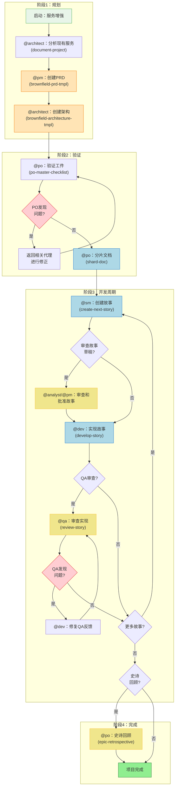
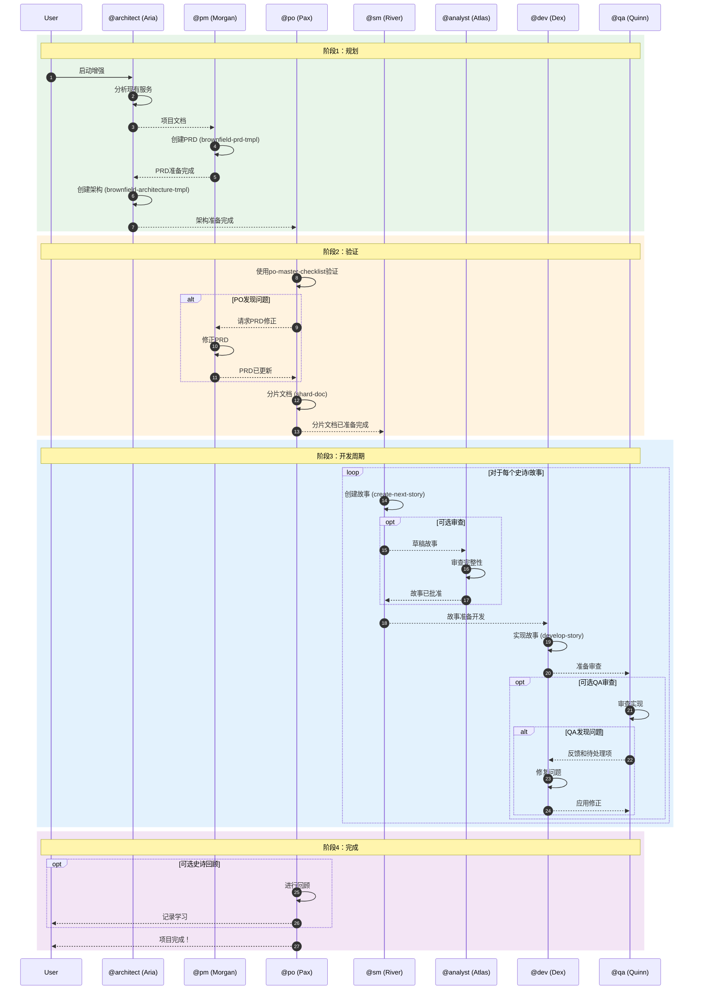
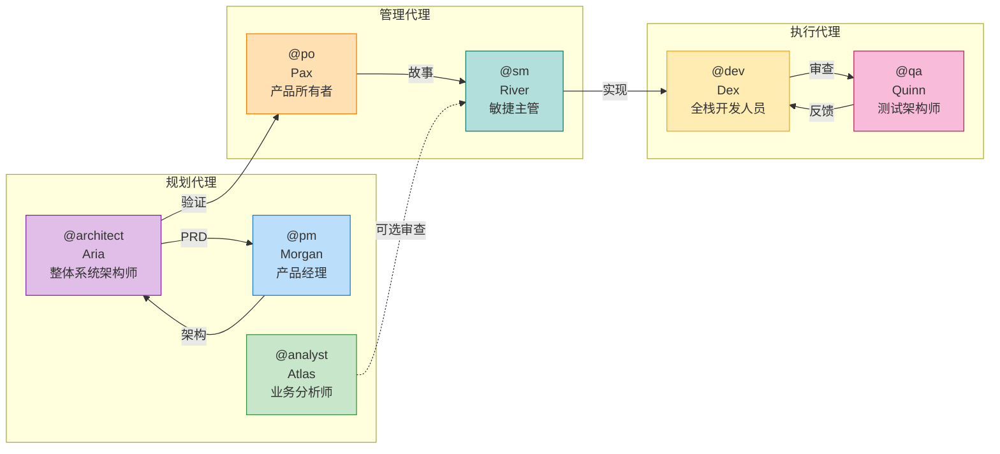
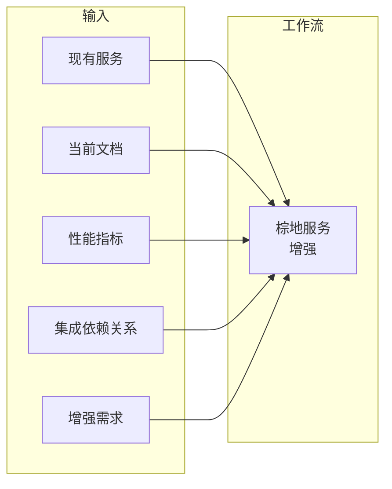
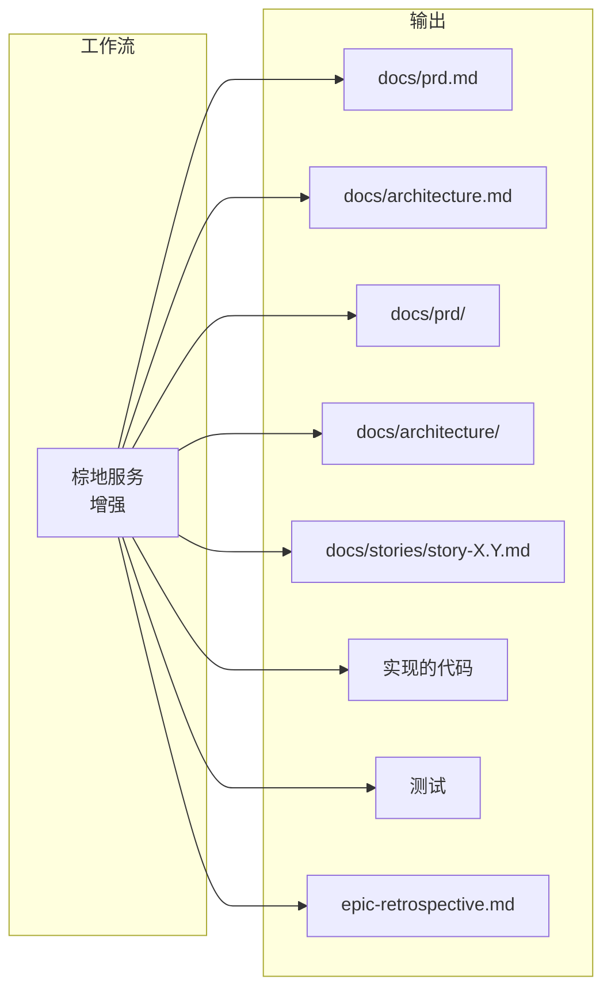
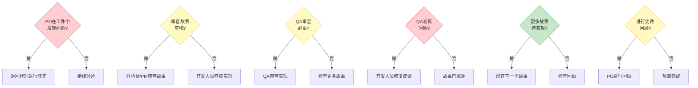

# 工作流：棕地项目服务/API增强

**标识符：** `brownfield-service`
**类型：** 棕地项目（现有系统）
**版本：** 1.0
**最后更新：** 2026-02-04

---

## 概述

**棕地项目服务/API增强**工作流设计用于增强现有后端服务和API，通过新资源、现代化或性能改进。它管理现有系统的分析和安全集成，确保在不中断关键功能的情况下实施更改。

### 用例

| 项目类型 | 描述 |
|---------|------|
| **服务现代化** | 将遗留服务升级到现代技术 |
| **API增强** | 添加新端点或改进现有API |
| **微服务提取** | 从单体中提取模块以创建微服务 |
| **性能优化** | 优化现有服务中的性能 |
| **集成增强** | 改进系统之间的集成 |

### 何时使用

- 服务增强需要协调的故事
- 需要API版本控制或重大变更
- 需要数据库schema变更
- 需要性能或可扩展性改进
- 受影响的多个集成点

---

## 工作流图



---

## 序列图



---

## 详细步骤

### 步骤1：服务分析

| 属性 | 值 |
|------|-----|
| **代理** | @architect (Aria) |
| **任务** | `document-project` |
| **输入** | 现有服务/API、性能指标、当前文档 |
| **输出** | 根据document-project模板的多个文档 |
| **注意** | 审查现有文档、代码库、性能指标并识别集成依赖关系 |

**激活：**
```
@architect
*document-project
```

---

### 步骤2：创建PRD

| 属性 | 值 |
|------|-----|
| **代理** | @pm (Morgan) |
| **任务** | `create-doc` 使用 `brownfield-prd-tmpl` |
| **输入** | 现有服务分析 |
| **输出** | `docs/prd.md` |
| **要求** | 现有服务分析已完成 |
| **注意** | 创建全面的PRD，重点关注服务增强，包括对现有系统的分析 |

**激活：**
```
@pm
*create-brownfield-prd
```

**重要：** 将最终文件 `prd.md` 保存到项目的 `docs/` 文件夹。

---

### 步骤3：创建架构

| 属性 | 值 |
|------|-----|
| **代理** | @architect (Aria) |
| **任务** | `create-doc` 使用 `brownfield-architecture-tmpl` |
| **输入** | PRD (`docs/prd.md`) |
| **输出** | `docs/architecture.md` |
| **要求** | 已批准的PRD |
| **注意** | 创建包含服务集成策略和API演进规划的架构 |

**激活：**
```
@architect
*create-brownfield-architecture
```

**重要：** 将最终文件 `architecture.md` 保存到项目的 `docs/` 文件夹。

---

### 步骤4：验证工件

| 属性 | 值 |
|------|-----|
| **代理** | @po (Pax) |
| **任务** | `execute-checklist` 使用 `po-master-checklist` |
| **输入** | 所有工件（PRD、架构） |
| **输出** | 验证报告 |
| **注意** | 验证所有文档以确保服务集成安全和API兼容性。可能需要更新任何文档。 |

**激活：**
```
@po
*execute-checklist-po
```

---

### 步骤5：修复问题（条件性）

| 属性 | 值 |
|------|-----|
| **代理** | 根据出现问题的文档而变化 |
| **任务** | 文档特定修正 |
| **输入** | PO的反馈 |
| **输出** | 更新的文档 |
| **条件** | PO在清单中发现问题 |
| **注意** | 如果PO发现问题，返回相关代理进行修正并重新导出更新的文档到 `docs/` 文件夹 |

---

### 步骤6：分片文档

| 属性 | 值 |
|------|-----|
| **代理** | @po (Pax) |
| **任务** | `shard-doc` |
| **输入** | 所有在 `docs/` 中验证的工件 |
| **输出** | `docs/prd/` 和 `docs/architecture/` 文件夹，包含分片内容 |
| **要求** | 所有工件在项目文件夹中 |
| **注意** | 为IDE开发分片文档 |

**激活选项：**

**选项A - 通过PO代理：**
```
@po
shard docs/prd.md
```

**选项B - 手动：**
将任务 `shard-doc` + `docs/prd.md` 拖到聊天中。

---

### 步骤7：创建故事

| 属性 | 值 |
|------|-----|
| **代理** | @sm (River) |
| **任务** | `create-next-story` |
| **输入** | 分片的文档 |
| **输出** | `story.md` |
| **要求** | 分片的文档 |
| **重复** | 对于每个史诗 |
| **注意** | 故事以"草稿"状态开始 |

**激活（新聊天会话）：**
```
@sm
*draft
```

---

### 步骤8：审查故事草稿（可选）

| 属性 | 值 |
|------|-----|
| **代理** | @analyst (Atlas) 或 @pm (Morgan) |
| **任务** | `review-draft-story` (正在开发) |
| **输入** | 草稿故事 |
| **输出** | 更新的故事 |
| **要求** | 创建的故事 |
| **可选** | 是 - 当用户希望审查故事时 |
| **条件** | 用户请求审查 |
| **注意** | 审查故事的完整性和对齐。更新状态：草稿 -> 已批准 |

---

### 步骤9：实现故事

| 属性 | 值 |
|------|-----|
| **代理** | @dev (Dex) |
| **任务** | `develop-story` |
| **输入** | 已批准的故事 |
| **输出** | 实现文件 |
| **要求** | 已批准的故事（不是草稿） |
| **注意** | 实现已批准的故事，使用所有更改更新文件列表，完成时将故事标记为"审查" |

**激活（新聊天会话）：**
```
@dev
*develop {story-id}
```

---

### 步骤10：QA审查（可选）

| 属性 | 值 |
|------|-----|
| **代理** | @qa (Quinn) |
| **任务** | `review-story` |
| **输入** | 实现文件 |
| **输出** | 更新的实现 + QA清单 |
| **可选** | 是 |
| **注意** | 具有重构能力的高级开发人员审查。直接修复小问题。为待处理项目留下清单。更新故事状态（审查 -> 完成或保持审查） |

**激活（新聊天会话）：**
```
@qa
*review {story-id}
```

---

### 步骤11：修复QA反馈（条件性）

| 属性 | 值 |
|------|-----|
| **代理** | @dev (Dex) |
| **任务** | `apply-qa-fixes` |
| **输入** | QA的反馈和待处理项 |
| **输出** | 修正的实现 |
| **条件** | QA留下未标记的项 |
| **注意** | 如果QA留下待处理项：开发人员（新会话）修复剩余项并返回QA进行最终批准 |

**激活（新聊天会话）：**
```
@dev
*apply-qa-fixes
```

---

### 步骤12：重复开发周期

| 属性 | 值 |
|------|-----|
| **操作** | 重复步骤7-11 |
| **注意** | 重复故事周期（SM -> 开发 -> QA），用于史诗的所有故事。继续进行，直到PRD中的所有故事都完成。 |

---

### 步骤13：史诗回顾（可选）

| 属性 | 值 |
|------|-----|
| **代理** | @po (Pax) |
| **任务** | `epic-retrospective` (正在开发) |
| **输入** | 完成的史诗 |
| **输出** | `epic-retrospective.md` |
| **条件** | 史诗完成 |
| **可选** | 是 |
| **注意** | 验证史诗已正确完成。记录学习和改进。 |

---

### 步骤14：工作流结束

| 属性 | 值 |
|------|-----|
| **操作** | 项目完成 |
| **注意** | 所有故事已实现和审查！项目的开发阶段完成。 |

**参考：** `.aios-core/data/aios-kb.md#IDE Development Workflow`

---

## 参与的代理



### 代理表

| 代理 | 名称 | 角色 | 工作流中的职责 |
|------|------|------|---------------|
| @architect | Aria | 整体系统架构师 | 现有服务分析、架构创建 |
| @pm | Morgan | 产品经理 | 为棕地项目创建PRD |
| @po | Pax | 产品所有者 | 工件验证、文档分片、回顾 |
| @sm | River | 敏捷主管 | 故事创建 |
| @analyst | Atlas | 业务分析师 | 故事草稿的可选审查 |
| @dev | Dex | 全栈开发人员 | 故事实现、修复反馈 |
| @qa | Quinn | 测试架构师 | 实现审查、质量关卡 |

---

## 执行的任务

### 主要任务

| 任务 | 模板/清单 | 代理 | 阶段 |
|------|----------|------|------|
| `document-project` | document-project模板 | @architect | 规划 |
| `create-doc` | `brownfield-prd-tmpl.yaml` | @pm | 规划 |
| `create-doc` | `brownfield-architecture-tmpl.yaml` | @architect | 规划 |
| `execute-checklist` | `po-master-checklist.md` | @po | 验证 |
| `shard-doc` | - | @po | 验证 |
| `create-next-story` | `story-tmpl.yaml` | @sm | 开发 |
| `develop-story` | - | @dev | 开发 |
| `review-story` | - | @qa | 开发 |
| `apply-qa-fixes` | - | @dev | 开发 |

### 未来任务（正在开发）

| 任务 | 代理 | 状态 |
|------|------|------|
| `story-review` | @analyst/@pm | 正在开发 |
| `epic-retrospective` | @po | 正在开发 |

---

## 前置条件

### 开始工作流之前

1. **现有服务/API**
   - 访问服务源代码
   - 当前文档（如果存在）
   - 可用的性能指标

2. **环境配置**
   - Git配置且正常运行
   - 访问AIOS模板
   - 已安装开发工具

3. **项目背景**
   - 增强目标清晰
   - 已知的约束和限制
   - 已识别的利益相关者

4. **可用的模板**
   - `.aios-core/development/templates/brownfield-prd-tmpl.yaml`
   - `.aios-core/development/templates/brownfield-architecture-tmpl.yaml`
   - `.aios-core/development/templates/story-tmpl.yaml`

5. **可用的清单**
   - `.aios-core/development/checklists/po-master-checklist.md`
   - `.aios-core/development/checklists/story-draft-checklist.md`
   - `.aios-core/development/checklists/story-dod-checklist.md`

---

## 输入和输出

### 工作流输入



| 输入 | 描述 | 来源 |
|------|------|------|
| 现有服务 | 源代码和当前基础设施 | Git存储库 |
| 当前文档 | 现有服务文档 | 项目中的 `docs/` |
| 性能指标 | 性能和使用数据 | 监控工具 |
| 集成依赖关系 | 连接到服务的系统 | 当前架构 |
| 增强需求 | 需要改进的内容 | 利益相关者 |

### 工作流输出



| 输出 | 描述 | 位置 |
|------|------|------|
| PRD | 产品需求文档 | `docs/prd.md` |
| 架构 | 架构文档 | `docs/architecture.md` |
| PRD分片 | 分割为部分的PRD | `docs/prd/` |
| 架构分片 | 分割的架构 | `docs/architecture/` |
| 故事 | 开发用的用户故事 | `docs/stories/` |
| 实现的代码 | 功能源代码 | 项目文件夹 |
| 测试 | 单元和集成测试 | `tests/` 或类似位置 |
| 回顾 | 史诗的学习 | `epic-retrospective.md` |

---

## 决策点



### 决策点详细说明

| 点 | 问题 | 是 | 否 |
|----|------|----|----|
| **D1** | PO在工件中发现问题? | 返回相关代理进行修正 | 继续分片文档 |
| **D2** | 用户希望审查故事草稿? | 分析师/PM审查完整性和对齐 | 开发人员直接实现故事 |
| **D3** | QA审查必要? | QA审查实现 | 检查是否有更多故事 |
| **D4** | QA发现问题? | 开发人员修复反馈并返回QA | 故事已批准，检查更多故事 |
| **D5** | 更多故事待实现? | 创建下一个故事（返回步骤7） | 检查是否需要回顾 |
| **D6** | 进行史诗回顾? | PO进行回顾并记录 | 项目完成 |

---

## 故障排除

### 常见问题和解决方案

#### 1. 服务分析不完整

**症状：** 架构不反映所有现有依赖关系。

**原因：** 缺少文档或代码访问。

**解决方案：**
1. 验证Git存储库访问权限
2. 再次执行 `*document-project`
3. 咨询当前团队关于未记录的依赖关系
4. 分析集成日志以发现连接

---

#### 2. PO拒绝PRD

**症状：** PO清单反复失败。

**原因：** PRD不完整或与架构不一致。

**解决方案：**
1. 审查PO的具体反馈
2. 验证PRD <-> 架构对齐
3. 验证验收标准是否可测试
4. 确认NFR已记录

```
@pm
*correct-course
```

---

#### 3. 故事草稿未批准

**症状：** 审查后故事保持草稿状态。

**原因：** 缺少详情或歧义。

**解决方案：**
1. 验证所有验收标准是否清晰
2. 确认任务是否可执行
3. 验证依赖关系已识别
4. 执行story-draft-checklist

```
@sm
*story-checklist
```

---

#### 4. 实现在QA中失败

**症状：** QA重复拒绝实现。

**原因：** 代码不符合标准或缺少测试。

**解决方案：**
1. 审查QA的详细反馈
2. 验证测试覆盖率
3. 在发送到QA前执行CodeRabbit
4. 确保文件列表完整

```
@dev
*run-tests
*apply-qa-fixes
```

---

#### 5. 反馈无限循环

**症状：** 开发和QA在修正中陷入循环。

**原因：** 需求模糊或范围蔓延。

**解决方案：**
1. 暂停并审查原始故事
2. 与PO澄清验收标准
3. 定义迭代限制（最多3次）
4. 如有必要，升级到PO

---

#### 6. 文档分片失败

**症状：** `shard-doc` 命令未生成预期的文件夹。

**原因：** 文档格式错误或路径错误。

**解决方案：**
1. 验证 `prd.md` 在 `docs/` 中
2. 确认文档格式
3. 通过选项A执行（PO代理）
4. 检查错误日志

---

### 升级矩阵

| 问题 | 首次联系 | 升级到 |
|------|--------|--------|
| PRD不完整 | @pm (Morgan) | @po (Pax) |
| 架构不一致 | @architect (Aria) | @pm (Morgan) |
| 故事模糊 | @sm (River) | @po (Pax) |
| 实现有错误 | @dev (Dex) | @qa (Quinn) |
| 质量关卡失败 | @qa (Quinn) | @po (Pax) |
| 集成中断 | @architect (Aria) | @devops (Gage) |

---

## 切换提示

代理之间的切换通过以下提示进行便于：

| 转换 | 提示 |
|------|------|
| 分析 -> PM | "服务分析完成。使用服务集成策略创建全面的PRD。" |
| PM -> 架构师 | "PRD准备完成。保存为 `docs/prd.md`，然后创建服务架构。" |
| 架构师 -> PO | "架构完成。保存为 `docs/architecture.md`。请验证所有工件以确保服务集成安全。" |
| PO（问题） | "PO在[文档]中发现问题。请返回到[代理]进行修正并重新保存更新的文档。" |
| PO（完成） | "所有规划工件已验证并保存在 `docs/` 文件夹中。移动到IDE环境以开始开发。" |

---

## 参考

### 配置文件

| 文件 | 描述 | 路径 |
|------|------|------|
| 工作流定义 | 工作流的YAML定义 | `.aios-core/development/workflows/brownfield-service.yaml` |
| PRD模板 | 棕地PRD的模板 | `.aios-core/development/templates/brownfield-prd-tmpl.yaml` |
| 架构模板 | 架构的模板 | `.aios-core/development/templates/brownfield-architecture-tmpl.yaml` |
| 故事模板 | 故事的模板 | `.aios-core/development/templates/story-tmpl.yaml` |
| PO主清单 | 验证清单 | `.aios-core/development/checklists/po-master-checklist.md` |
| 故事草稿清单 | 故事清单 | `.aios-core/development/checklists/story-draft-checklist.md` |
| 故事DoD清单 | 完成定义 | `.aios-core/development/checklists/story-dod-checklist.md` |

### 代理

| 代理 | 文件 | 路径 |
|------|------|------|
| @architect | Aria | `.aios-core/development/agents/architect.md` |
| @pm | Morgan | `.aios-core/development/agents/pm.md` |
| @po | Pax | `.aios-core/development/agents/po.md` |
| @sm | River | `.aios-core/development/agents/sm.md` |
| @analyst | Atlas | `.aios-core/development/agents/analyst.md` |
| @dev | Dex | `.aios-core/development/agents/dev.md` |
| @qa | Quinn | `.aios-core/development/agents/qa.md` |

### 相关文档

- [AIOS知识库](../../../.aios-core/data/aios-kb.md) - 框架知识库
- [技术偏好](../../../.aios-core/development/data/technical-preferences.md) - 项目技术偏好
- [IDE开发工作流](../../../.aios-core/data/aios-kb.md#IDE-Development-Workflow) - IDE开发流程

---

## 历史记录

| 日期 | 版本 | 变更 | 作者 |
|------|------|------|------|
| 2026-02-04 | 1.0 | 初始文档创建 | 技术文档专家 |

---

*从workflow `brownfield-service.yaml` 生成 - AIOS框架 v2.2*
