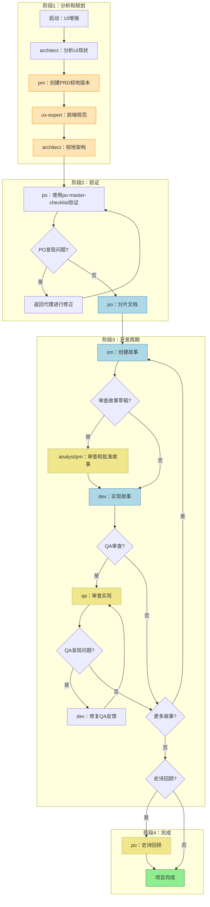
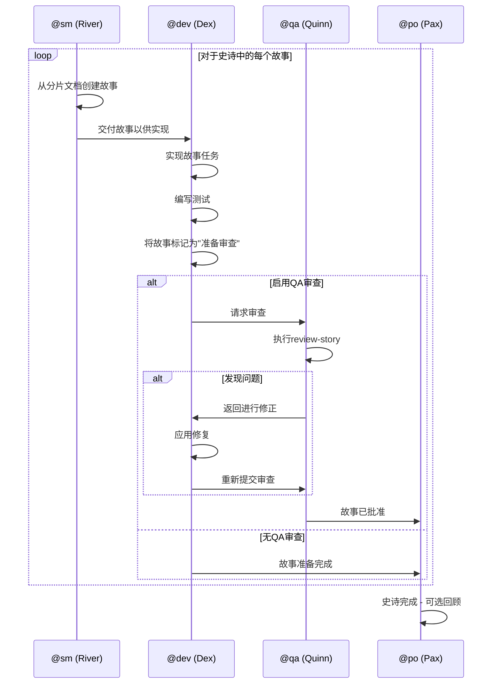
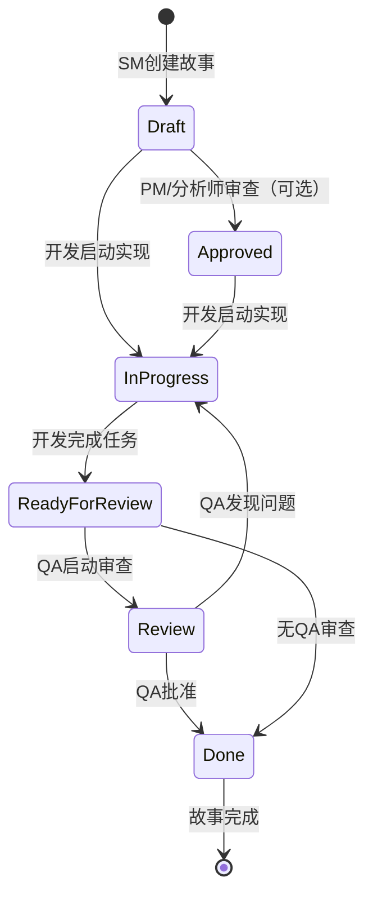
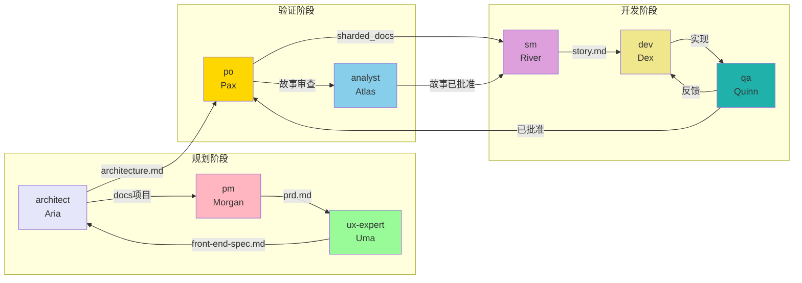
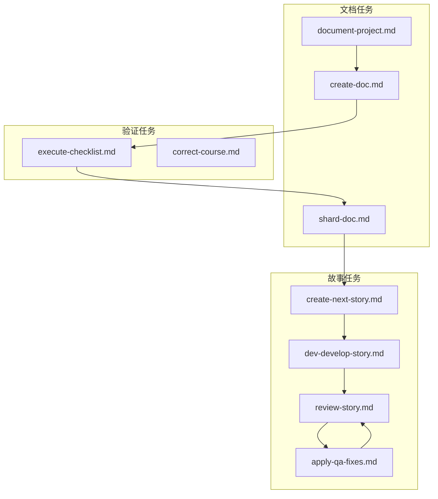
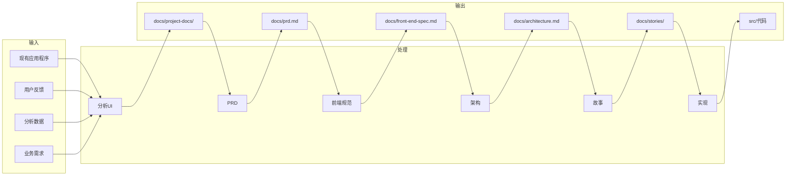
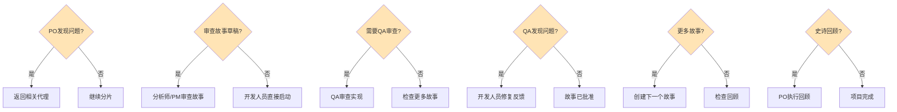

# 棕地项目UI/前端增强工作流

> **ID：** `brownfield-ui`
> **类型：** 棕地项目（现有项目）
> **版本：** 1.0
> **最后更新：** 2026-02-04

## 摘要

- [概述](#概述)
- [工作流图](#工作流图)
- [详细步骤](#详细步骤)
- [参与的代理](#参与的代理)
- [执行的任务](#执行的任务)
- [前置条件](#前置条件)
- [输入和输出](#输入和输出)
- [决策点](#决策点)
- [故障排除](#故障排除)
- [参考](#参考)

---

## 概述

**棕地项目UI/前端增强工作流**是用于增强现有前端应用程序的结构化工作流程。它从初始遗留系统分析到新功能的完整实现，涵盖现代化组件或设计更新。

### 用例

| 项目类型 | 描述 |
|---------|------|
| **UI现代化** | 将遗留界面更新为现代标准 |
| **框架迁移** | 在框架之间迁移（例如：jQuery到React） |
| **设计刷新** | 按照新设计标准进行视觉更新 |
| **前端增强** | 向现有前端添加新功能 |

### 优势

- 修改前对现有系统的结构化分析
- 与遗留代码的安全集成
- 每个阶段的质量验证
- 架构决策的完整文档

---

## 工作流图

### 主流程图



### 颜色图例

| 颜色 | 意义 |
|------|------|
| 浅绿色 | 工作流完成 |
| 浅蓝色 | 主要执行步骤 |
| 浅橙色 | 文档创建 |
| 浅黄色 | 可选审查步骤 |

### 开发周期图



### 故事状态图



---

## 详细步骤

### 步骤1：分析现有UI

| 属性 | 值 |
|------|-----|
| **代理** | @architect (Aria) |
| **操作** | 使用任务 `document-project` 分析现有项目 |
| **创建的工件** | 根据document-project模板的多个文档 |
| **输入** | 现有前端应用程序、用户反馈、使用分析数据 |
| **输出** | 包含已识别改进领域的项目文档 |

**注意：**
- 审查现有前端应用程序
- 分析用户反馈和使用数据
- 识别改进和现代化领域
- 记录当前架构

---

### 步骤2：创建棕地项目PRD

| 属性 | 值 |
|------|-----|
| **代理** | @pm (Morgan) |
| **操作** | 创建专注于UI增强的PRD |
| **模板** | `brownfield-prd-tmpl` |
| **创建的工件** | `prd.md` |
| **要求** | 现有UI分析（步骤1） |
| **输出** | 包含集成策略的完整PRD文档 |

**注意：**
- 创建专注于UI增强的全面PRD
- 包括现有系统的分析
- **重要**：将最终文件 `prd.md` 保存到项目的 `docs/` 文件夹

---

### 步骤3：前端规范

| 属性 | 值 |
|------|-----|
| **代理** | @ux-expert (Uma) |
| **操作** | 创建与现有模式集成的UI/UX规范 |
| **模板** | `front-end-spec-tmpl` |
| **创建的工件** | `front-end-spec.md` |
| **要求** | `prd.md` (步骤2) |
| **输出** | 详细的UI/UX规范 |

**注意：**
- 创建与现有设计模式集成的UI/UX规范
- 考虑已使用的设计令牌
- **重要**：将最终文件 `front-end-spec.md` 保存到项目的 `docs/` 文件夹

---

### 步骤4：棕地项目架构

| 属性 | 值 |
|------|-----|
| **代理** | @architect (Aria) |
| **操作** | 使用集成策略创建前端架构 |
| **模板** | `brownfield-architecture-tmpl` |
| **创建的工件** | `architecture.md` |
| **要求** | `prd.md`、`front-end-spec.md` (步骤2和3) |
| **输出** | 包含迁移计划的架构文档 |

**注意：**
- 使用组件集成策略创建前端架构
- 包括迁移规划
- 定义新组件与现有系统的交互方式
- **重要**：将最终文件 `architecture.md` 保存到项目的 `docs/` 文件夹

---

### 步骤5：PO验证

| 属性 | 值 |
|------|-----|
| **代理** | @po (Pax) |
| **操作** | 验证所有工件 |
| **清单** | `po-master-checklist` |
| **验证的工件** | 所有已创建的工件 |
| **输出** | 批准决策或修正列表 |

**注意：**
- 验证所有文档以确保UI集成安全
- 验证设计一致性
- 可能需要更新任何文档

---

### 步骤6：修正（条件性）

| 属性 | 值 |
|------|-----|
| **代理** | 可变（根据发现的问题） |
| **条件** | `po_checklist_issues` - PO发现问题 |
| **操作** | 修正标记的文档 |
| **输出** | 更新的文档重新导出到 `docs/` |

**注意：**
- 如果PO发现问题，返回相关代理
- 修正并重新导出更新的文档

---

### 步骤7：分片文档

| 属性 | 值 |
|------|-----|
| **代理** | @po (Pax) |
| **操作** | 分片文档供IDE开发 |
| **创建的工件** | `sharded_docs` (文件夹 `docs/prd/` 和 `docs/architecture/`) |
| **要求** | 项目文件夹中的所有工件 |
| **输出** | 分片内容准备供代理使用 |

**执行方法：**
- **选项A**：使用PO代理进行分片：`@po` 然后请求"shard docs/prd.md"
- **选项B**：手动：将任务 `shard-doc` + `docs/prd.md` 拖到聊天中

---

### 步骤8：创建故事（周期）

| 属性 | 值 |
|------|-----|
| **代理** | @sm (River) |
| **操作** | 从分片文档创建故事 |
| **创建的工件** | `story.md` (对于每个史诗) |
| **要求** | `sharded_docs` (步骤7) |
| **重复** | 对于PRD中的每个史诗 |
| **输出** | 处于"草稿"状态的故事 |

**流程：**
1. 在新聊天中激活SM代理：`@sm`
2. 执行命令：`*draft`
3. SM从分片文档创建下一个故事
4. 故事以"草稿"状态开始

---

### 步骤9：审查故事草稿（可选）

| 属性 | 值 |
|------|-----|
| **代理** | @analyst (Atlas) 或 @pm (Morgan) |
| **操作** | 审查并批准故事草稿 |
| **条件** | `user_wants_story_review` - 用户希望审查 |
| **可选** | 是 |
| **输出** | 更新的故事，状态为"草稿" -> "已批准" |

**注意：**
- 任务 `story-review` 正在开发中
- 审查故事的完整性和对齐
- 更新故事的状态

---

### 步骤10：实现故事

| 属性 | 值 |
|------|-----|
| **代理** | @dev (Dex) |
| **操作** | 实现已批准的故事 |
| **创建的工件** | 实现文件 |
| **要求** | `story.md` 已批准 |
| **输出** | 实现的代码、更新的文件列表、状态"审查" |

**流程：**
1. 在新聊天中激活开发代理：`@dev`
2. 执行命令：`*develop {story-id}`
3. 按故事任务实现
4. 使用所有更改更新文件列表
5. 完成后将故事标记为"审查"

---

### 步骤11：QA审查（可选）

| 属性 | 值 |
|------|-----|
| **代理** | @qa (Quinn) |
| **操作** | 作为高级开发人员审查实现 |
| **更新的工件** | 实现文件 |
| **要求** | 实现的文件 |
| **可选** | 是 |
| **输出** | 应用的修复或待处理项目清单 |

**流程：**
1. 在新聊天中激活QA代理：`@qa`
2. 执行命令：`*review {story-id}`
3. 具有重构能力的高级开发人员审查
4. 直接修复小问题
5. 为待处理项目留下清单
6. 更新故事状态（审查 -> 完成或保持审查）

---

### 步骤12：修复QA反馈（条件性）

| 属性 | 值 |
|------|-----|
| **代理** | @dev (Dex) |
| **条件** | `qa_left_unchecked_items` - QA留下待处理项目 |
| **操作** | 处理QA反馈 |
| **输出** | 修正的项目，返回QA进行最终批准 |

---

### 步骤13：开发周期

| 属性 | 值 |
|------|-----|
| **操作** | 重复SM -> 开发 -> QA周期 |
| **重复** | 对于PRD中的所有故事 |
| **退出条件** | PRD中的所有故事都完成 |

---

### 步骤14：史诗回顾（可选）

| 属性 | 值 |
|------|-----|
| **代理** | @po (Pax) |
| **条件** | `epic_complete` - 史诗已完成 |
| **可选** | 是 |
| **创建的工件** | `epic-retrospective.md` |
| **输出** | 学习和改进的文档 |

**注意：**
- 任务 `epic-retrospective` 正在开发中
- 验证史诗是否正确完成
- 记录学习和改进

---

### 步骤15：项目完成

| 属性 | 值 |
|------|-----|
| **操作** | 工作流完成 |
| **状态** | 所有故事已实现和审查 |
| **输出** | 项目的开发阶段完成 |

---

## 参与的代理

### 代理表

| 图标 | ID | 名称 | 职位 | 工作流中的角色 |
|------|-----|------|------|---------------|
| @architect | architect | Aria | 整体系统架构师 | 初始分析和棕地架构 |
| @pm | pm | Morgan | 产品经理 | 创建棕地PRD |
| @ux-expert | ux-design-expert | Uma | UX/UI设计师 | 前端规范 |
| @po | po | Pax | 产品所有者 | 验证、分片、回顾 |
| @sm | sm | River | 敏捷主管 | 故事创建 |
| @analyst | analyst | Atlas | 业务分析师 | 故事审查（可选） |
| @dev | dev | Dex | 全栈开发人员 | 实现 |
| @qa | qa | Quinn | 测试架构师 | 质量审查（可选） |

### 代理协作图



---

## 执行的任务

### 每个步骤的任务

| 步骤 | 任务 | 代理 | 描述 |
|------|------|------|------|
| 1 | `document-project.md` | architect | 记录现有项目 |
| 2 | `create-doc.md` + `brownfield-prd-tmpl` | pm | 创建棕地PRD |
| 3 | `create-doc.md` + `front-end-spec-tmpl` | ux-expert | 创建前端规范 |
| 4 | `create-doc.md` + `brownfield-architecture-tmpl` | architect | 创建棕地架构 |
| 5 | `execute-checklist.md` + `po-master-checklist` | po | 验证工件 |
| 7 | `shard-doc.md` | po | 分片文档 |
| 8 | `create-next-story.md` | sm | 创建故事 |
| 10 | `dev-develop-story.md` | dev | 实现故事 |
| 11 | `review-story.md` | qa | 审查实现 |
| 12 | `apply-qa-fixes.md` | dev | 应用QA修正 |

### 相关任务



---

## 前置条件

### 技术要求

| 要求 | 描述 | 验证 |
|------|------|------|
| **现有应用程序** | 用于分析的活跃前端 | 代码库可访问 |
| **AIOS模板** | 已安装的模板 | 检查 `.aios-core/development/templates/` |
| **已配置的代理** | 工作流的所有代理 | 检查 `.aios-core/development/agents/` |
| **Git已配置** | 版本控制 | `git status` 正常运行 |
| **Node.js** | 脚本运行时 | `node --version` >= 18 |

### 文档要求

| 文档 | 位置 | 需要用于 |
|------|------|---------|
| PRD模板 | `.aios-core/development/templates/brownfield-prd-tmpl.yaml` | 步骤2 |
| 前端模板 | `.aios-core/development/templates/front-end-spec-tmpl.yaml` | 步骤3 |
| 架构模板 | `.aios-core/development/templates/brownfield-architecture-tmpl.yaml` | 步骤4 |
| PO清单 | `.aios-core/development/checklists/po-master-checklist.md` | 步骤5 |
| 故事模板 | `.aios-core/development/templates/story-tmpl.yaml` | 步骤8 |

### 推荐的输入数据

- 现有应用程序的用户反馈
- 分析数据（功能使用情况、页面停留时间等）
- 现有的技术文档（如果可用）
- 当前的设计系统或样式指南
- 改进的业务需求

---

## 输入和输出

### 每个步骤的输入/输出矩阵



### 最终工件

| 工件 | 位置 | 描述 |
|------|------|------|
| 项目文档 | `docs/project-docs/` | 现有系统分析 |
| 棕地PRD | `docs/prd.md` | 产品需求 |
| 前端规范 | `docs/front-end-spec.md` | UI/UX规范 |
| 架构 | `docs/architecture.md` | 系统架构 |
| PRD分片 | `docs/prd/` | 分片的文档 |
| 架构分片 | `docs/architecture/` | 分片的架构 |
| 故事 | `docs/stories/epic-{N}/` | 用户故事 |
| 实现的代码 | `src/` | 源代码 |
| 回顾 | `docs/epic-retrospective.md` | 学习（可选） |

---

## 决策点

### 决策图



### 决策点描述

| 点 | 条件 | 路径"是" | 路径"否" |
|----|------|---------|---------|
| **D1** | `po_checklist_issues` | 修正文档 | 继续分片 |
| **D2** | `user_wants_story_review` | 分析师/PM审查 | 开发人员直接实现 |
| **D3** | 项目配置 | 完整QA审查 | 跳到下一个故事 |
| **D4** | `qa_left_unchecked_items` | 开发人员修复反馈 | 将故事标记为完成 |
| **D5** | PRD中剩余故事 | 创建下一个故事（返回步骤8） | 检查是否需要回顾 |
| **D6** | `epic_complete` 和期望的 | 执行回顾并记录 | 项目完成 |

### 决策标准

#### 何时使用故事审查（D2）
- 具有多个依赖关系的复杂故事
- 新史诗的第一个故事
- 影响多个系统的故事
- 需求业务模糊的故事

#### 何时使用QA审查（D3）
- 对关键组件的更改
- 安全或性能更改
- 与外部系统交互的代码
- 新模式的首次实现

#### 何时进行回顾（D6）
- 史诗花费的时间比预计长
- 发生了很多修正周期
- 建立了新的模式
- 有重要的学习需要分享

---

## 故障排除

### 常见问题和解决方案

#### 问题：代理不识别命令

**症状：**
- 代理不响应前缀为 `*` 的命令
- 关于未知命令的错误消息

**解决方案：**
1. 验证代理是否使用 `@{agent-id}` 正确激活
2. 确认代理存在该命令（咨询 `*help`）
3. 检查命令的拼写

```bash
# 正确激活的例子
@pm
*create-brownfield-prd
```

---

#### 问题：模板未找到

**症状：**
- 创建文档时出错
- 关于不存在的模板的消息

**解决方案：**
1. 验证模板是否存在：
```bash
ls .aios-core/development/templates/
```

2. 检查工作流中的正确模板名称
3. 如有必要，重新安装AIOS核心模板

---

#### 问题：PO验证反复失败

**症状：**
- 验证和修正之间的无限循环
- 文档永远不会被批准

**解决方案：**
1. 审查 `po-master-checklist` 的标准
2. 验证是否理解了所有要求
3. 如有必要，考虑简化范围
4. 咨询PO关于具体标准

---

#### 问题：故事太大而无法实现

**症状：**
- 开发人员需要很长时间才能完成
- 故事中的许多任务
- 范围反馈太宽

**解决方案：**
1. 返回SM以将故事分成较小的故事
2. 使用 `*shard-doc` 命令来分解PRD
3. 审查史诗的粒度

---

#### 问题：QA发现许多问题

**症状：**
- 开发和QA之间的重复周期
- 问题列表不断增加

**解决方案：**
1. 验证开发人员是否遵循代码标准
2. 在提交给QA之前运行linting
3. 验证单元测试通过
4. 对于重复问题，考虑结对编程

---

#### 问题：文档分片不起作用

**症状：**
- 执行shard-doc时出错
- 文件夹未创建

**解决方案：**
1. 验证文档是否已保存到 `docs/` 文件夹
2. 确认写入权限
3. 手动执行：
```bash
@po
# 请求特定分片
"shard docs/prd.md"
```

---

### 日志和诊断

#### 检查项目状态

```bash
# 通过AIOS
@aios-master
*status

# 通过Git
git status
```

#### 检查代理历史

```bash
@{agent}
*session-info
```

#### 定位工件

```bash
# 文档
ls docs/

# 故事
ls docs/stories/

# 架构
ls docs/architecture/
```

---

## 参考

### 相关文档

| 文档 | 位置 | 描述 |
|------|------|------|
| AIOS知识库 | `.aios-core/data/aios-kb.md` | AIOS基础知识库 |
| IDE开发工作流 | `.aios-core/data/aios-kb.md#IDE Development Workflow` | IDE开发工作流 |
| 棕地PRD模板 | `.aios-core/development/templates/brownfield-prd-tmpl.yaml` | 棕地PRD模板 |
| 前端规范模板 | `.aios-core/development/templates/front-end-spec-tmpl.yaml` | 前端规范模板 |
| 棕地架构模板 | `.aios-core/development/templates/brownfield-architecture-tmpl.yaml` | 棕地架构模板 |
| PO主清单 | `.aios-core/development/checklists/po-master-checklist.md` | PO验证清单 |

### 代理

| 代理 | 文件 | 文档 |
|------|------|------|
| @architect | `.aios-core/development/agents/architect.md` | Aria - 整体系统架构师 |
| @pm | `.aios-core/development/agents/pm.md` | Morgan - 产品经理 |
| @ux-expert | `.aios-core/development/agents/ux-design-expert.md` | Uma - UX/UI设计师 |
| @po | `.aios-core/development/agents/po.md` | Pax - 产品所有者 |
| @sm | `.aios-core/development/agents/sm.md` | River - 敏捷主管 |
| @analyst | `.aios-core/development/agents/analyst.md` | Atlas - 业务分析师 |
| @dev | `.aios-core/development/agents/dev.md` | Dex - 全栈开发人员 |
| @qa | `.aios-core/development/agents/qa.md` | Quinn - 测试架构师 |

### 切换提示

以下提示用于代理之间的转换：

| 转换 | 提示 |
|------|------|
| 分析师 -> PM | "UI分析完成。使用UI集成策略创建全面的PRD。" |
| PM -> UX | "PRD准备完成。保存为docs/prd.md，然后创建UI/UX规范。" |
| UX -> 架构师 | "UI/UX规范完成。保存为docs/front-end-spec.md，然后创建前端架构。" |
| 架构师 -> PO | "架构完成。保存为docs/architecture.md。请验证所有工件以确保UI集成安全。" |
| PO问题 | "PO在[文档]中发现问题。请返回到[代理]进行修正并重新保存更新的文档。" |
| 完成 | "所有规划工件已验证并保存在docs/文件夹中。移到IDE环境开始开发。" |

---

## 何时使用此工作流

### 使用的指示符

- UI增强需要协调的故事
- 需要设计系统更改
- 需要新的组件模式
- 需要用户研究和测试
- 多个团队成员将从事相关更改

### 替代方案

| 场景 | 推荐的工作流 |
|------|-----------|
| 新项目（绿地项目） | `greenfield-ui` |
| 简单错误修复 | 使用@dev的ad-hoc工作流 |
| 隔离更改 | 无需完整工作流的单个故事 |
| 后端迁移 | `brownfield-backend` |
| 全栈 | `brownfield-fullstack` |

---

*从`.aios-core/development/workflows/brownfield-ui.yaml`自动生成的文档*

*最后更新：2026-02-04*
