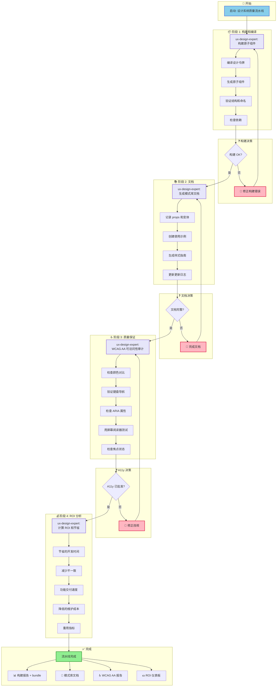
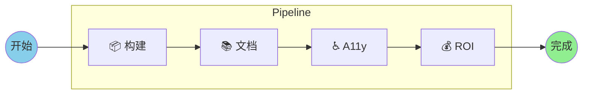
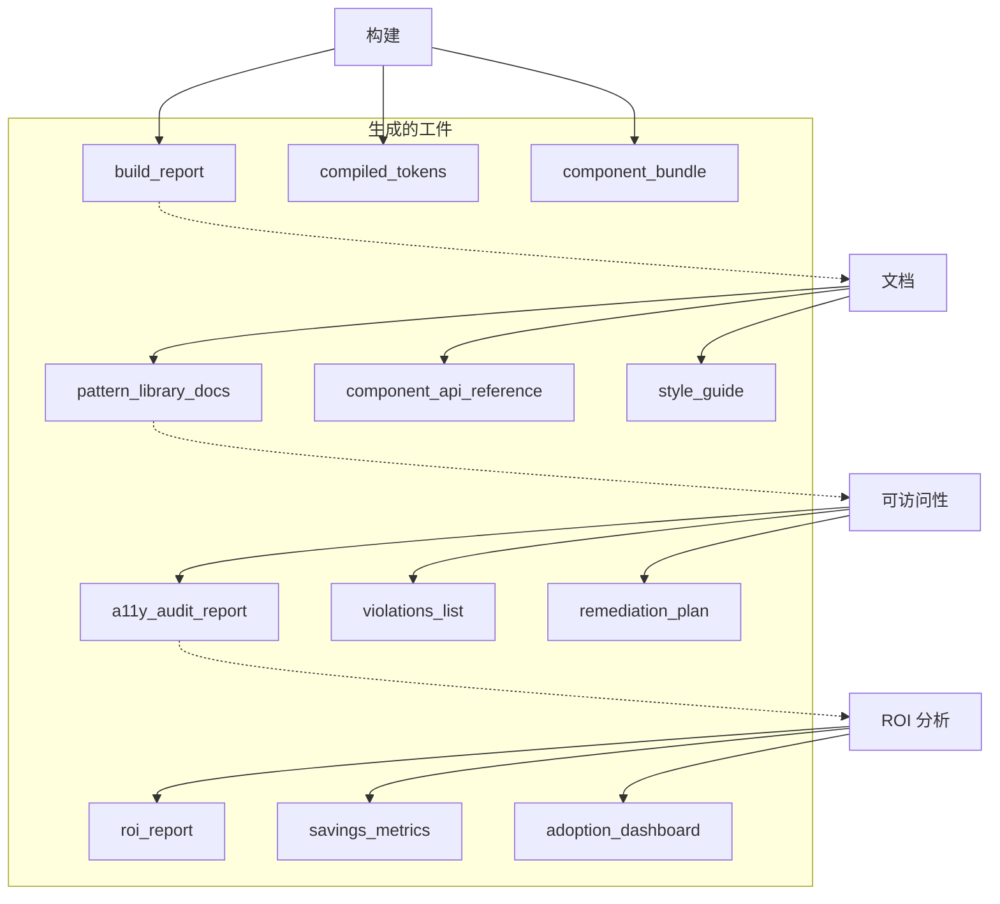
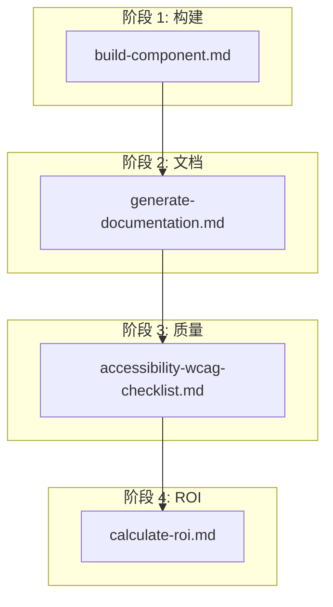
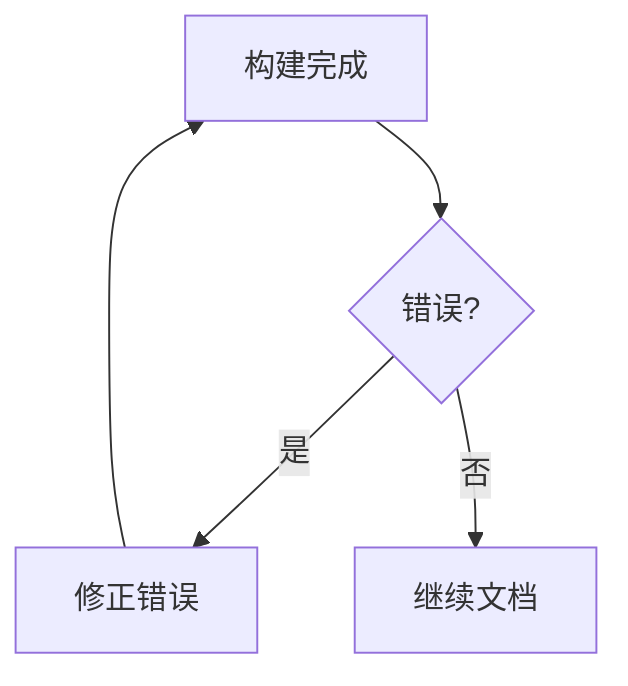
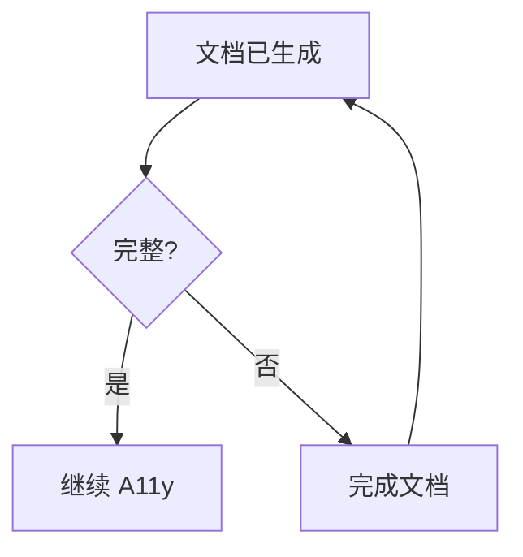
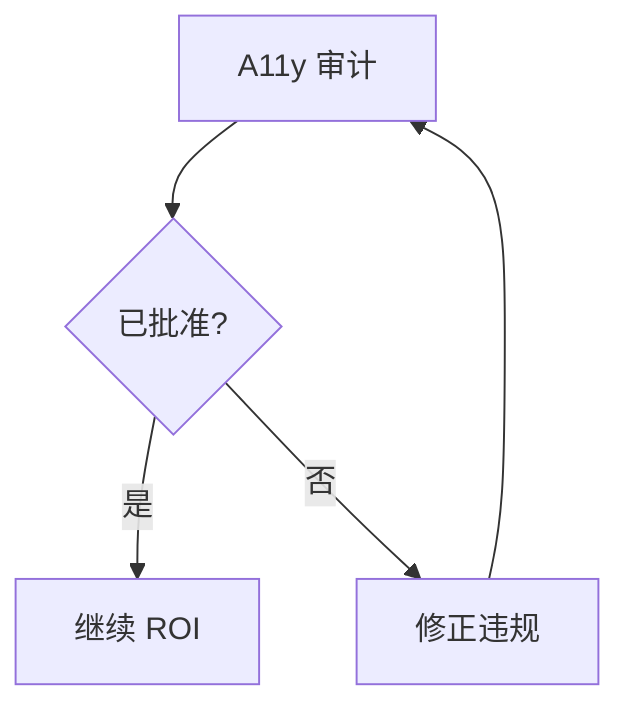

# 设计系统构建质量流水线

**工作流 ID:** `design-system-build-quality`
**版本:** 1.0.0
**类型:** 棕地
**状态:** 生产就绪

---

## 概览

**设计系统构建质量流水线**是一个迁移后的设计系统工作流。它按顺序链接构建、文档、可访问性审计和 ROI 计算步骤，以确保质量并衡量交付的价值。

### 目的

此流水线确保在迁移或创建设计系统后:

1. **组件正确编译** - 构建令牌和原子组件
2. **文档完整** - 带示例和指南的模式库
3. **可访问性已验证** - WCAG 2.1 AA 合规性
4. **ROI 已衡量** - 经济和价值交付指标

### 何时使用

| 场景 | 建议 |
|------|------|
| 设计系统迁移后 | 强烈推荐 |
| 发布新版本模式库 | 必需 |
| 定期质量审计 | 推荐 (季度) |
| 组件生产前验证 | 必需 |
| 为利益相关者生成指标 | 根据需要 |

### 支持的项目类型

- `design-system`
- `component-library`
- `pattern-library`
- `ui-migration`

---

## 工作流图

### 主流程



### 简化视图



#### 依赖流



---

## 详细步骤

### 步骤 1: 构建原子组件

| 属性 | 值 |
|------|-----|
| **ID** | `build` |
| **阶段** | 1 - 构建和编译 |
| **代理** | `ux-design-expert` (Uma) |
| **操作** | 原子组件构建 |
| **依赖** | 无 (初始步骤) |

#### 描述

执行设计系统组件的构建，编译令牌并生成原子组件。

#### 执行的活动

1. **编译设计令牌** - 颜色、排版、间距
2. **生成原子组件** - 按钮、输入、卡片等。
3. **验证文件结构和命名**
4. **检查依赖和导入**

#### 成功标准

- [ ] 构建完成无错误
- [ ] 所有令牌已编译
- [ ] 组件正确导出

#### 输出

| 工件 | 描述 |
|------|------|
| `build_report` | 构建过程报告 |
| `compiled_tokens` | 已编译的设计令牌 (CSS/JS) |
| `component_bundle` | 已准备的组件 bundle |

---

### 步骤 2: 生成文档

| 属性 | 值 |
|------|-----|
| **ID** | `document` |
| **阶段** | 2 - 文档 |
| **代理** | `ux-design-expert` (Uma) |
| **操作** | 生成模式库文档 |
| **依赖** | `build` (步骤 1) |

#### 描述

生成模式库的完整文档，包括组件 API、示例和样式指南。

#### 执行的活动

1. **记录每个组件**及其 props 和变体
2. **创建使用示例**和代码片段
3. **生成可视样式指南**
4. **更新组件更新日志**

#### 成功标准

- [ ] 所有组件都有文档
- [ ] 代码示例有效
- [ ] 样式指南已更新

#### 输出

| 工件 | 描述 |
|------|------|
| `pattern_library_docs` | 模式库的完整文档 |
| `component_api_reference` | 组件 API 参考 |
| `style_guide` | 可视样式指南 |

---

### 步骤 3: 可访问性审计

| 属性 | 值 |
|------|-----|
| **ID** | `a11y-check` |
| **阶段** | 3 - 质量保证 |
| **代理** | `ux-design-expert` (Uma) |
| **操作** | 可访问性审计 (WCAG AA) |
| **依赖** | `document` (步骤 2) |

#### 描述

按 WCAG 2.1 AA 执行可访问性审计，验证对比度、导航和辅助技术兼容性。

#### 执行的活动

1. **检查颜色对比** - 4.5:1 文本，3:1 UI
2. **验证键盘导航**
3. **检查 ARIA 属性和角色**
4. **用屏幕阅读器测试**
5. **检查焦点状态和视觉指示器**

#### 成功标准

- [ ] 颜色对比已批准
- [ ] 键盘导航有效
- [ ] ARIA 标签正确
- [ ] 无 WCAG AA 关键违规

#### 输出

| 工件 | 描述 |
|------|------|
| `a11y_audit_report` | 完整的审计报告 |
| `violations_list` | 发现的违规列表 |
| `remediation_plan` | 违规修正计划 |

---

### 步骤 4: 计算 ROI

| 属性 | 值 |
|------|-----|
| **ID** | `calculate-roi` |
| **阶段** | 4 - ROI 分析 |
| **代理** | `ux-design-expert` (Uma) |
| **操作** | ROI 和节省的计算 |
| **依赖** | `a11y-check` (步骤 3) |

#### 描述

计算设计系统的投资回报率，衡量时间节省、不一致性减少和重用指标。

#### 计算的指标

1. **节省的开发时间** (小时/月)
2. **视觉不一致降低** (%)
3. **功能交付速度** (平均时间)
4. **降低的维护成本** ($)
5. **组件重用率** (%)

#### 成功标准

- [ ] 每月节省的开发小时数已计算
- [ ] 组件重用百分比已衡量
- [ ] 平均新功能时间已计算
- [ ] 视觉 bug 的减少已量化

#### 输出

| 工件 | 描述 |
|------|------|
| `roi_report` | 完整的 ROI 报告 |
| `savings_metrics` | 详细的节省指标 |
| `adoption_dashboard` | 设计系统采用情况仪表板 |

---

## 参与的代理

### ux-design-expert (Uma)

| 属性 | 值 |
|------|-----|
| **名字** | Uma |
| **角色** | UX/UI 设计师和设计系统架构师 |
| **图标** | 🎨 |
| **原型** | 共鸣者 |

#### 混合哲学

Uma 结合了两种互补的方法:

**Sally 的 UX 原则 (研究阶段):**
- 以用户为中心: 基于真实需求的决策
- 同理心发现: 深度用户研究
- 迭代简单: 从简单开始，通过反馈优化
- 细节的喜悦: 微交互创造难忘体验

**Brad Frost 的系统原则 (构建和扩展阶段):**
- 指标驱动: 数据而非观点
- 视觉冲击疗法: 用真实数据显示混乱
- 智能整合: 模式的算法聚类
- ROI 集中: 计算节省，证明价值
- 无硬编码值: 所有样式来自令牌
- 原子设计: Atoms → Molecules → Organisms → Templates → Pages
- WCAG AA 最低: 内置可访问性

#### 此工作流的相关命令

| 命令 | 描述 | 阶段 |
|------|------|------|
| `*build {component}` | 原子组件构建 | 4 |
| `*document` | 生成模式库文档 | 5 |
| `*a11y-check` | WCAG AA/AAA 审计 | 5 |
| `*calculate-roi` | 计算 ROI 和经济 | 5 |

---

## 执行的任务

### 按步骤的任务映射

| 步骤 | 任务文件 | 描述 |
|------|---------|------|
| 构建 | `build-component.md` | 原子组件构建 |
| 文档 | `generate-documentation.md` | 模式库生成 |
| A11y 审计 | `accessibility-wcag-checklist.md` | WCAG 2.1 AA 检查清单 |
| ROI | `calculate-roi.md` | ROI 和指标计算 |

### 任务依赖图



---

## 前置条件

### 技术要求

| 要求 | 描述 |
|------|------|
| 现有设计系统 | 组件已迁移/创建 |
| 令牌结构 | `tokens.yaml` 或等价的已配置 |
| 构建环境 | Node.js 18+、npm/yarn/pnpm |
| 测试工具 | Jest、Testing Library (推荐) |

### 项目要求

- [ ] 设计系统迁移完成 (或创建了 v1)
- [ ] 设计令牌已提取并组织
- [ ] 原子组件已定义 (atoms、molecules、organisms)
- [ ] 文件夹结构遵循原子设计

### 团队要求

- [ ] 原子设计方法论的知识
- [ ] WCAG 2.1 指南的熟悉
- [ ] 设计系统存储库的访问权限

---

## 输入和输出

### 流水线输入

| 输入 | 类型 | 描述 |
|------|------|------|
| 设计令牌来源 | `tokens.yaml` | 颜色、排版、间距定义 |
| 组件源文件 | `*.tsx`、`*.css` | 组件源代码 |
| 现有文档 | `*.md` | 现有文档 (如有) |

### 流水线输出

#### 阶段 1: 构建和编译

```text
outputs/design-system/
├── build_report.json
├── compiled/
│   ├── tokens.css
│   ├── tokens.js
│   └── tokens.d.ts
└── bundle/
    ├── components.js
    └── components.d.ts
```

#### 阶段 2: 文档

```text
outputs/design-system/
├── docs/
│   ├── pattern-library/
│   │   ├── index.html
│   │   ├── atoms/
│   │   ├── molecules/
│   │   └── organisms/
│   ├── api-reference/
│   │   └── components.md
│   └── style-guide/
│       └── index.html
└── changelog.md
```

#### 阶段 3: 质量保证

```text
outputs/design-system/
├── a11y/
│   ├── audit-report.html
│   ├── violations.json
│   └── remediation-plan.md
```

#### 阶段 4: ROI 分析

```text
outputs/design-system/
├── metrics/
│   ├── roi-report.pdf
│   ├── savings-breakdown.json
│   └── adoption-dashboard.html
```

---

## 决策点

### 决策 1: 构建 OK?



**通过标准:**
- 无编译错误
- 所有令牌有效
- 导出有效

**失败操作:**
1. 审查构建日志
2. 修正语法/导入错误
3. 验证令牌结构
4. 重新运行构建

---

### 决策 2: 文档完整?



**通过标准:**
- 100% 的组件已记录
- 代码示例有效
- 样式指南已更新

**失败操作:**
1. 识别无文档的组件
2. 添加缺失的 props 和示例
3. 更新更新日志
4. 重新生成文档

---

### 决策 3: 可访问性已批准?



**通过标准:**
- 无关键违规 (等级 A)
- 无严重违规 (等级 AA)
- 100% 键盘导航功能

**失败操作:**
1. 审查 `violations_list`
2. 遵循 `remediation_plan`
3. 修正对比问题
4. 添加缺失的 ARIA 标签
5. 重新运行审计

---

## 执行模式

工作流支持三种执行模式:

### 模式 YOLO (自主)

| 属性 | 值 |
|------|-----|
| **提示** | 0-1 |
| **交互** | 最少 |
| **用途** | CI/CD 流水线、自动化执行 |

```bash
# 自主执行
*workflow design-system-build-quality --mode yolo
```

### 模式 Interactive (默认)

| 属性 | 值 |
|------|-----|
| **提示** | 5-10 |
| **交互** | 决策检查点 |
| **用途** | 正常开发、教育反馈 |

```bash
# 交互执行 (默认)
*workflow design-system-build-quality
```

### 模式 Preflight (规划)

| 属性 | 值 |
|------|-----|
| **提示** | 10-15 |
| **交互** | 执行前的完整规划 |
| **用途** | 首次执行、影响分析 |

```bash
# 带完整规划的执行
*workflow design-system-build-quality --mode preflight
```

---

## 故障排查

### 问题: 构建因令牌错误而失败

**症状:**
- 错误 "Token not found"
- 颜色或间距未编译

**解决方案:**
```bash
# 1. 检查令牌结构
cat tokens.yaml

# 2. 验证 YAML 语法
npm run lint:tokens

# 3. 检查交叉参考
grep -r "var(--" src/
```

---

### 问题: 文档不完整

**症状:**
- 组件无示例
- Props 未记录

**解决方案:**
```bash
# 1. 列出无文档的组件
*audit --check-docs

# 2. 生成文档存根
*document --generate-stubs

# 3. 手动完成并重新运行
*document
```

---

### 问题: 可访问性违规

**症状:**
- 对比失败
- ARIA 标签缺失

**解决方案:**
```bash
# 1. 审查详细报告
cat outputs/design-system/a11y/violations.json

# 2. 使用对比工具
# 推荐: WebAIM 对比检查器

# 3. 添加 ARIA 标签
# 遵循 remediation-plan.md

# 4. 重新运行审计
*a11y-check
```

---

### 问题: ROI 计算不正确

**症状:**
- 指标为零
- 历史数据缺失

**解决方案:**
```bash
# 1. 检查输入数据
cat .state.yaml

# 2. 手动提供基准
*calculate-roi --baseline "manual"

# 3. 使用市场估计
# Brad Frost 建议: 30-50% 的开发经济
```

---

## 切换提示

### 构建完成后

```
构建组件成功完成。
令牌已编译: {{token_count}}
组件已生成: {{component_count}}
继续文档...
```

### 文档后

```
模式库文档已生成。
已记录的组件: {{documented_count}}
已创建的示例: {{example_count}}
启动可访问性审计...
```

### 可访问性审计后

```
WCAG AA 可访问性审计已完成。
状态: {{pass/fail}}
关键违规: {{critical_count}}
次要违规: {{minor_count}}
{{if pass}}: 继续 ROI 计算。
{{if fail}}: 在继续前审查 remediation_plan。
```

### 流水线完成

```
质量流水线已完成!

摘要:
- 构建: {{build_status}}
- 文档: {{docs_status}}
- 可访问性: {{a11y_status}}
- 已计算的 ROI: {{roi_value}}

工件可在 outputs/design-system/ 获得
```

---

## 参考

### 内部文档

| 文档 | 路径 |
|------|------|
| 工作流定义 | `.aios-core/development/workflows/design-system-build-quality.yaml` |
| UX 设计专家代理 | `.aios-core/development/agents/ux-design-expert.md` |
| 任务: 构建组件 | `.aios-core/development/tasks/build-component.md` |
| 任务: 生成文档 | `.aios-core/development/tasks/generate-documentation.md` |
| 检查清单: WCAG A11y | `.aios-core/development/checklists/accessibility-wcag-checklist.md` |
| 任务: 计算 ROI | `.aios-core/development/tasks/calculate-roi.md` |

### 外部参考

| 资源 | 链接 |
|------|------|
| 原子设计 (Brad Frost) | https://atomicdesign.bradfrost.com/ |
| WCAG 2.1 指南 | https://www.w3.org/WAI/WCAG21/quickref/ |
| 设计令牌 W3C | https://design-tokens.github.io/community-group/format/ |
| WebAIM 对比检查器 | https://webaim.org/resources/contrastchecker/ |

### 相关工作流

| 工作流 | 描述 |
|------|------|
| `brownfield-migration` | 现有设计系统迁移 |
| `greenfield-design-system` | 从零创建设计系统 |
| `component-library-setup` | 组件库的初始设置 |

---

## 版本历史

| 版本 | 日期 | 作者 | 更改 |
|------|------|------|------|
| 1.0.0 | 2025-01-30 | Orion (AIOS 主机) | 工作流初始版本 |

---

## 元数据

```yaml
workflow_id: design-system-build-quality
version: 1.0.0
type: brownfield
author: Orion (AIOS Master)
created_date: 2025-01-30
documentation_created: 2026-02-04
tags:
  - design-system
  - quality-assurance
  - accessibility
  - documentation
  - roi
  - brownfield
```

---

*由技术文档专家生成的文档*
*AIOS-FULLSTACK 框架 v2.2*
