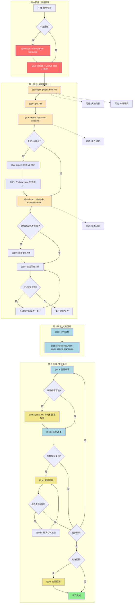
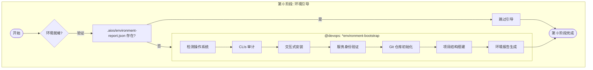
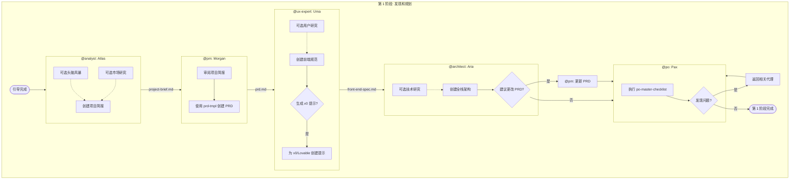
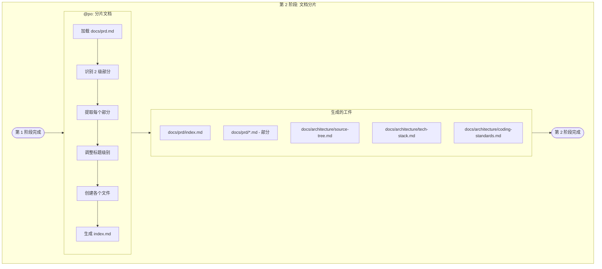
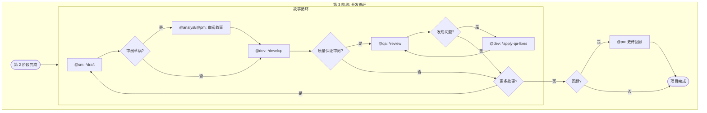
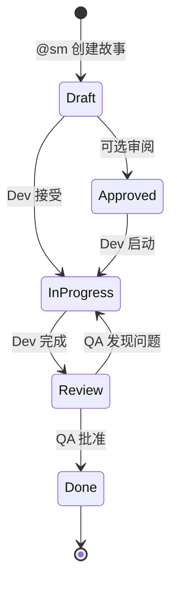
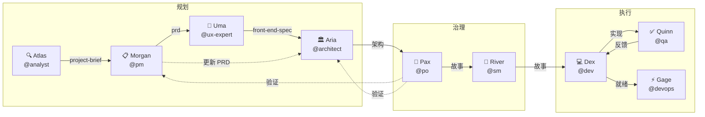
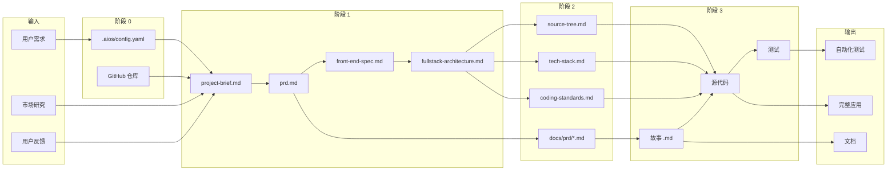
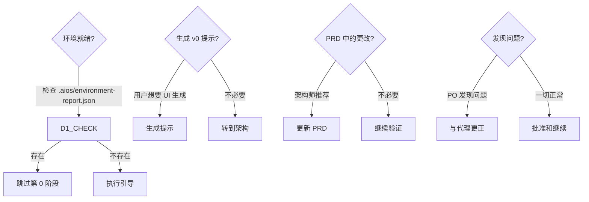

# 绿地全栈工作流

**版本:** 1.0.0
**类型:** 绿地项目
**最后更新:** 2026-02-04
**源文件:** `.aios-core/development/workflows/greenfield-fullstack.yaml`

---

## 概述

**绿地全栈工作流** 是 AIOS 从概念到开发的主要工作流,用于构建全栈应用。本工作流既支持复杂项目的全面规划,也支持简单项目的快速原型设计。

### 支持的项目类型

| 类型 | 描述 |
|------|------|
| `web-app` | 现代网络应用 |
| `saas` | 软件即服务 |
| `enterprise-app` | 企业应用 |
| `prototype` | 原型和概念验证 |
| `mvp` | 最小可行产品 |

### 何时使用本工作流

- 构建生产就绪的应用
- 多团队成员项目
- 复杂功能需求
- 需要全面文档
- 长期维护预期
- 企业或客户应用

---

## 工作流总体图表



---

## 工作流阶段

### 颜色说明

| 颜色 | 含义 |
|------|------|
| 红色 (#FF6B6B) | 环境引导 |
| 浅橙色 (#FFE4B5) | 规划和文档 |
| 浅蓝色 (#ADD8E6) | 开发和分片 |
| 浅紫色 (#E6E6FA) | AI 生成 UI |
| 黄色 (#F0E68C) | 审阅和验证 |
| 绿色 (#90EE90) | 完成 |

---

## 第 0 阶段: 环境引导

### 目标
在启动项目规划前配置开发环境。

### 详细图表



### 详细步骤

| 步骤 | 代理 | 任务 | 输入 | 输出 | 必需 |
|------|------|------|------|------|------|
| 1 | @devops (Gage) | `environment-bootstrap.md` | `project_name`, `project_path`, `github_org` | `.aios/config.yaml`, `.aios/environment-report.json`, `.gitignore`, `README.md`, `package.json` | 是 |

### 创建的工件

| 文件 | 描述 |
|------|------|
| `.aios/config.yaml` | AIOS 项目配置 |
| `.aios/environment-report.json` | 完整的环境报告 |
| `.gitignore` | Git 忽略规则 |
| `README.md` | 初始项目文档 |
| `package.json` | NPM 配置 |

### 验证/安装的 CLIs

| 类别 | 工具 | 必需 |
|------|------|------|
| 必需 | git | 是 |
| 必需 | gh (GitHub CLI) | 是 |
| 必需 | node | 是 |
| 必需 | npm | 是 |
| 基础设施 | supabase | 推荐 |
| 基础设施 | railway | 可选 |
| 基础设施 | docker | 推荐 |
| 质量 | coderabbit | 推荐 |
| 可选 | pnpm | 可选 |
| 可选 | bun | 可选 |

### 跳过条件

- 仅在项目已有 `.aios/environment-report.json` 时跳过
- 切换机器或新团队成员加入时重新执行

---

## 第 1 阶段: 发现和规划

### 目标
创建所有规划工件: 项目简报、PRD、规范和架构。

### 详细图表



### 详细步骤

| 步骤 | 代理 | 任务/模板 | 输入 | 输出 | 必需 |
|------|------|----------|------|------|------|
| 1 | @analyst (Atlas) | `project-brief-tmpl.yaml` | 用户需求、研究 | `project-brief.md` | 是 |
| 2 | @pm (Morgan) | `prd-tmpl.yaml` | `project-brief.md` | `prd.md` | 是 |
| 3 | @ux-expert (Uma) | `front-end-spec-tmpl.yaml` | `prd.md` | `front-end-spec.md` | 是 |
| 4 | @ux-expert (Uma) | `generate-ai-frontend-prompt.md` | `front-end-spec.md` | v0/Lovable 提示 | 可选 |
| 5 | @architect (Aria) | `fullstack-architecture-tmpl.yaml` | `prd.md`, `front-end-spec.md` | `fullstack-architecture.md` | 是 |
| 6 | @pm (Morgan) | 更新 | `fullstack-architecture.md` | 更新的 `prd.md` | 条件 |
| 7 | @po (Pax) | `po-master-checklist.md` | 所有工件 | 验证 | 是 |

### 创建的工件

| 文档 | 责任人 | 位置 |
|------|--------|------|
| 项目简报 | @analyst | `docs/project-brief.md` |
| PRD | @pm | `docs/prd.md` |
| 前端规范 | @ux-expert | `docs/front-end-spec.md` |
| 全栈架构 | @architect | `docs/fullstack-architecture.md` |

### 可选步骤

| 步骤 | 代理 | 描述 |
|------|------|------|
| 头脑风暴 | @analyst | 结构化的想法会议 |
| 市场研究 | @analyst | 市场和竞争对手分析 |
| 用户研究 | @ux-expert | 访谈和需求分析 |
| 技术研究 | @architect | 技术调查 |

---

## 第 2 阶段: 文档分片

### 目标
将 PRD 和架构分割成开发就绪的部分。

### 详细图表



### 详细步骤

| 步骤 | 代理 | 任务 | 输入 | 输出 | 必需 |
|------|------|------|------|------|------|
| 1 | @po (Pax) | `shard-doc.md` | `docs/prd.md` | 包含分片文件的 `docs/prd/` 文件夹 | 是 |

### 分片方法

1. **自动 (推荐)**: 使用 `md-tree explode {input} {output}`
2. **手动**: 按 2 级标题 (##) 分割

### 创建的工件

| 文件 | 描述 |
|------|------|
| `docs/prd/index.md` | 包含所有部分链接的索引 |
| `docs/prd/*.md` | PRD 的各个部分 |
| `docs/architecture/source-tree.md` | 项目目录结构 |
| `docs/architecture/tech-stack.md` | 技术堆栈 |
| `docs/architecture/coding-standards.md` | 代码标准 |

---

## 第 3 阶段: 开发循环

### 目标
通过质量保证审阅的迭代实施故事。

### 详细图表



### 详细步骤

| 步骤 | 代理 | 任务 | 输入 | 输出 | 必需 |
|------|------|------|------|------|------|
| 1 | @sm (River) | `sm-create-next-story.md` | 分片的文档 | `{epic}.{story}.story.md` | 是 |
| 2 | @analyst/@pm | 审阅 | 故事草稿 | 批准的故事 | 可选 |
| 3 | @dev (Dex) | `dev-develop-story.md` | 批准的故事 | 实现 | 是 |
| 4 | @qa (Quinn) | `qa-review-story.md` | 实现 | 质量保证反馈 | 可选 |
| 5 | @dev (Dex) | `apply-qa-fixes.md` | 质量保证反馈 | 应用的更正 | 条件 |
| 6 | @po (Pax) | 回顾 | 完成的史诗 | 回顾 | 可选 |

### 故事循环



### 故事状态

| 状态 | 描述 | 下一步 |
|------|------|--------|
| Draft | SM 创建的故事 | 审阅或开发 |
| Approved | 审阅和批准的故事 | 开发 |
| In Progress | 开发中 | 质量保证审阅 |
| Review | 等待审阅 | 质量保证或更正 |
| Done | 完成和批准 | 下一个故事 |

---

## 参与的代理

### 代理表

| 代理 | ID | 图标 | 原型 | 责任 |
|------|----|----|------|------|
| Gage | @devops | ⚡ | 操作员 | 环境引导、Git 推送、发布、CI/CD |
| Atlas | @analyst | 🔍 | 解码器 | 市场研究、头脑风暴、项目简报 |
| Morgan | @pm | 📋 | 策略师 | PRD、产品策略、史诗 |
| Uma | @ux-expert | 🎨 | 移情者 | 前端规范、UX、设计系统 |
| Aria | @architect | 🏛️ | 愿景者 | 全栈架构、技术决策 |
| Pax | @po | 🎯 | 平衡者 | 工件验证、待办事项、分片 |
| River | @sm | 🌊 | 促进者 | 故事创建、冲刺规划 |
| Dex | @dev | 💻 | 建设者 | 代码实现、测试 |
| Quinn | @qa | ✅ | 守卫者 | 质量审阅、测试、关卡 |

### 代理间交互图表



---

## 执行的任务

### 完整任务列表

| 阶段 | 任务 | 代理 | 文件 |
|------|------|------|------|
| 0 | 环境引导 | @devops | `environment-bootstrap.md` |
| 1 | 创建文档 | @analyst、@pm、@ux-expert、@architect | `create-doc.md` |
| 1 | 促进头脑风暴 | @analyst | `facilitate-brainstorming-session.md` |
| 1 | 深入研究提示 | @analyst、@pm、@architect | `create-deep-research-prompt.md` |
| 1 | 生成 AI 前端提示 | @ux-expert | `generate-ai-frontend-prompt.md` |
| 1 | 执行检查列表 | @po | `execute-checklist.md` |
| 2 | 分片文档 | @po | `shard-doc.md` |
| 3 | 创建下一个故事 | @sm | `sm-create-next-story.md` |
| 3 | 开发故事 | @dev | `dev-develop-story.md` |
| 3 | 审阅故事 | @qa | `qa-review-story.md` |
| 3 | 应用质量保证修复 | @dev | `apply-qa-fixes.md` |

### 使用的模板

| 模板 | 代理 | 目的 |
|------|------|------|
| `project-brief-tmpl.yaml` | @analyst | 项目简报结构 |
| `prd-tmpl.yaml` | @pm | PRD 结构 |
| `front-end-spec-tmpl.yaml` | @ux-expert | 前端规范 |
| `fullstack-architecture-tmpl.yaml` | @architect | 完整架构 |
| `story-tmpl.yaml` | @sm | 用户故事模板 |

### 使用的检查列表

| 检查列表 | 代理 | 用途 |
|---------|------|------|
| `po-master-checklist.md` | @po | 所有工件验证 |
| `story-draft-checklist.md` | @sm | 故事草稿质量 |
| `story-dod-checklist.md` | @dev | 完成定义 |

---

## 前置条件

### 系统要求

| 要求 | 最少 | 推荐 |
|------|------|------|
| Windows | 10 1809+ | 11 |
| macOS | 12+ | 14+ |
| Linux | Ubuntu 20.04+ | Ubuntu 22.04+ |
| Node.js | 18.x | 20.x |
| Git | 2.x | 2.43+ |

### 必需工具

| 工具 | 验证命令 | 安装 |
|------|----------|------|
| Git | `git --version` | 本地系统 |
| GitHub CLI | `gh --version` | `winget install GitHub.cli` |
| Node.js | `node --version` | `winget install OpenJS.NodeJS.LTS` |
| npm | `npm --version` | 包含在 Node.js 中 |

### 必需的身份验证

| 服务 | 登录命令 | 验证 |
|------|----------|------|
| GitHub | `gh auth login` | `gh auth status` |
| Supabase | `supabase login` | `supabase projects list` |
| Railway | `railway login` | `railway whoami` |

---

## 输入和输出

### 数据流



### 按阶段的输入/输出矩阵

| 阶段 | 输入 | 输出 |
|------|------|------|
| 0 | 项目名、GitHub 组织 | AIOS 配置、Git 仓库、文件夹结构 |
| 1 | 需求、研究 | 简报、PRD、规范、架构 |
| 2 | PRD、架构 | 分片文档、索引 |
| 3 | 故事、分片文档 | 代码、测试、应用 |

---

## 决策点

### 决策表

| 阶段 | 决策点 | 选项 | 标准 |
|------|--------|------|------|
| 0 | 环境就绪? | 跳过/执行引导 | `.aios/environment-report.json` 存在 |
| 1 | 生成 v0 提示? | 是/否 | 用户想要 AI UI 生成 |
| 1 | 架构建议更改? | 更新 PRD/继续 | 架构师建议 |
| 1 | PO 发现问题? | 更正/批准 | 检查列表结果 |
| 3 | 审阅故事草稿? | 审阅/跳过 dev | 故事复杂性 |
| 3 | 质量保证审阅? | 是/否 | 故事关键性 |
| 3 | 更多故事? | 继续/完成 | 史诗待办事项 |
| 3 | 回顾? | 是/否 | 史诗完成 |

### 决策流程图



---

## 故障排除

### 常见问题

#### 第 0 阶段: 环境引导

| 问题 | 原因 | 解决方案 |
|------|------|---------|
| `winget` 未识别 | Windows 过期 | 更新 Windows 或使用 `choco`/`scoop` |
| `gh auth login` 失败 | 连接或代理 | 检查互联网、配置代理 |
| 仓库权限被拒 | Token 作用域不足 | 使用 `--scopes repo,workflow` 重新认证 |
| Docker 不启动 | 服务停止 | 启动 Docker Desktop |

#### 第 1 阶段: 规划

| 问题 | 原因 | 解决方案 |
|------|------|---------|
| 模板未找到 | 路径错误 | 检查 `.aios-core/development/templates/` |
| PRD 与架构冲突 | 需求分歧 | 召开 PM 和 Architect 会议对齐 |
| 检查列表失败 | 工件不完整 | 返回相关代理 |

#### 第 2 阶段: 分片

| 问题 | 原因 | 解决方案 |
|------|------|---------|
| `md-tree` 未找到 | 未安装 | `npm install -g @kayvan/markdown-tree-parser` |
| 未检测到部分 | 格式错误 | 检查文档中的 `##` 标题 |
| 内容丢失 | 代码块中的 `##` | 使用正确解析的手动方法 |

#### 第 3 阶段: 开发

| 问题 | 原因 | 解决方案 |
|------|------|---------|
| 故事不完整 | SM 跳过字段 | 执行 `story-draft-checklist` |
| 测试失败 | 代码损坏 | @dev 执行 `*run-tests` |
| QA 阻止 | CRITICAL 问题 | 在继续前与 @dev 解决 |
| Epic 未在 ClickUp 中找到 | Task 未创建 | 使用正确标签创建 Epic |

### 诊断命令

```bash
# 检查环境
cat .aios/environment-report.json

# 检查 CLIs
git --version && gh --version && node --version

# 检查身份验证
gh auth status
supabase projects list
railway whoami

# 检查项目结构
ls -la .aios/
ls -la docs/
```

---

## 切换提示

### 阶段间转换

| 从 | 到 | 切换提示 |
|----|-----|----------|
| 阶段 0 | 阶段 1 | "环境引导完成! Git 仓库已创建,CLIs 已验证,项目结构就绪。使用 @analyst 在新聊天中开始创建项目简报。" |
| @analyst | @pm | "项目简报完成。将其保存为项目中的 `docs/project-brief.md`,然后创建 PRD。" |
| @pm | @ux-expert | "PRD 就绪。将其保存为项目中的 `docs/prd.md`,然后创建 UI/UX 规范。" |
| @ux-expert | @architect | "UI/UX 规范完成。将其保存为项目中的 `docs/front-end-spec.md`,然后创建全栈架构。" |
| @architect | @po | "架构完成。将其保存为 `docs/fullstack-architecture.md`。您建议对 PRD 故事进行更改或需要新故事吗?" |
| 阶段 1 | 阶段 2 | "所有规划工件已验证。现在为开发分片文档: @po → *shard-doc docs/prd.md" |
| 阶段 2 | 阶段 3 | "文档已分片! source-tree.md、tech-stack.md、coding-standards.md 已创建。开始开发: @sm → *draft" |
| 完成 | - | "所有故事已实施和审阅。项目的开发阶段完成!" |

---

## 参考

### 相关文件

| 类型 | 文件 | 描述 |
|------|------|------|
| 工作流 | `.aios-core/development/workflows/greenfield-fullstack.yaml` | 工作流定义 |
| 任务 | `.aios-core/development/tasks/environment-bootstrap.md` | 环境引导 |
| 任务 | `.aios-core/development/tasks/shard-doc.md` | 文档分片 |
| 任务 | `.aios-core/development/tasks/sm-create-next-story.md` | 故事创建 |
| 代理 | `.aios-core/development/agents/*.md` | 代理定义 |
| 模板 | `.aios-core/development/templates/*.yaml` | 文档模板 |
| 检查列表 | `.aios-core/development/checklists/*.md` | 验证检查列表 |

### 外部文档

| 资源 | URL |
|------|-----|
| GitHub CLI | https://cli.github.com/manual/ |
| Supabase CLI | https://supabase.com/docs/guides/cli |
| Railway CLI | https://docs.railway.app/reference/cli-api |
| CodeRabbit | https://coderabbit.ai/docs |

---

## 版本历史

| 版本 | 日期 | 更改 |
|------|------|------|
| 1.0.0 | 2026-02-04 | 初始完整文档 |

---

**维护者:** AIOS 开发团队
**最后审阅:** 2026-02-04
