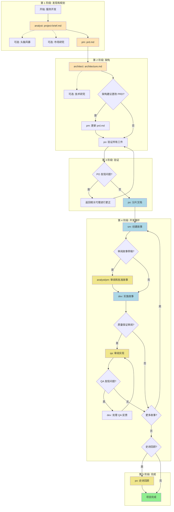
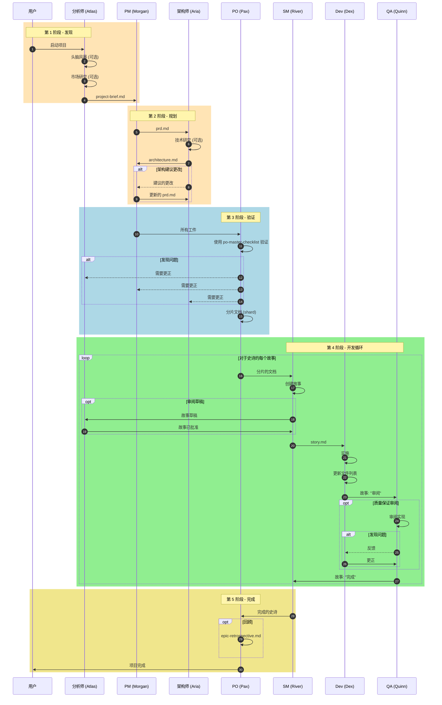
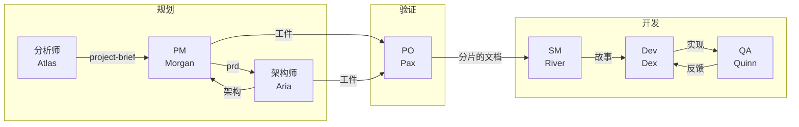
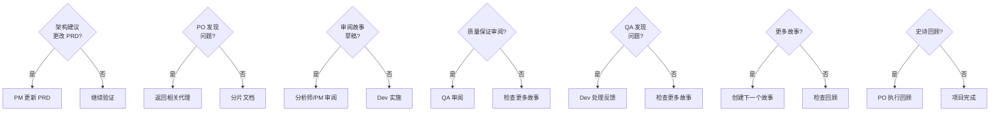

# 工作流: 绿地服务/API 开发

**文档:** GREENFIELD-SERVICE-WORKFLOW.md
**版本:** 1.0
**创建:** 2026-02-04
**源:** `.aios-core/development/workflows/greenfield-service.yaml`

---

## 概述

**绿地服务/API 开发** 工作流是一个编排的代理流程,用于开发后端服务,从构思到完整实现。它既支持复杂服务的全面规划,也支持简单 API 的快速原型设计。

### 支持的项目类型

| 类型 | 描述 |
|------|------|
| `rest-api` | 传统 RESTful API |
| `graphql-api` | GraphQL API |
| `microservice` | 独立微服务 |
| `backend-service` | 通用后端服务 |
| `api-prototype` | API 快速原型 |
| `simple-service` | 范围有限的简单服务 |

### 何时使用本工作流

- 构建生产 API 或微服务
- 多个端点和复杂业务逻辑
- 需要全面的文档和测试
- 多个团队成员参与
- 长期维护预期
- 企业或外部面向的 API

---

## 工作流图表



---

## 序列图



---

## 详细步骤

### 步骤 1: 创建项目简报

| 字段 | 值 |
|------|-----|
| **代理** | `@analyst` (Atlas) |
| **任务** | 创建 project-brief.md |
| **输入** | 项目概念/想法、初始需求 |
| **输出** | `docs/project-brief.md` |
| **可选步骤** | `brainstorming_session`, `market_research_prompt` |

**描述:**
分析师进行头脑风暴会议(可选)、市场研究(可选)并创建项目简报,建立范围、目标和初始背景。

**注意:** 将最终输出保存在项目的 `docs/project-brief.md`。

---

### 步骤 2: 创建 PRD

| 字段 | 值 |
|------|-----|
| **代理** | `@pm` (Morgan) |
| **任务** | 创建 prd.md |
| **输入** | `project-brief.md` |
| **输出** | `docs/prd.md` |
| **模板** | `prd-tmpl` |

**描述:**
产品经理从项目简报创建产品需求文档 (PRD),专注于 API/服务需求。

**注意:** 将最终输出保存在项目的 `docs/prd.md`。

---

### 步骤 3: 创建架构

| 字段 | 值 |
|------|-----|
| **代理** | `@architect` (Aria) |
| **任务** | 创建 architecture.md |
| **输入** | `prd.md` |
| **输出** | `docs/architecture.md` |
| **模板** | `architecture-tmpl` |
| **可选步骤** | `technical_research_prompt` |

**描述:**
架构师创建后端/服务架构。可以建议对 PRD 中的故事进行更改或新故事。

**注意:** 将最终输出保存在项目的 `docs/architecture.md`。

---

### 步骤 4: 更新 PRD (条件)

| 字段 | 值 |
|------|-----|
| **代理** | `@pm` (Morgan) |
| **任务** | 更新 prd.md |
| **条件** | `architecture_suggests_prd_changes` |
| **输入** | 带有建议的 `architecture.md` |
| **输出** | `docs/prd.md` (已更新) |

**描述:**
如果架构师建议对故事进行更改,PM 会更新 PRD 并重新导出完整的非折叠文档。

---

### 步骤 5: 验证工件

| 字段 | 值 |
|------|-----|
| **代理** | `@po` (Pax) |
| **任务** | 验证所有工件 |
| **输入** | 所有文档 (`project-brief.md`, `prd.md`, `architecture.md`) |
| **输出** | 验证已批准或问题列表 |
| **检查列表** | `po-master-checklist` |

**描述:**
产品所有者验证所有文档的一致性和完整性。可能需要对任何文档进行更新。

---

### 步骤 6: 更正问题 (条件)

| 字段 | 值 |
|------|-----|
| **代理** | 变量(取决于问题) |
| **任务** | 更正标记的文档 |
| **条件** | `po_checklist_issues` |
| **输入** | PO 的问题列表 |
| **输出** | 更正的文档 |

**描述:**
如果 PO 发现问题,返回相关代理进行更正并将更新的文档重新保存到 `docs/` 文件夹。

---

### 步骤 7: 分片文档

| 字段 | 值 |
|------|-----|
| **代理** | `@po` (Pax) |
| **任务** | 分片文档 |
| **输入** | 所有已验证的工件 |
| **输出** | `docs/prd/`, `docs/architecture/` (已分片) |

**描述:**
为 IDE 开发分片文档:
- **选项 A:** 使用 PO 代理分片: `@po` 并要求分片 `docs/prd.md`
- **选项 B:** 手动: 将任务 `shard-doc` + `docs/prd.md` 拖到聊天中

---

### 步骤 8: 创建故事 (循环)

| 字段 | 值 |
|------|-----|
| **代理** | `@sm` (River) |
| **任务** | 创建故事 |
| **输入** | 分片的文档 |
| **输出** | `story.md` |
| **重复** | 对于每个史诗 |

**描述:**
故事创建循环:
1. SM 代理 (新会话): `@sm` -> `*create`
2. 从分片的文档创建下一个故事
3. 故事以"草稿"状态开始

---

### 步骤 9: 审阅故事草稿 (可选)

| 字段 | 值 |
|------|-----|
| **代理** | `@analyst` 或 `@pm` |
| **任务** | 审阅故事草稿 |
| **条件** | `user_wants_story_review` |
| **输入** | 草稿中的 `story.md` |
| **输出** | 已批准的故事 (草稿 -> 已批准) |

**描述:**
审阅故事草稿以批准的可选步骤:
- 审阅故事的完整性和一致性
- 更新状态: 草稿 -> 已批准

---

### 步骤 10: 实施故事

| 字段 | 值 |
|------|-----|
| **代理** | `@dev` (Dex) |
| **任务** | 实施故事 |
| **输入** | 已批准的 `story.md` |
| **输出** | 实现文件 |

**描述:**
Dev 代理 (新会话): `@dev`
- 实施已批准的故事
- 使用所有更改更新文件列表
- 完成时将故事标记为"审阅"

---

### 步骤 11: 审阅实现 (可选)

| 字段 | 值 |
|------|-----|
| **代理** | `@qa` (Quinn) |
| **任务** | 审阅实现 |
| **条件** | 可选 |
| **输入** | 实现文件 |
| **输出** | 已批准的实现或反馈 |

**描述:**
高级开发人员审阅,具有重构能力。

QA 代理 (新会话): `@qa` -> `*review-story`
- 审阅高级开发,具有重构能力
- 直接更正小问题
- 为其余项目留下检查列表
- 更新故事状态 (审阅 -> 完成或保持审阅)

---

### 步骤 12: 处理 QA 反馈 (条件)

| 字段 | 值 |
|------|-----|
| **代理** | `@dev` (Dex) |
| **任务** | 处理 QA 反馈 |
| **条件** | `qa_left_unchecked_items` |
| **输入** | 包含待办项的 QA 检查列表 |
| **输出** | 更正的实现 |

**描述:**
如果 QA 留下未标记的项:
- Dev 代理 (新会话): 处理剩余项
- 返回 QA 进行最终批准

---

### 步骤 13: 继续循环

| 字段 | 值 |
|------|-----|
| **动作** | 对所有故事继续 |
| **条件** | 直到 PRD 的所有故事完成 |

**描述:**
重复故事创建、实现和审阅循环,处理所有故事。

---

### 步骤 14: 史诗回顾 (可选)

| 字段 | 值 |
|------|-----|
| **代理** | `@po` (Pax) |
| **任务** | 史诗回顾 |
| **条件** | `epic_complete` |
| **输出** | `epic-retrospective.md` |

**描述:**
史诗完成后:
- 验证史诗已正确完成
- 记录学习和改进

---

### 步骤 15: 项目完成

| 字段 | 值 |
|------|-----|
| **动作** | 项目完成 |
| **最终状态** | 所有故事已实施和审阅 |

**描述:**
所有故事已实施和审阅! 服务开发阶段完成。

**参考:** `.aios-core/data/aios-kb.md#IDE Development Workflow`

---

## 参与的代理



### 代理表

| ID | 名称 | 标题 | 图标 | 工作流中的责任 |
|----|------|------|------|----------------|
| `analyst` | Atlas | 业务分析师 | `分析` | 创建项目简报、头脑风暴、市场研究 |
| `pm` | Morgan | 产品经理 | `战略` | 创建和更新 PRD |
| `architect` | Aria | 架构师 | `架构` | 创建服务架构 |
| `po` | Pax | 产品所有者 | `验证` | 验证工件、分片文档、回顾 |
| `sm` | River | Scrum 大师 | `便利` | 创建史诗的故事 |
| `dev` | Dex | 全栈开发人员 | `实现` | 实施故事 |
| `qa` | Quinn | 测试架构师 | `质量` | 审阅实现 |

---

## 执行的任务

| 步骤 | 任务 | 代理 | 必需 |
|------|------|------|------|
| 1 | `create-project-brief` | analyst | 是 |
| 1a | `brainstorming_session` | analyst | 否 |
| 1b | `market_research_prompt` | analyst | 否 |
| 2 | `create-prd` | pm | 是 |
| 3 | `create-full-stack-architecture` | architect | 是 |
| 3a | `technical_research_prompt` | architect | 否 |
| 4 | `update-prd` | pm | 条件 |
| 5 | `execute-checklist (po-master-checklist)` | po | 是 |
| 6 | `fix-documents` | 多个 | 条件 |
| 7 | `shard-doc` | po | 是 |
| 8 | `create-next-story` | sm | 是 (循环) |
| 9 | `review-story-draft` | analyst/pm | 否 |
| 10 | `develop-story` | dev | 是 (循环) |
| 11 | `review-story` | qa | 否 |
| 12 | `apply-qa-fixes` | dev | 条件 |
| 14 | `epic-retrospective` | po | 否 |

---

## 前置条件

### 必需工具

| 工具 | 用途 |
|------|------|
| Node.js 18+ | 开发运行时 |
| Git | 版本控制 |
| GitHub CLI (`gh`) | GitHub 集成 |
| Supabase CLI | 数据库操作 |

### 配置文件

| 文件 | 描述 |
|------|------|
| `.aios-core/core-config.yaml` | 框架配置 |
| `.env` | 环境变量 |
| `projects/{Name}/.project.yaml` | 项目特定配置 |

### 必需模板

| 模板 | 位置 | 代理 |
|------|------|------|
| `project-brief-tmpl.yaml` | `.aios-core/development/templates/` | analyst |
| `prd-tmpl.yaml` | `.aios-core/development/templates/` | pm |
| `architecture-tmpl.yaml` | `.aios-core/development/templates/` | architect |
| `story-tmpl.yaml` | `.aios-core/development/templates/` | sm |
| `qa-gate-tmpl.yaml` | `.aios-core/development/templates/` | qa |

### 检查列表

| 检查列表 | 代理 | 用途 |
|---------|------|------|
| `po-master-checklist.md` | po | 工件验证 |
| `story-draft-checklist.md` | sm | 故事验证 |
| `story-dod-checklist.md` | dev | 完成定义 |

---

## 输入和输出

### 工作流输入

| 输入 | 描述 | 提供者 |
|------|------|--------|
| 项目概念 | 初始想法、目标、范围 | 用户 |
| 业务需求 | 客户/利益相关者需求 | 用户 |
| 技术限制 | 已知限制 | 用户 |
| 堆栈偏好 | 偏好技术 | 用户 |

### 工作流输出

| 输出 | 位置 | 创建者 |
|------|------|--------|
| `project-brief.md` | `docs/project-brief.md` | analyst |
| `prd.md` | `docs/prd.md` | pm |
| `architecture.md` | `docs/architecture.md` | architect |
| 分片的 PRD | `docs/prd/` | po |
| 分片的架构 | `docs/architecture/` | po |
| 故事 | `docs/stories/epic-X/` | sm |
| 实现的代码 | `apps/`, `packages/`, `infrastructure/` | dev |
| 质量保证关卡 | `docs/qa/gates/` | qa |
| 回顾 | `docs/epic-retrospective.md` | po |

---

## 决策点



### 决策表

| 点 | 条件 | 如果真实 | 如果假 |
|----|------|----------|--------|
| D1 | `architecture_suggests_prd_changes` | PM 更新 PRD | 继续到 PO |
| D2 | `po_checklist_issues` | 返回更正 | 分片文档 |
| D3 | `user_wants_story_review` | 分析师/PM 审阅草稿 | Dev 直接实施 |
| D4 | 用户偏好 | QA 审阅实现 | 检查更多故事 |
| D5 | `qa_left_unchecked_items` | Dev 处理反馈 | 故事完成 |
| D6 | 史诗中的剩余故事 | 创建下一个故事 | 检查回顾 |
| D7 | `epic_complete` 和偏好 | PO 执行回顾 | 项目完成 |

---

## 切换提示

标准化的代理间转换消息:

| 转换 | 提示 |
|------|------|
| 分析师 -> PM | "项目简报已完成。将其保存为项目中的 docs/project-brief.md,然后创建 PRD。" |
| PM -> 架构师 | "PRD 已就绪。将其保存为项目中的 docs/prd.md,然后创建服务架构。" |
| 架构师 (审阅) | "架构已完成。将其保存为 docs/architecture.md。您建议对 PRD 故事进行任何更改或需要添加新故事吗?" |
| 架构师 -> PM | "请使用建议的故事更改更新 PRD,然后将完整的 prd.md 重新导出到 docs/。" |
| 工件 -> PO | "所有文档都准备在 docs/ 文件夹中。请验证所有工件的一致性。" |
| PO (问题) | "PO 发现 [文档] 的问题。请返回 [代理] 进行修复并重新保存更新的文档。" |
| 工作流完成 | "所有规划工件已验证并保存在 docs/ 文件夹中。转到 IDE 环境开始开发。" |

---

## 故障排除

### 常见问题

#### 1. PRD 不完整

**症状:** 架构师无法创建充分的架构。

**原因:** 项目简报缺少关键信息。

**解决方案:**
1. 返回分析师
2. 执行 `*brainstorm` 发现缺失的需求
3. 更新 project-brief.md
4. PM 重新创建 PRD

---

#### 2. 不兼容的架构

**症状:** 故事不映射到架构。

**原因:** PRD 和架构不一致。

**解决方案:**
1. 架构师建议对 PRD 进行更改
2. PM 更新 PRD
3. PO 验证一致性
4. 重新分片文档

---

#### 3. 故事在草稿中被阻止

**症状:** 故事不进展到实现。

**原因:** 故事草稿未通过验证。

**解决方案:**
1. SM 审阅 `story-draft-checklist`
2. 更正缺失的项
3. 如必要,与分析师/PM 重新验证

---

#### 4. 实现在质量保证中失败

**症状:** QA 重复拒绝实现。

**原因:** 需求被误解或代码质量低。

**解决方案:**
1. Dev 审阅故事的接受标准
2. 执行 `*apply-qa-fixes` 并使用 QA 反馈
3. 运行 CodeRabbit 进行自动验证
4. 重新提交 QA

---

#### 5. 无限开发循环

**症状:** 故事未完成。

**原因:** 范围太大或依赖项未解决。

**解决方案:**
1. PO 审阅待办事项和优先级
2. SM 将大故事分解为较小故事
3. 识别并解决阻塞
4. 考虑更受限的 MVP

---

### 日志和诊断

| 类型 | 位置 |
|------|------|
| 代理日志 | `.aios/logs/agent.log` |
| 项目状态 | `.aios/project-registry.yaml` |
| 决策日志 | `.ai/decision-log-{story-id}.md` |
| 质量保证报告 | `docs/qa/gates/` |

### 调试命令

```bash
# 检查项目状态
cat .aios/project-status.yaml

# 列出进行中的故事
ls docs/stories/epic-*/

# 检查代理日志
tail -f .aios/logs/agent.log

# 启用调试模式
export AIOS_DEBUG=true
```

---

## 参考

### 工作流文件

| 文件 | 描述 |
|------|------|
| `.aios-core/development/workflows/greenfield-service.yaml` | 工作流定义 |
| `.aios-core/data/aios-kb.md` | AIOS 知识库 |

### 代理

| 文件 | 代理 |
|------|------|
| `.aios-core/development/agents/analyst.md` | Atlas (分析师) |
| `.aios-core/development/agents/pm.md` | Morgan (PM) |
| `.aios-core/development/agents/architect.md` | Aria (架构师) |
| `.aios-core/development/agents/po.md` | Pax (PO) |
| `.aios-core/development/agents/sm.md` | River (SM) |
| `.aios-core/development/agents/dev.md` | Dex (Dev) |
| `.aios-core/development/agents/qa.md` | Quinn (QA) |

### 主要任务

| 文件 | 任务 |
|------|------|
| `.aios-core/development/tasks/create-doc.md` | 创建文档 |
| `.aios-core/development/tasks/shard-doc.md` | 分片文档 |
| `.aios-core/development/tasks/sm-create-next-story.md` | 创建故事 |
| `.aios-core/development/tasks/dev-develop-story.md` | 实施故事 |
| `.aios-core/development/tasks/qa-review-story.md` | 审阅实现 |
| `.aios-core/development/tasks/execute-checklist.md` | 执行检查列表 |

### 模板

| 文件 | 模板 |
|------|------|
| `.aios-core/development/templates/project-brief-tmpl.yaml` | 项目简报 |
| `.aios-core/development/templates/prd-tmpl.yaml` | PRD |
| `.aios-core/development/templates/architecture-tmpl.yaml` | 架构 |
| `.aios-core/development/templates/story-tmpl.yaml` | 用户故事 |
| `.aios-core/development/templates/qa-gate-tmpl.yaml` | 质量保证关卡 |

### 检查列表

| 文件 | 检查列表 |
|------|----------|
| `.aios-core/development/checklists/po-master-checklist.md` | PO 验证 |
| `.aios-core/development/checklists/story-draft-checklist.md` | 验证故事草稿 |
| `.aios-core/development/checklists/story-dod-checklist.md` | 完成定义 |

---

## 更改历史

| 日期 | 版本 | 描述 |
|------|------|------|
| 2026-02-04 | 1.0 | 初始文档创建 |

---

*文档自动从 `.aios-core/development/workflows/greenfield-service.yaml` 生成*
