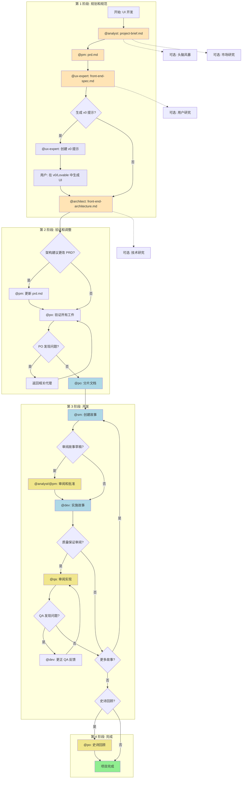
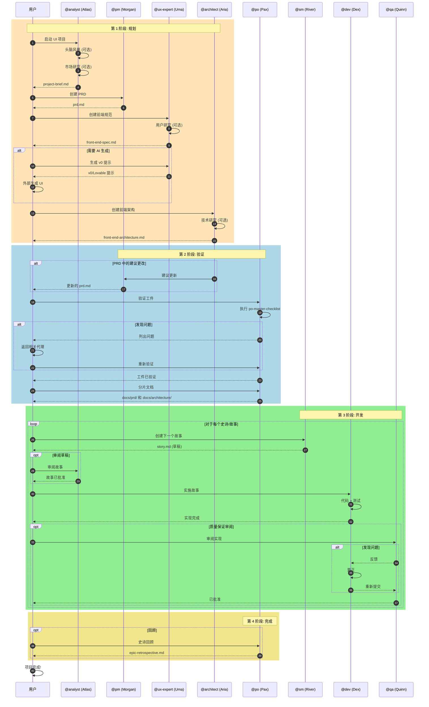
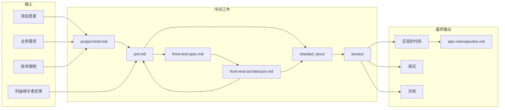
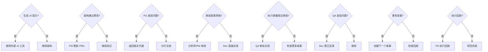
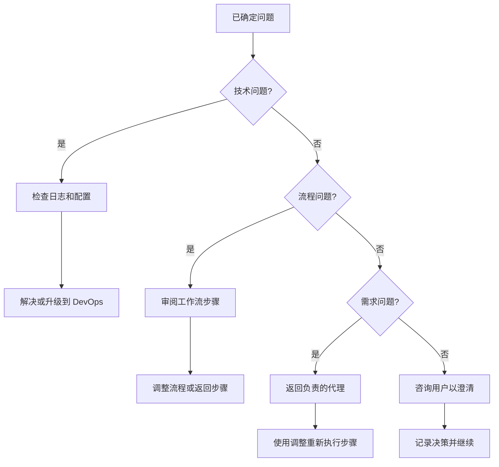

# 绿地 UI 工作流 - 完整指南

> **工作流 ID:** `greenfield-ui`
> **类型:** 绿地项目
> **版本:** 1.0
> **最后更新:** 2026-02-04

## 概述

**绿地 UI 工作流** 是从零开始开发前端应用的编排流程。它涵盖了从构思到实现的整个生命周期,既支持复杂 UI 的全面规划,也支持简单界面的快速原型设计。

### 支持的项目类型

| 类型 | 描述 |
|------|------|
| `spa` | 单页应用 |
| `mobile-app` | 移动应用 |
| `micro-frontend` | 微前端 |
| `static-site` | 静态网站 |
| `ui-prototype` | UI 原型 |
| `simple-interface` | 简单界面 |

### 何时使用本工作流

- 构建生产前端应用
- 多个视图/页面和复杂交互
- 需要全面的 UI/UX 设计和测试
- 多个团队成员参与
- 预期长期维护
- 面向客户的应用

---

## 工作流图表

### 主流程



### 颜色说明

| 颜色 | 含义 |
|------|------|
| 橙色 (#FFE4B5) | 文档创建 |
| 浅蓝色 (#ADD8E6) | 开发循环 |
| 薰衣草色 (#E6E6FA) | AI 生成 (可选) |
| 黄色 (#F0E68C) | 审阅/验证 (可选) |
| 绿色 (#90EE90) | 完成 |

---

## 序列图



---

## 详细步骤

### 第 1 阶段: 规划和规范

#### 步骤 1: 创建项目简报

| 属性 | 值 |
|------|-----|
| **代理** | `@analyst` (Atlas) |
| **命令** | `*create-project-brief` |
| **任务** | `create-doc.md` + `project-brief-tmpl.yaml` |
| **创建** | `project-brief.md` |
| **可选步骤** | `brainstorming_session`, `market_research_prompt` |

**描述:** 分析师促进初始想法,进行可选市场研究,并创建作为整个开发基础的项目简报。

**输入:**
- 用户对项目的愿景
- 市场背景
- 已知的限制

**输出:**
- `docs/project-brief.md` - 完整的项目简报

**切换提示:**
> "项目简报已完成。将其保存为项目中的 docs/project-brief.md,然后创建 PRD。"

---

#### 步骤 2: 创建 PRD

| 属性 | 值 |
|------|-----|
| **代理** | `@pm` (Morgan) |
| **命令** | `*create-prd` |
| **任务** | `create-doc.md` + `prd-tmpl.yaml` |
| **需要** | `project-brief.md` |
| **创建** | `prd.md` |

**描述:** 产品经理将简报转换为详细的产品需求文档 (PRD),专注于 UI/前端需求。

**输入:**
- `project-brief.md`
- 利益相关者反馈

**输出:**
- `docs/prd.md` - 完整的 PRD 和故事

**切换提示:**
> "PRD 已就绪。将其保存为项目中的 docs/prd.md,然后创建 UI/UX 规范。"

---

#### 步骤 3: 前端规范

| 属性 | 值 |
|------|-----|
| **代理** | `@ux-expert` (Uma) |
| **命令** | `*create-front-end-spec` |
| **任务** | `create-doc.md` + `front-end-spec-tmpl.yaml` |
| **需要** | `prd.md` |
| **创建** | `front-end-spec.md` |
| **可选步骤** | `user_research_prompt` |

**描述:** UX 专家创建详细的 UI/UX 规范,包括线框、交互流和设计系统。

**输入:**
- `prd.md`
- 用户研究 (可选)

**输出:**
- `docs/front-end-spec.md` - 完整的前端规范

---

#### 步骤 4: AI 提示生成 (可选)

| 属性 | 值 |
|------|-----|
| **代理** | `@ux-expert` (Uma) |
| **命令** | `*generate-ui-prompt` |
| **任务** | `generate-ai-frontend-prompt.md` |
| **需要** | `front-end-spec.md` |
| **创建** | `v0_prompt` |
| **条件** | `user_wants_ai_generation` |

**描述:** 为 v0、Lovable 或类似工具生成优化的提示。

**输入:**
- `front-end-spec.md`
- 样式偏好

**输出:**
- 针对 AI 工具的格式化提示
- 用户外部生成 UI 并下载项目结构

---

#### 步骤 5: 前端架构

| 属性 | 值 |
|------|-----|
| **代理** | `@architect` (Aria) |
| **命令** | `*create-front-end-architecture` |
| **任务** | `create-doc.md` + `front-end-architecture-tmpl.yaml` |
| **需要** | `front-end-spec.md` |
| **创建** | `front-end-architecture.md` |
| **可选步骤** | `technical_research_prompt`, `review_generated_ui_structure` |

**描述:** 架构师创建前端的技术架构,包括堆栈决策、模式和组件结构。

**输入:**
- `front-end-spec.md`
- v0/Lovable 生成的结构 (如适用)

**输出:**
- `docs/front-end-architecture.md` - 完整的技术架构

**切换提示:**
> "前端架构已完成。将其保存为 docs/front-end-architecture.md。您建议对 PRD 故事进行任何更改或需要添加新故事吗?"

---

### 第 2 阶段: 验证和调整

#### 步骤 6: 更新 PRD (条件)

| 属性 | 值 |
|------|-----|
| **代理** | `@pm` (Morgan) |
| **命令** | `*create-prd` (更新) |
| **需要** | `front-end-architecture.md` |
| **更新** | `prd.md` |
| **条件** | `architecture_suggests_prd_changes` |

**描述:** 如果架构师建议对故事进行更改或新需求,PM 会更新 PRD。

**输入:**
- 架构师的建议
- 当前 PRD

**输出:**
- 更新的 `docs/prd.md`

---

#### 步骤 7: PO 验证

| 属性 | 值 |
|------|-----|
| **代理** | `@po` (Pax) |
| **命令** | `*execute-checklist-po` |
| **任务** | `execute-checklist.md` + `po-master-checklist.md` |
| **验证** | 所有工件 |

**描述:** 产品所有者验证所有创建文档的一致性和完整性。

**输入:**
- `project-brief.md`
- `prd.md`
- `front-end-spec.md`
- `front-end-architecture.md`

**输出:**
- 验证通过或问题列表

**出现问题时的提示:**
> "PO 发现 [文档] 的问题。请返回 [代理] 进行修复并重新保存更新的文档。"

---

#### 步骤 8: 分片文档

| 属性 | 值 |
|------|-----|
| **代理** | `@po` (Pax) |
| **命令** | `*shard-doc` |
| **任务** | `shard-doc.md` |
| **需要** | 所有已验证的工件 |
| **创建** | `sharded_docs` |

**描述:** 将大型文档分割成较小的部分,以便于 IDE 开发。

**执行选项:**
- **选项 A:** 使用 PO 代理: `@po` 然后要求分片 `docs/prd.md`
- **选项 B:** 手动: 将任务 `shard-doc` + `docs/prd.md` 拖到聊天中

**输出:**
- `docs/prd/` - 分片的 PRD
- `docs/architecture/` - 分片的架构

---

### 第 3 阶段: 开发

#### 步骤 9: 创建故事

| 属性 | 值 |
|------|-----|
| **代理** | `@sm` (River) |
| **命令** | `*draft` |
| **任务** | `create-next-story.md` |
| **需要** | `sharded_docs` |
| **创建** | `story.md` |
| **重复** | 对于每个史诗 |

**描述:** Scrum 大师从分片的文档创建详细故事。

**创建循环:**
1. SM 代理 (新会话): `@sm` → `*draft`
2. 从分片的文档创建下一个故事
3. 故事以"草稿"状态开始

**输入:**
- 分片的文档
- Sprint 上下文

**输出:**
- `docs/stories/epic-X/story-X.Y.md` - 草稿中的故事

---

#### 步骤 10: 审阅草稿 (可选)

| 属性 | 值 |
|------|-----|
| **代理** | `@analyst` 或 `@pm` |
| **命令** | `*review` (即将推出) |
| **更新** | `story.md` |
| **条件** | `user_wants_story_review` |
| **可选** | 是 |

**描述:** 草稿的可选审阅以确保完整性和一致性。

**操作:**
- 审阅故事的完整性
- 检查与 PRD 的一致性
- 更新状态: 草稿 → 已批准

---

#### 步骤 11: 实现

| 属性 | 值 |
|------|-----|
| **代理** | `@dev` (Dex) |
| **命令** | `*develop` |
| **任务** | `dev-develop-story.md` |
| **需要** | `story.md` (已批准) |
| **创建** | 实现文件 |

**描述:** 开发者根据定义的需求和任务实现故事。

**实现循环:**
1. Dev 代理 (新会话): `@dev`
2. 实现已批准的故事
3. 使用所有更改更新文件列表
4. 完成时将故事标记为"审阅"

**输入:**
- 批准的故事
- 参考架构

**输出:**
- 实现的代码
- 测试
- 具有文件列表的更新故事

---

#### 步骤 12: 质量保证审阅 (可选)

| 属性 | 值 |
|------|-----|
| **代理** | `@qa` (Quinn) |
| **命令** | `*review` |
| **任务** | `review-story.md` |
| **需要** | 实现的文件 |
| **更新** | 实现 |
| **可选** | 是 |

**描述:** 高级开发人员审阅,具有重构能力。

**QA 循环:**
1. QA 代理 (新会话): `@qa` → `*review {story}`
2. 直接更正小问题
3. 为其余项目留下检查列表
4. 更新状态 (审阅 → 完成或保持审阅)

**输出:**
- 审阅/重构的代码
- 待办项检查列表 (如果有)
- 质量保证关卡决策 (通过/关注/失败)

---

#### 步骤 13: 更正质量保证反馈 (条件)

| 属性 | 值 |
|------|-----|
| **代理** | `@dev` (Dex) |
| **命令** | `*apply-qa-fixes` |
| **任务** | `apply-qa-fixes.md` |
| **条件** | `qa_left_unchecked_items` |
| **更新** | 实现文件 |

**描述:** 如果质量保证留下未标记的项,Dev 修复并重新提交。

**循环:**
1. Dev 代理 (新会话): 处理剩余项
2. 返回质量保证进行最终批准

---

#### 步骤 14: 开发循环

| 属性 | 值 |
|------|-----|
| **动作** | 重复 SM → Dev → QA 循环 |
| **条件** | 直到 PRD 的所有故事完成 |

**描述:** 对所有故事重复故事创建、实现和审阅循环。

---

### 第 4 阶段: 完成

#### 步骤 15: 史诗回顾 (可选)

| 属性 | 值 |
|------|-----|
| **代理** | `@po` (Pax) |
| **命令** | `*epic-retrospective` (即将推出) |
| **条件** | `epic_complete` |
| **创建** | `epic-retrospective.md` |
| **可选** | 是 |

**描述:** 完成史诗后,验证其是否正确完成并记录学习。

**输出:**
- `docs/retrospectives/epic-X-retrospective.md`
- 记录的改进

---

#### 步骤 16: 项目完成

| 属性 | 值 |
|------|-----|
| **动作** | 项目完成 |

**描述:** 所有故事已实现和审阅。项目开发阶段完成。

**参考:** `.aios-core/data/aios-kb.md#IDE Development Workflow`

---

## 参与的代理

### 代理表

| 代理 | 名称 | 角色 | 主要命令 |
|------|------|------|---------|
| `@analyst` | Atlas | 业务分析师 | `*create-project-brief`, `*brainstorm`, `*research` |
| `@pm` | Morgan | 产品经理 | `*create-prd`, `*shard-prd`, `*create-epic` |
| `@ux-expert` | Uma | UX/UI 设计师 | `*create-front-end-spec`, `*generate-ui-prompt`, `*wireframe` |
| `@architect` | Aria | 系统架构师 | `*create-front-end-architecture`, `*document-project` |
| `@po` | Pax | 产品所有者 | `*execute-checklist-po`, `*shard-doc`, `*validate-story-draft` |
| `@sm` | River | Scrum 大师 | `*draft`, `*story-checklist` |
| `@dev` | Dex | 全栈开发人员 | `*develop`, `*run-tests`, `*apply-qa-fixes` |
| `@qa` | Quinn | 测试架构师 | `*review`, `*gate`, `*test-design` |

### 代理间协作图表

```mermaid
graph LR
    subgraph "规划"
        AN[Atlas<br/>@analyst] --> PM[Morgan<br/>@pm]
        PM --> UX[Uma<br/>@ux-expert]
        UX --> AR[Aria<br/>@architect]
    end

    subgraph "验证"
        AR --> PM
        AR --> PO[Pax<br/>@po]
        PM --> PO
    end

    subgraph "开发"
        PO --> SM[River<br/>@sm]
        SM --> DEV[Dex<br/>@dev]
        DEV --> QA[Quinn<br/>@qa]
        QA --> DEV
    end

    PO -.-> SM
    SM -.-> PO

    style AN fill:#FFE4B5
    style PM fill:#FFE4B5
    style UX fill:#FFE4B5
    style AR fill:#FFE4B5
    style PO fill:#F0E68C
    style SM fill:#ADD8E6
    style DEV fill:#ADD8E6
    style QA fill:#F0E68C
```

---

## 执行的任务

### 按阶段

#### 第 1 阶段: 规划

| 任务 | 代理 | 模板 | 描述 |
|------|------|------|------|
| `create-doc.md` | @analyst | `project-brief-tmpl.yaml` | 创建项目简报 |
| `create-deep-research-prompt.md` | @analyst | - | 市场研究 |
| `facilitate-brainstorming-session.md` | @analyst | `brainstorming-output-tmpl.yaml` | 头脑风暴会议 |
| `create-doc.md` | @pm | `prd-tmpl.yaml` | 创建 PRD |
| `create-doc.md` | @ux-expert | `front-end-spec-tmpl.yaml` | 前端规范 |
| `generate-ai-frontend-prompt.md` | @ux-expert | - | v0/Lovable 提示 |
| `create-doc.md` | @architect | `front-end-architecture-tmpl.yaml` | 前端架构 |

#### 第 2 阶段: 验证

| 任务 | 代理 | 检查列表 | 描述 |
|------|------|---------|------|
| `execute-checklist.md` | @po | `po-master-checklist.md` | 验证工件 |
| `shard-doc.md` | @po | - | 分片文档 |

#### 第 3 阶段: 开发

| 任务 | 代理 | 描述 |
|------|------|------|
| `create-next-story.md` | @sm | 创建下一个故事 |
| `execute-checklist.md` | @sm | 故事草稿检查列表 |
| `dev-develop-story.md` | @dev | 实现故事 |
| `apply-qa-fixes.md` | @dev | 应用质量保证更正 |
| `review-story.md` | @qa | 审阅实现 |
| `qa-gate.md` | @qa | 质量保证关卡决策 |

---

## 前置条件

### 开始工作流前

1. **已配置的环境**
   - 安装了 Node.js 18+
   - 配置了 Git
   - 包管理器 (npm/yarn/pnpm)

2. **AIOS-Core 可用**
   - `.aios-core/development/templates/` 中的模板
   - `.aios-core/development/tasks/` 中的任务
   - `.aios-core/development/checklists/` 中的检查列表

3. **项目结构**
   - 已创建 `docs/` 目录
   - 已创建 `docs/stories/` 目录

4. **研究工具 (可选)**
   - 配置的 EXA MCP 进行网络搜索
   - Context7 用于库文档

---

## 输入和输出

### 数据流图



### 按步骤的输入和输出矩阵

| 步骤 | 输入 | 输出 | 位置 |
|------|------|------|------|
| 1 | 用户愿景 | `project-brief.md` | `docs/project-brief.md` |
| 2 | `project-brief.md` | `prd.md` | `docs/prd.md` |
| 3 | `prd.md` | `front-end-spec.md` | `docs/front-end-spec.md` |
| 4 | `front-end-spec.md` | v0 提示 | (外部) |
| 5 | `front-end-spec.md` | `front-end-architecture.md` | `docs/front-end-architecture.md` |
| 6 | 架构建议 | 更新的 `prd.md` | `docs/prd.md` |
| 7 | 所有工件 | 验证 | - |
| 8 | 已验证的工件 | 分片的文档 | `docs/prd/`, `docs/architecture/` |
| 9 | 分片的文档 | `story.md` | `docs/stories/epic-X/` |
| 11 | `story.md` | 代码 + 测试 | `src/`, `tests/` |
| 12 | 实现 | 质量保证关卡 | `docs/qa/gates/` |

---

## 决策点

### 决策图



### 决策点描述

| 点 | 条件 | 是路径 | 否路径 |
|----|------|--------|--------|
| D1 | 用户需要 AI 生成 | UX 生成提示、用户使用 v0/Lovable | 继续架构 |
| D2 | 架构需要更改 | PM 更新 PRD | 继续 PO 验证 |
| D3 | PO 发现不一致 | 返回代理进行更正 | 分片文档 |
| D4 | 用户想审阅草稿 | 分析师/PM 验证故事 | Dev 直接实现 |
| D5 | 需要质量保证审阅 | QA 执行完整审阅 | 检查下一个故事 |
| D6 | QA 确定问题 | Dev 更正和重新提交 | 继续下一个故事 |
| D7 | 存在更多故事 | 在循环中创建下一个故事 | 检查回顾 |
| D8 | 需要回顾 | PO 记录学习 | 项目完成 |

---

## 故障排除

### 常见问题和解决方案

#### 规划阶段

| 问题 | 可能原因 | 解决方案 |
|------|---------|---------|
| 简报不完整 | 缺少用户信息 | 在前面执行 `*brainstorm` 或 `*elicit` |
| PRD 太通用 | 简报不充分 | 返回分析师以充实简报 |
| 规范缺乏 UX 细节 | PRD 中的需求模糊 | PM 应在 PRD 中详细说明用户旅程 |

#### 验证阶段

| 问题 | 可能原因 | 解决方案 |
|------|---------|---------|
| PO 拒绝工件 | 文档之间不一致 | 使用 po-master-checklist 识别差距 |
| 许多修正迭代 | 缺乏初始一致性 | 在 PO 前确保交叉审阅 |
| 分片失败 | 文档结构不当 | 检查文档的 Markdown 格式 |

#### 开发阶段

| 问题 | 可能原因 | 解决方案 |
|------|---------|---------|
| 故事太大 | 定义不当的史诗 | PM 应将史诗分解为更小的故事 |
| Dev 被阻止 | 模糊的故事 | SM 应使用更多细节改进故事 |
| QA 重复拒绝 | 缺少测试 | Dev 应在标记完成前包括测试 |
| Dev-QA 无限循环 | 需求变化 | 冻结故事范围后再实现 |

#### 技术问题

| 问题 | 可能原因 | 解决方案 |
|------|---------|---------|
| 模板未找到 | 路径不正确 | 检查 `.aios-core/development/templates/` |
| 代理未激活 | YAML 格式不当 | 验证代理文件的语法 |
| 检查列表失败 | 缺少依赖 | 检查代理中的 `dependencies` |

### 升级流程



---

## 参考

### 工作流文件

| 文件 | 路径 |
|------|------|
| 工作流定义 | `.aios-core/development/workflows/greenfield-ui.yaml` |
| 知识库 | `.aios-core/data/aios-kb.md` |

### 代理

| 代理 | 路径 |
|------|------|
| @analyst | `.aios-core/development/agents/analyst.md` |
| @pm | `.aios-core/development/agents/pm.md` |
| @ux-expert | `.aios-core/development/agents/ux-design-expert.md` |
| @architect | `.aios-core/development/agents/architect.md` |
| @po | `.aios-core/development/agents/po.md` |
| @sm | `.aios-core/development/agents/sm.md` |
| @dev | `.aios-core/development/agents/dev.md` |
| @qa | `.aios-core/development/agents/qa.md` |

### 主要模板

| 模板 | 路径 |
|------|------|
| 项目简报 | `.aios-core/development/templates/project-brief-tmpl.yaml` |
| PRD | `.aios-core/development/templates/prd-tmpl.yaml` |
| 前端规范 | `.aios-core/development/templates/front-end-spec-tmpl.yaml` |
| 前端架构 | `.aios-core/development/templates/front-end-architecture-tmpl.yaml` |
| 故事 | `.aios-core/development/templates/story-tmpl.yaml` |

### 检查列表

| 检查列表 | 路径 |
|---------|------|
| PO 主检查 | `.aios-core/development/checklists/po-master-checklist.md` |
| 故事草稿 | `.aios-core/development/checklists/story-draft-checklist.md` |
| 故事完成定义 | `.aios-core/development/checklists/story-dod-checklist.md` |

### 相关文档

- [AIOS 知识库](.aios-core/data/aios-kb.md) - 中央知识库
- [棕地工作流](./BROWNFIELD-WORKFLOW.md) - 现有项目工作流 (如可用)

---

## 版本历史

| 版本 | 日期 | 作者 | 更改 |
|------|------|------|------|
| 1.0 | 2026-02-04 | 文档专家 | 指南初始版本 |

---

*文档自动从 `.aios-core/development/workflows/greenfield-ui.yaml` 生成*
